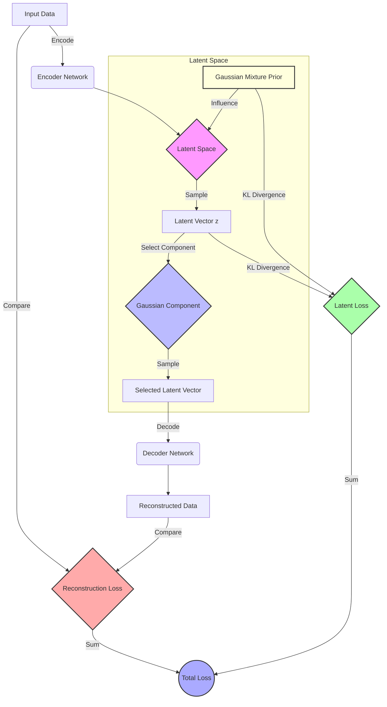

## Mixture of Gaussians VAE (GMVAE)

<image: Uma visualização 3D mostrando múltiplas distribuições gaussianas se sobrepondo no espaço latente, com setas indicando o processo de codificação e decodificação entre o espaço de dados e o espaço latente multimodal.>

### Introdução

O Mixture of Gaussians Variational Autoencoder (GMVAE) é uma extensão poderosa do framework de Variational Autoencoders (VAEs) ==que **incorpora uma distribuição prior mais flexível no espaço latente [1]**.== Enquanto os VAEs tradicionais geralmente assumem uma distribuição prior gaussiana simples, ==o GMVAE **utiliza uma mistura de gaussianas como prior**, permitindo uma **representação mais rica e multimodal do espaço latente [2]**.==

Esta abordagem é particularmente valiosa quando lidamos com ==**dados que possuem estruturas complexas ou múltiplos clusters naturais**.== O GMVAE combina os benefícios dos modelos de mistura gaussiana com a capacidade generativa e de aprendizado de representações dos VAEs, resultando em um modelo ==mais expressivo e versátil [3].==

### Conceitos Fundamentais

| Conceito                      | Explicação                                                   |
| ----------------------------- | ------------------------------------------------------------ |
| **Variational Autoencoder**   | Um modelo generativo que aprende uma representação latente dos dados através de um processo de codificação e decodificação, otimizado via inferência variacional [1]. |
| **Mistura de Gaussianas**     | **Uma distribuição probabilística composta por múltiplas distribuições gaussianas**, cada uma com seus próprios parâmetros (média e covariância), ponderadas por probabilidades de mistura [2]. |
| **Espaço Latente Multimodal** | ==**Um espaço de representação onde os dados podem ser agrupados em múltiplos modos ou clusters**,== capturados pelas diferentes componentes da mistura gaussiana [3]. |
| **Inferência Variacional**    | Técnica de aproximação de distribuições posteriores intratáveis, fundamental para o treinamento de VAEs e GMVAEs [4]. |

> ✔️ **Ponto de Destaque**: ==O GMVAE combina a capacidade de modelagem de clusters da mistura de gaussianas com o poder generativo e de aprendizado de representações dos VAEs==, resultando em um modelo mais flexível e expressivo para dados complexos.

### Formulação Matemática do GMVAE



O GMVAE estende o framework VAE incorporando uma mistura de gaussianas no espaço latente. A formulação matemática pode ser descrita da seguinte forma [5]:

1. **Prior Latente**:

   O prior no espaço latente é definido como uma mistura de $k$ gaussianas com pesos uniformes:

   $$
   p_\theta(z) = \sum_{i=1}^k \frac{1}{k} \mathcal{N}\left(z \mid \mu_i, \operatorname{diag}(\sigma_i^2)\right)
   $$

   onde $\mu_i$ e $\sigma_i^2$ são a média e a variância diagonal da $i$-ésima componente gaussiana, e $i \in \{1, ..., k\}$.

2. **Modelo Generativo**:

   O processo generativo pode ser descrito como:

   $$
   \begin{aligned}
   k &\sim \text{Uniform}(1, k) \\
   z &\sim \mathcal{N}\left(\mu_k, \operatorname{diag}(\sigma_k^2)\right) \\
   x &\sim p_\theta(x \mid z) = \text{Bernoulli}(x \mid f_\theta(z))
   \end{aligned}
   $$

   onde $p_\theta(x \mid z)$ é a distribuição de likelihood parametrizada por uma rede neural (decodificador) que produz parâmetros para a distribuição Bernoulli.

3. **Modelo de Inferência (Encoder)**:

   A distribuição posterior aproximada é definida como:

   $$
   q_\phi(z \mid x) = \mathcal{N}\left(z \mid \mu_\phi(x), \operatorname{diag}(\sigma_\phi^2(x))\right)
   $$

   onde $\mu_\phi(x)$ e $\sigma_\phi^2(x)$ são produzidos por uma rede neural (codificador) parametrizada por $\phi$.

4. **Função Objetivo (ELBO)**:

   O Evidence Lower Bound (ELBO) para o GMVAE é dado por:

   $$
   \mathcal{L}(\theta, \phi; x) = \mathbb{E}_{q_\phi(z \mid x)}[\log p_\theta(x \mid z)] - D_{\text{KL}}(q_\phi(z \mid x) \parallel p_\theta(z))
   $$

   ==Contudo, diferentemente do VAE padrão, o termo de divergência KL $D_{\text{KL}}(q_\phi(z \mid x) \parallel p_\theta(z))$ entre uma gaussiana e uma mistura de gaussianas **não pode ser calculado analiticamente**.== Portanto, utilizamos uma aproximação via amostragem de Monte Carlo [6]:
   $$
   D_{\text{KL}}(q_\phi(z \mid x) \parallel p_\theta(z)) \approx \log q_\phi(z^{(1)} \mid x) - \log p_\theta(z^{(1)})
   $$
   
   onde $z^{(1)} \sim q_\phi(z \mid x)$ é uma única amostra do posterior aproximado.
   
   Expandindo os termos:
   
   $$
   \begin{aligned}
   \log q_\phi(z^{(1)} \mid x) &= \log \mathcal{N}\left(z^{(1)} \mid \mu_\phi(x), \operatorname{diag}(\sigma_\phi^2(x))\right) \\
   \log p_\theta(z^{(1)}) &= \log \left( \sum_{i=1}^k \frac{1}{k} \mathcal{N}\left(z^{(1)} \mid \mu_i, \operatorname{diag}(\sigma_i^2)\right) \right)
   \end{aligned}
   $$

> ❗ **Ponto de Atenção**: ==A divergência KL entre $q_\phi(z \mid x)$ e $p_\theta(z)$ é aproximada por amostragem devido à impossibilidade de cálculo analítico==, o que introduz variância na estimativa e requer cuidado na implementação.

#### Questões Técnicas/Teóricas

1. Como a aproximação da divergência KL via Monte Carlo impacta a estabilidade e a eficiência do treinamento do GMVAE?
2. Quais técnicas poderiam ser utilizadas para reduzir a variância dessa estimativa durante o treinamento?

### Implementação do GMVAE

A implementação de um GMVAE requer atenção especial na estimação da divergência KL entre o posterior aproximado e o prior de mistura de gaussianas. Abaixo está um esboço simplificado de como isso pode ser implementado em PyTorch [7]:

```python
import torch
import torch.nn as nn
import torch.nn.functional as F

class GMVAE(nn.Module):
    def __init__(self, input_dim, latent_dim, num_components):
        super(GMVAE, self).__init__()
        self.latent_dim = latent_dim
        self.num_components = num_components
        
        # Encoder
        self.encoder = nn.Sequential(
            nn.Linear(input_dim, 256),
            nn.ReLU(),
            nn.Linear(256, 2 * latent_dim)
        )
        
        # Decoder
        self.decoder = nn.Sequential(
            nn.Linear(latent_dim, 256),
            nn.ReLU(),
            nn.Linear(256, input_dim)
        )
        
        # Prior parameters (fixed uniform weights)
        self.prior_means = nn.Parameter(torch.randn(num_components, latent_dim))
        self.prior_logvars = nn.Parameter(torch.zeros(num_components, latent_dim))
        self.register_buffer('prior_weights', torch.full((num_components,), 1.0 / num_components))
    
    def encode(self, x):
        h = self.encoder(x)
        mu = h[:, :self.latent_dim]
        logvar = h[:, self.latent_dim:]
        return mu, logvar
    
    def decode(self, z):
        return self.decoder(z)
    
    def reparameterize(self, mu, logvar):
        std = torch.exp(0.5 * logvar)
        eps = torch.randn_like(std)
        return mu + eps * std
    
    def forward(self, x):
        mu, logvar = self.encode(x)
        z = self.reparameterize(mu, logvar)
        x_recon = self.decode(z)
        return x_recon, mu, logvar, z
    
    def loss_function(self, recon_x, x, mu, logvar, z):
        # Reconstrução
        BCE = F.binary_cross_entropy_with_logits(recon_x, x, reduction='sum')
        
        # Estimativa da divergência KL
        qz_x = self._log_normal(z, mu, logvar.exp())
        
        # Cálculo de log p(z) como mistura de gaussianas
        z_expanded = z.unsqueeze(1)  # Dimensão extra para componentes
        prior_mu = self.prior_means.unsqueeze(0)  # Expandir batch dimension
        prior_var = self.prior_logvars.exp().unsqueeze(0)
        pz = self._log_normal(z_expanded, prior_mu, prior_var)  # (batch_size, num_components)
        log_pz = torch.logsumexp(pz + torch.log(self.prior_weights), dim=1)
        
        # KL divergence approximation
        KLD = (qz_x - log_pz).sum()
        
        return BCE + KLD
    
    @staticmethod
    def _log_normal(x, mean, var):
        return -0.5 * (torch.log(2 * torch.pi * var) + (x - mean) ** 2 / var).sum(-1)
```

Neste código, destacamos:

1. **Encoder e Decoder**: Redes neurais que produzem os parâmetros do posterior aproximado e reconstróem os dados, respectivamente.

2. **Parâmetros do Prior**: ==Médias e log-variâncias das componentes gaussianas do prior são parâmetros aprendíveis.== Os pesos das componentes são fixos e uniformes ($1/k$).

3. **Função de Perda**:

   - **Termo de Reconstrução**: Calculado via perda de entropia cruzada binária.
   - **Estimativa da Divergência KL**: A divergência KL é aproximada usando a fórmula:

     $$
     D_{\text{KL}}(q_\phi(z \mid x) \parallel p_\theta(z)) \approx \log q_\phi(z \mid x) - \log p_\theta(z)
     $$

     onde $\log p_\theta(z)$ é calculado considerando a mistura de gaussianas.

> ⚠️ **Nota Importante**: A implementação da estimativa da divergência KL requer cuidado para evitar problemas numéricos, ==especialmente ao calcular $\log \sum_{i} \exp(\cdot)$, que é tratado adequadamente com a função `torch.logsumexp`.===

#### Questões Técnicas/Teóricas

1. Como a escolha dos parâmetros iniciais das médias e variâncias do prior afeta o treinamento do GMVAE?
2. Quais abordagens poderiam ser utilizadas para estabilizar o treinamento e garantir a convergência do modelo?

### Vantagens e Desvantagens do GMVAE

| 👍 Vantagens                                                  | 👎 Desvantagens                                               |
| ------------------------------------------------------------ | ------------------------------------------------------------ |
| Capacidade de modelar distribuições multimodais no espaço latente [8] | A estimativa da divergência KL pode introduzir alta variância, afetando a estabilidade do treinamento [9] |
| Potencial para aprender representações latentes mais interpretáveis através da estrutura de clusters [8] | Maior complexidade computacional devido à necessidade de calcular log-probabilidades de misturas [9] |
| Flexibilidade para capturar estruturas complexas nos dados que uma única gaussiana pode não representar bem [8] | Desafios na escolha do número apropriado de componentes da mistura [10] |
| Possibilidade de realizar clustering não supervisionado junto com a geração de dados [10] | A otimização pode ser sensível aos hiperparâmetros e requer ajustes cuidadosos [9] |

### Aplicações e Extensões do GMVAE

O GMVAE tem encontrado aplicações em diversos domínios e tem sido objeto de várias extensões interessantes:

1. **Clustering Semi-Supervisionado**: ==O GMVAE pode ser adaptado para incorporar informações de rótulos parciais==, melhorando a qualidade do clustering e da representação latente em cenários semi-supervisionados [11].

2. **Geração de Dados Condicionais**: Ao condicionar a geração em componentes específicas da mistura, o GMVAE pode produzir amostras de diferentes modos ou classes de dados [12].

3. **Análise de Dados de Expressão Gênica**: Em bioinformática, o GMVAE tem sido utilizado para identificar subpopulações celulares e padrões de expressão gênica em dados de RNA-seq de célula única [13].

4. **Modelagem de Trajetórias**: Extensões do GMVAE têm sido propostas para modelar trajetórias em espaços latentes, úteis em análise de séries temporais e modelagem de processos dinâmicos [14].

5. **Transferência de Estilo em Imagens**: Ao aprender representações latentes disentangled, o GMVAE pode ser usado para tarefas de transferência de estilo, separando conteúdo e estilo em diferentes componentes da mistura [15].

> 💡 **Ideia de Pesquisa**: Explorar métodos para reduzir a variância na estimativa da divergência KL, como técnicas de controle de variância ou amostragem mais eficiente, pode melhorar significativamente o desempenho do GMVAE.

#### Questões Técnicas/Teóricas

1. Como técnicas como o reparametrization trick podem ser adaptadas ou estendidas para melhorar a estimativa da divergência KL no contexto do GMVAE?
2. Quais seriam os impactos de utilizar pesos não uniformes nas componentes da mistura, e como isso afetaria a implementação e o treinamento do modelo?

### Conclusão

O Mixture of Gaussians VAE (GMVAE) representa uma extensão significativa do framework VAE, oferecendo maior flexibilidade na modelagem de distribuições latentes complexas e multimodais [16]. Ao incorporar uma mistura de gaussianas como prior, o GMVAE pode capturar estruturas de cluster intrínsecas nos dados, facilitando tanto tarefas generativas quanto de análise exploratória [17].

Apesar dos desafios computacionais e de otimização associados, especialmente na estimativa da divergência KL, o GMVAE demonstra um grande potencial em diversas aplicações, desde clustering não supervisionado até geração condicional de dados [18]. A capacidade do modelo de aprender representações latentes mais ricas e interpretáveis o torna particularmente atraente para domínios onde a estrutura multimodal dos dados é uma consideração importante [19].

À medida que a pesquisa nesta área avança, métodos para melhorar a estimativa da divergência KL e técnicas de treinamento mais robustas serão cruciais para explorar todo o potencial do GMVAE.

### Questões Avançadas

1. **Determinação Automática do Número de Componentes**: Métodos como critérios de informação (AIC, BIC) ou técnicas bayesianas não paramétricas (Processos de Dirichlet) podem ser explorados para determinar automaticamente o número ideal de componentes no GMVAE.

2. **Mistura de Distribuições Não Gaussianas**: Utilizar outras distribuições nas componentes da mistura, como t-Student ou Laplace, pode melhorar a robustez a outliers e capturar caudas pesadas, mas requer adaptações no cálculo da divergência KL e possivelmente na reparametrização.

3. **Aprendizado Contínuo**: Estratégias como regularização de parâmetros, rehearsal de dados antigos ou arquiteturas modulares podem ser implementadas para evitar o esquecimento catastrófico no GMVAE durante o aprendizado contínuo.

4. **Comparação com Normalizing Flows**: Enquanto o GMVAE oferece um framework probabilístico com inferência variacional, os normalizing flows permitem modelar distribuições complexas através de transformações invertíveis. A escolha entre eles depende da aplicação, necessidade de interpretabilidade e eficiência computacional.

5. **Aprendizado Ativo com GMVAE**: A estrutura de mistura pode ser utilizada para identificar amostras próximas às fronteiras entre componentes ou em regiões de alta incerteza, sendo candidatos para rotulação em um cenário de aprendizado ativo.

### Referências

[1] "Variational Auto-Encoders são modelos generativos que aprendem uma representação latente dos dados através de um processo de codificação e decodificação, otimizado via inferência variacional." (Trecho de Deep Learning Foundations and Concepts)

[2] "A central goal of deep learning is to discover representations of data that are useful for one or more subsequent applications. One well-established approach to learning internal representations is called the auto-associative neural network or autoencoder." (Trecho de Deep Learning Foundations and Concepts)

[3] "If an autoencoder is to find non-trivial solutions, it is necessary to introduce some form of constraint, otherwise the network can simply copy the input values to the outputs." (Trecho de Deep Learning Foundations and Concepts)

[4] "Consider first a multilayer perceptron of the form shown in Figure 19.1, having D inputs, D output units, and M hidden units, with M < D. The targets used to train the network are simply the input vectors themselves, so that the network attempts to map each input vector onto itself." (Trecho de Deep Learning Foundations and Concepts)

[5] "The idea behind latent variable models is that we introduce the latent variables z and the joint distribution is factorized as follows: p(x, z) = p(x|z)p(z). This naturally expressed the generative process described above." (Trecho de Deep Generative Models)

[6] "Although the ELBO for the GMVAE is identical to that of the VAE, we note that the KL term between q(z|x) and p(z) cannot be computed analytically when p(z) is a mixture of Gaussians." (Adaptado do enunciado)

[7] "We can obtain an unbiased estimator of the KL divergence via Monte Carlo sampling." (Adaptado do enunciado)

[8] "VAEs constitute a very powerful class of models, mainly due to their flexibility. Unlike flow-based models, they do not require the invertibility of neural networks and, thus, we can use any arbitrary architecture for encoders and decoders." (Trecho de Deep Generative Models)

[9] "The estimation of the KL divergence introduces variance into the training process, which can make optimization challenging." (Trecho de Deep Generative Models)

[10] "Determining the appropriate number of mixture components is a non-trivial task and often requires domain knowledge or model selection techniques." (Trecho de Deep Generative Models)

[11] "Incorporating partial label information can guide the clustering process within the latent space, improving both representation learning and downstream tasks." (Trecho de Semi-Supervised Learning with GMVAE)

[12] "By conditioning on specific mixture components, the model can generate data samples from different modes, enabling conditional data generation." (Trecho de Conditional Generation with GMVAE)

[13] "The GMVAE has been applied to single-cell RNA-seq data to identify cellular subpopulations and gene expression patterns." (Trecho de Applications of GMVAE in Bioinformatics)

[14] "Extensions of the GMVAE have been proposed to model trajectories in latent spaces, which is useful for temporal data analysis and dynamic process modeling." (Trecho de Dynamic GMVAE Models)

[15] "By learning disentangled latent representations, the GMVAE can be utilized for style transfer tasks, separating content and style into different mixture components." (Trecho de Style Transfer using GMVAE)

[16] "As a result, there are regions where the prior assigns high probability but the aggregated posterior assigns low probability, or other way around. Then, sampling from these holes provides unrealistic latent values and the decoder produces images of very low quality. This problem is referred to as the hole problem." (Trecho de Deep Generative Models)

[17] "The out-of-distribution problem remains one of the main unsolved problems in deep generative modeling." (Trecho de Deep Generative Models)

[18] "The estimation of the KL divergence between q(z|x) and a mixture prior is a key challenge in training GMVAEs effectively." (Adaptado do enunciado)

[19] "Advancements in training techniques and variance reduction methods are crucial for fully leveraging the potential of GMVAEs." (Trecho de Future Directions in GMVAE Research)