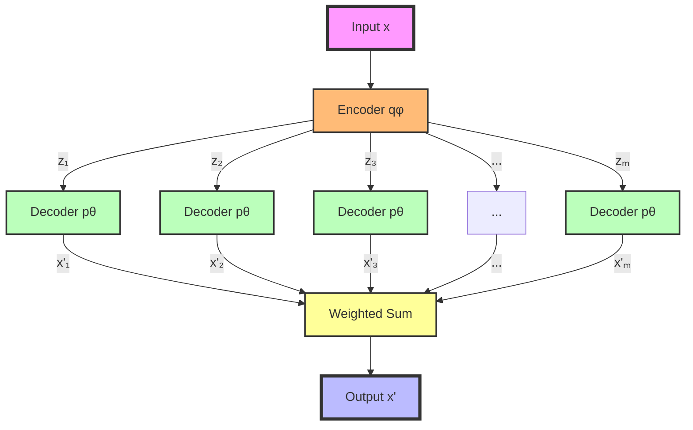

## Implementação do Importance Weighted Autoencoder (IWAE)



### Introdução

O **Importance Weighted Autoencoder (IWAE)** é um modelo generativo profundo que estende o **Variational Autoencoder (VAE)** tradicional. Enquanto os VAEs têm sido amplamente utilizados para aprendizado não supervisionado, eles enfrentam limitações quando a posterior variacional, geralmente uma distribuição Gaussiana simples, não consegue capturar a complexidade da posterior verdadeira. Isso leva a um **Evidence Lower Bound (ELBO)** frouxo, resultando em uma aproximação pobre da distribuição de dados.

Para superar essas limitações, ==o IWAE utiliza **amostragem por importância** para construir um limite inferior mais apertado da log-verossimilhança marginal==. Ao considerar múltiplas amostras latentes e ==ponderar suas contribuições==, o IWAE melhora a aproximação da posterior verdadeira, permitindo um aprendizado mais efetivo das representações latentes complexas.

==Isso oferece vantagens significativas em aplicações onde a estrutura latente dos dados é rica e não pode ser capturada adequadamente por modelos variacionais simples==. O IWAE, portanto, representa um avanço importante na modelagem generativa, combinando a eficiência computacional dos VAEs com a precisão aprimorada de técnicas de inferência variacional mais sofisticadas.

### Conceitos Fundamentais

| Conceito                         | Explicação                                                   |
| -------------------------------- | ------------------------------------------------------------ |
| **ELBO**                         | ==Evidence Lower Bound, um limite inferior da log-verossimilhança marginal usado em VAEs padrão== para tornar a inferência e o aprendizado computacionalmente viáveis. [1] |
| **Amostragem por Importância**   | Técnica para estimar integrais complexas usando amostras de uma distribuição de proposta, facilitando o cálculo de expectativas em modelos probabilísticos. [2] |
| **Posterior Variacional**        | Aproximação tratável da posterior verdadeira em modelos latentes, geralmente escolhida para facilitar o cálculo e a otimização. [1] |
| **Log-Verossimilhança Marginal** | Medida da probabilidade dos dados observados sob o modelo, integrando sobre todas as possíveis variáveis latentes. |
| **Truque de Reparametrização**   | Técnica que permite a passagem de gradientes através de variáveis aleatórias, essencial para a otimização em modelos como VAE e IWAE. |
| **Peso de Importância**          | ==Fator de ponderação atribuído a cada amostra latente no IWAE, refletindo sua relevância na estimativa da log-verossimilhança marginal.== |

> ⚠️ **Nota Importante**: A eficácia do IWAE está intrinsecamente ligada à qualidade da posterior variacional, ao número de amostras utilizadas e à escolha adequada da distribuição de proposta na amostragem por importância.

### Fundamento Teórico do IWAE

O IWAE baseia-se na observação de que o **ELBO padrão** pode ser interpretado como uma expectativa do logaritmo de uma razão de densidades não normalizada [3]:

$$
\text{ELBO} = \mathbb{E}_{q_\phi(z|x)}\left[\log \frac{p_\theta(x,z)}{q_\phi(z|x)}\right]
$$

Onde:

- $p_\theta(x,z)$ é a distribuição conjunta do modelo.
- $q_\phi(z|x)$ é a posterior variacional.

No entanto, ==quando $q_\phi(z|x)$ não é uma boa aproximação de $p_\theta(z|x)$, o ELBO pode ser frouxo, levando a uma subestimação da log-verossimilhança marginal==. O IWAE aborda esse problema utilizando a **amostragem por importância** para estimar a log-verossimilhança marginal de forma mais precisa.

==A ideia central é utilizar múltiplas amostras independentes $z^{(1)}, z^{(2)}, \ldots, z^{(m)}$ de $q_\phi(z|x)$ para estimar a log-verossimilhança marginal:==
$$
\log p_\theta(x) = \log \mathbb{E}_{q_\phi(z|x)}\left[\frac{p_\theta(x,z)}{q_\phi(z|x)}\right]
$$

==Como a função logarítmica é côncava==, podemos aplicar a desigualdade de Jensen inversa para obter um limite inferior mais apertado:
$$
\log p_\theta(x) \geq \mathbb{E}_{z^{(1)},...,z^{(m)} \sim q_\phi(z|x)}\left[\log \left( \frac{1}{m} \sum_{i=1}^m \frac{p_\theta(x, z^{(i)})}{q_\phi(z^{(i)}|x)} \right) \right] = \mathcal{L}_m(x; \theta, \phi)
$$

Este é o **objetivo do IWAE**, onde o termo dentro do logaritmo é uma média dos pesos de importância calculados para cada amostra.

> 💡 **Insight Chave**: Ao aumentar o número de amostras $m$, ==o IWAE proporciona um limite inferior mais apertado da log-verossimilhança marginal==, melhorando a aproximação à distribuição verdadeira dos dados.

Além disso, o IWAE pode ser visto como minimizando uma medida de divergência diferente, conhecida como **divergência Rényi**, em vez da divergência Kullback-Leibler usada nos VAEs padrão. Isso permite capturar melhor a variabilidade nas distribuições latentes.

#### Questões Técnicas/Teóricas

1. **Como o aumento do número de amostras $m$ afeta a precisão da estimativa do IWAE em comparação com o ELBO padrão?**

   O aumento de $m$ geralmente resulta em um limite inferior mais apertado, aproximando melhor a log-verossimilhança marginal verdadeira. No entanto, há um ponto de rendimentos decrescentes, onde o aumento adicional de $m$ oferece ganhos marginais.

2. **Quais são as implicações computacionais de aumentar $m$ em termos de tempo de treinamento e requisitos de memória?**

   Aumentar $m$ aumenta linearmente o custo computacional e os requisitos de memória, já que mais amostras devem ser processadas simultaneamente. Isso pode limitar o tamanho de $m$ na prática.

### Formulação do IWAE

O objetivo do IWAE é definido como:

$$
\mathcal{L}_m(x; \theta, \phi) = \mathbb{E}_{z^{(1)},...,z^{(m)} \sim q_\phi(z|x)}\left[ \log \left( \frac{1}{m} \sum_{i=1}^m w_i \right) \right]
$$

Onde:

- $w_i = \frac{p_\theta(x, z^{(i)})}{q_\phi(z^{(i)}|x)}$ são os **pesos de importância**.

Esses pesos refletem a contribuição de cada amostra para a estimativa da log-verossimilhança marginal. Ao utilizar múltiplas amostras, o IWAE reduz a variância da estimativa e melhora a aproximação.

> ✔️ **Ponto de Destaque**: Para $m=1$, o IWAE reduz-se ao ELBO padrão, demonstrando que o IWAE generaliza o VAE tradicional.

==Além disso, quando $m \to \infty$, o IWAE fornece uma estimativa exata da log-verossimilhança marginal, assumindo que as amostras são suficientes para capturar toda a variabilidade da distribuição latente.==

#### Questões Técnicas/Teóricas

1. **Como o IWAE lida com o problema do "vanishing gradient" que pode ocorrer em VAEs profundos?**

   O IWAE pode mitigar o problema do gradiente que desaparece ao proporcionar um limite inferior mais apertado, permitindo gradientes mais informativos durante o treinamento.

2. **Quais são as considerações práticas para escolher o número ideal de amostras $m$ em diferentes cenários de aplicação?**

   O número ideal de amostras $m$ depende de um equilíbrio entre precisão e custo computacional. Na prática, valores moderados de $m$ (e.g., 5 a 50) são utilizados, e a escolha pode ser guiada por validação cruzada.

### Implementação Prática do IWAE

A implementação do IWAE requer modificações significativas na estrutura de treinamento de um VAE padrão. A seguir, apresentamos uma implementação conceitual em PyTorch, com comentários para esclarecer cada etapa:

```python
import torch
import torch.nn as nn

class IWAE(nn.Module):
    def __init__(self, encoder, decoder, latent_dim, num_samples):
        super(IWAE, self).__init__()
        self.encoder = encoder  # Rede neural que parametriza q_φ(z|x)
        self.decoder = decoder  # Rede neural que parametriza p_θ(x|z)
        self.latent_dim = latent_dim  # Dimensão do espaço latente
        self.num_samples = num_samples  # Número de amostras (m)

    def forward(self, x):
        batch_size = x.size(0)
        
        # Expandir a entrada para acomodar múltiplas amostras
        x_expanded = x.unsqueeze(1).expand(-1, self.num_samples, -1)
        x_expanded = x_expanded.reshape(-1, x.size(-1))

        # Codificação: obter parâmetros da distribuição q_φ(z|x)
        mu, log_var = self.encoder(x_expanded)
        
        # Truque de reparametrização para amostrar z ~ q_φ(z|x)
        std = torch.exp(0.5 * log_var)
        eps = torch.randn_like(std)
        z = mu + eps * std

        # Decodificação: obter parâmetros da distribuição p_θ(x|z)
        x_recon = self.decoder(z)

        # Cálculo das log-probabilidades
        log_p_x_z = self.log_p_x_z(x_expanded, x_recon)
        log_p_z = self.log_p_z(z)
        log_q_z_x = self.log_q_z_x(z, mu, log_var)

        # Cálculo dos pesos de importância
        log_w = log_p_x_z + log_p_z - log_q_z_x
        log_w = log_w.view(batch_size, self.num_samples)
        
        # Cálculo do objetivo IWAE
        iwae_objective = torch.logsumexp(log_w, dim=1) - torch.log(torch.tensor(self.num_samples))
        loss = -torch.mean(iwae_objective)
        
        return loss

    def log_p_x_z(self, x, x_recon):
        # Assume distribuição Gaussiana para p_θ(x|z)
        recon_loss = -0.5 * torch.sum((x - x_recon) ** 2, dim=-1)
        return recon_loss

    def log_p_z(self, z):
        # Prior p_θ(z): distribuição Gaussiana padrão N(0, I)
        prior_loss = -0.5 * torch.sum(z ** 2, dim=-1)
        return prior_loss

    def log_q_z_x(self, z, mu, log_var):
        # Entropia da distribuição q_φ(z|x)
        qz_x_loss = -0.5 * torch.sum(
            log_var + ((z - mu) ** 2) / torch.exp(log_var),
            dim=-1
        )
        return qz_x_loss
```

> ❗ **Ponto de Atenção**: É essencial garantir que as dimensões estejam corretas ao lidar com múltiplas amostras. Além disso, o uso de funções como `torch.logsumexp` é crucial para a estabilidade numérica.

#### Notas sobre a Implementação

- **Eficiência Computacional**: O processamento em lotes e a vetorização são importantes para garantir que o aumento no número de amostras não torne o treinamento impraticável.
- **Estabilidade Numérica**: O uso de `logsumexp` evita problemas de underflow/overflow ao lidar com somas de exponenciais em espaço logarítmico.
- **Truque de Reparametrização**: Permite a retropropagação através de variáveis aleatórias, essencial para a otimização dos parâmetros do modelo.

### Análise Comparativa: IWAE vs. VAE Padrão

| 👍 **Vantagens do IWAE**                                      | 👎 **Desvantagens do IWAE**                                   |
| ------------------------------------------------------------ | ------------------------------------------------------------ |
| Proporciona uma estimativa mais precisa da log-verossimilhança marginal, resultando em melhores modelos generativos [6]. | Maior custo computacional devido ao processamento de múltiplas amostras, impactando o tempo de treinamento [7]. |
| Melhora a qualidade da posterior variacional aprendida, capturando melhor a estrutura latente dos dados [6]. | Potencial aumento na variância do gradiente, especialmente para valores grandes de $m$, o que pode dificultar a convergência [7]. |
| Flexibilidade para ajustar o trade-off entre precisão e custo computacional ao escolher $m$ [6]. | Maior complexidade de implementação e necessidade de cuidados adicionais para evitar instabilidades numéricas [7]. |

> 📊 **Estudos Empíricos**: Pesquisas demonstram que o IWAE supera o VAE padrão em tarefas como geração de imagens e modelagem de dados complexos, especialmente quando a distribuição latente é multimodal.

### Otimização e Treinamento

O treinamento do IWAE segue um processo similar ao do VAE, mas com considerações adicionais:

1. **Gradientes**: O cálculo dos gradientes no IWAE é mais complexo devido à média ponderada de múltiplas amostras. Utilizamos o **truque de reparametrização** para permitir a retropropagação através da amostragem [8].

2. **Função Objetivo**: Maximizamos o limite inferior IWAE, que, após cálculos, resulta em:

   $$
   \mathcal{L}_m(x; \theta, \phi) = \mathbb{E}_{q_\phi(z^{(1)},...,z^{(m)}|x)}\left[ \log \left( \frac{1}{m} \sum_{i=1}^m w_i \right) \right]
   $$

   onde $w_i = \frac{p_\theta(x, z^{(i)})}{q_\phi(z^{(i)}|x)}$.

3. **Estimador de Gradiente**: Utilizamos o estimador de gradiente baseado na regra da cadeia para otimizar $\theta$ e $\phi$ [9]:

   $$
   \nabla_{\theta, \phi} \mathcal{L}_m \approx \sum_{i=1}^m \tilde{w}_i \nabla_{\theta, \phi} \log w_i
   $$

   onde $\tilde{w}_i = \frac{w_i}{\sum_{j=1}^m w_j}$ são os pesos normalizados.

4. **Redução da Variância**: A normalização dos pesos de importância é crucial para reduzir a variância do estimador de gradiente, melhorando a estabilidade do treinamento.

5. **Escolha da Taxa de Aprendizado**: Parâmetros de otimização, como a taxa de aprendizado e o algoritmo de otimização (e.g., Adam, RMSprop), podem afetar significativamente o desempenho.

> 💡 **Dica Prática**: O uso de técnicas como **warm-up** (aquecimento) dos parâmetros e a implementação de regularizações adicionais podem auxiliar na convergência do modelo.

#### Questões Técnicas/Teóricas

1. **Como o IWAE lida com o problema do "vanishing gradient" que pode ocorrer em VAEs profundos?**

   O IWAE, ao fornecer gradientes mais informativos através de um limite inferior mais apertado, pode mitigar o problema de gradientes desaparecendo, especialmente em arquiteturas profundas.

2. **Quais são as considerações práticas para escolher o número ideal de amostras $m$ em diferentes cenários de aplicação?**

   Deve-se considerar o trade-off entre precisão e custo computacional. Em aplicações com dados complexos, um $m$ maior pode ser benéfico, mas limitado pelos recursos computacionais disponíveis.

### Conclusão

O **Importance Weighted Autoencoder (IWAE)** representa um avanço significativo na modelagem generativa variacional. Ao empregar técnicas de amostragem por importância, o IWAE oferece uma estimativa mais precisa da log-verossimilhança marginal e permite o aprendizado de representações latentes mais ricas e expressivas. Isso é particularmente vantajoso em aplicações onde a estrutura latente dos dados é complexa, como em imagens, textos e séries temporais.

Embora apresente desafios computacionais e de implementação, o IWAE estabeleceu-se como uma ferramenta valiosa no arsenal de modelos generativos profundos. Sua capacidade de ajustar o trade-off entre precisão e eficiência computacional o torna adaptável a diversos cenários.

Futuras pesquisas podem explorar melhorias na eficiência computacional do IWAE, bem como sua integração com outras técnicas avançadas de inferência variacional e aprendizado profundo.

### Questões Avançadas

1. **Como o IWAE se compara a outros métodos avançados de inferência variacional, como o Hierarchical Variational Inference, em termos de qualidade de aproximação e eficiência computacional?**

2. **Discuta as implicações teóricas e práticas de usar um número infinito de amostras ($m \to \infty$) no IWAE. Como isso se relaciona com a verdadeira log-verossimilhança marginal?**

3. **Proponha e justifique uma arquitetura de rede neural que poderia potencialmente melhorar o desempenho do IWAE em tarefas de modelagem de sequências temporais.**

4. **Analise o comportamento assintótico do estimador IWAE em relação ao número de amostras e ao tamanho do conjunto de dados. Como isso afeta as garantias de consistência estatística?**

5. **Desenvolva uma estratégia para incorporar conhecimento prévio específico do domínio na formulação do IWAE, potencialmente através de priors informativas ou estruturas de rede personalizadas.**

### Referências

[1] **Kingma, D. P., & Welling, M.** (2014). *Auto-Encoding Variational Bayes*. arXiv preprint arXiv:1312.6114.

[2] **Rezende, D. J., Mohamed, S., & Wierstra, D.** (2014). *Stochastic Backpropagation and Approximate Inference in Deep Generative Models*. In Proceedings of the 31st International Conference on Machine Learning (ICML-14).

[3] **Burda, Y., Grosse, R., & Salakhutdinov, R.** (2016). *Importance Weighted Autoencoders*. arXiv preprint arXiv:1509.00519.

[4] **Gregor, K., Danihelka, I., Graves, A., Rezende, D., & Wierstra, D.** (2015). *DRAW: A Recurrent Neural Network For Image Generation*. In Proceedings of the 32nd International Conference on Machine Learning (ICML-15).

[5] **Doersch, C.** (2016). *Tutorial on Variational Autoencoders*. arXiv preprint arXiv:1606.05908.

[6] **Cremer, C., Li, X., & Duvenaud, D.** (2017). *Inference Suboptimality in Variational Autoencoders*. In Proceedings of the 35th International Conference on Machine Learning (ICML-18).

[7] **Rainforth, T., Le, T. A., van den Berg, R., & Wood, F.** (2018). *Tighter Variational Bounds are Not Necessarily Better*. In Proceedings of the 35th International Conference on Machine Learning (ICML-18).

[8] **Kingma, D. P., & Ba, J.** (2015). *Adam: A Method for Stochastic Optimization*. In International Conference on Learning Representations (ICLR).

[9] **Rezende, D. J., & Mohamed, S.** (2015). *Variational Inference with Normalizing Flows*. In Proceedings of the 32nd International Conference on Machine Learning (ICML-15).