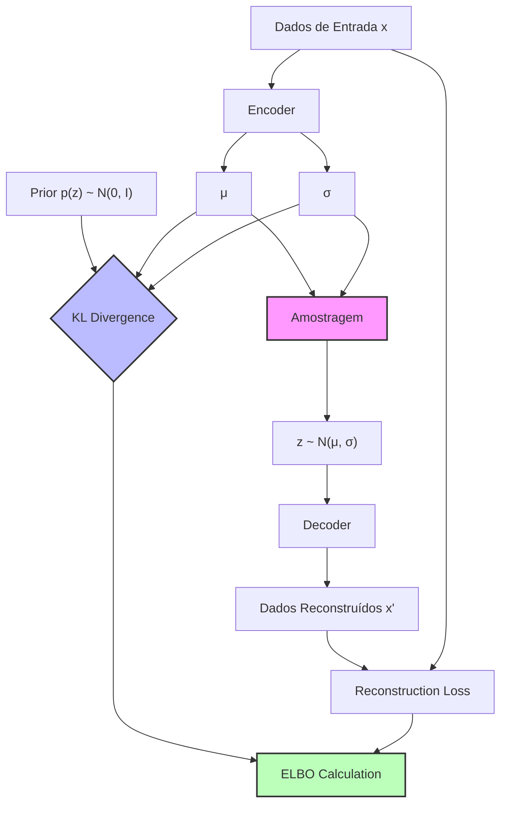

## Análise Detalhada da Classe VAE (Variational Autoencoder)



### Introdução

A classe **VAE** implementa um Variational Autoencoder, uma arquitetura de aprendizado profundo que combina redes neurais com inferência variacional para aprender representações latentes de dados. O VAE é usado para gerar novos dados similares aos dados de treinamento e para aprender representações comprimidas úteis para tarefas downstream.

### Análise Detalhada do Código

#### Classe VAE

A classe **VAE** é definida como uma subclasse de `nn.Module`, indicando que é um componente do PyTorch. Ela encapsula a lógica para o encoder, decoder, amostragem do espaço latente e cálculos de perda (ELBO - Evidence Lower BOund).

##### Definição da Classe

```python
class VAE(nn.Module):
    def __init__(self, nn='v1', name='vae', z_dim=2):
        super().__init__()
        self.name = name
        self.z_dim = z_dim
        nn = getattr(nns, nn)
        self.enc = nn.Encoder(self.z_dim)
        self.dec = nn.Decoder(self.z_dim)

        self.z_prior_m = torch.nn.Parameter(torch.zeros(1), requires_grad=False)
        self.z_prior_v = torch.nn.Parameter(torch.ones(1), requires_grad=False)
        self.z_prior = (self.z_prior_m, self.z_prior_v)
```

- **Propósito**: Inicializa a estrutura básica do VAE, incluindo o encoder, decoder e prior do espaço latente.
- **Parâmetros**:
  - *nn*: String que especifica a versão da arquitetura neural a ser usada (padrão: 'v1').
  - *name*: Nome do modelo (padrão: 'vae').
  - *z_dim*: Dimensão do espaço latente (padrão: 2).
- **Lógica Interna**:
  1. Inicializa atributos básicos (*name*, *z_dim*).
  2. Carrega dinamicamente as classes Encoder e Decoder do módulo especificado.
  3. Inicializa o encoder e decoder com a dimensão do espaço latente.
  4. Define o prior do espaço latente como uma distribuição normal padrão (média 0, variância 1).

> 💡 **Observação Importante**: O uso de `getattr(nns, nn)` permite flexibilidade na escolha da arquitetura neural, facilitando experimentos com diferentes configurações.

##### Método negative_elbo_bound

```python
def negative_elbo_bound(self, x):
    m, v = self.enc(x)
    z = ut.sample_gaussian(m, v)
    kl = ut.kl_normal(m, v, self.z_prior_m.expand_as(m), self.z_prior_v.expand_as(v))
    kl = kl.mean()
    logits = self.dec(z)
    rec = torch.nn.functional.binary_cross_entropy_with_logits(
        logits, x, reduction='none'
    )
    rec = rec.sum(dim=1)
    rec = rec.mean()
    nelbo = kl + rec
    return nelbo, kl, rec
```

- **Propósito**: Calcula o limite inferior negativo da evidência (Negative Evidence Lower BOund - NELBO), que é a função de perda principal do VAE.
- **Parâmetros**:
  - *x*: Tensor de entrada contendo os dados observados.
- **Lógica Interna**:
  1. Codifica a entrada *x* para obter os parâmetros da distribuição posterior q(z|x).
  2. Amostra z do espaço latente usando a técnica de reparametrização.
  3. Calcula a divergência KL entre q(z|x) e o prior p(z).
  4. Decodifica z para obter os logits da reconstrução.
  5. Calcula a perda de reconstrução usando cross-entropy binária.
  6. Combina KL e reconstrução para obter o NELBO.
- **Retorno**: Tupla contendo (nelbo, kl, rec).

> ⚠️ **Nota sobre Implementação**: A expansão do prior (`expand_as`) é crucial para garantir compatibilidade de dimensões no cálculo da KL.

Certamente! Vou criar uma explicação detalhada e passo a passo do método `negative_elbo_bound` da classe VAE. Esta função é crucial para o treinamento do Variational Autoencoder, pois calcula a função de perda principal do modelo.

### Explicação Passo a Passo

1. **Codificação dos Dados de Entrada**
   ```python
   m, v = self.enc(x)  # m and v are tensors of shape (batch_size, z_dim)
   ```
   - **Propósito**: Transforma os dados de entrada `x` em parâmetros da distribuição posterior q(z|x).
   - **Detalhes**:
     - `self.enc` é o encoder neural network.
     - `m` representa a média (μ) da distribuição posterior.
     - `v` representa a variância (σ²) da distribuição posterior.
   - **Dimensões**: Ambos `m` e `v` têm forma (batch_size, z_dim), onde z_dim é a dimensão do espaço latente.

2. **Amostragem do Espaço Latente**
   ```python
   z = ut.sample_gaussian(m, v)
   ```
   - **Propósito**: Amostra pontos `z` do espaço latente usando o truque de reparametrização.
   - **Detalhes**:
     - Utiliza a função `sample_gaussian` do módulo de utilidades.
     - Implementa z = μ + σ * ε, onde ε ~ N(0, 1).
   - **Importância**: Permite a propagação de gradientes através da operação de amostragem.

3. **Cálculo da Divergência KL**
   ```python
   kl = ut.kl_normal(m, v, self.z_prior_m.expand_as(m), self.z_prior_v.expand_as(v))
   kl = kl.mean()  # Mean over batch
   ```
   - **Propósito**: Calcula a divergência KL entre a distribuição posterior q(z|x) e o prior p(z).
   - **Detalhes**:
     - `self.z_prior_m` e `self.z_prior_v` são os parâmetros do prior (geralmente N(0, 1)).
     - `expand_as` é usado para garantir compatibilidade de dimensões.
     - A média é calculada sobre o batch para obter um único valor de KL.
   - **Significado**: Mede o quanto a distribuição posterior se desvia do prior.

4. **Computação da Perda de Reconstrução**
   ```python
   logits = self.dec(z)  # Shape: (batch_size, data_dim)
   rec = torch.nn.functional.binary_cross_entropy_with_logits(
       logits, x, reduction='none'
   )
   rec = rec.sum(dim=1)  # Sum over data dimensions
   rec = rec.mean()  # Mean over batch
   ```
   - **Propósito**: Calcula o erro de reconstrução entre os dados originais e os reconstruídos.
   - **Detalhes**:
     - `self.dec` é o decoder neural network.
     - `logits` são as saídas brutas do decoder antes da aplicação da função sigmoid.
     - Usa cross-entropy binária com logits para calcular a perda.
     - Soma sobre as dimensões dos dados e calcula a média sobre o batch.
   - **Significado**: Quantifica o quão bem o modelo reconstrói os dados de entrada.

5. **Cálculo do NELBO (Negative Evidence Lower Bound)**
   ```python
   nelbo = kl + rec
   ```
   - **Propósito**: Combina a divergência KL e a perda de reconstrução para formar o NELBO.
   - **Detalhes**: 
     - NELBO = KL(q(z|x) || p(z)) + E[log p(x|z)]
     - Minimizar o NELBO é equivalente a maximizar o ELBO.
   - **Importância**: Esta é a função objetivo principal que o VAE otimiza durante o treinamento.

6. **Retorno dos Resultados**
   ```python
   return nelbo, kl, rec
   ```
   - **Propósito**: Fornece os componentes individuais da perda para monitoramento e debugging.
   - **Valores Retornados**:
     - `nelbo`: Negative Evidence Lower Bound (a ser minimizado).
     - `kl`: Divergência KL entre posterior e prior.
     - `rec`: Erro de reconstrução.

### Observações Importantes

> 💡 **Truque de Reparametrização**: A amostragem de `z` usando `ut.sample_gaussian` é crucial para permitir a propagação de gradientes através da operação de amostragem estocástica.

> ⚠️ **Estabilidade Numérica**: O uso de `binary_cross_entropy_with_logits` em vez de `binary_cross_entropy` seguido de sigmoid melhora a estabilidade numérica.

> 🔍 **Balanceamento KL e Reconstrução**: O NELBO combina dois termos que muitas vezes estão em conflito. Um KL baixo incentiva uma distribuição posterior próxima ao prior, enquanto uma reconstrução baixa incentiva um ajuste melhor aos dados.

### Fluxo de Dados

1. Entrada `x` → Encoder → (m, v)
2. (m, v) → Amostragem → z
3. z → Decoder → logits
4. logits + x original → Perda de Reconstrução
5. (m, v) + prior → Divergência KL
6. KL + Reconstrução → NELBO

Este método encapsula o coração do funcionamento do VAE, implementando tanto o processo de codificação-decodificação quanto o cálculo da função de perda que guia o aprendizado do modelo.

##### Método negative_iwae_bound

```python
def negative_iwae_bound(self, x, iw):
    batch_size, data_dim = x.shape
    m, v = self.enc(x)
    m_expanded = m.unsqueeze(1).expand(batch_size, iw, self.z_dim)
    v_expanded = v.unsqueeze(1).expand(batch_size, iw, self.z_dim)
    epsilon = torch.randn(batch_size, iw, self.z_dim, device=x.device)
    z = m_expanded + torch.sqrt(v_expanded) * epsilon
    log_pz = ut.log_normal(z, torch.zeros_like(z), torch.ones_like(z))
    log_qz_given_x = ut.log_normal(z, m_expanded, v_expanded)
    z_flat = z.view(-1, self.z_dim)
    logits = self.dec(z_flat)
    logits = logits.view(batch_size, iw, data_dim)
    x_expanded = x.unsqueeze(1).expand(batch_size, iw, data_dim)
    log_px_given_z = ut.log_bernoulli_with_logits(x_expanded, logits)
    log_w = log_pz + log_px_given_z - log_qz_given_x
    log_mean_w = ut.log_mean_exp(log_w, dim=1)
    niwae = -torch.mean(log_mean_w)
    kl = ut.kl_normal(m, v, torch.zeros_like(m), torch.ones_like(v))
    kl = torch.mean(kl)
    z_rec = ut.sample_gaussian(m, v)
    logits_rec = self.dec(z_rec)
    rec = torch.nn.functional.binary_cross_entropy_with_logits(
        logits_rec, x, reduction='none'
    )
    rec = rec.sum(dim=1)
    rec = torch.mean(rec)
    return niwae, kl, rec
```

- **Propósito**: Calcula o limite IWAE (Importance Weighted Autoencoder Bound), uma estimativa mais precisa da log-verossimilhança.
- **Parâmetros**:
  - *x*: Tensor de entrada contendo os dados observados.
  - *iw*: Número de amostras de importância a serem usadas.
- **Lógica Interna**:
  1. Codifica a entrada e expande os parâmetros para acomodar múltiplas amostras.
  2. Amostra z usando a técnica de reparametrização.
  3. Calcula log p(z), log q(z|x) e log p(x|z) para cada amostra.
  4. Computa os pesos de importância e aplica o truque log-sum-exp para estabilidade numérica.
  5. Calcula o NIWAE (Negative IWAE) a partir dos pesos de importância.
  6. Calcula KL e reconstrução para comparação com ELBO.
- **Retorno**: Tupla contendo (niwae, kl, rec).

> 💡 **Observação Importante**: O IWAE fornece uma estimativa de limite inferior mais apertada que o ELBO padrão, especialmente útil para avaliação de modelo.

##### Método loss

```python
def loss(self, x):
    nelbo, kl, rec = self.negative_elbo_bound(x)
    loss = nelbo
    summaries = dict((
        ('train/loss', nelbo),
        ('gen/elbo', -nelbo),
        ('gen/kl_z', kl),
        ('gen/rec', rec),
    ))
    return loss, summaries
```

- **Propósito**: Calcula a perda total e prepara um dicionário de métricas para logging.
- **Parâmetros**:
  - *x*: Tensor de entrada contendo os dados observados.
- **Lógica Interna**:
  1. Chama `negative_elbo_bound` para obter NELBO, KL e reconstrução.
  2. Define a perda total como NELBO.
  3. Prepara um dicionário com métricas relevantes para monitoramento.
- **Retorno**: Tupla contendo (loss, summaries).

##### Métodos de Amostragem e Geração

```python
def sample_sigmoid(self, batch):
    z = self.sample_z(batch)
    return self.compute_sigmoid_given(z)

def compute_sigmoid_given(self, z):
    logits = self.dec(z)
    return torch.sigmoid(logits)

def sample_z(self, batch):
    return ut.sample_gaussian(
        self.z_prior[0].expand(batch, self.z_dim),
        self.z_prior[1].expand(batch, self.z_dim))

def sample_x(self, batch):
    z = self.sample_z(batch)
    return self.sample_x_given(z)

def sample_x_given(self, z):
    return torch.bernoulli(self.compute_sigmoid_given(z))
```

- **Propósito**: Fornecem funcionalidades para amostragem do espaço latente e geração de novas amostras.
- **Lógica Interna**:
  - `sample_sigmoid`: Amostra z do prior e computa a probabilidade sigmoid da saída.
  - `compute_sigmoid_given`: Aplica o decoder e a função sigmoid aos logits.
  - `sample_z`: Amostra do prior gaussiano do espaço latente.
  - `sample_x`: Gera novas amostras completas, amostrando z e então x.
  - `sample_x_given`: Gera amostras de x dado um z específico.

> 💡 **Observação Importante**: Esses métodos são cruciais para a geração de novas amostras e para visualizar o que o modelo aprendeu.

### Fluxo de Dados e Interações

1. **Codificação**: Os dados de entrada x são processados pelo encoder para produzir parâmetros (média e variância) da distribuição posterior q(z|x).
2. **Amostragem**: Um z é amostrado desta distribuição posterior usando o truque de reparametrização.
3. **Decodificação**: O z amostrado é passado pelo decoder para reconstruir x.
4. **Cálculo de Perda**: A ELBO é calculada combinando a perda de reconstrução e a divergência KL.
5. **Backpropagation**: O gradiente da perda é usado para atualizar os parâmetros do encoder e decoder.

### Exemplo de Uso

```python
# Inicialização do modelo
vae = VAE(nn='v1', z_dim=10)

# Treinamento
optimizer = torch.optim.Adam(vae.parameters())
for epoch in range(num_epochs):
    for batch in dataloader:
        optimizer.zero_grad()
        loss, _ = vae.loss(batch)
        loss.backward()
        optimizer.step()

# Geração de novas amostras
new_samples = vae.sample_x(batch_size=64)
```

### Conclusão

A classe VAE implementa um Variational Autoencoder completo, fornecendo métodos para treinamento (via ELBO ou IWAE), inferência e geração de amostras. A flexibilidade na escolha da arquitetura neural e a implementação cuidadosa dos cálculos de perda tornam esta classe uma base sólida para experimentos com VAEs em diversos conjuntos de dados.

A compreensão profunda de cada componente, especialmente os cálculos de ELBO e IWAE, é crucial para utilizar efetivamente este modelo e potencialmente estendê-lo para variantes mais complexas de VAEs.