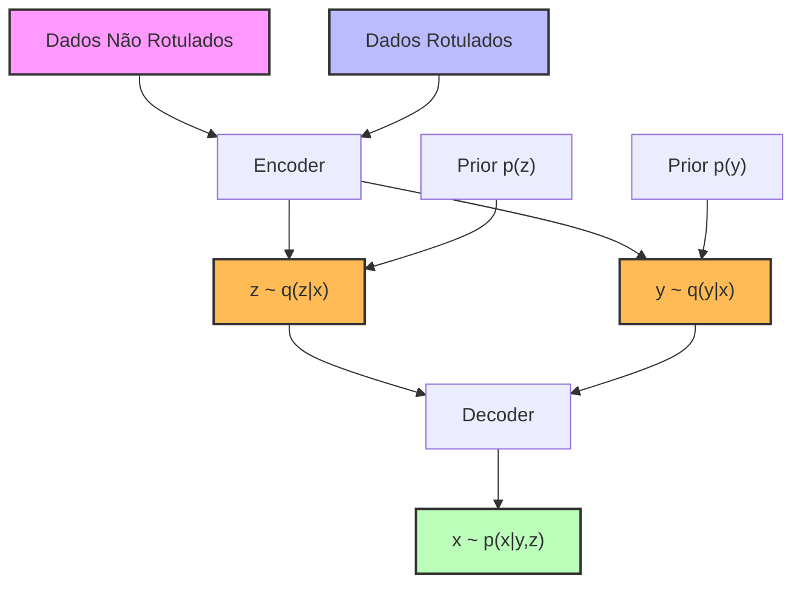

## Modelo Semi-Supervisionado de Autoencodificador Variacional (SSVAE) para Classificação de Imagens



### Introdução

Este resumo aborda o **Modelo Semi-Supervisionado de Autoencodificador Variacional (SSVAE)**, uma poderosa extensão do VAE tradicional para cenários de aprendizado semi-supervisionado. ==O SSVAE é particularmente útil quando temos uma grande quantidade de dados não rotulados e apenas um pequeno conjunto de dados rotulados, situação comum em muitas aplicações práticas de *machine learning* [1].==

O SSVAE combina as vantagens dos modelos generativos com a capacidade de incorporar informações de rótulos parciais, permitindo um aprendizado mais eficiente e robusto. ==Ao integrar dados não rotulados no processo de treinamento, o SSVAE pode aprender representações latentes que capturam a estrutura subjacente dos dados, melhorando o desempenho em tarefas de classificação com recursos limitados de rótulos.==

Neste resumo, exploraremos em detalhes a formulação matemática, a implementação prática e as nuances deste modelo avançado, além de discutir as implicações teóricas e práticas do uso do SSVAE em problemas reais.

### Conceitos Fundamentais

| Conceito                                | Explicação                                                   |
| --------------------------------------- | ------------------------------------------------------------ |
| **Aprendizado Semi-Supervisionado**     | ==Paradigma de aprendizado de máquina que utiliza tanto dados rotulados quanto não rotulados para treinamento==. No contexto do SSVAE, temos um pequeno conjunto de dados rotulados $X_l = \{(x^{(i)}, y^{(i)})\}_{i=1}^{100}$ e um grande conjunto de dados não rotulados $X_u = \{x^{(i)}\}_{i=101}^{60000}$ [1]. |
| **Autoencodificador Variacional (VAE)** | Modelo generativo que aprende uma representação latente dos dados, utilizando técnicas de inferência variacional. No SSVAE, ==estendemos o VAE para incorporar informações de rótulos parcialmente observados, permitindo que o modelo capture tanto a distribuição dos dados quanto a relação entre dados e rótulos [1].== |
| **Inferência Amortizada**               | Técnica que utiliza uma rede neural para aproximar a distribuição posterior das variáveis latentes, permitindo inferência rápida em novos dados. ==No contexto do SSVAE, a inferência amortizada facilita a estimação das distribuições $q_\phi(y | x)$ e $q_\phi(z | x, y)$ [1].== |

> ⚠️ **Nota Importante**: O SSVAE permite aproveitar a grande quantidade de dados não rotulados para melhorar o desempenho do classificador, uma vantagem significativa sobre métodos puramente supervisionados que utilizam apenas dados rotulados [1].

### Modelo Generativo do SSVAE

O SSVAE segue o seguinte processo generativo [1]:

1. **Distribuição *prior* para variáveis latentes z**:

   $$
   p(z) = \mathcal{N}(z | 0, I)
   $$

   Onde $z$ é uma variável latente contínua com distribuição normal multivariada com média zero e matriz de covariância identidade.

2. **Distribuição *prior* para rótulos y**:

   $$
   p(y) = \text{Categorical}(y | \pi) = \frac{1}{10}
   $$

   ==Onde $y$ é uma variável categórica representando os rótulos das classes (no caso do MNIST, dígitos de 0 a 9), com distribuição uniforme.==

3. **Distribuição condicional para dados observados x**:

   $$
   p_\theta(x | y, z) = \text{Bern}(x | f_\theta(y, z))
   $$

   ==Aqui, $f_\theta(\cdot)$ é uma rede neural decodificadora parametrizada por $\theta$, que mapeia as variáveis latentes $y$ e $z$ para os parâmetros da distribuição Bernoulli sobre cada pixel da imagem $x$.==

Onde $\pi = \left(\frac{1}{10}, \frac{1}{10}, \ldots, \frac{1}{10}\right)$ é um *prior* uniforme fixo sobre os 10 possíveis rótulos.

> ✔️ **Ponto de Destaque**: ==A incorporação do rótulo $y$ como uma variável latente parcialmente observada permite ao modelo aprender representações significativas,== mesmo com poucos dados rotulados. Isso ocorre porque ==o modelo pode inferir informações sobre $y$ a partir dos dados não rotulados, aproveitando a estrutura estatística dos dados [1].==

### Objetivo de Treinamento

==O princípio da máxima verossimilhança sugere que devemos encontrar o modelo $p_\theta$ que maximiza a verossimilhança sobre ambos os conjuntos de dados, $X_l$ (dados rotulados) e $X_u$ (dados não rotulados).== Assumindo amostras i.i.d., o objetivo é maximizar a seguinte função de log-verossimilhança [1]:
$$
\max_\theta \left( \sum_{x \in X_u} \log p_\theta(x) + \sum_{(x,y) \in X_l} \log p_\theta(x, y) \right)
$$

Onde:

$$
p_\theta(x) = \sum_{y \in \mathcal{Y}} \int p_\theta(x, y, z) \, dz = \sum_{y \in \mathcal{Y}} p_\theta(x, y)
$$

$$
p_\theta(x, y) = \int p_\theta(x, y, z) \, dz
$$

Devido à intratabilidade da marginalização exata das variáveis latentes $z$, ==maximizamos seus respectivos limites inferiores de evidência (ELBOs) [1]:==

$$
\max_{\theta,\phi} \left( \sum_{x \in X_u} \text{ELBO}(x; \theta, \phi) + \sum_{(x,y) \in X_l} \text{ELBO}(x, y; \theta, \phi) \right)
$$

#### Questões Técnicas

1. **Como a incorporação de dados não rotulados no SSVAE difere da abordagem de um VAE padrão?**

   A abordagem padrão de um VAE utiliza apenas dados não rotulados para aprender a distribuição dos dados, sem considerar rótulos. No SSVAE, incorporamos dados rotulados e não rotulados, permitindo que o modelo aprenda não apenas a distribuição dos dados, mas também a relação entre os dados e seus rótulos. Isso resulta em um modelo que pode realizar tarefas de geração e classificação simultaneamente.

2. **Qual é o papel do *prior* uniforme sobre os rótulos no processo generativo do SSVAE?**

   O *prior* uniforme sobre os rótulos reflete a suposição de que todas as classes têm probabilidade igual antes de observar os dados. Isso ajuda a evitar vieses no modelo e simplifica o processo de inferência, pois cada classe é tratada de forma equitativa durante o treinamento.

### Modelo de Inferência Amortizada

Introduzimos um modelo de inferência amortizada $q_\phi(y, z | x)$ que se factoriza como $q_\phi(y | x) q_\phi(z | x, y)$ [1]:

$$
q_\phi(y | x) = \text{Categorical}(y | f_\phi(x))
$$

$$
q_\phi(z | x, y) = \mathcal{N}(z | \mu_\phi(x, y), \text{diag}(\sigma^2_\phi(x, y)))
$$

Onde $f_\phi(x)$ é um classificador MLP que prediz a probabilidade do rótulo $y$ dado $x$, e $\mu_\phi(x, y)$ e $\sigma^2_\phi(x, y)$ são obtidos através de uma passagem pelo encoder.

### Construção dos ELBOs

Utilizamos o modelo de inferência amortizada para construir os ELBOs [1]:

$$
\text{ELBO}(x; \theta, \phi) = \mathbb{E}_{q_\phi(y,z|x)}\left[ \log p_\theta(x, y, z) - \log q_\phi(y, z | x) \right]
$$

$$
\text{ELBO}(x, y; \theta, \phi) = \mathbb{E}_{q_\phi(z|x,y)}\left[ \log p_\theta(x, y, z) - \log q_\phi(z | x, y) \right]
$$

> ❗ **Ponto de Atenção**: ==A maximização apenas do limite inferior da log-verossimilhança não é suficiente para aprender um bom classificador, pois o objetivo não penaliza diretamente erros de classificação [1].==

### Objetivo de Treinamento Aprimorado

Kingma et al. (2014) propuseram ==introduzir um sinal de treinamento adicional que treina diretamente o classificador nos dados rotulados [1]:==

$$
\max_{\theta,\phi} \left( \sum_{x \in X_u} \text{ELBO}(x; \theta, \phi) + \sum_{(x,y) \in X_l} \text{ELBO}(x, y; \theta, \phi) + \alpha \sum_{(x,y) \in X_l} \log q_\phi(y | x) \right)
$$

==Onde $\alpha \geq 0$ pondera a importância da precisão da classificação.==

Uma variante simplificada deste objetivo, que funciona igualmente bem na prática, é [1]:

$$
\max_{\theta,\phi} \left( \sum_{x \in X} \text{ELBO}(x; \theta, \phi) + \alpha \sum_{(x,y) \in X_l} \log q_\phi(y | x) \right)
$$

Onde $X = \{X_u, X_l\}$.

> 💡 **Interpretação**: A introdução da perda de classificação pode ser interpretada como a maximização do ELBO sujeita à restrição suave de que o classificador $q_\phi(y | x)$ alcance um bom desempenho no conjunto de dados rotulados [1].

#### Questões Técnicas

1. **Como o termo adicional $\alpha \sum_{(x,y) \in X_l} \log q_\phi(y | x)$ no objetivo de treinamento aprimorado afeta o aprendizado do modelo?**

   Este termo atua como uma penalidade para erros de classificação, incentivando o modelo a melhorar a precisão do classificador nos dados rotulados. Isso ajuda a alinhar o objetivo de maximização da verossimilhança com o objetivo de classificação, resultando em um modelo que é tanto generativo quanto discriminativo.

2. **Por que a variante simplificada do objetivo de treinamento funciona bem na prática? Quais são as implicações teóricas dessa simplificação?**

   A variante simplificada remove a necessidade de computar ELBOs separados para dados rotulados e não rotulados, reduzindo a complexidade computacional. Teoricamente, essa simplificação assume que o ELBO sobre todos os dados captura informações suficientes para o treinamento eficaz do modelo, especialmente quando o conjunto de dados rotulados é pequeno.

### Implementação Prática do SSVAE

Para implementar o SSVAE, podemos utilizar o PyTorch. Abaixo, apresentamos um esboço de código que ilustra a estrutura básica do modelo:

```python
import torch
import torch.nn as nn
import torch.nn.functional as F

class SSVAE(nn.Module):
    def __init__(self, input_dim, latent_dim, num_classes):
        super(SSVAE, self).__init__()
        
        self.latent_dim = latent_dim
        self.num_classes = num_classes
        
        # Encoder
        self.encoder = nn.Sequential(
            nn.Linear(input_dim, 256),
            nn.ReLU(),
            nn.Linear(256, 2 * latent_dim)
        )
        
        # Classifier
        self.classifier = nn.Sequential(
            nn.Linear(input_dim, 256),
            nn.ReLU(),
            nn.Linear(256, num_classes)
        )
        
        # Decoder
        self.decoder = nn.Sequential(
            nn.Linear(latent_dim + num_classes, 256),
            nn.ReLU(),
            nn.Linear(256, input_dim),
            nn.Sigmoid()
        )
        
    def encode(self, x, y=None):
        h = self.encoder(x)
        mu = h[:, :self.latent_dim]
        logvar = h[:, self.latent_dim:]
        return mu, logvar
    
    def reparameterize(self, mu, logvar):
        std = torch.exp(0.5 * logvar)
        eps = torch.randn_like(std)
        return mu + eps * std
    
    def decode(self, z, y):
        y_onehot = F.one_hot(y, num_classes=self.num_classes).float()
        zy = torch.cat([z, y_onehot], dim=1)
        return self.decoder(zy)
    
    def forward(self, x, y=None):
        # Classification
        y_logits = self.classifier(x)
        y_pred = F.softmax(y_logits, dim=1)
        
        # Encoding
        if y is None:
            # For unlabeled data, sample y from q(y|x)
            y = torch.argmax(y_pred, dim=1)
        mu, logvar = self.encode(x)
        z = self.reparameterize(mu, logvar)
        
        # Decoding
        x_recon = self.decode(z, y)
        
        return x_recon, mu, logvar, y_logits, y
    
    def loss_function(self, x_recon, x, mu, logvar, y_logits, y_true, alpha):
        # Reconstruction loss
        recon_loss = F.binary_cross_entropy(x_recon, x, reduction='sum')
        
        # KL divergence
        kl_div = -0.5 * torch.sum(1 + logvar - mu.pow(2) - logvar.exp())
        
        # Classification loss
        class_loss = F.cross_entropy(y_logits, y_true, reduction='sum')
        
        return recon_loss + kl_div + alpha * class_loss
```

Este código implementa a estrutura básica do SSVAE, incluindo o *encoder*, o *classifier* e o *decoder*. A função de perda (`loss_function`) combina a perda de reconstrução, a divergência KL e a perda de classificação, conforme descrito no objetivo de treinamento aprimorado [1].

> ⚠️ **Nota Importante**: A implementação prática requer cuidados adicionais, como o tratamento adequado de dados rotulados e não rotulados durante o treinamento, a normalização dos dados de entrada, a inicialização dos parâmetros da rede, e a escolha apropriada do hiperparâmetro $\alpha$. Além disso, técnicas como *batch normalization*, *dropout*, e otimização adequada podem ser necessárias para obter um bom desempenho [1].

### Conclusão

O **Modelo Semi-Supervisionado de Autoencodificador Variacional (SSVAE)** representa uma abordagem poderosa para aprendizado semi-supervisionado, combinando as vantagens dos modelos generativos com a capacidade de incorporar informações de rótulos parciais. Ao utilizar tanto dados rotulados quanto não rotulados, o SSVAE pode aprender representações latentes significativas e melhorar o desempenho de classificação, especialmente em cenários com poucos dados rotulados disponíveis [1].

A formulação matemática do SSVAE, incluindo o processo generativo, o modelo de inferência amortizada e o objetivo de treinamento aprimorado, fornece uma base sólida para entender e implementar este modelo avançado. A introdução do termo de classificação no objetivo de treinamento é uma contribuição chave, permitindo um equilíbrio entre a qualidade do modelo generativo e o desempenho do classificador [1].

A implementação prática do SSVAE em frameworks como PyTorch permite a aplicação deste modelo em uma variedade de tarefas de aprendizado semi-supervisionado, oferecendo um caminho promissor para abordar problemas com dados parcialmente rotulados em diversos domínios, como visão computacional, processamento de linguagem natural e bioinformática.

### Questões Avançadas

1. **Como o SSVAE se compara a outros métodos de aprendizado semi-supervisionado em termos de desempenho e eficiência computacional? Discuta os *trade-offs* envolvidos.**

   O SSVAE oferece a vantagem de integrar de forma natural dados rotulados e não rotulados, aproveitando modelos generativos para melhorar o desempenho de classificação. Em comparação com métodos discriminativos semi-supervisionados, o SSVAE pode capturar melhor a estrutura dos dados, mas pode ser mais complexo computacionalmente devido à necessidade de treinar modelos generativos. Os *trade-offs* envolvem a complexidade do modelo, tempo de treinamento e requisitos computacionais versus potencial melhoria no desempenho em tarefas com dados limitados.

2. **O SSVAE assume um *prior* uniforme sobre os rótulos. Como a escolha de um *prior* não uniforme afetaria o modelo e em quais cenários isso poderia ser benéfico?**

   Usar um *prior* não uniforme permite incorporar conhecimento prévio sobre a distribuição das classes. Se algumas classes forem mais frequentes que outras, ajustar o *prior* para refletir essa distribuição pode melhorar o desempenho do modelo em cenários reais. Isso pode ser benéfico em aplicações onde as classes estão desbalanceadas. No entanto, isso também pode introduzir viés e requer cuidado na estimação do *prior* apropriado.

3. **Considerando a arquitetura do SSVAE, como você poderia estendê-la para lidar com dados multimodais, como imagens e texto associados? Quais modificações seriam necessárias no modelo e no objetivo de treinamento?**

   Para lidar com dados multimodais, o modelo precisaria ser estendido para incorporar múltiplos tipos de entrada e possivelmente múltiplos espaços latentes. Isso poderia envolver a definição de codificadores e decodificadores específicos para cada modalidade, e a combinação das representações latentes de forma coerente. O objetivo de treinamento também precisaria considerar a reconstrução de múltiplas modalidades e a possível interação entre elas.

4. **Analise o impacto do número de amostras rotuladas no desempenho do SSVAE. Como você poderia adaptar o modelo para cenários com quantidades extremamente limitadas de dados rotulados (por exemplo, aprendizado de poucos disparos)?**

   Com um número muito limitado de amostras rotuladas, o desempenho do classificador pode ser prejudicado. Para lidar com isso, técnicas de *few-shot learning* podem ser integradas, como meta-aprendizado ou utilização de métricas de similaridade. Além disso, pode-se explorar métodos de data augmentation, transferência de aprendizado ou regulares mais fortes para evitar overfitting.

5. **Discuta as implicações teóricas e práticas de usar um modelo de inferência amortizada no contexto do SSVAE. Quais são as vantagens e limitações desta abordagem em comparação com métodos de inferência variacional mais tradicionais?**

   A inferência amortizada permite estimar a distribuição posterior das variáveis latentes de forma eficiente, reutilizando os parâmetros da rede neural para diferentes amostras. Isso torna a inferência rápida e escalável. No entanto, a aproximação pode ser menos precisa do que métodos variacionais tradicionais que otimizam uma distribuição posterior específica para cada amostra. A amortização pode introduzir viés e limitar a flexibilidade da aproximação posterior.

### Referências

[1] Kingma, D. P., et al. (2014). *Semi-Supervised Learning with Deep Generative Models*. arXiv preprint arXiv:1406.5298.