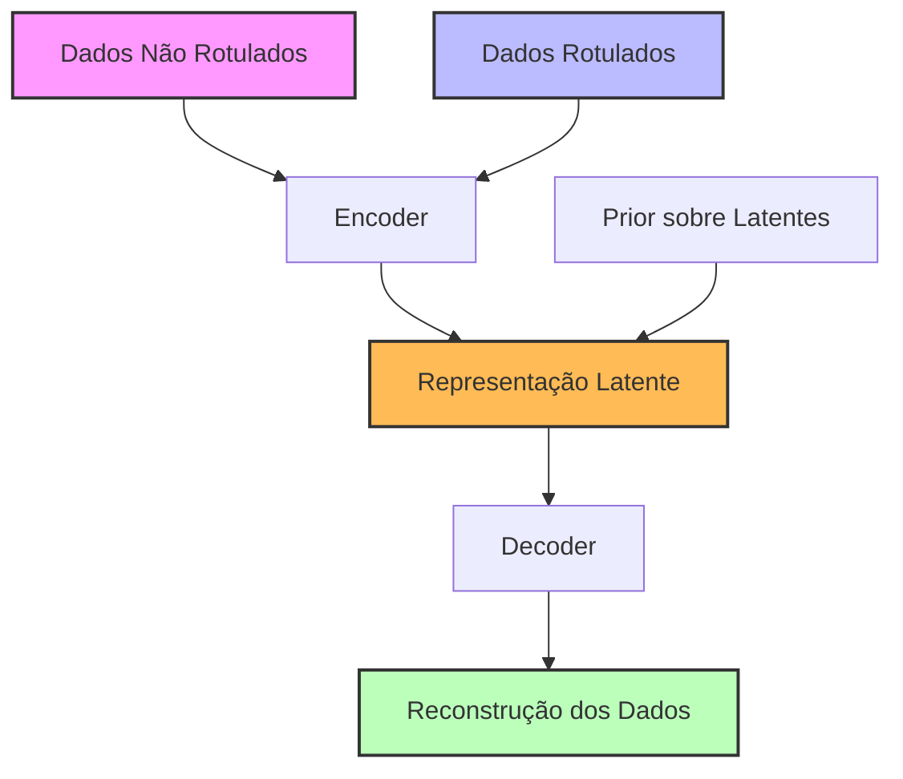

## Modelos Generativos Semi-Supervisionados para Aprendizado Profundo



### Introdução

Este resumo aborda os **Modelos Generativos Semi-Supervisionados** no contexto do aprendizado profundo, destacando os princípios que tornam essa abordagem teoricamente superior e aplicável a qualquer modelo generativo. Em cenários onde há abundância de dados não rotulados e escassez de dados rotulados, modelos generativos semi-supervisionados oferecem uma alternativa eficaz para melhorar o desempenho em tarefas de classificação e geração de dados [1].

Ao integrar dados não rotulados no processo de treinamento, esses modelos capturam a estrutura subjacente dos dados, resultando em representações latentes mais robustas e generalizáveis. Isso é alcançado combinando técnicas de aprendizado não supervisionado com informações parciais de rótulos, permitindo um aprendizado mais eficiente mesmo com recursos limitados de rótulos.

Neste resumo, exploraremos os princípios fundamentais, a formulação matemática e as implicações teóricas dos modelos generativos semi-supervisionados, entendendo por que essa alternativa é melhor e quais princípios auxiliam nesse objetivo para qualquer modelo generativo.

### Conceitos Fundamentais

| Conceito                            | Explicação                                                   |
| ----------------------------------- | ------------------------------------------------------------ |
| **Aprendizado Semi-Supervisionado** | ==Paradigma de aprendizado que utiliza tanto dados rotulados quanto não rotulados para treinamento.== Permite que o modelo aproveite a grande quantidade de dados não rotulados disponíveis em muitas aplicações [1]. |
| **Modelos Generativos**             | Modelos que aprendem a distribuição de probabilidade dos dados, permitindo a geração de novos exemplos. Exemplos incluem Autoencoders Variacionais (VAEs) e Redes Generativas Adversariais (GANs) [2]. |
| **Inferência Variacional**          | Técnica para aproximar distribuições complexas por meio de otimização, facilitando o treinamento de modelos generativos profundos [3]. |

> ⚠️ **Nota Importante**: A capacidade dos modelos generativos semi-supervisionados de utilizar dados não rotulados para melhorar o aprendizado supervisionado é um dos principais motivos pelos quais essa abordagem é teoricamente vantajosa e amplamente aplicável.

### Princípios Gerais dos Modelos Generativos Semi-Supervisionados

Os modelos generativos semi-supervisionados baseiam-se em princípios que os tornam eficazes:

1. **Exploração da Estrutura dos Dados Não Rotulados**: Ao modelar a distribuição dos dados, o modelo captura padrões e estruturas latentes que não seriam detectados apenas com dados rotulados [4].

2. **Aprendizado Conjunto de Representações e Classificação**: Simultaneamente, o modelo aprende representações latentes úteis para geração e classificação, promovendo uma sinergia entre as duas tarefas [5].

3. **Regularização Implícita**: A capacidade de gerar dados atua como uma forma de regularização, prevenindo o overfitting e melhorando a generalização [6].

4. **Inferência Amortizada**: Utiliza redes neurais para aproximar distribuições posteriores, tornando a inferência em novos dados rápida e eficiente [3].

> ✔️ **Ponto de Destaque**: Esses princípios são universais e podem ser aplicados a qualquer modelo generativo, como VAEs, GANs ou Flows Normais, ampliando o alcance e a utilidade dos modelos generativos semi-supervisionados.

### Formulação Matemática Geral

#### Modelo Generativo

Considere um modelo generativo com variáveis latentes $z$ e rótulos $y$, onde $x$ são os dados observados. O modelo define a seguinte distribuição conjunta:

$$
p_\theta(x, y, z) = p_\theta(x | y, z) \, p(y) \, p(z)
$$

Onde:

- $p_\theta(x | y, z)$ é o decodificador que gera os dados a partir de $y$ e $z$.
- ==$p(y)$ é o prior sobre os rótulos, frequentemente assumido como uniforme.==
- $p(z)$ é o prior sobre as variáveis latentes, tipicamente uma distribuição normal multivariada.

#### Objetivo de Treinamento

==O objetivo é maximizar a verossimilhança dos dados rotulados $\mathcal{D}_l = \{(x^{(i)}, y^{(i)})\}_{i=1}^{N_l}$ e dos dados não rotulados $\mathcal{D}_u = \{x^{(i)}\}_{i=N_l+1}^{N}$:==
$$
\max_\theta \left( \sum_{i=1}^{N_l} \log p_\theta(x^{(i)}, y^{(i)}) + \sum_{i=N_l+1}^{N} \log p_\theta(x^{(i)}) \right)
$$

Como a marginalização sobre $z$ e $y$ é intratável, ==introduzimos uma distribuição aproximada $q_\phi(y, z | x)$== para construir o ELBO (Evidência Limite Inferior):

$$
\log p_\theta(x) \geq \mathbb{E}_{q_\phi(y, z | x)}\left[ \log p_\theta(x, y, z) - \log q_\phi(y, z | x) \right]
$$

#### Inferência Amortizada

A inferência amortizada modela $q_\phi(y, z | x)$ como:

$$
q_\phi(y, z | x) = q_\phi(y | x) \, q_\phi(z | x, y)
$$

Onde:

- $q_\phi(y | x)$ é um classificador probabilístico.
- $q_\phi(z | x, y)$ é o encoder que mapeia $x$ e $y$ para uma distribuição sobre $z$.

> ❗ **Ponto de Atenção**: A eficiência e a precisão da inferência amortizada dependem da capacidade das redes neurais utilizadas para aproximar as distribuições posteriores.

### Princípios que Tornam a Abordagem Melhor

1. **Utilização Completa dos Dados**: Ao incorporar dados não rotulados, o modelo aproveita toda a informação disponível, melhorando o aprendizado e a generalização [1].

2. **Aprendizado de Representações Latentes Ricas**: A modelagem conjunta de $x$, $y$ e $z$ permite que o modelo capture nuances dos dados que beneficiam tanto a geração quanto a classificação [5].

3. **Regularização Natural**: A necessidade de reconstruir ou gerar dados força o modelo a evitar soluções triviais, atuando como regularizador [6].

4. **Flexibilidade Modelagem**: Os princípios podem ser aplicados a diferentes arquiteturas e domínios, tornando a abordagem amplamente aplicável [7].

#### Questões Técnicas

1. **Por que modelar a distribuição conjunta $p(x, y)$ é vantajoso?**

   ==Modelar $p(x, y)$ permite que o modelo capture a relação entre os dados e os rótulos==, utilizando informações dos dados não rotulados para melhorar a predição dos rótulos [4].

2. **Como a inferência amortizada contribui para a eficiência do modelo?**

   A inferência amortizada usa redes neurais para aproximar as distribuições posteriores, permitindo a inferência rápida e escalável em novos dados, essencial para modelos profundos [3].

### Implementação Prática Geral

A implementação de um modelo generativo semi-supervisionado envolve a definição de componentes para o encoder, decoder e classificador. A função de perda combina termos de reconstrução, divergência KL e, se necessário, perda de classificação.

```python
import torch
import torch.nn as nn
import torch.nn.functional as F

class SemiSupervisedGenerativeModel(nn.Module):
    def __init__(self, input_dim, latent_dim, num_classes):
        super(SemiSupervisedGenerativeModel, self).__init__()
        
        self.latent_dim = latent_dim
        self.num_classes = num_classes
        
        # Encoder
        self.encoder = nn.Sequential(
            nn.Linear(input_dim + num_classes, 256),
            nn.ReLU(),
            nn.Linear(256, 2 * latent_dim)
        )
        
        # Decoder
        self.decoder = nn.Sequential(
            nn.Linear(latent_dim + num_classes, 256),
            nn.ReLU(),
            nn.Linear(256, input_dim),
            nn.Sigmoid()
        )
        
        # Classifier
        self.classifier = nn.Sequential(
            nn.Linear(input_dim, 256),
            nn.ReLU(),
            nn.Linear(256, num_classes)
        )
        
    def forward(self, x, y=None):
        # Classificação
        y_logits = self.classifier(x)
        y_pred = F.softmax(y_logits, dim=1)
        
        # Amostragem de y para dados não rotulados
        if y is None:
            y = torch.argmax(y_pred, dim=1)
        y_onehot = F.one_hot(y, num_classes=self.num_classes).float()
        
        # Encoder
        x_y = torch.cat([x, y_onehot], dim=1)
        h = self.encoder(x_y)
        mu, logvar = h.chunk(2, dim=-1)
        z = self.reparameterize(mu, logvar)
        
        # Decoder
        z_y = torch.cat([z, y_onehot], dim=1)
        x_recon = self.decoder(z_y)
        
        return x_recon, mu, logvar, y_logits, y_pred
    
    def reparameterize(self, mu, logvar):
        std = torch.exp(0.5 * logvar)
        eps = torch.randn_like(std)
        return mu + eps * std
    
    def loss_function(self, x_recon, x, mu, logvar, y_logits, y_true, alpha=1.0):
        # Perda de reconstrução
        recon_loss = F.binary_cross_entropy(x_recon, x, reduction='sum')
        
        # Divergência KL
        kl_div = -0.5 * torch.sum(1 + logvar - mu.pow(2) - logvar.exp())
        
        # Perda de classificação
        class_loss = F.cross_entropy(y_logits, y_true, reduction='sum')
        
        return recon_loss + kl_div + alpha * class_loss
```

> ⚠️ **Nota Importante**: A implementação prática requer ajustes específicos ao problema, como a seleção de hiperparâmetros, arquitetura da rede e técnicas de regularização.

### Conclusão

Os **Modelos Generativos Semi-Supervisionados** representam uma abordagem poderosa e teoricamente sólida para o aprendizado em cenários com dados rotulados escassos. Ao explorar princípios fundamentais como a exploração da estrutura dos dados não rotulados, o aprendizado conjunto de representações e classificação, e a inferência amortizada, esses modelos oferecem vantagens significativas sobre métodos puramente supervisionados.

Compreender esses princípios permite aplicar a abordagem a uma variedade de modelos generativos e domínios, promovendo avanços tanto teóricos quanto práticos em aprendizado de máquina.

### Questões Avançadas

1. **Como os modelos generativos semi-supervisionados se comparam a métodos puramente discriminativos em termos de desempenho e complexidade?**

   Modelos generativos podem superar métodos discriminativos em cenários com poucos dados rotulados, mas geralmente têm maior complexidade computacional e requerem mais cuidado na modelagem.

2. **Quais desafios estão associados à inferência variacional em modelos generativos profundos, e como eles podem ser superados?**

   Desafios incluem a escolha de distribuições aproximadas adequadas e a otimização estável. Técnicas como amortização da inferência e regularização melhorada podem ajudar a superar esses desafios.

3. **Como adaptar os princípios discutidos para modelos generativos não probabilísticos, como Autoencoders Determinísticos?**

   Embora não modelam explicitamente distribuições, princípios como o aprendizado de representações latentes e o uso de dados não rotulados podem ser adaptados para melhorar o desempenho em tarefas específicas.

### Referências

[1] Zhu, X., & Goldberg, A. B. (2009). *Introduction to Semi-Supervised Learning*. Synthesis Lectures on Artificial Intelligence and Machine Learning.

[2] Goodfellow, I., et al. (2014). *Generative Adversarial Nets*. Advances in Neural Information Processing Systems.

[3] Kingma, D. P., & Welling, M. (2013). *Auto-Encoding Variational Bayes*. arXiv preprint arXiv:1312.6114.

[4] Kingma, D. P., et al. (2014). *Semi-Supervised Learning with Deep Generative Models*. arXiv preprint arXiv:1406.5298.

[5] Rasmus, A., et al. (2015). *Semi-Supervised Learning with Ladder Networks*. Advances in Neural Information Processing Systems.

[6] Doersch, C. (2016). *Tutorial on Variational Autoencoders*. arXiv preprint arXiv:1606.05908.

[7] Chapelle, O., Scholkopf, B., & Zien, A. (2006). *Semi-Supervised Learning*. MIT Press.