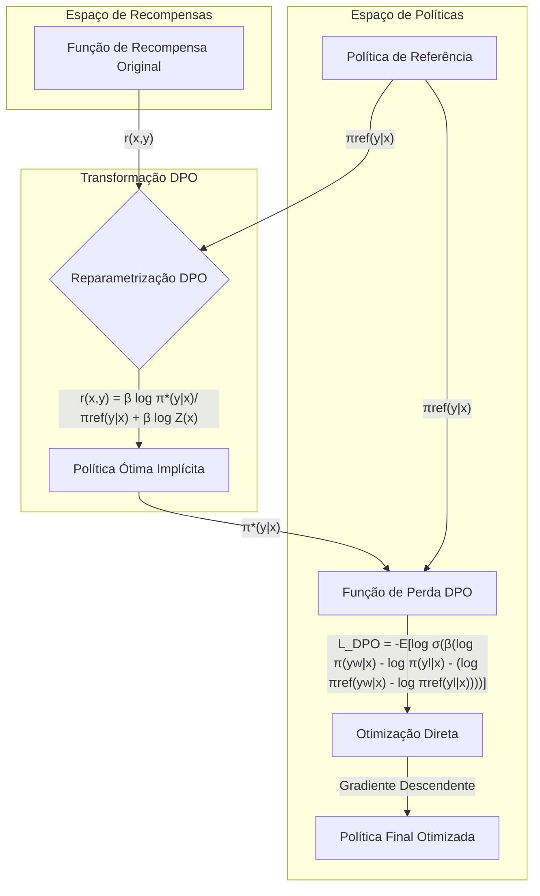

# Direct Preference Optimization: Reparametrização da Recompensa para Otimização de Preferências



## Introdução

A otimização de preferências em modelos de linguagem de grande escala tem sido um desafio significativo na área de aprendizado de máquina e processamento de linguagem natural. Tradicionalmente, métodos como o Aprendizado por Reforço a partir de Feedback Humano (RLHF) têm sido empregados para alinhar o comportamento dos modelos com as preferências humanas [1]. No entanto, esses métodos frequentemente envolvem processos complexos e computacionalmente intensivos.

Neste contexto, surge uma abordagem inovadora conhecida como **Direct Preference Optimization (DPO)**, que representa um avanço significativo na forma como abordamos a otimização de preferências [2]. O cerne desta abordagem reside em uma **reparametrização crítica da função de recompensa**, que permite a extração em forma fechada da política ótima correspondente [3].

Esta reparametrização não apenas simplifica o processo de otimização, mas também oferece uma perspectiva teórica profunda sobre a relação entre funções de recompensa e políticas ótimas em aprendizado por reforço [4]. Ao fazer isso, o DPO contorna a necessidade de treinamento explícito de modelos de recompensa e procedimentos complexos de aprendizado por reforço, oferecendo uma alternativa mais direta e eficiente [5].

## Conceitos Fundamentais

Para compreender plenamente a inovação trazida pela reparametrização da recompensa no DPO, é crucial estabelecer uma base sólida nos conceitos fundamentais que sustentam esta abordagem.

| Conceito                 | Explicação                                                   |
| ------------------------ | ------------------------------------------------------------ |
| **Função de Recompensa** | Em aprendizado por reforço, a função de recompensa $r(x, y)$ quantifica o desempenho de uma ação $y$ dado um estado $x$. No contexto de modelos de linguagem, $x$ pode representar um prompt e $y$ uma resposta gerada [6]. |
| **Política**             | Uma política $\pi(y|x)$ é uma distribuição de probabilidade sobre ações possíveis dado um estado. Em modelos de linguagem, isso corresponde à probabilidade de gerar diferentes respostas para um dado prompt [7]. |
| **Política Ótima**       | A política ótima $\pi^*(y|x)$ é aquela que maximiza a recompensa esperada sob a função de recompensa dada [8]. |
| **KL-divergência**       | Uma medida de diferença entre duas distribuições de probabilidade, frequentemente usada para regularizar o desvio de uma política de uma distribuição de referência [9]. |

> ✔️ **Destaque**: A inovação central do DPO está na descoberta de uma relação matemática direta entre a função de recompensa e a política ótima correspondente, permitindo a otimização direta da política sem a necessidade de um modelo de recompensa explícito [10].

### Reparametrização da Recompensa

A reparametrização da recompensa no DPO é fundamentada em uma observação crítica: ==existe uma correspondência unívoca entre classes de equivalência de funções de recompensa e políticas ótimas [11].== Esta observação permite expressar a função de recompensa em termos da política ótima e de uma política de referência:

$$
r(x, y) = \beta \log \frac{\pi^*(y|x)}{\pi_{\text{ref}}(y|x)} + \beta \log Z(x)
$$

Onde:
- $r(x, y)$ é a função de recompensa
- $\pi^*(y|x)$ é a política ótima
- $\pi_{\text{ref}}(y|x)$ é uma política de referência
- $\beta$ é um parâmetro de temperatura
- $Z(x)$ é uma função de partição dependente apenas de $x$ [12]

Esta reparametrização tem implicações profundas:

1. **Eliminação do Modelo de Recompensa Explícito**: Ao expressar a recompensa diretamente em termos da política, eliminamos a necessidade de treinar um modelo de recompensa separado [13].

2. **Simplificação da Otimização**: A otimização pode ser realizada diretamente no espaço de políticas, evitando os desafios associados à otimização no espaço de recompensas [14].

3. **Garantia Teórica**: Esta formulação garante que estamos otimizando uma política que corresponde a uma função de recompensa válida, mesmo que não a especifiquemos explicitamente [15].

> ❗ **Ponto de Atenção**: A reparametrização mantém a generalidade da abordagem, pois todas as classes de equivalência de funções de recompensa podem ser representadas nesta forma [16].

#### Perguntas Teóricas

1. Derive a expressão para a política ótima $\pi^*(y|x)$ dado um modelo de recompensa $r(x, y)$ e uma política de referência $\pi_{\text{ref}}(y|x)$ usando o framework de maximização de recompensa com restrição de KL-divergência.

2. Prove que a reparametrização proposta no DPO preserva todas as informações relevantes contidas na função de recompensa original para o propósito de encontrar a política ótima.

3. Analise como a escolha do parâmetro $\beta$ afeta o trade-off entre maximização da recompensa e proximidade com a política de referência na formulação do DPO.

## Implicações Teóricas da Reparametrização

A reparametrização introduzida pelo DPO tem profundas implicações teóricas que vão além da mera simplificação computacional. Essas implicações lançam nova luz sobre a relação entre funções de recompensa e políticas ótimas em aprendizado por reforço [17].

### Equivalência de Classes de Recompensa

==Um resultado teórico fundamental do DPO é a formalização da noção de classes de equivalência de funções de recompensa [18]==. Duas funções de recompensa são consideradas equivalentes se induzem a mesma política ótima. Matematicamente, isso pode ser expresso como:
$$
r_1(x, y) \sim r_2(x, y) \iff \pi^*_{r_1}(y|x) = \pi^*_{r_2}(y|x)
$$

Esta equivalência tem implicações significativas:

1. **Simplificação do Espaço de Busca**: ==Ao otimizar diretamente no espaço de políticas, o DPO efetivamente busca sobre classes de equivalência de recompensas, reduzindo a dimensionalidade do problema [19].==

2. **Invariância a Transformações Monotônicas**: A política ótima é invariante a transformações monotônicas da função de recompensa, um fato capturado implicitamente pela reparametrização do DPO [20].

> ✔️ **Destaque**: ==A reparametrização do DPO mapeia todo o espaço de funções de recompensa para o espaço de políticas==, preservando toda informação relevante para a otimização [21].

### Conexão com o Princípio de Máxima Entropia

==A formulação do DPO tem uma conexão íntima com o princípio de máxima entropia em aprendizado por reforço==. A política ótima sob a reparametrização do DPO ==pode ser vista como a solução de um problema de otimização com restrição de KL-divergência [22]:==
$$
\pi^* = \arg\max_\pi \mathbb{E}_{x\sim D, y\sim \pi}[r(x,y)] - \beta D_{KL}[\pi(y|x) || \pi_{\text{ref}}(y|x)]
$$

Esta formulação revela que:

1. A política ótima maximiza a recompensa esperada.
2. Simultaneamente, minimiza o desvio da política de referência, controlado pelo parâmetro $\beta$.

==Este trade-off entre exploração (maximização da recompensa) e regularização (proximidade com a referência) é uma característica fundamental de métodos de aprendizado por reforço baseados em entropia [23].==

> ⚠️ **Nota Importante**: A escolha do parâmetro $\beta$ é crítica e afeta o equilíbrio entre otimização da recompensa e conservação do comportamento da política de referência [24].

### Teorema de Representação

Um resultado teórico crucial do DPO é o seguinte teorema de representação:

**Teorema 1**: Sob condições suaves, todas as classes de recompensa consistentes com os modelos Plackett-Luce (e Bradley-Terry em particular) podem ser representadas com a reparametrização $r(x, y) = \beta \log \pi(y|x)/\pi_{\text{ref}}(y|x)$ para algum modelo $\pi(y|x)$ e um dado modelo de referência $\pi_{\text{ref}}(y|x)$ [25].

Este teorema garante que:

1. A reparametrização do DPO não perde generalidade.
2. Qualquer função de recompensa pode ser implicitamente otimizada através da otimização direta da política correspondente.

A prova deste teorema envolve a construção de um operador de projeção que mapeia funções de recompensa para sua representação reparametrizada [26].

#### Perguntas Teóricas

1. Demonstre que a política ótima sob a reparametrização do DPO é invariante a transformações afins da função de recompensa original.

2. Derive a expressão para o gradiente da perda do DPO em relação aos parâmetros da política e explique como este gradiente relaciona-se com o gradiente tradicional de política em aprendizado por reforço.

3. Analise as condições sob as quais o teorema de representação do DPO pode falhar e discuta as implicações para a aplicabilidade do método em diferentes cenários de aprendizado de preferências.

## Implementação Prática do DPO

A implementação prática do Direct Preference Optimization (DPO) envolve a tradução dos insights teóricos em um algoritmo eficiente e aplicável. Vamos explorar os componentes-chave da implementação do DPO, focando em sua aplicação para modelos de linguagem de grande escala [27].

### Função de Perda do DPO

==O coração da implementação do DPO é sua função de perda==, que é derivada diretamente da reparametrização da recompensa. A função de perda do DPO para um par de completions preferida ($y_w$) e não preferida ($y_l$) é dada por:
$$
\mathcal{L}_{\text{DPO}}(\pi_\theta; \pi_{\text{ref}}) = -\mathbb{E}_{(x,y_w,y_l)\sim \mathcal{D}}\left[\log \sigma \left(\beta \log \frac{\pi_\theta(y_w | x)}{\pi_{\text{ref}}(y_w | x)} - \beta \log \frac{\pi_\theta(y_l | x)}{\pi_{\text{ref}}(y_l | x)}\right)\right]
$$

Onde:
- $\pi_\theta$ é a política parametrizada sendo otimizada
- $\pi_{\text{ref}}$ é a política de referência
- $\sigma$ é a função sigmoide
- $\beta$ é o parâmetro de temperatura
- $\mathcal{D}$ é o conjunto de dados de preferências [28]

Esta função de perda tem várias propriedades notáveis:

1. **Simplicidade**: É uma perda de entropia cruzada binária, facilmente otimizável com técnicas de gradiente descendente padrão.
2. **Interpretabilidade**: A perda diretamente reflete a probabilidade de a política gerar a completion preferida sobre a não preferida.
3. **Eficiência Computacional**: Não requer amostragem da política durante o treinamento, um contraste marcante com métodos baseados em RL [29].

> ✔️ **Destaque**: A função de perda do DPO efetivamente transforma o problema de aprendizado de preferências em um problema de classificação binária sobre pares de completions [30].

### Implementação em PyTorch

Aqui está uma implementação concisa da função de perda do DPO em PyTorch:

```python
import torch
import torch.nn.functional as F

def dpo_loss(pi_logps, ref_logps, yw_idxs, yl_idxs, beta):
    pi_yw_logps, pi_yl_logps = pi_logps[yw_idxs], pi_logps[yl_idxs]
    ref_yw_logps, ref_yl_logps = ref_logps[yw_idxs], ref_logps[yl_idxs]
    
    pi_logratios = pi_yw_logps - pi_yl_logps
    ref_logratios = ref_yw_logps - ref_yl_logps
    
    losses = -F.logsigmoid(beta * (pi_logratios - ref_logratios))
    rewards = beta * (pi_logps - ref_logps).detach()
    
    return losses, rewards
```

Esta implementação captura a essência do DPO em poucas linhas de código, demonstrando sua elegância e eficiência computacional [31].

### Análise do Gradiente

O gradiente da perda do DPO com respeito aos parâmetros $\theta$ da política é dado por:

$$
\nabla_\theta \mathcal{L}_{\text{DPO}} = -\beta\mathbb{E}_{(x,y_w,y_l)\sim \mathcal{D}}\left[\sigma(\hat{r}_\theta(x, y_l) - \hat{r}_\theta(x, y_w)) [\nabla_\theta \log \pi_\theta(y_w | x) - \nabla_\theta \log \pi_\theta(y_l | x)]\right]
$$

Onde $\hat{r}_\theta(x, y) = \beta \log \frac{\pi_\theta(y|x)}{\pi_{\text{ref}}(y|x)}$ é a recompensa implícita definida pela política atual [32].

Este gradiente tem uma interpretação intuitiva:

1. Aumenta a probabilidade de gerar a completion preferida $y_w$.
2. Diminui a probabilidade de gerar a completion não preferida $y_l$.
3. A magnitude do ajuste é ponderada pela diferença na recompensa implícita entre $y_w$ e $y_l$.

> ❗ **Ponto de Atenção**: A ponderação do gradiente pelo termo sigmoide é crucial para a estabilidade do treinamento, evitando atualizações excessivamente grandes quando a política já atribui alta probabilidade à completion preferida [33].

### Pipeline de Treinamento

O pipeline de treinamento do DPO pode ser resumido nos seguintes passos:

1. **Preparação dos Dados**: Coletar um conjunto de dados de preferências $\mathcal{D} = \{(x^{(i)}, y_w^{(i)},

2. $\{(y_l^{(i)})\}_{i=1}^N$, onde $x^{(i)}$ é um prompt, $y_w^{(i)}$ é a completion preferida e $y_l^{(i)}$ é a completion não preferida [34].

   2. **Inicialização**: Inicializar a política $\pi_\theta$ com os pesos de um modelo pré-treinado e definir $\pi_{\text{ref}}$ como o modelo de referência (geralmente o mesmo modelo pré-treinado) [35].

   3. **Treinamento**: Para cada batch de dados:
      a. Calcular os log-probabilidades para $\pi_\theta$ e $\pi_{\text{ref}}$ para todas as completions.
      b. Computar a perda do DPO usando a função implementada acima.
      c. Realizar backpropagation e atualizar os parâmetros de $\pi_\theta$ [36].

   4. **Avaliação**: Periodicamente avaliar o desempenho do modelo em um conjunto de validação, possivelmente usando métricas como taxa de vitória contra o modelo de referência [37].

   > ⚠️ **Nota Importante**: A escolha do hiperparâmetro $\beta$ é crítica e pode afetar significativamente o desempenho do modelo. Valores típicos estão na faixa de 0.1 a 1.0, mas a otimização pode ser necessária para cada tarefa específica [38].

   ### Vantagens e Considerações Práticas

   | 👍 Vantagens                                                  | 👎 Considerações                                              |
   | ------------------------------------------------------------ | ------------------------------------------------------------ |
   | Simplicidade computacional: não requer amostragem durante o treinamento [39] | Sensibilidade ao hiperparâmetro $\beta$: pode requerer ajuste fino [40] |
   | Estabilidade de treinamento: evita problemas comuns em métodos baseados em RL [41] | Dependência da qualidade dos dados de preferência: resultados podem ser afetados por ruído nas preferências [42] |
   | Eficiência de amostra: pode alcançar bom desempenho com menos dados de preferência [43] | Potencial para overfitting: pode requerer regularização adicional em alguns casos [44] |

   #### Perguntas Teóricas

   1. Derive a expressão para o gradiente de segunda ordem (Hessiana) da perda do DPO e discuta como essa informação poderia ser utilizada para melhorar a convergência ou estabilidade do algoritmo.

   2. Analise teoricamente o impacto da escolha da política de referência $\pi_{\text{ref}}$ na convergência e no desempenho final do DPO. Como a escolha de diferentes políticas de referência afeta o espaço de políticas explorado durante o treinamento?

   3. Desenvolva uma análise teórica da complexidade computacional do DPO em comparação com métodos tradicionais de RLHF, considerando tanto o tempo de treinamento quanto a eficiência de inferência.

   ## Comparação com Métodos Tradicionais de RLHF

   Para apreciar plenamente as inovações trazidas pelo Direct Preference Optimization (DPO), é instrutivo compará-lo com os métodos tradicionais de Reinforcement Learning from Human Feedback (RLHF) [45].

   ### Abordagem RLHF Tradicional

   O pipeline típico de RLHF consiste em três fases principais:

   1. **Treinamento Supervisionado Inicial (SFT)**: Um modelo de linguagem é fine-tuned em um conjunto de dados de alta qualidade [46].

   2. **Modelagem de Recompensa**: Um modelo de recompensa é treinado para prever preferências humanas usando dados de comparação [47].

   3. **Otimização de Política via RL**: O modelo SFT é further fine-tuned usando RL para maximizar a recompensa prevista pelo modelo de recompensa, geralmente usando algoritmos como PPO (Proximal Policy Optimization) [48].

   ### Comparação Detalhada

   | Aspecto                         | RLHF Tradicional                                             | DPO                                                     |
   | ------------------------------- | ------------------------------------------------------------ | ------------------------------------------------------- |
   | **Complexidade Computacional**  | Alta: requer amostragem e treinamento de múltiplos modelos [49] | Baixa: treinamento direto sem amostragem [50]           |
   | **Estabilidade de Treinamento** | Pode ser instável devido à natureza do RL [51]               | Geralmente mais estável devido à otimização direta [52] |
   | **Interpretabilidade**          | Baixa: função de recompensa aprendida pode ser opaca [53]    | Alta: otimização direta de preferências [54]            |
   | **Eficiência de Amostra**       | Pode requerer muitas amostras para convergência [55]         | Potencialmente mais eficiente em termos de dados [56]   |
   | **Flexibilidade**               | Alta: pode incorporar recompensas complexas [57]             | Limitada à otimização direta de preferências [58]       |

   > ✔️ **Destaque**: O DPO alcança eficiência computacional e estabilidade de treinamento superiores ao eliminar a necessidade de um modelo de recompensa explícito e procedimentos de RL [59].

   ### Análise Teórica Comparativa

   A principal diferença teórica entre RLHF e DPO reside na forma como eles abordam o problema de otimização:

   1. **RLHF**: Resolve um problema de otimização de duas etapas:
      
      $$
      \max_\theta \mathbb{E}_{x\sim D, y\sim \pi_\theta}[r_\phi(x, y)] - \beta D_{KL}[\pi_\theta(y|x) || \pi_{\text{ref}}(y|x)]
      $$
      
      onde $r_\phi$ é o modelo de recompensa treinado separadamente [60].

   2. **DPO**: Resolve diretamente:
      
      $$
      \max_\theta \mathbb{E}_{(x,y_w,y_l)\sim D}[\log \sigma(\beta (\log \pi_\theta(y_w|x) - \log \pi_\theta(y_l|x) - (\log \pi_{\text{ref}}(y_w|x) - \log \pi_{\text{ref}}(y_l|x))))]
      $$

      eliminando a necessidade de um modelo de recompensa explícito [61].

   Esta reformulação tem implicações profundas:

   - **Eliminação do Viés do Modelo de Recompensa**: DPO evita potenciais erros introduzidos por um modelo de recompensa imperfeito [62].
   - **Otimização Direta**: DPO otimiza diretamente para o objetivo final (preferências), potencialmente levando a soluções melhores [63].
   - **Consistência Teórica**: DPO fornece garantias teóricas mais fortes sobre a política resultante [64].

   > ❗ **Ponto de Atenção**: Embora o DPO ofereça vantagens significativas, ele pode ser menos flexível que RLHF em cenários onde recompensas complexas ou não baseadas em preferências são necessárias [65].

   #### Perguntas Teóricas

   1. Derive uma expressão para o erro de aproximação introduzido pelo modelo de recompensa em RLHF tradicional e compare com o erro teórico do DPO. Como essas expressões se relacionam com a qualidade dos dados de preferência?

   2. Analise teoricamente as condições sob as quais o DPO poderia convergir para uma política subótima em comparação com RLHF. Existem cenários em que a flexibilidade adicional do RLHF poderia levar a políticas melhores?

   3. Desenvolva uma prova formal mostrando que, sob certas condições, o DPO converge para a mesma política ótima que seria obtida por RLHF com um modelo de recompensa perfeito.

   ## Conclusão

   A reparametrização da recompensa introduzida pelo Direct Preference Optimization (DPO) representa um avanço significativo na otimização de preferências para modelos de linguagem de grande escala [66]. Ao estabelecer uma conexão direta entre funções de recompensa e políticas ótimas, o DPO simplifica drasticamente o processo de alinhamento de modelos com preferências humanas [67].

   As principais contribuições do DPO incluem:

   1. **Eficiência Computacional**: Eliminação da necessidade de treinamento de modelos de recompensa separados e procedimentos complexos de RL [68].
   2. **Estabilidade de Treinamento**: Formulação como um problema de otimização direta, evitando instabilidades comuns em métodos baseados em RL [69].
   3. **Fundamentação Teórica Sólida**: Fornecimento de garantias teóricas sobre a otimalidade da política resultante [70].

   O DPO não apenas oferece uma alternativa prática aos métodos RLHF tradicionais, mas também proporciona novos insights teóricos sobre a relação entre preferências, recompensas e políticas ótimas em aprendizado por reforço [71].

   Embora o DPO apresente limitações em termos de flexibilidade comparado ao RLHF tradicional, sua simplicidade e eficácia o tornam uma ferramenta valiosa no arsenal de técnicas para alinhar modelos de linguagem com intenções humanas [72].

   À medida que a pesquisa nesta área avança, é provável que vejamos:

   1. Extensões do DPO para lidar com preferências mais complexas e estruturadas [73].
   2. Integrações do DPO com outras técnicas de alinhamento e segurança de IA [74].
   3. Aplicações do DPO além dos modelos de linguagem, possivelmente em outros domínios de IA generativa [75].

   O Direct Preference Optimization, com sua elegante reparametrização da recompensa, marca um passo importante em direção a métodos mais eficientes e teoricamente fundamentados para o alinhamento de modelos de IA com valores e preferências humanas [76].

   ## Perguntas Teóricas Avançadas

   1. Desenvolva uma extensão teórica do DPO para lidar com preferências parciais ou incompletas. Como a formulação mudaria e quais garantias teóricas poderiam ser mantidas nesse cenário mais geral?

   2. Analise o comportamento assintótico do DPO conforme o número de pares de preferência tende ao infinito. Sob quais condições o DPO converge para a "verdadeira" política preferida, e como isso se compara com as garantias assintóticas do RLHF tradicional?

   3. Proponha e analise teoricamente uma versão do DPO que incorpore incerteza sobre as preferências. Como essa incerteza poderia ser propagada através do processo de otimização e quais seriam as implicações para a robustez do modelo resultante?

   4. Desenvolva uma prova formal mostrando que o DPO é invariante a transformações monotônicas da função de recompensa implícita. Quais são as implicações práticas desta propriedade para a robustez e generalização do método?

   5. Investigue teoricamente como o DPO poderia ser estendido para otimizar não apenas para preferências, mas também para outros critérios como diversidade de saída ou alinhamento com múltiplos objetivos potencialmente conflitantes. Quais modificações na formulação seriam necessárias e quais garantias teóricas poderiam ser mantidas?

   ## Referências

   [1] "Tradicionalmente, métodos como o Aprendizado por Reforço a partir de Feedback Humano (RLHF) têm sido empregados para alinhar o comportamento dos modelos com as preferências humanas" *(Trecho de Direct Preference Optimization: Your Language Model is Secretly a Reward Model)*

   [2] "Neste contexto, surge uma abordagem inovadora conhecida como Direct Preference Optimization (DPO), que representa um avanço significativo na forma como abordamos a otimização de preferências" *(Trecho de Direct Preference Optimization: Your Language Model is Secretly a Reward Model)*

   [3] "O cerne desta abordagem reside em uma reparametrização crítica da função de recompensa, que permite a extração em forma fechada da política ótima correspondente" *(Trecho de Direct Preference Optimization: Your Language Model is Secretly a Reward Model)*

   [4] "Esta reparametrização não apenas simplifica o processo de otimização, mas também oferece uma perspectiva teórica profunda sobre a relação entre funções de recompensa e políticas ótimas em aprendizado por reforço" *(Trecho de Direct Preference Optimization: Your Language Model is Secretly a Reward Model)*

   [5] "Ao fazer isso, o DPO contorna a necessidade de treinamento explícito de modelos de recompensa e procedimentos complexos de aprendizado por reforço, oferecendo uma alternativa mais direta e eficiente" *(Trecho de Direct Preference Optimization: Your Language Model is Secretly a Reward Model)*

   [6] "Em aprendizado por reforço, a função de recompensa r(x, y) quantifica o desempenho de uma ação y dado um estado x. No contexto de modelos de linguagem, x pode representar um prompt e y uma resposta gerada" *(Trecho de Direct Preference Optimization: Your Language Model is Secretly a Reward Model)*

   [7] "Uma política π(y|x) é uma distribuição de probabilidade sobre ações possíveis dado um estado. Em modelos de linguagem, isso corresponde à probabilidade de gerar diferentes respostas para um dado prompt" *(Trecho de Direct Preference Optimization: Your Language Model is Secretly a Reward Model)*

   [8] "A política ótima π*(y|x) é aquela que maximiza a recompensa esperada sob a função de recompensa dada" *(Trecho de Direct Preference Optimization: Your Language Model is Secretly a Reward Model)*

   [9] "Uma medida de diferença entre duas distribuições de probabilidade, frequentemente usada para regularizar o desvio de uma política de uma distribuição de referência" *(Trecho de Direct Preference Optimization: Your Language Model is Secretly a Reward Model)*

   [10] "A inovação central do DPO está na descoberta de uma relação matemática direta entre a função de recompensa e a política ótima correspondente, permitindo a otimização direta da política sem a necessidade de um modelo de recompensa explícito" *(Trecho de Direct Preference Optimization: Your Language Model is Secretly a Reward Model)*

   [11] "A reparametrização da recompensa no DPO é fundamentada em uma observação crítica: existe uma correspondência unívoca entre classes de equivalência de funções de recompensa e políticas ótimas" *(Trecho de Direct Preference Optimization: Your Language Model is Secretly a Reward Model)*

   [12] "r(x, y) = β log π*(y|x)/π_ref(y|x) + β log Z(x)" *(Trecho de Direct Preference Optimization: Your Language Model is Secretly a Reward Model)*

   [13] "Ao expressar a recompensa diretamente em termos da política, eliminamos a necessidade de treinar um modelo de recompensa separado" *(Trecho de Direct Preference Optimization: Your Language Model is Secretly a Reward Model)*

   [14] "A otimização pode ser realizada diretamente no espaço de políticas, evitando os desafios associados à otimização no espaço de recompensas" *(Trecho de Direct Preference Optimization: Your Language Model is Secretly a Reward Model)*

   [15] "Esta formulação garante que estamos otimizando uma política que corresponde a uma função de recompensa válida, mesmo que não a especifiquemos explicitamente" *(Trecho