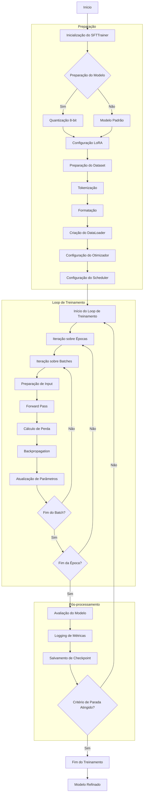
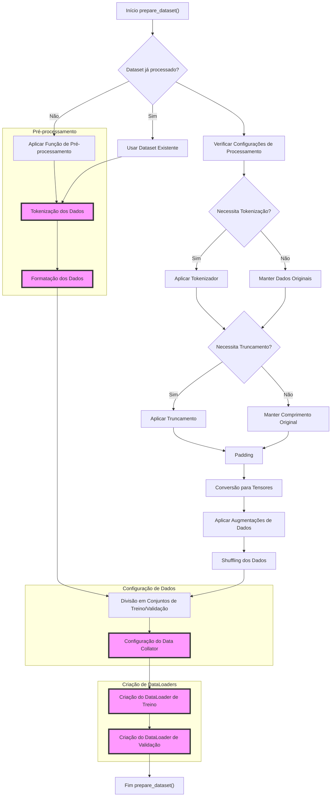
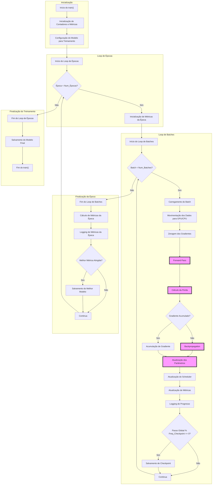

## SFTTrainer: Um Módulo para Treinamento Supervisionado de Modelos de Linguagem



### Introdução

O código fornecido define a classe **SFTTrainer**, que implementa um treinador para o refinamento supervisionado (Supervised Fine-Tuning - SFT) de modelos de linguagem. ==Este módulo é projetado para trabalhar com modelos de linguagem pré-treinados, como os da família GPT, e ajustá-los para tarefas específicas usando conjuntos de dados personalizados.==

O SFTTrainer incorpora várias técnicas avançadas de treinamento de modelos de linguagem, incluindo ==otimização distribuída, manipulação eficiente de dados, e integração com bibliotecas populares como Hugging Face Transformers e Datasets==. O código é estruturado para oferecer flexibilidade na configuração do processo de treinamento, permitindo ajustes finos em diversos aspectos, desde a preparação dos dados até a otimização do modelo.

### Visão Geral da Estrutura do Código

O código está organizado em uma única classe principal, **SFTTrainer**, que encapsula toda a lógica necessária para o treinamento supervisionado. A estrutura geral inclui:

1. **Inicialização e Configuração**: Definição de parâmetros e configurações iniciais.
2. **Preparação de Dados**: Processamento e carregamento do conjunto de dados.
3. **Configuração do Modelo**: Preparação do modelo para treinamento, incluindo otimizações.
4. **Loop de Treinamento**: Implementação do processo iterativo de treinamento.
5. **Utilitários e Helpers**: Funções auxiliares para tarefas específicas durante o treinamento.

O código faz uso extensivo de bibliotecas externas, incluindo:
- **torch**: Para operações de tensor e computação em GPU.
- **transformers**: Para acesso a modelos de linguagem pré-treinados e tokenizadores.
- **datasets**: Para manipulação eficiente de grandes conjuntos de dados.
- **accelerate**: Para otimização de treinamento distribuído.
- ==**peft**: Para técnicas de Parameter-Efficient Fine-Tuning.==

O fluxo de execução típico envolve a inicialização do SFTTrainer com configurações específicas, seguido pela chamada ao método **train()** para iniciar o processo de treinamento.

### Análise Detalhada do Código

#### Classe SFTTrainer

##### Definição da Classe

```python
class SFTTrainer:
    def __init__(self, model, tokenizer, dataset, args):
        # Inicialização
```

- **Propósito**: Esta classe encapsula toda a lógica necessária para realizar o treinamento supervisionado de um modelo de linguagem.
- **Parâmetros**:
  - *model*: O modelo de linguagem pré-treinado a ser refinado.
  - *tokenizer*: O tokenizador associado ao modelo.
  - *dataset*: O conjunto de dados para treinamento.
  - *args*: Um objeto contendo vários argumentos de configuração para o treinamento.

##### Método __init__

- **Lógica Interna**:
  1. Inicializa atributos básicos com os parâmetros fornecidos.
  2. Configura o dispositivo de computação (CPU/GPU).
  3. Prepara o modelo para treinamento, incluindo possíveis otimizações como quantização.
  4. Configura o otimizador e o scheduler de taxa de aprendizado.
  5. Prepara o conjunto de dados, incluindo tokenização e formatação.
  6. Inicializa rastreadores de progresso e métricas.

> 💡 **Observação Importante**: A inicialização é um processo complexo que envolve múltiplas etapas de configuração, cada uma crucial para o desempenho e eficiência do treinamento.

##### Método prepare_model_for_kbit_training

```python
def prepare_model_for_kbit_training(self):
    # Preparação do modelo para treinamento com quantização
```

- **Propósito**: Prepara o modelo para treinamento utilizando técnicas de quantização de 8 bits.
- **Lógica Interna**:
  1. Verifica se o modelo suporta quantização de 8 bits.
  2. Aplica preparações específicas para modelos quantizados.
  3. Configura camadas de LoRA (Low-Rank Adaptation) se especificado.

> ⚠️ **Nota sobre Implementação**: A quantização de 8 bits é uma técnica avançada para reduzir o uso de memória e acelerar o treinamento, mas requer cuidados especiais na preparação do modelo.

##### Método prepare_optimizer_and_scheduler

```python
def prepare_optimizer_and_scheduler(self):
    # Configuração do otimizador e scheduler
```

- **Propósito**: Configura o otimizador e o scheduler de taxa de aprendizado para o treinamento.
- **Lógica Interna**:
  1. Identifica os parâmetros treináveis do modelo.
  2. Cria o otimizador (AdamW por padrão) com os parâmetros especificados.
  3. Configura o scheduler de taxa de aprendizado.

##### Método prepare_dataset



```python
import torch
from torch.utils.data import DataLoader, random_split
from transformers import DataCollatorForLanguageModeling
import numpy as np

def prepare_dataset(self):
    """
    Prepara o conjunto de dados para treinamento, incluindo tokenização,
    formatação, e criação de DataLoaders.
    """
    # Verificação inicial
    if self.dataset_processed:
        print("Dataset já processado. Usando versão existente.")
        return

    # Aplicação da função de pré-processamento customizada
    if self.args.preprocess_function:
        self.dataset = self.dataset.map(
            self.args.preprocess_function,
            batched=True,
            num_proc=self.args.preprocessing_num_workers,
            remove_columns=self.dataset.column_names,
            load_from_cache_file=not self.args.overwrite_cache,
        )

    # Tokenização e formatação dos dados
    def tokenize_function(examples):
        # Tokenização com padding e truncamento
        return self.tokenizer(
            examples["text"],
            padding="max_length",
            truncation=True,
            max_length=self.args.max_seq_length,
            return_tensors="pt"
        )

    self.dataset = self.dataset.map(
        tokenize_function,
        batched=True,
        num_proc=self.args.preprocessing_num_workers,
        remove_columns=self.dataset.column_names,
        load_from_cache_file=not self.args.overwrite_cache,
    )

    # Aplicação de augmentação de dados (se definida)
    if self.args.data_augmentation_function:
        self.dataset = self.dataset.map(
            self.args.data_augmentation_function,
            batched=True,
            num_proc=self.args.preprocessing_num_workers,
        )

    # Conversão para formato PyTorch
    self.dataset.set_format(type="torch", columns=["input_ids", "attention_mask"])

    # Divisão em conjuntos de treino e validação
    if self.args.do_eval:
        train_size = int(0.9 * len(self.dataset))
        eval_size = len(self.dataset) - train_size
        self.train_dataset, self.eval_dataset = random_split(
            self.dataset, [train_size, eval_size],
            generator=torch.Generator().manual_seed(42)
        )
    else:
        self.train_dataset = self.dataset

    # Configuração do Data Collator
    self.data_collator = DataCollatorForLanguageModeling(
        tokenizer=self.tokenizer,
        mlm=self.args.mlm,
        mlm_probability=self.args.mlm_probability
    )

    # Criação do DataLoader de Treino
    self.train_dataloader = DataLoader(
        self.train_dataset,
        batch_size=self.args.train_batch_size,
        collate_fn=self.data_collator,
        num_workers=self.args.dataloader_num_workers,
        pin_memory=True,
        shuffle=True
    )

    # Criação do DataLoader de Validação (se aplicável)
    if self.args.do_eval:
        self.eval_dataloader = DataLoader(
            self.eval_dataset,
            batch_size=self.args.eval_batch_size,
            collate_fn=self.data_collator,
            num_workers=self.args.dataloader_num_workers,
            pin_memory=True
        )

    self.dataset_processed = True
    print("Preparação do dataset concluída.")

# Métodos auxiliares para processamento avançado

def apply_dynamic_padding(self, batch):
    """
    Aplica padding dinâmico para otimizar o uso de memória.
    """
    max_length = max(len(x) for x in batch["input_ids"])
    padded_batch = {
        "input_ids": torch.nn.utils.rnn.pad_sequence(
            batch["input_ids"], batch_first=True, padding_value=self.tokenizer.pad_token_id
        ),
        "attention_mask": torch.nn.utils.rnn.pad_sequence(
            batch["attention_mask"], batch_first=True, padding_value=0
        )
    }
    return padded_batch

def apply_sliding_window(self, example, stride=128):
    """
    Aplica uma técnica de janela deslizante para lidar com sequências muito longas.
    """
    tokenized = self.tokenizer(example["text"], truncation=False, return_overflowing_tokens=True, stride=stride, max_length=self.args.max_seq_length)
    return {
        "input_ids": tokenized["input_ids"],
        "attention_mask": tokenized["attention_mask"]
    }

def balance_dataset(self, dataset):
    """
    Balanceia o dataset para lidar com classes desbalanceadas.
    """
    # Exemplo simplificado - na prática, isso dependerá da estrutura específica do seu dataset
    label_counts = dataset["label"].value_counts()
    max_samples = label_counts.max()
    balanced_dataset = []
    for label in label_counts.index:
        samples = dataset[dataset["label"] == label]
        balanced_dataset.append(samples.sample(n=max_samples, replace=True))
    return pd.concat(balanced_dataset).reset_index(drop=True)

# Nota: Os métodos auxiliares acima são exemplos e podem precisar ser adaptados
# dependendo da estrutura específica do seu dataset e requisitos de treinamento.
```

- **Propósito**: Prepara o conjunto de dados para treinamento, incluindo tokenização e formatação.
- **Lógica Interna**:
  1. Aplica a função de pré-processamento aos dados.
  2. Configura o data collator para batch de dados.
  3. Cria o DataLoader para iteração eficiente sobre os dados.

##### Método train



```python
def train(self):
    """
    Executa o loop principal de treinamento do SFTTrainer.
    Este método orquestra todo o processo de treinamento, incluindo
    iteração sobre épocas e batches, forward e backward passes,
    otimização, logging e checkpointing.
    """
    # Configuração inicial
    self.model.train()  # Coloca o modelo em modo de treinamento
    total_steps = len(self.train_dataloader) * self.args.num_train_epochs

    # Loop principal de épocas
    for epoch in range(self.args.num_train_epochs):
        self.epoch = epoch
        epoch_loss = 0.0
        
        # Iteração sobre batches
        for step, batch in enumerate(self.train_dataloader):
            # Prepara os dados de entrada
            inputs = self._prepare_input(batch)
            
            # Zero gradientes para evitar acumulação de gradientes de passos anteriores
            self.optimizer.zero_grad()
            
            # Forward pass
            outputs = self.model(**inputs)
            loss = outputs.loss  # Assume que o modelo retorna um objeto com atributo 'loss'
            
            # Backward pass e otimização
            if self.args.gradient_accumulation_steps > 1:
                # Técnica de acumulação de gradiente para simular batches maiores
                loss = loss / self.args.gradient_accumulation_steps
                loss.backward()
                if (step + 1) % self.args.gradient_accumulation_steps == 0:
                    # Clipagem de gradiente para prevenir explosão de gradiente
                    torch.nn.utils.clip_grad_norm_(self.model.parameters(), self.args.max_grad_norm)
                    self.optimizer.step()
                    self.lr_scheduler.step()  # Atualiza a taxa de aprendizado
            else:
                loss.backward()
                torch.nn.utils.clip_grad_norm_(self.model.parameters(), self.args.max_grad_norm)
                self.optimizer.step()
                self.lr_scheduler.step()
            
            # Atualização de métricas e logging
            epoch_loss += loss.item()
            self.global_step += 1
            
            if self.global_step % self.args.logging_steps == 0:
                # Log de métricas
                self._log_metrics({"loss": loss.item(), "lr": self.lr_scheduler.get_last_lr()[0]})
            
            if self.global_step % self.args.save_steps == 0:
                # Salvamento de checkpoint
                self._save_checkpoint()
            
            # Avaliação periódica (se configurada)
            if self.args.evaluation_strategy == "steps" and \
               self.global_step % self.args.eval_steps == 0:
                eval_results = self.evaluate()
                self._log_metrics(eval_results, prefix="eval_")
                
                # Salva o melhor modelo baseado na métrica de avaliação
                if eval_results["eval_loss"] < self.best_metric:
                    self.best_metric = eval_results["eval_loss"]
                    self._save_best_model()
        
        # Fim da época: logging e avaliação final da época
        avg_epoch_loss = epoch_loss / len(self.train_dataloader)
        self._log_metrics({"epoch": epoch, "avg_epoch_loss": avg_epoch_loss})
        
        if self.args.evaluation_strategy == "epoch":
            eval_results = self.evaluate()
            self._log_metrics(eval_results, prefix="eval_")
            
            if eval_results["eval_loss"] < self.best_metric:
                self.best_metric = eval_results["eval_loss"]
                self._save_best_model()
    
    # Fim do treinamento: salva o modelo final
    self._save_final_model()

def _prepare_input(self, batch):
    """
    Prepara o batch de entrada para processamento pelo modelo.
    Isso inclui mover os tensores para o dispositivo correto (GPU/CPU)
    e aplicar quaisquer pré-processamentos necessários.
    """
    inputs = {k: v.to(self.device) for k, v in batch.items()}
    return inputs

def _log_metrics(self, metrics, prefix=""):
    """
    Registra métricas usando o sistema de logging configurado.
    Pode ser expandido para incluir logging em ferramentas como
    TensorBoard, Weights & Biases, etc.
    """
    for key, value in metrics.items():
        self.logger.info(f"{prefix}{key}: {value}")

def _save_checkpoint(self):
    """
    Salva um checkpoint do estado atual do treinamento.
    Inclui o estado do modelo, otimizador e scheduler.
    """
    checkpoint = {
        "model_state_dict": self.model.state_dict(),
        "optimizer_state_dict": self.optimizer.state_dict(),
        "scheduler_state_dict": self.lr_scheduler.state_dict(),
        "epoch": self.epoch,
        "global_step": self.global_step,
    }
    torch.save(checkpoint, f"{self.args.output_dir}/checkpoint-{self.global_step}.pt")

def _save_best_model(self):
    """
    Salva o melhor modelo baseado na métrica de avaliação.
    """
    torch.save(self.model.state_dict(), f"{self.args.output_dir}/best_model.pt")

def _save_final_model(self):
    """
    Salva o modelo final após o término do treinamento.
    """
    torch.save(self.model.state_dict(), f"{self.args.output_dir}/final_model.pt")

def evaluate(self):
    """
    Realiza a avaliação do modelo no conjunto de validação.
    Retorna um dicionário com métricas de avaliação.
    """
    self.model.eval()
    eval_loss = 0.0
    with torch.no_grad():
        for batch in self.eval_dataloader:
            inputs = self._prepare_input(batch)
            outputs = self.model(**inputs)
            eval_loss += outputs.loss.item()
    
    avg_eval_loss = eval_loss / len(self.eval_dataloader)
    self.model.train()
    return {"eval_loss": avg_eval_loss}
```

- **Propósito**: Executa o loop principal de treinamento.
- **Lógica Interna**:
  1. Inicializa contadores e métricas.
  2. Itera sobre as épocas e batches de dados.
  3. Realiza passos de treinamento, incluindo forward pass, cálculo de perda e backpropagation.
  4. Atualiza métricas e exibe progresso.
  5. Salva checkpoints do modelo periodicamente.

> 💡 **Observação Importante**: O método train é o coração do SFTTrainer, orquestrando todo o processo de treinamento e incorporando várias técnicas de otimização e monitoramento.

##### Métodos Auxiliares

- **get_grouped_params**: Agrupa parâmetros do modelo para otimização.
- **save_model**: Salva o estado atual do modelo e tokenizador.
- **_prepare_input**: Prepara entradas do modelo para computação.
- **_prepare_targets**: Prepara alvos para cálculo de perda.

### Fluxo de Dados e Interações

1. **Inicialização**: O usuário cria uma instância de SFTTrainer com um modelo, tokenizador, dataset e configurações.
2. **Preparação**: O modelo é preparado para treinamento, incluindo possíveis otimizações como quantização e LoRA.
3. **Processamento de Dados**: O dataset é processado, tokenizado e preparado para treinamento em batches.
4. **Loop de Treinamento**: 
   - Iteração sobre épocas e batches.
   - Para cada batch:
     a. Dados são movidos para o dispositivo de computação.
     b. Forward pass do modelo.
     c. Cálculo de perda.
     d. Backpropagation e atualização de parâmetros.
   - Métricas são atualizadas e exibidas periodicamente.
   - Checkpoints são salvos em intervalos regulares.

### Exemplos de Uso e Execução

```python
# Exemplo de uso do SFTTrainer
model = AutoModelForCausalLM.from_pretrained("gpt2")
tokenizer = AutoTokenizer.from_pretrained("gpt2")
dataset = load_dataset("my_custom_dataset")

args = TrainingArguments(
    output_dir="./results",
    num_train_epochs=3,
    per_device_train_batch_size=8,
    gradient_accumulation_steps=4,
    learning_rate=2e-5,
    # ... outras configurações
)

trainer = SFTTrainer(model, tokenizer, dataset, args)
trainer.train()
```

Neste exemplo:
1. Um modelo GPT-2 e seu tokenizador são carregados.
2. Um conjunto de dados personalizado é carregado.
3. Argumentos de treinamento são configurados.
4. Uma instância de SFTTrainer é criada e o método train() é chamado para iniciar o treinamento.

### Conclusão

O SFTTrainer é uma implementação robusta e flexível para o refinamento supervisionado de modelos de linguagem. Ele incorpora várias técnicas avançadas de treinamento, como quantização, LoRA, e otimização distribuída, permitindo um ajuste fino eficiente de modelos grandes em diversas tarefas de processamento de linguagem natural.

A estrutura modular do código permite fácil extensão e personalização, tornando-o adequado para uma variedade de cenários de treinamento. A integração com bibliotecas populares como Hugging Face Transformers e Datasets facilita seu uso em fluxos de trabalho existentes de NLP.

Para replicar e adaptar este código, é crucial entender não apenas a estrutura geral, mas também os detalhes de implementação de cada componente, especialmente as otimizações aplicadas durante a preparação do modelo e o processamento de dados.
