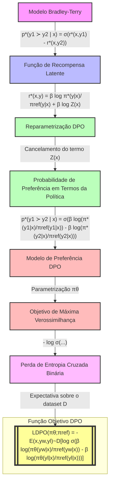

## Otimização Direta de Preferências: Seu Modelo de Linguagem é Secretamente um Modelo de Recompensa

```mermaid
graph TD
    subgraph "Direct Preference Optimization (DPO)"
        A1[Modelo de Linguagem Pré-treinado] --> B1[Coleta de Dados de Preferência]
        B1 --> C1[Reparametrização da Função de Recompensa]
        C1 --> D1[Otimização Direta da Política]
        D1 --> E1[Modelo de Linguagem Otimizado]
        E1 --> F1[Respostas Alinhadas com Preferências]
    end

    subgraph "RLHF Tradicional"
        A2[Modelo de Linguagem Pré-treinado] --> B2[Coleta de Dados de Preferência]
        B2 --> C2[Treinamento do Modelo de Recompensa]
        C2 --> D2[Aprendizado por Reforço]
        D2 --> E2[Modelo de Linguagem Ajustado]
        E2 --> F2[Respostas Alinhadas com Preferências]
        
        D2 -.-> G2[Amostragem do Modelo]
        G2 -.-> D2
        D2 -.-> H2[Ajuste de Hiperparâmetros]
        H2 -.-> D2
    end

    style A1 fill:#f9f,stroke:#333,stroke-width:2px
    style A2 fill:#f9f,stroke:#333,stroke-width:2px
    style E1 fill:#bbf,stroke:#333,stroke-width:2px
    style E2 fill:#bbf,stroke:#333,stroke-width:2px
    style C1 fill:#bfb,stroke:#333,stroke-width:2px
    style D1 fill:#bfb,stroke:#333,stroke-width:2px
    style C2 fill:#fbb,stroke:#333,stroke-width:2px
    style D2 fill:#fbb,stroke:#333,stroke-width:2px
```



### Introdução

Os grandes modelos de linguagem (LLMs) não supervisionados adquirem capacidades surpreendentes, mas controlar precisamente seu comportamento é difícil devido à natureza completamente não supervisionada de seu treinamento [1]. Métodos existentes para obter tal controle coletam rótulos humanos da qualidade relativa das gerações do modelo e fazem fine-tuning do LLM não supervisionado para alinhar com essas preferências, frequentemente com reinforcement learning from human feedback (RLHF) [2].

No entanto, o RLHF é um procedimento complexo e frequentemente instável, primeiro ajustando um modelo de recompensa que reflete as preferências humanas, e então fazendo fine-tuning do grande LLM não supervisionado usando reinforcement learning para maximizar essa recompensa estimada sem se afastar muito do modelo original [3].

Neste resumo, introduzimos uma nova parametrização do modelo de recompensa no RLHF que permite extrair a política ótima correspondente em forma fechada, permitindo resolver o problema padrão de RLHF com apenas uma simples loss de classificação [4]. O algoritmo resultante, que chamamos de Direct Preference Optimization (DPO), é estável, eficaz e computacionalmente leve, eliminando a necessidade de amostragem do LM durante o fine-tuning ou realizar ajustes significativos de hiperparâmetros [5].

### Conceitos Fundamentais

| Conceito                 | Explicação                                                   |
| ------------------------ | ------------------------------------------------------------ |
| **RLHF**                 | Reinforcement Learning from Human Feedback - método tradicional que usa RL para otimizar um LM para seguir preferências humanas [6] |
| **Modelo de Recompensa** | Rede neural treinada para prever preferências humanas entre pares de respostas do modelo [7] |
| **KL-divergence**        | Medida da diferença entre duas distribuições de probabilidade, usada para restringir o desvio da política durante o treinamento [8] |
| **DPO**                  | Direct Preference Optimization - novo método que otimiza diretamente o LM para satisfazer preferências sem RL explícito [9] |

> ⚠️ **Nota Importante**: O DPO resolve o mesmo objetivo que algoritmos RLHF existentes (maximização de recompensa com uma restrição de KL-divergência) mas é muito mais simples de implementar e treinar.

> ❗ **Ponto de Atenção**: O DPO elimina a necessidade de amostrar do LM durante o fine-tuning ou realizar ajustes significativos de hiperparâmetros, tornando-o computacionalmente mais eficiente.

> ✔️ **Destaque**: O DPO permite extrair a política ótima correspondente em forma fechada, permitindo resolver o problema de RLHF com apenas uma simples loss de classificação.

### Formulação Teórica do DPO



<image: Um diagrama mostrando a derivação matemática da função objetivo do DPO, partindo do modelo Bradley-Terry de preferências e chegando na loss de entropia cruzada binária>

==O DPO é baseado em uma reformulação teórica do problema de aprendizado de preferências.== A ideia chave é ==usar uma mudança de variáveis para definir a loss de preferência como uma função diretamente da política, em vez do modelo de recompensa [10].==

Dado um dataset de preferências humanas sobre respostas do modelo $D = \{x^{(i)}, y_w^{(i)}, y_l^{(i)}\}_{i=1}^N$, o DPO pode ==otimizar uma política usando uma simples loss de entropia cruzada binária:==

$$\mathcal{L}_{\text{DPO}}(\pi_\theta; \pi_{\text{ref}}) = -\mathbb{E}_{(x,y_w,y_l)\sim \mathcal{D}}\left[\log \sigma \left(\beta \log \frac{\pi_\theta(y_w | x)}{\pi_{\text{ref}}(y_w | x)} - \beta \log \frac{\pi_\theta(y_l | x)}{\pi_{\text{ref}}(y_l | x)}\right)\right]$$

Onde:
- $\pi_\theta$ é a política sendo otimizada
- $\pi_{\text{ref}}$ é a política de referência (geralmente o modelo SFT inicial)
- $\beta$ é um parâmetro que controla a força da restrição de KL
- $\sigma$ é a função sigmoid

Esta formulação ==permite que o DPO otimize implicitamente o mesmo objetivo que algoritmos RLHF existentes==, mas de uma forma muito mais simples e direta [11].

#### Questões Técnicas/Teóricas

1. Como a mudança de variáveis no DPO afeta a capacidade do modelo de aprender recompensas complexas em comparação com o RLHF tradicional?
2. Quais são as implicações teóricas de otimizar diretamente a política vs. aprender um modelo de recompensa separado em termos de generalização e robustez?

### Implementação e Aspectos Práticos

A implementação do DPO é notavelmente simples comparada ao RLHF tradicional. Aqui está um exemplo de código PyTorch para a loss do DPO:

```python
import torch.nn.functional as F

def dpo_loss(pi_logps, ref_logps, yw_idxs, yl_idxs, beta):
    pi_yw_logps,  pi_yl_logps =  pi_logps[yw_idxs],  pi_logps[yl_idxs]
    ref_yw_logps, ref_yl_logps = ref_logps[yw_idxs], ref_logps[yl_idxs]

    pi_logratios  = pi_yw_logps - pi_yl_logps
    ref_logratios = ref_yw_logps - ref_yl_logps

    losses = -F.logsigmoid(beta * (pi_logratios - ref_logratios))
    rewards = beta * (pi_logps - ref_logps).detach()

    return losses, rewards
```

Os hiperparâmetros típicos incluem:
- $\beta = 0.1$ (valor padrão)
- Tamanho de batch de 64
- Otimizador RMSprop com learning rate de 1e-6
- Warmup linear do learning rate de 0 a 1e-6 ao longo de 150 steps

> ⚠️ **Nota Importante**: A escolha do $\beta$ pode afetar significativamente o desempenho. Para tarefas como sumarização, um valor maior como $\beta = 0.5$ pode ser mais apropriado.

### Resultados Experimentais

Os experimentos mostram que o DPO é pelo menos tão eficaz quanto métodos existentes, incluindo RLHF baseado em PPO, para aprender a partir de preferências em tarefas como:

1. Modulação de sentimento
2. Sumarização
3. Diálogo

<image: Um gráfico comparando o desempenho do DPO vs RLHF em diferentes tarefas, mostrando win rates e métricas de qualidade>

Alguns resultados notáveis:

- Na tarefa de sumarização TL;DR, o DPO superou o PPO com uma taxa de vitória de 61% vs 57% na temperatura ótima [12].
- O DPO demonstrou maior robustez à temperatura de amostragem comparado ao PPO.
- Em diálogo de turno único, o DPO foi o único método computacionalmente eficiente que melhorou sobre as completions preferidas no dataset Anthropic HH [13].

> ✔️ **Destaque**: O DPO alcançou desempenho superior ou comparável ao RLHF tradicional em várias tarefas, enquanto sendo significativamente mais simples de implementar e treinar.

#### Questões Técnicas/Práticas

1. Como o DPO se compara ao RLHF em termos de eficiência computacional e uso de memória durante o treinamento?
2. Quais são as melhores práticas para ajustar o hiperparâmetro $\beta$ do DPO para diferentes tipos de tarefas?

### Conclusão

O Direct Preference Optimization (DPO) representa um avanço significativo na tarefa de alinhar modelos de linguagem com preferências humanas. Suas principais vantagens incluem:

1. Simplicidade de implementação e treinamento
2. Desempenho comparável ou superior ao RLHF tradicional
3. Maior eficiência computacional
4. Robustez a hiperparâmetros como temperatura de amostragem

O DPO oferece uma alternativa promissora ao RLHF, potencialmente reduzindo as barreiras para treinar modelos de linguagem alinhados com preferências humanas [14].

### Questões Avançadas

1. Como o DPO se compara ao RLHF em termos de generalização para distribuições fora da distribuição? Há diferenças teóricas ou empíricas na capacidade de transferência de conhecimento?

2. Quais são as implicações éticas de usar o DPO vs RLHF para alinhamento de IA? Há diferenças na interpretabilidade ou auditabilidade dos modelos resultantes?

3. Como o DPO poderia ser estendido para lidar com preferências mais complexas ou multi-objetivo? É possível incorporar restrições adicionais além da KL-divergência de forma elegante?

4. Quais são os limites teóricos do DPO em termos de expressividade do modelo de recompensa implícito? Existem classes de funções de recompensa que o RLHF pode aprender mas o DPO não?

5. Como o DPO se escalaria para modelos muito maiores (trilhões de parâmetros) e conjuntos de dados de preferência muito grandes? Há desafios únicos que surgiriam nessa escala?

### Referências

[1] "Large unsupervised language models (LMs) trained on very large datasets acquire surprising capabilities [11, 7, 42, 8]. However, these models are trained on data generated by humans with a wide variety of goals, priorities, and skillsets." (Excerpt from paste.txt)

[2] "Existing methods for gaining such steerability collect human labels of the relative quality of model generations and fine-tune the unsupervised LM to align with these preferences, often with reinforcement learning from human feedback (RLHF)." (Excerpt from paste.txt)

[3] "However, RLHF is a complex and often unstable procedure, first fitting a reward model that reflects the human preferences, and then fine-tuning the large unsupervised LM using reinforcement learning to maximize this estimated reward without drifting too far from the original model." (Excerpt from paste.txt)

[4] "In this paper we introduce a new parameterization of the reward model in RLHF that enables extraction of the corresponding optimal policy in closed form, allowing us to solve the standard RLHF problem with only a simple classification loss." (Excerpt from paste.txt)

[5] "The resulting algorithm, which we call Direct Preference Optimization (DPO), is stable, performant, and computationally lightweight, eliminating the need for sampling from the LM during fine-tuning or performing significant hyperparameter tuning." (Excerpt from paste.txt)

[6] "RLHF methods fit a reward model to a dataset of human preferences and then use RL to optimize a language model policy to produce responses assigned high reward without drifting excessively far from the original model." (Excerpt from paste.txt)

[7] "Framing the problem as a binary classification we have the negative log-likelihood loss: L_R(r_ϕ, D) = -E_{(x,y_w,y_l)∼D}[log σ(r_ϕ(x, y_w) - r_ϕ(x, y_l))]" (Excerpt from paste.txt)

[8] "Following prior works [17, 18], the optimization is formulated as max_{\pi_θ} E_{x∼D,y∼π_θ(y|x)}[r_ϕ(x, y)] - βD_{KL}[π_θ(y | x) || π_{ref}(y | x)]," (Excerpt from paste.txt)

[9] "We propose Direct Preference Optimization (DPO), an algorithm that implicitly optimizes the same objective as existing RLHF algorithms (reward maximization with a KL-divergence constraint) but is simple to implement and straight-forward to train." (Excerpt from paste.txt)

[10] "However, while existing methods use the preference model to define a preference loss to train a reward model and then train a policy that optimizes the learned reward model, DPO uses a change of variables to define the preference loss as a function of the policy directly." (Excerpt from paste.txt)

[11] "Given a dataset of human preferences over model responses, DPO can therefore optimize a policy using a simple binary cross entropy objective, producing the optimal policy to an implicit reward function fit to the preference data." (Excerpt from paste.txt)

[12] "We find that DPO has a win rate of approximately 61% at a temperature of 0.0, exceeding the performance of PPO at 57% at its optimal sampling temperature of 0.0." (Excerpt from paste.txt)

[13] "Overall, DPO is the only computationally efficient method that improves over the preferred completions in the Anthropic HH dataset, and provides similar or better performance to the computationally demanding Best of 128 baseline." (Excerpt from paste.txt)

[14] "DPO thus meaningfully reduces the barrier to training more language models from human preferences." (Excerpt from paste.txt)