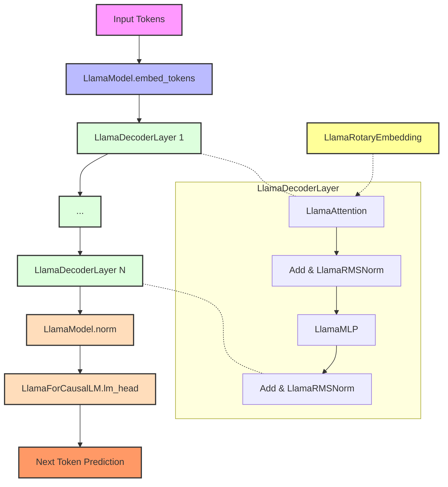
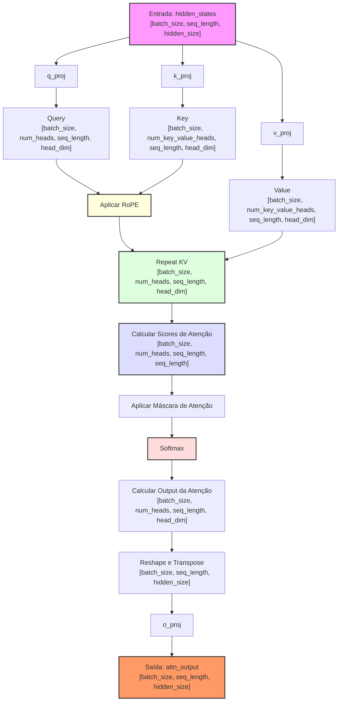

## Análise do Código do Modelo LLaMA 2



### Introdução

O código fornecido implementa o modelo LLaMA 2 (Large Language Model Meta AI), um modelo de linguagem de grande escala desenvolvido pela Meta AI. Este modelo é uma evolução do LLaMA original e utiliza uma arquitetura baseada em transformers, especificamente otimizada para tarefas de geração de texto e compreensão de linguagem natural.

O código é uma implementação em PyTorch do modelo LLaMA 2, incluindo várias classes e funções que compõem a arquitetura do modelo, bem como classes auxiliares para processamento de atenção e geração de texto.

### Visão Geral da Estrutura do Código

O código está organizado em várias classes principais:

1. **LlamaConfig**: Define a configuração do modelo.
2. **LlamaRotaryEmbedding**: Implementa embeddings rotacionais.
3. **LlamaMLP**: Implementa a camada de perceptron multicamadas.
4. **LlamaAttention**: Implementa o mecanismo de atenção.
5. **LlamaDecoderLayer**: Implementa uma camada do decodificador.
6. **LlamaPreTrainedModel**: Classe base para modelos pré-treinados.
7. **LlamaModel**: Implementa o modelo principal.
8. **LlamaForCausalLM**: Adapta o modelo para tarefas de modelagem de linguagem causal.

O fluxo de execução geral envolve a inicialização do modelo, o processamento de entrada através das camadas de embeddings e atenção, e a geração de saída através da camada final.

Dependências externas principais:
- PyTorch (`torch`)
- Transformers (biblioteca Hugging Face)

### Análise Detalhada do Código

````mermaid
classDiagram
    class LlamaConfig {
        +vocab_size: int
        +hidden_size: int
        +intermediate_size: int
        +num_hidden_layers: int
        +num_attention_heads: int
        +max_position_embeddings: int
        +rms_norm_eps: float
        +rope_theta: float
    }

    class LlamaPreTrainedModel {
        <<abstract>>
        +config: LlamaConfig
        +_init_weights(module)
    }

    class LlamaModel {
        +embed_tokens: nn.Embedding
        +layers: nn.ModuleList
        +norm: LlamaRMSNorm
        +rotary_emb: LlamaRotaryEmbedding
        +forward(input_ids, attention_mask, ...)
    }

    class LlamaForCausalLM {
        +model: LlamaModel
        +lm_head: nn.Linear
        +forward(input_ids, attention_mask, ...)
        +generate(input_ids, ...)
    }

    class LlamaDecoderLayer {
        +self_attn: LlamaAttention
        +mlp: LlamaMLP
        +input_layernorm: LlamaRMSNorm
        +post_attention_layernorm: LlamaRMSNorm
        +forward(hidden_states, attention_mask, ...)
    }

    class LlamaAttention {
        +q_proj: nn.Linear
        +k_proj: nn.Linear
        +v_proj: nn.Linear
        +o_proj: nn.Linear
        +rotary_emb: LlamaRotaryEmbedding
        +forward(hidden_states, attention_mask, ...)
    }

    class LlamaMLP {
        +gate_proj: nn.Linear
        +up_proj: nn.Linear
        +down_proj: nn.Linear
        +act_fn: Callable
        +forward(x)
    }

    class LlamaRMSNorm {
        +weight: nn.Parameter
        +variance_epsilon: float
        +forward(hidden_states)
    }

    class LlamaRotaryEmbedding {
        +inv_freq: torch.Tensor
        +forward(x, position_ids)
    }

    LlamaPreTrainedModel <|-- LlamaModel
    LlamaPreTrainedModel <|-- LlamaForCausalLM
    LlamaForCausalLM *-- LlamaModel
    LlamaModel *-- LlamaDecoderLayer
    LlamaModel *-- LlamaRMSNorm
    LlamaModel *-- LlamaRotaryEmbedding
    LlamaDecoderLayer *-- LlamaAttention
    LlamaDecoderLayer *-- LlamaMLP
    LlamaDecoderLayer *-- LlamaRMSNorm
    LlamaAttention *-- LlamaRotaryEmbedding
    LlamaConfig --o LlamaPreTrainedModel
````

Vamos começar analisando as classes e funções mais importantes do código.

#### LlamaConfig

Esta classe define a configuração do modelo LLaMA 2.

```python
class LlamaConfig(PretrainedConfig):
    model_type = "llama"
    keys_to_ignore_at_inference = ["past_key_values"]

    def __init__(
        self,
        vocab_size=32000,
        hidden_size=4096,
        intermediate_size=11008,
        num_hidden_layers=32,
        num_attention_heads=32,
        num_key_value_heads=None,
        hidden_act="silu",
        max_position_embeddings=2048,
        initializer_range=0.02,
        rms_norm_eps=1e-6,
        use_cache=True,
        pad_token_id=None,
        bos_token_id=1,
        eos_token_id=2,
        pretraining_tp=1,
        tie_word_embeddings=False,
        rope_theta=10000.0,
        rope_scaling=None,
        attention_bias=False,
        attention_dropout=0.0,
        **kwargs,
    ):
        self.vocab_size = vocab_size
        self.max_position_embeddings = max_position_embeddings
        self.hidden_size = hidden_size
        self.intermediate_size = intermediate_size
        self.num_hidden_layers = num_hidden_layers
        self.num_attention_heads = num_attention_heads
        
        # ... (código omitido para brevidade)

        super().__init__(
            pad_token_id=pad_token_id,
            bos_token_id=bos_token_id,
            eos_token_id=eos_token_id,
            tie_word_embeddings=tie_word_embeddings,
            **kwargs,
        )
```

- **Propósito**: Esta classe define os hiperparâmetros e a configuração geral do modelo LLaMA 2.
- **Parâmetros Importantes**:
  - *vocab_size*: Tamanho do vocabulário.
  - *hidden_size*: Dimensão dos estados ocultos.
  - *num_hidden_layers*: Número de camadas ocultas.
  - *num_attention_heads*: Número de cabeças de atenção.
  - *max_position_embeddings*: Comprimento máximo da sequência.

> 💡 **Observação**: A configuração permite uma grande flexibilidade na arquitetura do modelo, permitindo ajustes em vários aspectos como tamanho do modelo, número de camadas e cabeças de atenção.

#### LlamaRotaryEmbedding

Esta classe implementa os embeddings rotacionais (RoPE - Rotary Position Embedding) utilizados no modelo LLaMA 2.

```python
class LlamaRotaryEmbedding(nn.Module):
    def __init__(
        self,
        dim=None,
        max_position_embeddings=2048,
        base=10000,
        device=None,
        scaling_factor=1.0,
        rope_type="default",
        config: Optional[LlamaConfig] = None,
    ):
        super().__init__()
        # ... (inicialização de atributos)

    def _dynamic_frequency_update(self, position_ids, device):
        # ... (implementação do método)

    @torch.no_grad()
    def forward(self, x, position_ids):
        # ... (implementação do método forward)
```

- **Propósito**: Implementa os embeddings rotacionais, que são cruciais para capturar informações posicionais em sequências longas.
- **Métodos Principais**:
  - ==*_dynamic_frequency_update*: Atualiza as frequências dinamicamente baseado nas posições.==
  - ==*forward*: Aplica os embeddings rotacionais aos tensores de entrada.==

> ⚠️ **Nota sobre Implementação**: Os embeddings rotacionais são uma técnica avançada que permite ao modelo lidar eficientemente com sequências longas, superando limitações de outros métodos de embeddings posicionais.

#### LlamaMLP

````mermaid
flowchart TD
    A[Entrada x] --> B{pretraining_tp > 1?}
    
    B -->|Sim| C[Tensor Parallelism]
    B -->|Não| D[Execução Padrão]

    subgraph "Tensor Parallelism"
        C --> C1[Dividir pesos em fatias]
        C1 --> C2[Aplicar gate_proj em paralelo]
        C1 --> C3[Aplicar up_proj em paralelo]
        C2 --> C4[Concatenar resultados]
        C3 --> C4
        C4 --> C5[Aplicar ativação e multiplicação]
        C5 --> C6[Dividir resultado]
        C6 --> C7[Aplicar down_proj em paralelo]
        C7 --> C8[Somar resultados]
    end

    subgraph "Execução Padrão"
        D --> D1[Aplicar gate_proj]
        D --> D2[Aplicar up_proj]
        D1 --> D3[Aplicar ativação]
        D3 --> D4[Multiplicar resultados]
        D2 --> D4
        D4 --> D5[Aplicar down_proj]
    end

    C8 --> E[Saída]
    D5 --> E

    style A fill:#f9f,stroke:#333,stroke-width:2px
    style B fill:#ffd,stroke:#333,stroke-width:2px
    style C fill:#dfd,stroke:#333,stroke-width:2px
    style D fill:#ddf,stroke:#333,stroke-width:2px
    style E fill:#f96,stroke:#333,stroke-width:2px
````

Esta classe implementa a camada de Perceptron Multicamadas (MLP) utilizada no modelo LLaMA 2.

```python
class LlamaMLP(nn.Module):
    def __init__(self, config):
        super().__init__()
        self.config = config
        self.hidden_size = config.hidden_size
        self.intermediate_size = config.intermediate_size
        self.gate_proj = nn.Linear(self.hidden_size, self.intermediate_size, bias=config.mlp_bias)
        self.up_proj = nn.Linear(self.hidden_size, self.intermediate_size, bias=config.mlp_bias)
        self.down_proj = nn.Linear(self.intermediate_size, self.hidden_size, bias=config.mlp_bias)
        self.act_fn = ACT2FN[config.hidden_act]

    def forward(self, x):
        if self.config.pretraining_tp > 1:
            # ... (implementação para tensor parallelism)
        else:
            down_proj = self.down_proj(self.act_fn(self.gate_proj(x)) * self.up_proj(x))

        return down_proj
```

- **Propósito**: Implementa a camada de feed-forward do modelo, crucial para o processamento não-linear das representações.
- **Componentes**:
  - *gate_proj*, *up_proj*, *down_proj*: Projeções lineares para transformação dos dados.
  - *act_fn*: Função de ativação não-linear.

> 💡 **Observação**: ==A implementação suporta tensor parallelism para treinamento em múltiplos dispositivos, evidenciado pela condição `self.config.pretraining_tp > 1`.==

#### LlamaAttention



Esta classe implementa o mecanismo de atenção utilizado no LLaMA 2.

```python
class LlamaAttention(nn.Module):
    def __init__(self, config: LlamaConfig, layer_idx: Optional[int] = None):
        super().__init__()
        self.config = config
        self.layer_idx = layer_idx
        # ... (inicialização de atributos)

    def forward(
        self,
        hidden_states: torch.Tensor,
        attention_mask: Optional[torch.Tensor] = None,
        position_ids: Optional[torch.LongTensor] = None,
        past_key_value: Optional[Cache] = None,
        output_attentions: bool = False,
        use_cache: bool = False,
        cache_position: Optional[torch.LongTensor] = None,
        position_embeddings: Optional[Tuple[torch.Tensor, torch.Tensor]] = None,
        **kwargs,
    ) -> Tuple[torch.Tensor, Optional[torch.Tensor], Optional[Tuple[torch.Tensor]]]:
        # ... (implementação do método forward)
```

- **Propósito**: Implementa o mecanismo de atenção multi-cabeça, permitindo ao modelo focar em diferentes partes da entrada.
- **Componentes Principais**:
  - Projeções lineares para queries, keys e values.
  - Aplicação de embeddings rotacionais.
  - Cálculo da atenção e aplicação de dropout.

> ⚠️ **Nota sobre Implementação**: ==A classe suporta diferentes implementações de atenção, incluindo otimizações como Flash Attention e Scaled Dot Product Attention (SDPA).==

Certamente. Vamos continuar a análise detalhada do código do modelo LLaMA 2, focando nas classes e componentes restantes.

#### LlamaDecoderLayer

Esta classe implementa uma camada individual do decodificador no modelo LLaMA 2.

```python
class LlamaDecoderLayer(nn.Module):
    def __init__(self, config: LlamaConfig, layer_idx: int):
        super().__init__()
        self.hidden_size = config.hidden_size
        self.self_attn = LLAMA_ATTENTION_CLASSES[config._attn_implementation](config=config, layer_idx=layer_idx)
        self.mlp = LlamaMLP(config)
        self.input_layernorm = LlamaRMSNorm(config.hidden_size, eps=config.rms_norm_eps)
        self.post_attention_layernorm = LlamaRMSNorm(config.hidden_size, eps=config.rms_norm_eps)

    def forward(
        self,
        hidden_states: torch.Tensor,
        attention_mask: Optional[torch.Tensor] = None,
        position_ids: Optional[torch.LongTensor] = None,
        past_key_value: Optional[Cache] = None,
        output_attentions: Optional[bool] = False,
        use_cache: Optional[bool] = False,
        cache_position: Optional[torch.LongTensor] = None,
        position_embeddings: Optional[Tuple[torch.Tensor, torch.Tensor]] = None,
        **kwargs,
    ) -> Tuple[torch.FloatTensor, Optional[Tuple[torch.FloatTensor, torch.FloatTensor]]]:
        residual = hidden_states

        hidden_states = self.input_layernorm(hidden_states)

        # Self Attention
        hidden_states, self_attn_weights, present_key_value = self.self_attn(
            hidden_states=hidden_states,
            attention_mask=attention_mask,
            position_ids=position_ids,
            past_key_value=past_key_value,
            output_attentions=output_attentions,
            use_cache=use_cache,
            cache_position=cache_position,
            position_embeddings=position_embeddings,
            **kwargs,
        )
        hidden_states = residual + hidden_states

        # Fully Connected
        residual = hidden_states
        hidden_states = self.post_attention_layernorm(hidden_states)
        hidden_states = self.mlp(hidden_states)
        hidden_states = residual + hidden_states

        outputs = (hidden_states,)

        if output_attentions:
            outputs += (self_attn_weights,)

        if use_cache:
            outputs += (present_key_value,)

        return outputs
```

- **Propósito**: Esta classe implementa uma única camada do decodificador, combinando atenção e MLP.
- **Componentes Principais**:
  - *self_attn*: Mecanismo de auto-atenção.
  - *mlp*: Camada de perceptron multicamadas.
  - *input_layernorm* e *post_attention_layernorm*: Normalização de camada.

> 💡 **Observação**: A implementação utiliza conexões residuais (skip connections) para facilitar o treinamento de redes profundas.

#### LlamaPreTrainedModel

Esta é uma classe base para modelos LLaMA 2 pré-treinados.

```python
class LlamaPreTrainedModel(PreTrainedModel):
    config_class = LlamaConfig
    base_model_prefix = "model"
    supports_gradient_checkpointing = True
    _no_split_modules = ["LlamaDecoderLayer"]
    _skip_keys_device_placement = ["past_key_values"]
    _supports_flash_attn_2 = True
    _supports_sdpa = True
    _supports_cache_class = True
    _supports_quantized_cache = True
    _supports_static_cache = True

    def _init_weights(self, module):
        std = self.config.initializer_range
        if isinstance(module, nn.Linear):
            module.weight.data.normal_(mean=0.0, std=std)
            if module.bias is not None:
                module.bias.data.zero_()
        elif isinstance(module, nn.Embedding):
            module.weight.data.normal_(mean=0.0, std=std)
            if module.padding_idx is not None:
                module.weight.data[module.padding_idx].zero_()
```

- **Propósito**: Serve como base para modelos LLaMA 2 pré-treinados, definindo configurações comuns e métodos de inicialização.
- **Características**:
  - Suporte a várias otimizações como Flash Attention 2 e SDPA.
  - Método de inicialização de pesos personalizado.

> ⚠️ **Nota sobre Implementação**: A classe define várias flags de suporte para otimizações e funcionalidades avançadas, indicando a flexibilidade do modelo.

#### LlamaModel

Esta é a classe principal que implementa o modelo LLaMA 2 completo.

```python
class LlamaModel(LlamaPreTrainedModel):
    def __init__(self, config: LlamaConfig):
        super().__init__(config)
        self.padding_idx = config.pad_token_id
        self.vocab_size = config.vocab_size

        self.embed_tokens = nn.Embedding(config.vocab_size, config.hidden_size, self.padding_idx)
        self.layers = nn.ModuleList([LlamaDecoderLayer(config, layer_idx) for layer_idx in range(config.num_hidden_layers)])
        self.norm = LlamaRMSNorm(config.hidden_size, eps=config.rms_norm_eps)
        self.rotary_emb = LlamaRotaryEmbedding(config=config)
        self.gradient_checkpointing = False

        # Initialize weights and apply final processing
        self.post_init()

    def get_input_embeddings(self):
        return self.embed_tokens

    def set_input_embeddings(self, value):
        self.embed_tokens = value

    def forward(
        self,
        input_ids: torch.LongTensor = None,
        attention_mask: Optional[torch.Tensor] = None,
        position_ids: Optional[torch.LongTensor] = None,
        past_key_values: Optional[Union[Cache, List[torch.FloatTensor]]] = None,
        inputs_embeds: Optional[torch.FloatTensor] = None,
        use_cache: Optional[bool] = None,
        output_attentions: Optional[bool] = None,
        output_hidden_states: Optional[bool] = None,
        return_dict: Optional[bool] = None,
        cache_position: Optional[torch.LongTensor] = None,
    ) -> Union[Tuple, BaseModelOutputWithPast]:
        # ... (implementação do método forward)
```

- **Propósito**: Implementa o modelo LLaMA 2 completo, integrando todas as componentes (embeddings, camadas de decodificador, normalização).
- **Componentes Principais**:
  - *embed_tokens*: Camada de embedding para tokens de entrada.
  - *layers*: Lista de camadas de decodificador.
  - *norm*: Normalização final.
  - *rotary_emb*: Embeddings rotacionais.

> 💡 **Observação**: O método `forward` é o coração do modelo, processando a entrada através de todas as camadas e produzindo a saída final.

#### LlamaForCausalLM

Esta classe adapta o modelo LLaMA 2 para tarefas de modelagem de linguagem causal.

```python
class LlamaForCausalLM(LlamaPreTrainedModel):
    _tied_weights_keys = ["lm_head.weight"]

    def __init__(self, config):
        super().__init__(config)
        self.model = LlamaModel(config)
        self.vocab_size = config.vocab_size
        self.lm_head = nn.Linear(config.hidden_size, config.vocab_size, bias=False)

        # Initialize weights and apply final processing
        self.post_init()

    def get_input_embeddings(self):
        return self.model.embed_tokens

    def set_input_embeddings(self, value):
        self.model.embed_tokens = value

    def get_output_embeddings(self):
        return self.lm_head

    def set_output_embeddings(self, new_embeddings):
        self.lm_head = new_embeddings

    def set_decoder(self, decoder):
        self.model = decoder

    def get_decoder(self):
        return self.model

    def forward(
        self,
        input_ids: torch.LongTensor = None,
        attention_mask: Optional[torch.Tensor] = None,
        position_ids: Optional[torch.LongTensor] = None,
        past_key_values: Optional[Union[Cache, List[torch.FloatTensor]]] = None,
        inputs_embeds: Optional[torch.FloatTensor] = None,
        labels: Optional[torch.LongTensor] = None,
        use_cache: Optional[bool] = None,
        output_attentions: Optional[bool] = None,
        output_hidden_states: Optional[bool] = None,
        return_dict: Optional[bool] = None,
        cache_position: Optional[torch.LongTensor] = None,
        num_logits_to_keep: int = 0,
    ) -> Union[Tuple, CausalLMOutputWithPast]:
        # ... (implementação do método forward)
```

- **Propósito**: Adapta o modelo LLaMA 2 para tarefas de modelagem de linguagem causal, adicionando uma camada de saída (lm_head) para prever o próximo token.
- **Componentes Principais**:
  - *model*: Instância de LlamaModel.
  - *lm_head*: Camada linear para projetar os estados ocultos para o espaço do vocabulário.

> ⚠️ **Nota sobre Implementação**: Esta classe inclui métodos para lidar com caching de estados passados, crucial para geração eficiente de texto.

### Fluxo de Dados e Interações

1. **Entrada**: Os tokens de entrada são processados pela camada de embedding (`embed_tokens`).
2. **Processamento Principal**: 
   - Os embeddings passam por cada camada de decodificador (`LlamaDecoderLayer`).
   - Em cada camada, os dados passam por auto-atenção e MLP.
   - Embeddings rotacionais são aplicados para capturar informações posicionais.
3. **Normalização Final**: Após todas as camadas, uma normalização final é aplicada.
4. **Saída**: Para tarefas de modelagem de linguagem causal, a camada `lm_head` projeta os estados finais para previsões de próximo token.

### Exemplo de Uso e Execução

```python
from transformers import LlamaTokenizer, LlamaForCausalLM

# Carregar modelo e tokenizador
model = LlamaForCausalLM.from_pretrained("meta-llama/Llama-2-7b-hf")
tokenizer = LlamaTokenizer.from_pretrained("meta-llama/Llama-2-7b-hf")

# Preparar entrada
input_text = "Olá, como você está?"
inputs = tokenizer(input_text, return_tensors="pt")

# Gerar texto
outputs = model.generate(**inputs, max_length=50)

# Decodificar saída
generated_text = tokenizer.decode(outputs[0], skip_special_tokens=True)
print(generated_text)
```

Este exemplo demonstra como carregar um modelo LLaMA 2 pré-treinado, tokenizar uma entrada de texto, gerar uma continuação e decodificar a saída.

### Conclusão

O código analisado implementa o modelo LLaMA 2, um sofisticado modelo de linguagem baseado na arquitetura Transformer. Ele incorpora várias otimizações e técnicas avançadas, como embeddings rotacionais e suporte a diferentes implementações de atenção, tornando-o altamente eficiente e flexível.

Características-chave incluem:
- Arquitetura de decodificador empilhado com múltiplas camadas de atenção e MLP.
- Uso de embeddings rotacionais para melhor processamento de sequências longas.
- Suporte a várias otimizações de hardware e software para treinamento e inferência eficientes.
- Adaptabilidade para diferentes tarefas de processamento de linguagem natural, com foco em modelagem de linguagem causal.

A compreensão detalhada deste código é essencial para quem deseja trabalhar com ou modificar modelos de linguagem de grande escala, oferecendo insights valiosos sobre as técnicas de ponta em NLP e deep learning.