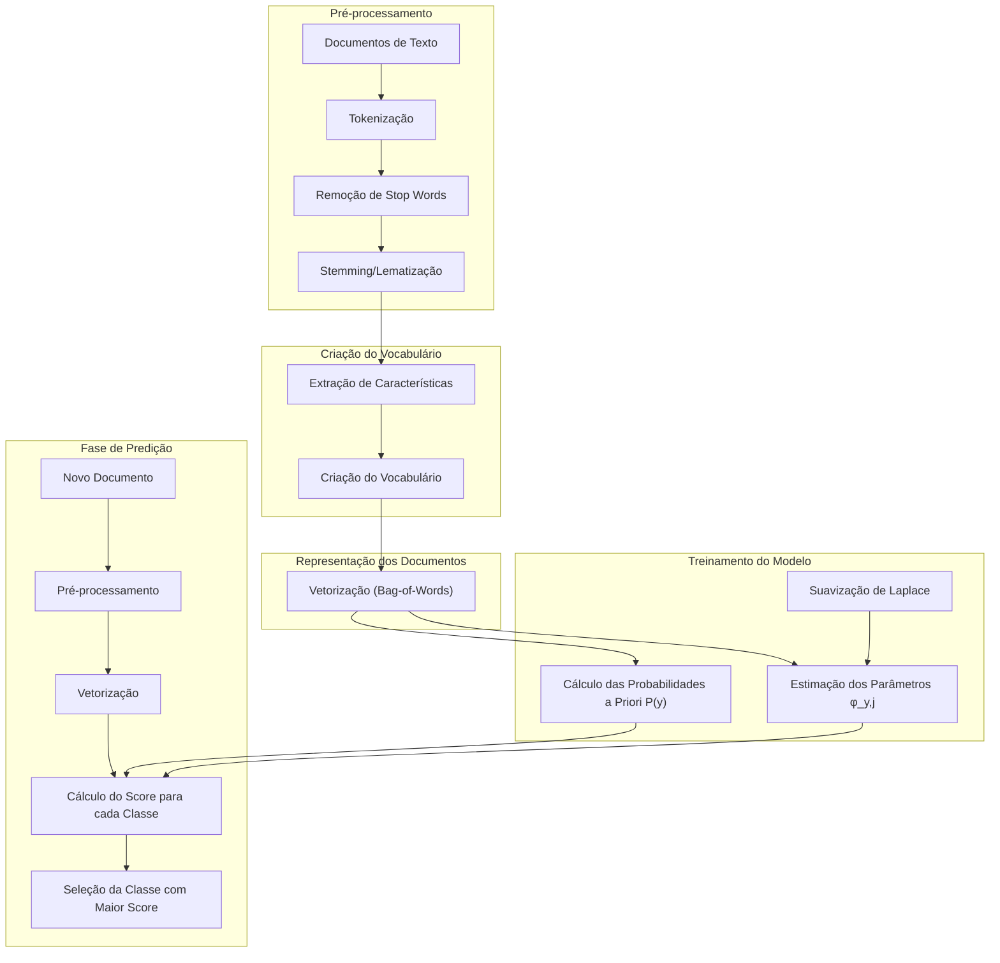

# Classificação de Texto com Multinomial Naïve Bayes



## Introdução

O **Multinomial Naïve Bayes** é um algoritmo fundamental em **classificação de texto**, ==particularmente eficaz quando utilizamos a representação de **bag-of-words**==. Este método combina o princípio do **Naïve Bayes** com a **distribuição multinomial** para ==modelar a ocorrência de palavras em documentos, assumindo a independência condicional das palavras dado o rótulo do documento.== Essa suposição simplifica significativamente o processo de inferência, tornando o algoritmo computacionalmente eficiente.

A eficácia do Multinomial Naïve Bayes em tarefas de classificação de texto, como ==filtragem de spam, categorização de notícias e análise de sentimentos==, deve-se à sua capacidade de lidar com dados de alta dimensionalidade e ao fato de que, em muitas aplicações, ==as dependências entre palavras podem ser consideradas negligenciáveis para efeitos práticos==. Além disso, apesar de sua simplicidade, o Multinomial Naïve Bayes frequentemente alcança desempenho competitivo em comparação com modelos mais complexos.

## Conceitos Fundamentais

| Conceito                      | Explicação                                                   |
| ----------------------------- | ------------------------------------------------------------ |
| **Bag-of-Words**              | Representação de um documento como um vetor de contagem de palavras, ignorando a ordem e a estrutura gramatical. Cada posição do vetor corresponde a uma palavra do vocabulário, e o valor é a frequência dessa palavra no documento. |
| **Distribuição Multinomial**  | ==Modelo probabilístico que descreve a probabilidade de contagens de eventos discretos em múltiplas categorias==, adequado para modelar a frequência de palavras em documentos. ==É uma generalização da distribuição binomial para mais de duas categorias.== |
| **Independência Condicional** | Suposição de que as ocorrências de palavras são independentes entre si, dado o rótulo do documento. ==Isso permite que a probabilidade conjunta das palavras seja fatorada como o produto das probabilidades individuais.== |

> ⚠️ **Nota Importante**: Embora a suposição de independência condicional não seja realista em muitos contextos (já que palavras em um texto geralmente estão correlacionadas), ela é crucial para a tratabilidade computacional do modelo Naïve Bayes, permitindo uma fatoração eficiente da probabilidade conjunta. Na prática, essa simplificação muitas vezes não compromete significativamente o desempenho do classificador.

### Formulação Matemática do Multinomial Naïve Bayes

O Multinomial Naïve Bayes modela a probabilidade de um documento $x$ pertencer a uma classe específica $y$ usando o **Teorema de Bayes**:

$$
p(y|x) = \frac{p(x|y)p(y)}{p(x)}
$$

Como $p(x)$ é constante para todas as classes durante a classificação, podemos focar no numerador $p(x|y)p(y)$.

#### Verossimilhança

==A verossimilhança $p(x|y)$ é modelada usando a **distribuição multinomial**, que captura a probabilidade de observar uma certa combinação de contagens de palavras em um documento da classe $y$:==
$$
p_{\text{mult}}(x; \phi_y) = \frac{N_{x}!}{\prod_{j=1}^V x_j!} \prod_{j=1}^V \phi_{y,j}^{x_j}
$$

Onde:

- $\phi_{y,j} = p(w_j|y)$ é a probabilidade de observar a palavra $w_j$ na classe $y$.
- $x_j$ é a contagem da palavra $w_j$ no documento $x$.
- $V$ é o tamanho do vocabulário.
- $N_{x} = \sum_{j=1}^V x_j$ é o número total de palavras no documento $x$.
- O coeficiente multinomial $\frac{N_{x}!}{\prod_{j=1}^V x_j!}$ é constante dado $x$ e pode ser ignorado durante a classificação.

#### Probabilidade a Priori

A probabilidade a priori $p(y)$ é a proporção de documentos pertencentes à classe $y$ no conjunto de treinamento.

#### Classificação

A predição é feita selecionando a classe que maximiza a probabilidade a posteriori:

$$
\hat{y} = \arg\max_{y} \left[ \log p(y) + \sum_{j=1}^V x_j \log \phi_{y,j} \right]
$$

==O uso do logaritmo transforma o produto em uma soma, facilitando os cálculos e evitando problemas de underflow numérico.==

### Estimação de Parâmetros

==Os parâmetros $\phi_{y,j}$ representam a probabilidade de observar a palavra $w_j$ em documentos da classe $y$.== Eles são ==estimados a partir do conjunto de treinamento usando a **estimativa de máxima verossimilhança (MLE)**:==
$$
\phi_{y,j} = \frac{\text{contagem}(w_j, y)}{\sum_{k=1}^V \text{contagem}(w_k, y)}
$$

Onde:

- $\text{contagem}(w_j, y)$ é o número total de ocorrências da palavra $w_j$ em todos os documentos de classe $y$.
- O denominador é o número total de palavras em todos os documentos de classe $y$.

#### Problema das Contagens Zero

Quando uma palavra não aparece em nenhum documento de uma classe no conjunto de treinamento, a estimativa $\phi_{y,j}$ será zero. ==Isso é problemático porque qualquer documento contendo essa palavra receberia probabilidade zero para essa classe.==

> ✔️ **Destaque**: Para evitar probabilidades zero e melhorar a generalização do modelo, é comum usar **suavização de Laplace** (add-one smoothing).

### Suavização de Laplace

A **suavização de Laplace** adiciona um valor constante $\alpha > 0$ (tipicamente $\alpha = 1$) a cada contagem de palavra, ajustando a estimativa dos parâmetros:

$$
\phi_{y,j} = \frac{\alpha + \text{contagem}(w_j, y)}{V \alpha + \sum_{k=1}^V \text{contagem}(w_k, y)}
$$

==Isso garante que todas as probabilidades $\phi_{y,j}$ sejam positivas e que a soma das probabilidades sobre todo o vocabulário seja igual a 1.==

#### Impacto da Suavização

A suavização de Laplace tem o efeito de incorporar uma distribuição a priori uniforme sobre as palavras, o que é particularmente útil quando se lida com palavras raras ou não vistas no conjunto de treinamento. Ela introduz um trade-off entre o viés e a variância do estimador:

- **Redução de Variância**: A suavização reduz a variância dos estimadores $\phi_{y,j}$ ao evitar estimativas extremas (0 ou 1).
- **Aumento de Viés**: Ao adicionar contagens artificiais, introduz-se um pequeno viés nas estimativas.

No geral, a suavização melhora a capacidade de generalização do modelo em dados não vistos.

#### Perguntas Teóricas

1. **Derive a estimativa de máxima verossimilhança para o parâmetro $\phi_{y,j}$ no modelo Naïve Bayes, considerando a distribuição multinomial.**

   **Resposta**: A função de verossimilhança para a classe $y$ é:

   $$
   L(\phi_{y}) = \prod_{i:y^{(i)}=y} p_{\text{mult}}(x^{(i)}; \phi_{y})
   $$

   Onde $x^{(i)}$ são os documentos de treinamento pertencentes à classe $y$. Tomando o logaritmo da função de verossimilhança e derivando em relação a $\phi_{y,j}$, aplicando a restrição de que $\sum_{j=1}^V \phi_{y,j} = 1$, obtemos:

   $$
   \phi_{y,j} = \frac{\sum_{i:y^{(i)}=y} x_j^{(i)}}{\sum_{k=1}^V \sum_{i:y^{(i)}=y} x_k^{(i)}}
   $$

   Que é a frequência relativa da palavra $w_j$ nos documentos de classe $y$.

2. **Demonstre matematicamente por que a suavização de Laplace é necessária e como ela afeta a estimativa dos parâmetros $\phi_{y,j}$.**

   **Resposta**: Sem suavização, se $\text{contagem}(w_j, y) = 0$, então $\phi_{y,j} = 0$. Isso leva a problemas porque $\log \phi_{y,j}$ será indefinido (tende a $-\infty$), anulando a probabilidade total do documento se $x_j > 0$. A suavização de Laplace adiciona uma pseudocontagem $\alpha$ a cada $\text{contagem}(w_j, y)$, garantindo que $\phi_{y,j} > 0$ para todas as palavras. Matematicamente, a suavização afeta a estimativa dos parâmetros ao ajustar as contagens:

   $$
   \phi_{y,j} = \frac{\alpha + \text{contagem}(w_j, y)}{V \alpha + \sum_{k=1}^V \text{contagem}(w_k, y)}
   $$

3. **Analise teoricamente o impacto da suposição de independência condicional na performance do Multinomial Naïve Bayes em comparação com modelos que não fazem essa suposição.**

   **Resposta**: A suposição de independência condicional simplifica o modelo, permitindo estimar as probabilidades de forma eficiente. No entanto, em muitos casos, as palavras em um texto não são realmente independentes; há correlações e dependências semânticas importantes. Modelos que capturam essas dependências, como modelos de linguagem baseados em redes neurais ou modelos de n-gramas, podem potencialmente oferecer melhor performance ao custo de maior complexidade computacional e necessidade de mais dados para treinamento. O Multinomial Naïve Bayes pode apresentar desempenho inferior quando as dependências entre palavras são críticas para a tarefa de classificação.

## Implementação e Algoritmo

A implementação do Multinomial Naïve Bayes envolve duas fases principais: **treinamento** e **predição**.

### Fase de Treinamento

1. **Calcular as probabilidades a priori $p(y)$**:

   $$ p(y) = \frac{\text{número de documentos da classe } y}{\text{número total de documentos}} $$

2. **Estimar os parâmetros $\phi_{y,j}$** para cada classe $y$ e palavra $w_j$ usando a suavização de Laplace:

   $$
   \phi_{y,j} = \frac{\alpha + \text{contagem}(w_j, y)}{V \alpha + \sum_{k=1}^V \text{contagem}(w_k, y)}
   $$

### Fase de Predição

Para um novo documento $x$, representado como um vetor de contagens de palavras, calcular o score para cada classe $y$:

$$
\text{score}(y) = \log p(y) + \sum_{j=1}^V x_j \log \phi_{y,j}
$$

A classe predita $\hat{y}$ é aquela com o maior score:

$$
\hat{y} = \arg\max_{y} \text{score}(y)
$$

> 💡 **Dica**: Trabalhar no logaritmo das probabilidades evita problemas de underflow numérico e converte produtos em somas, facilitando os cálculos.

### Implementação em Python

Abaixo, uma implementação eficiente do Multinomial Naïve Bayes usando o Scikit-learn e matrizes esparsas para lidar com grandes conjuntos de dados de texto:

```python
import numpy as np
from scipy.sparse import csr_matrix

class MultinomialNB:
    def __init__(self, alpha=1.0):
        self.alpha = alpha
        
    def fit(self, X: csr_matrix, y):
        n_samples, n_features = X.shape
        self.classes = np.unique(y)
        n_classes = len(self.classes)
        
        # Calcular as probabilidades a priori log p(y)
        class_count = np.bincount(y)
        self.class_log_prior_ = np.log(class_count) - np.log(n_samples)
        
        # Inicializar matrizes
        self.feature_log_prob_ = np.zeros((n_classes, n_features))
        
        # Calcular log φ_{y,j} para cada classe
        for idx, c in enumerate(self.classes):
            X_c = X[y == c]
            # Contagens de palavras com suavização
            smoothed_wc = X_c.sum(axis=0) + self.alpha
            smoothed_total_wc = smoothed_wc.sum()
            self.feature_log_prob_[idx, :] = np.log(smoothed_wc) - np.log(smoothed_total_wc)
        
    def predict(self, X: csr_matrix):
        jll = self._joint_log_likelihood(X)
        return self.classes[np.argmax(jll, axis=1)]
        
    def _joint_log_likelihood(self, X: csr_matrix):
        return X.dot(self.feature_log_prob_.T) + self.class_log_prior_
```

Nesta implementação:

- Utilizamos matrizes esparsas (`csr_matrix`) para eficiência com dados de alta dimensionalidade.
- As probabilidades são calculadas no logaritmo para estabilidade numérica.
- A suavização de Laplace é aplicada nas contagens de palavras.

## Vantagens e Desvantagens

| 👍 **Vantagens**                                              | 👎 **Desvantagens**                                           |
| ------------------------------------------------------------ | ------------------------------------------------------------ |
| **Simplicidade e eficiência computacional**: O algoritmo é fácil de implementar e rápido, mesmo em grandes conjuntos de dados. | **Suposição de independência condicional**: Pode ser irrealista, já que palavras em um texto geralmente não são independentes, afetando potencialmente a performance. |
| **Requer poucos dados para treinamento**: Funciona bem mesmo com conjuntos de dados relativamente pequenos. | **Sensibilidade a características irrelevantes ou correlacionadas**: Características que não são informativas ou que estão correlacionadas podem afetar negativamente o modelo. |
| **Escalabilidade**: Escala bem com o número de classes e características (palavras no vocabulário). | **Inferior a modelos complexos em algumas tarefas**: Modelos mais sofisticados podem superar o Multinomial Naïve Bayes em tarefas onde as dependências entre palavras são importantes. |
| **Interpretação direta das probabilidades**: As probabilidades estimadas têm uma interpretação clara. | **Estimativas de probabilidade podem ser imprecisas**: Devido às suposições simplificadoras, as probabilidades preditas podem não refletir com precisão as probabilidades reais. |

## Análise Teórica Avançada

### Relação com Modelos Log-lineares

O Multinomial Naïve Bayes pode ser interpretado como um caso especial de um modelo **log-linear generativo**. Embora o Naïve Bayes seja um modelo generativo (modela $p(x|y)$), sua forma logarítmica das probabilidades a posteriori é linear em relação às características, similar a um modelo discriminativo como a **regressão logística**. Especificamente, podemos escrever:

$$
\log p(y|x) = \log p(y) + \sum_{j=1}^V x_j \log \phi_{y,j} + \text{constante}
$$

Isso mostra que o classificador toma a forma de um **classificador linear**, onde os pesos são $\log \phi_{y,j}$ e o bias é $\log p(y)$. A diferença fundamental é que, no Naïve Bayes, os parâmetros $\phi_{y,j}$ são estimados de forma generativa a partir de $p(x|y)$, enquanto na regressão logística os parâmetros são ajustados discriminativamente para maximizar diretamente $p(y|x)$.

### Análise de Complexidade

- **Complexidade de Tempo de Treinamento**: $O(N D)$, onde $N$ é o número de documentos e $D$ é o número de características (tamanho do vocabulário). O tempo é linear no número de documentos e palavras.
- **Complexidade de Tempo de Predição**: Também $O(D)$ por documento, pois envolve calcular um score linear em relação às características.
- **Complexidade de Espaço**: $O(C D)$, onde $C$ é o número de classes. Precisamos armazenar os parâmetros $\phi_{y,j}$ para cada classe e característica.

### Teorema de Bayes e Máxima Verossimilhança

A estimativa dos parâmetros $\phi_{y,j}$ por máxima verossimilhança pode ser vista como a maximização da probabilidade conjunta dos dados observados:

$$
\mathcal{L}(\phi, p(y)) = \prod_{i=1}^N p(y^{(i)}) p(x^{(i)}|y^{(i)}; \phi_{y^{(i)}})
$$

Tomando o logaritmo:

$$
\log \mathcal{L} = \sum_{i=1}^N \left[ \log p(y^{(i)}) + \sum_{j=1}^V x_j^{(i)} \log \phi_{y^{(i)},j} \right] + \text{constante}
$$

Maximizar $\log \mathcal{L}$ em relação aos parâmetros $\phi_{y,j}$ sob a restrição $\sum_{j=1}^V \phi_{y,j} = 1$ leva às estimativas de frequência relativa das palavras nas classes.

#### Estimativa de Máxima a Posteriori (MAP)

Se assumirmos uma distribuição a priori Dirichlet sobre $\phi_{y}$, a estimativa MAP dos parâmetros coincide com a suavização de Laplace, onde $\alpha$ são os parâmetros da distribuição a priori.

#### Perguntas Teóricas Avançadas

1. **Derive a forma da fronteira de decisão entre duas classes no espaço de características para o Multinomial Naïve Bayes. Como essa fronteira se compara com a de um classificador de regressão logística?**

   **Discussão**: No Multinomial Naïve Bayes, a fronteira de decisão entre duas classes é definida pela equação onde as probabilidades a posteriori são iguais:

   $$
   \log p(y_1) + \sum_{j=1}^V x_j \log \phi_{y_1,j} = \log p(y_2) + \sum_{j=1}^V x_j \log \phi_{y_2,j}
   $$

   Essa fronteira é linear nas contagens de palavras $x_j$, similar à regressão logística. No entanto, enquanto a regressão logística ajusta os pesos para maximizar a separação entre as classes nos dados de treinamento, o Naïve Bayes estima os pesos de forma generativa.

2. **Analise teoricamente o comportamento assintótico do Multinomial Naïve Bayes à medida que o número de amostras de treinamento tende ao infinito. Sob quais condições o classificador converge para o classificador de Bayes ótimo?**

   **Discussão**: À medida que o número de amostras tende ao infinito, as estimativas de $\phi_{y,j}$ convergem para as verdadeiras probabilidades condicionais $p(w_j|y)$. Se a suposição de independência condicional for satisfeita nos dados reais, o classificador Multinomial Naïve Bayes convergirá para o classificador de Bayes ótimo. No entanto, se essa suposição for violada, o classificador pode não alcançar a performance ótima, mesmo com dados infinitos.

3. **Desenvolva uma prova formal da consistência do estimador de máxima verossimilhança para os parâmetros do Multinomial Naïve Bayes, assumindo que os dados são gerados pelo modelo verdadeiro.**

   **Discussão**: A consistência do estimador de máxima verossimilhança (MLE) implica que, conforme o número de amostras tende ao infinito, o estimador converge em probabilidade para o valor verdadeiro do parâmetro. Isso pode ser demonstrado mostrando que a função de verossimilhança é concava e que as condições regulares para a consistência do MLE são satisfeitas no caso multinomial.

4. **Derive a expressão para a informação mútua entre as características e o rótulo da classe no contexto do Multinomial Naïve Bayes. Como isso se relaciona com a capacidade preditiva do modelo?**

   **Discussão**: A informação mútua entre uma característica $w_j$ e a classe $y$ é dada por:

   $$
   I(w_j; y) = \sum_{y} \sum_{w_j} p(w_j, y) \log \frac{p(w_j, y)}{p(w_j) p(y)}
   $$

   A informação mútua mede a redução de incerteza sobre $y$ dado o conhecimento de $w_j$. Características com alta informação mútua são mais informativas para a classificação, e essa medida pode ser usada para seleção de características no modelo.

5. **Formule e prove um teorema que estabeleça limites superiores no erro de generalização do Multinomial Naïve Bayes em termos do número de amostras de treinamento e da dimensionalidade do espaço de características.**

   **Discussão**: Um possível teorema poderia relacionar o erro de generalização com a **complexidade de Vapnik-Chervonenkis (VC)** do modelo. No caso do Naïve Bayes, como se trata de um classificador linear, podemos usar resultados da teoria da aprendizagem estatística para estabelecer que, com alta probabilidade, o erro de generalização é limitado pelo erro no conjunto de treinamento mais um termo que decai com o aumento do número de amostras e cresce com a dimensionalidade.

## Conclusão

O **Multinomial Naïve Bayes** é um classificador poderoso e eficiente para tarefas de **classificação de texto**, especialmente adequado para dados de alta dimensionalidade e com representações esparsas, como é comum em processamento de linguagem natural. Sua simplicidade matemática e eficiência computacional permitem treinamento e predição rápidos, tornando-o uma escolha atraente em cenários onde os recursos computacionais são limitados ou quando se necessita de um modelo básico de referência.

Apesar de suas limitações, como a suposição de independência condicional entre as palavras, o Multinomial Naïve Bayes frequentemente alcança desempenho competitivo em comparação com modelos mais complexos, especialmente quando o volume de dados é limitado. Além disso, sua interpretabilidade e facilidade de implementação fazem dele uma ferramenta valiosa no arsenal de qualquer cientista de dados.

Em suma, o Multinomial Naïve Bayes permanece relevante e útil em muitas aplicações práticas, servindo tanto como um ponto de partida para o desenvolvimento de modelos mais sofisticados quanto como uma solução eficiente para problemas de classificação de texto em larga escala.