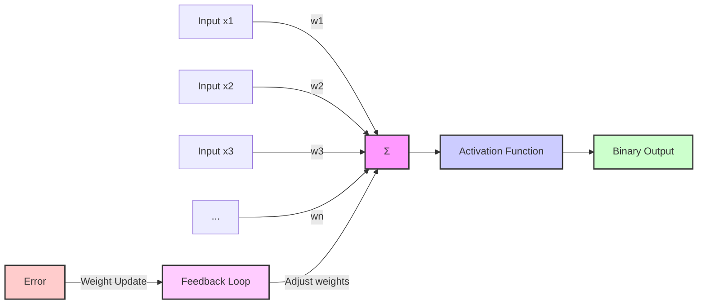

# Classificação Baseada em Erros: O Perceptron como Classificador *Error-Driven*



## Introdução

A **classificação baseada em erros**, ou aprendizagem *error-driven*, é um paradigma central em *machine learning* que enfatiza a correção iterativa de erros de classificação para aprimorar o desempenho dos modelos [1]. Nesse contexto, o **perceptron** surge como um classificador pioneiro, introduzindo um mecanismo de aprendizagem que atualiza os pesos com base em erros de classificação [2].

Proposto por **Frank Rosenblatt** em 1958, o perceptron representa uma abordagem fundamental para a classificação linear e serve como alicerce para muitos algoritmos de aprendizagem de máquina modernos [3]. Sua simplicidade e eficácia o tornam essencial para compreender os princípios da classificação baseada em erros, além de fornecer insights sobre o funcionamento de redes neurais mais complexas [4].

## Conceitos Fundamentais

| Conceito                 | Explicação                                                   |
| ------------------------ | ------------------------------------------------------------ |
| **Perceptron**           | Algoritmo de aprendizagem supervisionada para classificação binária que ajusta os pesos com base nos erros de classificação [5]. |
| **Classificação Linear** | Separação de classes usando um hiperplano no espaço de características [6]. |
| **Atualização de Pesos** | Ajuste dos parâmetros do modelo para minimizar erros de classificação [7]. |

> ⚠️ **Nota Importante**: O perceptron **converge** para uma solução se os dados forem **linearmente separáveis** [8].

> ❗ **Ponto de Atenção**: O perceptron **não converge** para dados **não linearmente separáveis**, o que motivou o desenvolvimento de algoritmos mais avançados [9].

> ✔️ **Destaque**: A regra de atualização do perceptron é uma forma de **descida de gradiente estocástico**, conectando-o a técnicas de otimização modernas [10].

## Funcionamento do Perceptron

O perceptron atua como um classificador binário, mapeando um vetor de entrada $\mathbf{x}$ para uma saída $y \in \{-1, +1\}$ [11]. O processo pode ser descrito matematicamente:

1. **Classificação**:

   $$
   y = \text{sign}(\boldsymbol{\theta} \cdot \mathbf{x})
   $$

   onde $\boldsymbol{\theta}$ é o vetor de pesos [12].

2. **Atualização de Pesos**:

   Em caso de erro de classificação, os pesos são atualizados:

   $$
   \boldsymbol{\theta}^{(t+1)} = \boldsymbol{\theta}^{(t)} + y^{(i)} \mathbf{x}^{(i)}
   $$

   onde $t$ é a iteração atual, $y^{(i)}$ é a classe verdadeira e $\mathbf{x}^{(i)}$ é o vetor de características [13].

O algoritmo do perceptron pode ser implementado:

```python
def perceptron(X, y, max_iterations=1000):
    theta = np.zeros(X.shape[1])
    for _ in range(max_iterations):
        for i in range(len(y)):
            if y[i] * np.dot(theta, X[i]) <= 0:
                theta += y[i] * X[i]
    return theta
```

Este código reflete o procedimento de aprendizagem do perceptron [14].

### Análise Teórica

==O **Teorema de Convergência do Perceptron** afirma que, se os dados são linearmente separáveis, o algoritmo converge em um número finito de iterações [15].== A margem de separação $\rho$ é definida como:
$$
\rho = \min_{i} \frac{y^{(i)} (\boldsymbol{\theta}^* \cdot \mathbf{x}^{(i)})}{\|\boldsymbol{\theta}^*\|}
$$

onde $\boldsymbol{\theta}^*$ é o vetor de pesos ótimo [16].

O número máximo de atualizações é limitado por:

$$
\text{Atualizações} \leq \left( \frac{R}{\rho} \right)^2
$$

com $R = \max_{i} \| \mathbf{x}^{(i)} \|$ [17].

==Essa análise mostra que a convergência depende da margem $\rho$ e do tamanho dos dados $R$.==

### Perguntas Teóricas

1. **Derive a regra de atualização do perceptron a partir da minimização do erro de classificação.**

2. **Prove o Teorema de Convergência do Perceptron usando a margem funcional.**

3. **Explique por que o perceptron não converge para dados não linearmente separáveis e relacione ao conceito de margem geométrica.**

## Extensões e Variações do Perceptron

### Perceptron Médio (*Averaged Perceptron*)

O perceptron médio visa melhorar a generalização ao usar a média dos pesos [18]:

$$
\bar{\boldsymbol{\theta}} = \frac{1}{T} \sum_{t=1}^T \boldsymbol{\theta}^{(t)}
$$

onde $T$ é o total de iterações [19].

Implementação:

```python
def averaged_perceptron(X, y, max_iterations=1000):
    theta = np.zeros(X.shape[1])
    theta_total = np.zeros(X.shape[1])
    count = 0
    for _ in range(max_iterations):
        for i in range(len(y)):
            if y[i] * np.dot(theta, X[i]) <= 0:
                theta += y[i] * X[i]
            theta_total += theta
            count += 1
    return theta_total / count
```

Esta abordagem reduz a variância e pode melhorar o desempenho em dados não separáveis [20].

### Perceptron com Margem (*Margin Perceptron*)

O perceptron com margem busca maximizar a margem de separação [21]. A atualização ocorre se:

$$
y^{(i)} (\boldsymbol{\theta}^{(t)} \cdot \mathbf{x}^{(i)}) < \gamma
$$

onde $\gamma$ é a margem desejada [22].

Essa variante conecta-se às **Máquinas de Vetores de Suporte (SVM)**, que otimizam uma margem máxima [23].

### Perguntas Teóricas

1. **Mostre como o perceptron médio reduz a variância em relação ao perceptron padrão.**

2. **Derive a relação entre o perceptron com margem e a função objetivo da SVM linear.**

3. **Analise o impacto da margem $\gamma$ na generalização do modelo.**

## Otimização e Convergência

A função de perda do perceptron é:

$$
L(\boldsymbol{\theta}) = -\sum_{i} y^{(i)} (\boldsymbol{\theta} \cdot \mathbf{x}^{(i)}) \quad \text{se} \quad y^{(i)} (\boldsymbol{\theta} \cdot \mathbf{x}^{(i)}) \leq 0
$$

A atualização dos pesos é equivalente a um passo na direção negativa do gradiente [24]:

$$
\boldsymbol{\theta}^{(t+1)} = \boldsymbol{\theta}^{(t)} - \eta \nabla L(\boldsymbol{\theta}^{(t)})
$$

onde $\eta$ é a taxa de aprendizagem [25].

> ⚠️ **Nota Importante**: A escolha da taxa de aprendizagem $\eta$ é crítica para a convergência [26].

### Análise de Convergência

==A separabilidade linear implica que existe um $\boldsymbol{\theta}^*$ tal que:==
$$
y^{(i)} (\boldsymbol{\theta}^* \cdot \mathbf{x}^{(i)}) \geq \rho > 0
$$

para todos os $i$ [27].

A prova de convergência mostra que o número de erros é finito e depende de $\rho$ e $R$ [28].

### Perguntas Teóricas

1. **Derive o gradiente da função de perda e relacione à regra de atualização.**

2. **Prove que o número de erros é limitado por $\left( \frac{R}{\rho} \right)^2$.**

3. **Compare teoricamente a convergência do perceptron médio com o padrão.**

## Conclusão

O perceptron é fundamental para a aprendizagem de máquina, estabelecendo conceitos-chave em classificação linear e aprendizagem baseada em erros [29]. Suas extensões, como o perceptron médio e com margem, conectam-se a algoritmos avançados, como SVMs, demonstrando sua relevância contínua [30].

A compreensão profunda do perceptron e suas propriedades teóricas é essencial para o desenvolvimento de algoritmos mais sofisticados e para o avanço da área de *machine learning* [31].

## Perguntas Teóricas Avançadas

1. **Derive a formulação dual do perceptron e compare com a SVM linear.**

2. **Analise o perceptron em aprendizagem online com dados não estacionários.**

3. **Prove que o perceptron médio converge para a solução de margem máxima em expectativa.**

4. **Explore uma extensão do perceptron com regularização $L_1$ e discuta os efeitos.**

5. **Compare a complexidade do perceptron com regressão logística e SVM em termos de erro de generalização.**
