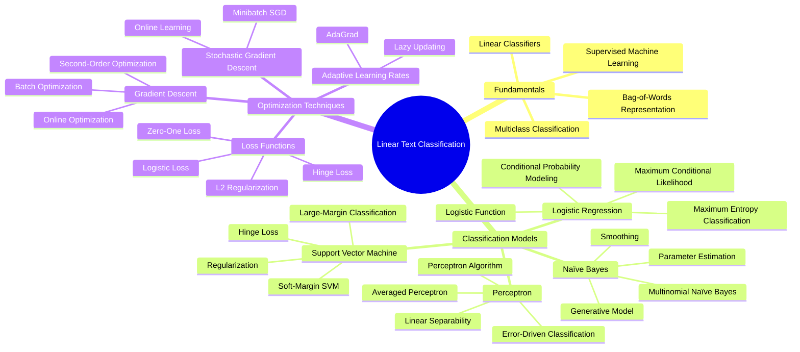

## Chapter 2: Linear Text Classification

### 2. Introduction

- **Bag-of-Words Representation:**  Representing text as a vector of word counts, ignoring word order.
- **Linear Classifiers:**  Classifying text based on a linear scoring function, computed as the inner product between a weight vector and a feature vector.
- **Weights and Feature Function:**  Defining weights (θ) as measures of word-label compatibility and the feature function (f(x, y)) as a mapping from word counts and labels to a feature vector.
- **Multiclass Classification:**  Extending linear classifiers to handle multiple labels by computing a score for each label and predicting the label with the highest score.
- **Supervised Machine Learning:**  Using labeled data to automatically learn the classification weights.
- **Probabilistic vs. Discriminative Approaches:**  Distinguishing between probabilistic classifiers (e.g., Naïve Bayes) and discriminative classifiers (e.g., perceptron, SVM).

### 2.2 Naïve Bayes

- **Generative Story:**  Describing Naïve Bayes as a generative model that assumes a joint probability distribution over labels and features.
- **Multinomial Naïve Bayes:**  Using the multinomial distribution to model the bag-of-words representation, assuming conditional independence of words given the label.
- **Categorical Distribution:**  Modeling the generation of individual tokens using the categorical distribution.
- **Types vs. Tokens:**  Distinguishing between word types (unique words in the vocabulary) and tokens (individual word occurrences).
- **Conditional Independence Assumption:**  Assuming that each token is independent of all other tokens, given the label.
- **Prediction Rule:**  Predicting the label that maximizes the joint log-probability, which can be computed as a vector inner product between weights and features.
- **Parameter Estimation:**  Estimating the parameters (μ, φ) of the categorical and multinomial distributions using relative frequency estimation (maximum likelihood).
- **Smoothing:**  Addressing the problem of zero probabilities by adding a pseudocount (Laplace smoothing) to avoid overfitting and high variance.

### 2.3 The Perceptron

- **Error-Driven Classification:**  Introducing the perceptron as an error-driven classifier that updates weights based on misclassifications.
- **Perceptron Algorithm:**  Describing the perceptron algorithm and its update rule for adjusting weights based on classification errors.
- **Linear Separability:**  Defining linear separability and its relationship with the perceptron's ability to find a separator.
- **Averaged Perceptron:**  Improving the perceptron's performance by averaging the weights over training iterations.

### 2.4 Loss Functions and Large-Margin Classification

- **Loss Functions:**  Introducing the concept of loss functions as measures of classifier performance on individual instances.
- **Negative Log-Likelihood as Loss Function:**  Reframing maximum likelihood estimation as minimizing the negative log-likelihood loss.
- **Zero-One Loss:**  Defining the zero-one loss and its limitations due to non-convexity and useless derivatives.
- **Hinge Loss (Perceptron Loss):**  Introducing the hinge loss as the loss function optimized by the perceptron.
- **Margin and Large-Margin Classification:**  Defining the margin and motivating large-margin classification for improved generalization.
- **Margin Loss:**  Introducing the margin loss as a convex upper bound on the zero-one loss, encouraging a larger separation between correct and incorrect labels.
- **Online Support Vector Machine:**  Presenting the online support vector machine as an online algorithm that minimizes the margin loss.
- **Functional Margin vs. Geometric Margin:**  Distinguishing between functional margin (based on raw scores) and geometric margin (normalized by weight vector norm).
- **Constrained Optimization for Maximum Geometric Margin:**  Formulating the SVM objective as a constrained optimization problem to maximize the geometric margin.
- ==PAREI AQUI==
- **Slack Variables and Soft-Margin SVM:**  Introducing slack variables to allow for misclassifications and defining the soft-margin SVM.
- **Regularization as a Prior:**  Interpreting regularization as imposing a prior distribution on the weights, favoring smaller weight values.

### 2.5 Logistic Regression

- **Directly Modeling Conditional Probability:**  Defining logistic regression as a discriminative classifier that directly models the conditional probability p(Y|X).
- **Logistic Function and Probability:**  Using the logistic function (sigmoid) to convert linear scores into probabilities.
- **Maximum Conditional Likelihood:**  Estimating the weights by maximizing the conditional log-likelihood.
- **Logistic Loss:**  Introducing the logistic loss as the additive inverse of the conditional log-probability.
- **L2 Regularization:**  Penalizing the squared L2 norm of the weights to improve generalization and prevent overfitting.
- **Gradient of the Logistic Loss:**  Computing the gradient of the logistic loss and its relationship to expected and observed feature counts.
- **Generalized Linear Models (GLMs):**  Mentioning logistic regression as a member of the GLM family.
- **Maximum Entropy Classification:**  Presenting the maximum entropy formulation of logistic regression, based on moment-matching constraints and maximizing entropy.

### 2.6 Optimization

- **Batch vs. Online Optimization:**  Distinguishing between batch optimization (using the entire dataset for each update) and online optimization (updating weights incrementally).
- **Gradient Descent:**  Describing gradient descent as a batch optimization algorithm and its convergence properties for convex objectives.
- **Second-Order Optimization (Newton, Quasi-Newton):**  Briefly discussing Newton and quasi-Newton methods for faster convergence, mentioning L-BFGS as a popular technique.
- **Stochastic Gradient Descent (SGD):**  Introducing SGD as an online optimization algorithm that approximates the gradient using a single instance or a small minibatch.
- **Adaptive Learning Rates (AdaGrad):**  Discussing the use of adaptive learning rates, where each feature has its own learning rate based on its frequency.
- **Lazy Updating:**  Optimizing online learning by updating weights only as they are used, reducing computation cost for sparse feature vectors.

### 2.7 Maximum Entropy Motivation

- **Log-Linear Models:**  Mentioning logistic regression and related models as log-linear models due to the linear relationship between log-probability and features.
- **Moment-Matching Constraints:**  Formulating maximum entropy classification as finding a probability distribution that maximizes entropy while satisfying moment-matching constraints, requiring empirical and expected feature counts to match.
- **Maximum Entropy Principle:**  Choosing the probability distribution with the highest entropy among those that satisfy the constraints, representing the weakest commitment consistent with the observed data.

### 2.8 Summary of Learning Algorithms

- **Naïve Bayes:**  A probabilistic generative model that assumes conditional independence of features.
- **Perceptron:**  An error-driven online algorithm that minimizes the hinge loss.
- **Support Vector Machine (SVM):**  A discriminative model that maximizes the margin between classes, with online and batch variants.
- **Logistic Regression:**  A discriminative probabilistic model that directly models the conditional probability using the logistic function and maximizes conditional likelihood.