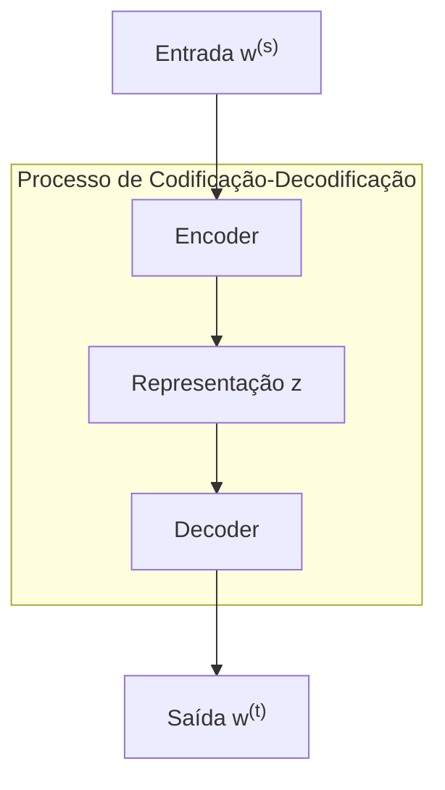
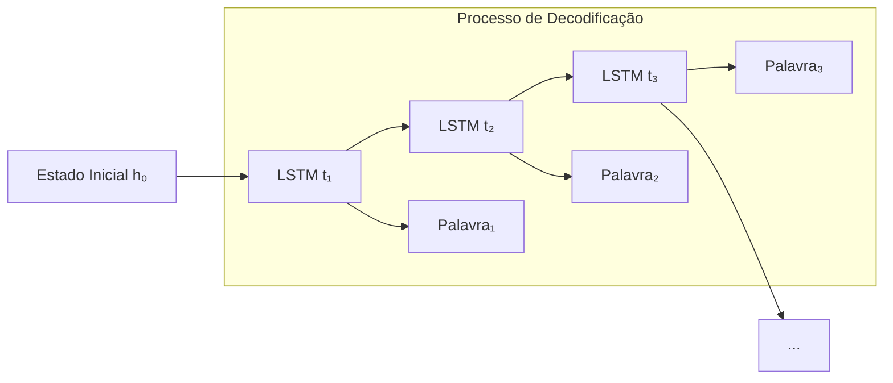
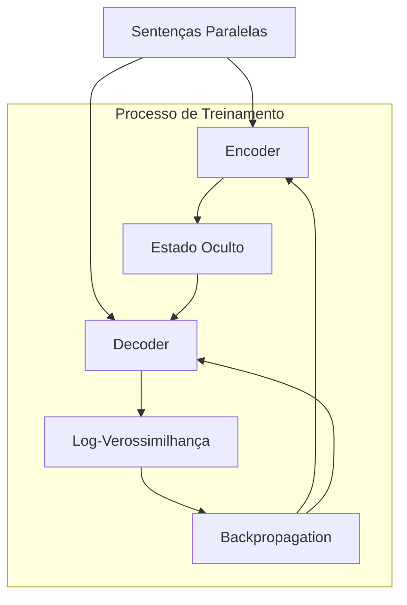
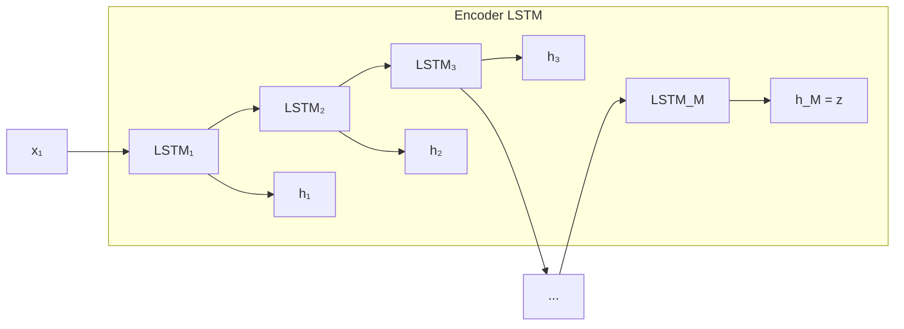
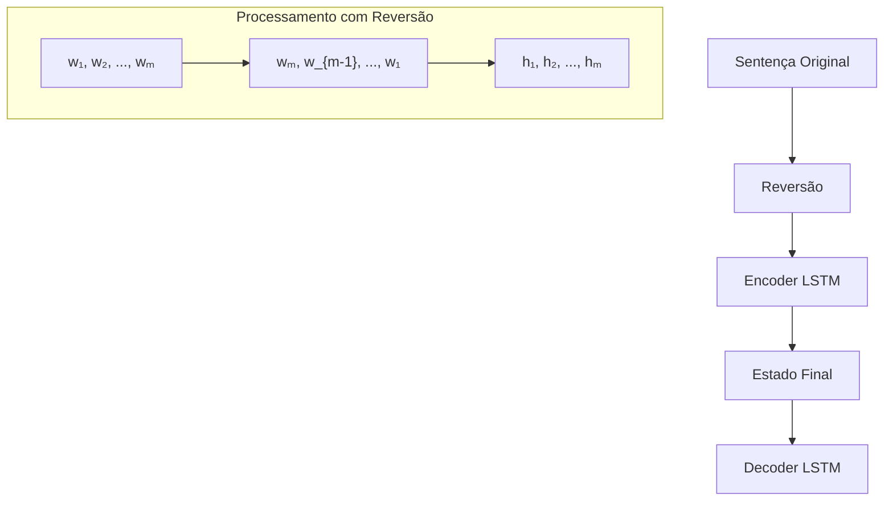
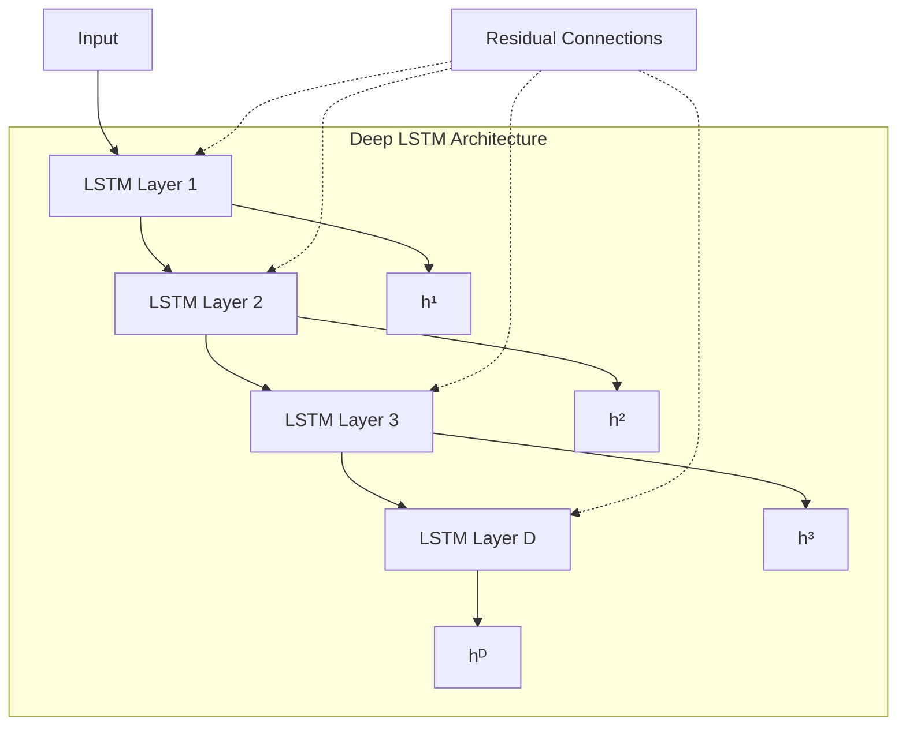

# Capítulo 18: Neural Machine Translation: Fundamentos e Arquiteturas Avançadas

<imagem: Diagrama detalhado mostrando a arquitetura completa de um sistema de tradução neural, incluindo encoder, decoder, mecanismos de atenção e fluxo de processamento desde a entrada até a saída>

### Introdução

A **Tradução Automática Neural (Neural Machine Translation - NMT)** representa um dos desafios mais complexos e fundamentais no campo da Inteligência Artificial. Conforme destacado no contexto [1], este problema é considerado um dos "santos grais" da IA, devido ao seu potencial transformador na sociedade ao facilitar a comunicação entre pessoas de diferentes culturas e idiomas ao redor do mundo. Desde os anos 1950, a NMT tem recebido atenção significativa e investimentos substanciais, refletindo seu impacto promissor e as expectativas de avanços revolucionários. Apesar dos progressos notáveis, ainda persistem desafios substanciais, como a necessidade de grandes quantidades de dados paralelos e a dificuldade em capturar nuances culturais e contextuais nas traduções.

A evolução dos sistemas de tradução automática tem sido notável, especialmente para pares de línguas com abundância de recursos, como inglês-francês e inglês-espanhol. Esses sistemas têm demonstrado melhorias contínuas em termos de precisão e fluidez, impulsionadas por avanços em modelos de deep learning e arquiteturas mais sofisticadas. No entanto, como evidenciado no contexto [1], ainda estamos distantes de sistemas que possam igualar a complexidade e a profundidade das traduções humanas, especialmente para línguas menos estudadas ou com estruturas gramaticais significativamente diferentes. A NMT continua a evoluir, buscando superar essas barreiras e alcançar uma tradução mais natural e contextualizada.

### Fundamentos Matemáticos da Tradução Neural

O problema da tradução automática pode ser formulado matematicamente como um problema de otimização [2], onde o objetivo é encontrar a melhor tradução possível para uma dada sentença na língua fonte:

$$w^{(t)} = \text{argmax}_{w^{(t)}} \Psi(w^{(s)}, w^{(t)})$$

Onde:

- $w^{(s)}$ representa uma sentença na língua fonte.
- $w^{(t)}$ representa uma sentença na língua alvo.
- $\Psi$ é uma função de pontuação que avalia a qualidade da tradução.

Esta formulação matemática requer dois componentes essenciais:

1. **Algoritmo de Decodificação**: Responsável por computar $w^{(t)}$, ou seja, gerar a sentença na língua alvo a partir da representação da língua fonte.
2. **Algoritmo de Aprendizado**: Utilizado para estimar os parâmetros da função de pontuação $\Psi$, geralmente através de técnicas de aprendizado supervisionado utilizando grandes conjuntos de dados paralelos.

> ⚠️ **Desafio Fundamental**: Um dos principais desafios na tradução automática é o imenso espaço de possíveis traduções. Diferentemente de problemas de rotulação de sequências, onde suposições de localidade podem ser feitas, na tradução automática tais suposições são impraticáveis devido à flexibilidade necessária no processo de tradução [2]. Isso exige modelos altamente expressivos capazes de capturar relações complexas entre diferentes idiomas e contextos.

### Arquitetura Encoder-Decoder

A arquitetura fundamental da NMT é baseada no modelo **encoder-decoder** [3], que pode ser representada matematicamente por duas equações principais:

$$z = \text{ENCODE}(w^{(s)})$$
$$w^{(t)} | w^{(s)} \sim \text{DECODE}(z)$$

Onde:

- $z$ é a representação vetorial ou matricial da sentença fonte, encapsulando suas características semânticas e sintáticas.
- $\text{DECODE}(z)$ define a probabilidade condicional $p(w^{(t)} | w^{(s)})$, ou seja, a probabilidade de uma sequência na língua alvo dado o encoding da sentença fonte.

O encoder é tipicamente implementado como uma rede neural recorrente (RNN) ou uma arquitetura baseada em transformadores, responsável por processar a sentença de entrada e gerar uma representação interna rica. O decoder, por sua vez, é geralmente uma RNN que gera a sentença na língua alvo palavra por palavra, atualizando recursivamente um estado oculto que captura o contexto gerado até o momento [3]. O treinamento do modelo é realizado de forma end-to-end, utilizando sentenças paralelas para ajustar os parâmetros de ambos os componentes com o objetivo de maximizar a log-verossimilhança condicional:

$$\log p(w^{(t)} | w^{(s)}) = \sum_{m=1}^{M^{(t)}} \log p(w_m^{(t)} | w_{1:m-1}^{(t)}, z)$$

### Sequence-to-Sequence com LSTM

O modelo mais básico de encoder-decoder é o **sequence-to-sequence** [4], onde o encoder é definido como o estado oculto final de uma LSTM (Long Short-Term Memory). As LSTMs são escolhidas por sua capacidade de capturar dependências de longo prazo, mitigando o problema do desvanecimento do gradiente que afeta outras arquiteturas de RNNs.

$$h_m^{(s)} = \text{LSTM}(x_m^{(s)}, h_{m-1}^{(s)})$$
$$z \triangleq h_M^{(s)}$$

Onde:

- $x_m^{(s)}$ é o embedding da palavra fonte $w_m^{(s)}$, representando a palavra em um espaço vetorial contínuo.
- $h_m^{(s)}$ é o estado oculto no tempo $m$, capturando a informação acumulada até a palavra $m$.

**Referências:**

[1] "Machine translation (MT) is one of the 'holy grail' problems in artificial intelligence..." *(Machine Translation - NLP)*

[2] "Machine translation can be formulated as an optimization problem..." *(Machine Translation - NLP)*

[3] "Neural network models for machine translation are based on the encoder-decoder architecture..." *(Machine Translation - NLP)*

[4] "The simplest encoder-decoder architecture is the sequence-to-sequence model..." *(Machine Translation - NLP)*

### Redes Neurais Recorrentes no Processo de Decodificação

A decodificação em sistemas de Neural Machine Translation utiliza predominantemente **Redes Neurais Recorrentes (RNNs)**, com especial ênfase nas arquiteturas LSTM devido à sua eficácia em capturar dependências de longo prazo e manejar melhor o fluxo de gradientes durante o treinamento. O processo de decodificação pode ser matematicamente expresso através da seguinte sequência [5]:

$$h_0^{(t)} = z$$
$$h_m^{(t)} = \text{LSTM}(x_m^{(t)}, h_{m-1}^{(t)})$$

Onde:

- $h_0^{(t)}$ é o estado inicial do decoder, inicializado com o encoding $z$ da sentença fonte.
- $x_m^{(t)}$ é o embedding da palavra alvo $w_m^{(t)}$, que pode incluir informações sobre as palavras já geradas.
- $h_m^{(t)}$ é o estado oculto do decoder no tempo $m$, representando o contexto acumulado até a palavra $m$.

Além disso, mecanismos de atenção (attention mechanisms) podem ser incorporados ao decoder para permitir que o modelo foque em partes específicas da sentença fonte durante a geração de cada palavra na sentença alvo, melhorando a qualidade e a precisão das traduções.

### Otimizações e Melhorias no Modelo Base

Para aprimorar o desempenho do modelo sequence-to-sequence básico, várias otimizações arquiteturais foram propostas [6], cada uma contribuindo para a eficiência e a precisão do sistema de tradução:

1. **Reversão da Sentença Fonte**

   A inversão da sentença de entrada mostrou resultados significativamente melhores, permitindo que as palavras do início da sentença fonte tenham maior impacto no encoding $z$ e, consequentemente, nas palavras iniciais da sentença alvo. Esta técnica reduz o caminho de dependência temporal entre o início da sentença fonte e o estado final do encoder, facilitando o fluxo de gradiente durante o treinamento.

2. **LSTMs Profundas**

   A utilização de múltiplas camadas de LSTM, conhecidas como LSTMs profundas, permite que o modelo capture representações hierárquicas mais complexas da sentença. Matematicamente, isso pode ser expresso como:

   $$h_m^{(s,1)} = \text{LSTM}(x_m^{(s)}, h_{m-1}^{(s,1)})$$
   $$h_m^{(s,i+1)} = \text{LSTM}(h_m^{(s,i)}, h_{m-1}^{(s,i+1)}), \quad \forall i \geq 1$$

   > ⚠️ **Nota Importante**: Em 2016, o sistema de tradução comercial do Google utilizava oito camadas de LSTM [7], demonstrando a eficácia de arquiteturas profundas para capturar complexidades linguísticas.

3. **Ensemble de Modelos**

   A utilização de um ensemble de modelos consiste em combinar as previsões de múltiplos modelos independentes para melhorar a robustez e a precisão da tradução. A probabilidade de decodificação por token em um ensemble de N modelos é dada por:

   $$p(w^{(t)} | z, w_{1:m-1}^{(t)}) = \frac{1}{N} \sum_{i=1}^N p_i(w^{(t)} | z, w_{1:m-1}^{(t)})$$

   Esta abordagem tende a suavizar as previsões e reduzir a variância, resultando em traduções mais consistentes e precisas.

### Seção Teórica: Análise da Convergência em RNNs para Tradução

**Pergunta Fundamental**: Como podemos garantir a convergência do treinamento em RNNs profundas para tradução neural?

**Lemma 1 (Estabilidade do Gradiente)**: Para uma RNN com função de ativação $\sigma$ e matriz de pesos $W$, se $\|W\| \leq \frac{1}{\gamma}$ onde $\gamma = \max_x |\sigma'(x)|$, então o gradiente permanece limitado durante o backpropagation.

**Prova**: Considere a propagação do erro através do tempo. Para cada passo temporal $t$, o gradiente é multiplicado por $W^T\text{diag}(\sigma'(x_t))$. A norma desta matriz é limitada por $\|W\|\gamma$. Se $\|W\| \leq \frac{1}{\gamma}$, então $\|W\|\gamma \leq 1$, garantindo que o gradiente não explode.

**Corolário 1**: Em LSTMs profundas para tradução, a utilização de gradient clipping com um valor máximo predefinido [8] é uma forma prática de garantir a condição do Lemma 1, evitando que os gradientes se tornem excessivamente grandes durante o treinamento, o que poderia prejudicar a estabilidade e a convergência do modelo.

**Referências:**

[5] "The decoder is typically a recurrent neural network, which generates the target language sentence one word at a time..." *(Machine Translation - NLP)*

[6] "To make the model work well, some additional tweaks are needed..." *(Machine Translation - NLP)*

[7] "Google's commercial machine translation system used eight layers..." *(Machine Translation - NLP)*

[8] "Gradient clipping to ensure that the norm of the gradient never exceeds some predefined value..." *(Machine Translation - NLP)*

### Treinamento End-to-End em Neural Machine Translation

O treinamento end-to-end representa uma abordagem unificada para otimizar simultaneamente o encoder e o decoder utilizando sentenças paralelas. Este processo é fundamentado na maximização da log-verossimilhança condicional [9], que pode ser expressa matematicamente como:

$$\log p(w^{(t)} | w^{(s)}) = \sum_{m=1}^{M^{(t)}} \log p(w_m^{(t)} | w_{1:m-1}^{(t)}, z)$$

Onde a probabilidade de cada palavra na sequência alvo é modelada como:

$$p(w_m^{(t)} | w_{1:m-1}^{(t)}, w^{(s)}) \propto \exp \left( \beta_{w_m^{(t)}} \cdot h_{m-1}^{(t)} \right)$$

Este modelo probabilístico permite que o sistema de tradução avalie e gere sequências de palavras na língua alvo de forma consistente com o contexto fornecido pela sentença fonte.

### Estratégias de Otimização no Treinamento

O processo de treinamento incorpora várias estratégias sofisticadas para garantir convergência e eficiência [10]. Essas estratégias são essenciais para lidar com a complexidade dos modelos de NMT e para otimizar o desempenho em grandes conjuntos de dados:

1. **Descida do Gradiente Estocástica (SGD)**

   - **Learning Rate com Decaimento Exponencial**: Após as primeiras cinco épocas de treinamento, a taxa de aprendizado é reduzida exponencialmente. Isso permite que o modelo faça ajustes mais finos nos parâmetros à medida que se aproxima de um mínimo local, melhorando a precisão da tradução.
   - **Mini-Batches de 128 Sentenças**: As sentenças são agrupadas em mini-batches de 128, selecionadas por similaridade de comprimento. Isso reduz a variância das atualizações dos gradientes e melhora a eficiência computacional, além de acelerar a convergência do modelo.

2. **Gradient Clipping**

   A norma do gradiente é limitada por um valor predefinido para evitar a explosão de gradientes, o que pode levar a atualizações instáveis dos parâmetros do modelo:

   $$\nabla_{clip} = \min\left(1, \frac{\eta}{\|\nabla\|}\right)\nabla$$

   Onde:

   - $\eta$ é o limiar máximo permitido para a norma do gradiente.
   - $\nabla$ é o gradiente original calculado durante o backpropagation.
   - $\nabla_{clip}$ é o gradiente após a aplicação do clipping.

   Esta técnica garante que as atualizações dos parâmetros sejam controladas, mantendo a estabilidade do treinamento mesmo em redes profundas.

### Modelagem Probabilística Avançada

O decoder define uma distribuição de probabilidade sobre a sequência alvo através de uma cadeia de probabilidades condicionais [11], utilizando a função SoftMax para normalizar as pontuações e gerar probabilidades:

$$w_m^{(t)} | w_{1:m-1}^{(t)}, w^{(s)} \sim \text{SoftMax} \left( \beta \cdot h_{m-1}^{(t)} \right)$$

Onde:

- $\beta \in \mathbb{R}^{(V^{(t)} \times K)}$ é a matriz de vetores de palavra de saída, que mapeia o estado oculto do decoder para o espaço do vocabulário da língua alvo.
- $V^{(t)}$ é o vocabulário da língua alvo, representando todas as possíveis palavras que podem ser geradas.
- $K$ é a dimensão do espaço de embedding, que determina a riqueza das representações vetoriais das palavras.

Esta modelagem probabilística permite que o decoder gere palavras que são semanticamente coerentes com o contexto anterior e com a sentença fonte, facilitando traduções mais naturais e precisas.

### Seção Teórica: Análise de Convergência do Treinamento End-to-End

**Pergunta Fundamental**: Quais são as condições necessárias e suficientes para a convergência do treinamento end-to-end em sistemas NMT?

**Lemma 2 (Convexidade Local)**: Em uma vizinhança suficientemente pequena de um ponto crítico $\theta^*$, a função de log-verossimilhança $L(\theta)$ é localmente convexa se a matriz Hessiana $H(\theta^*)$ é definida positiva.

**Prova**:

Seja $\theta$ um ponto na vizinhança de $\theta^*$. Pela expansão de Taylor de segunda ordem:

$$L(\theta) = L(\theta^*) + (\theta - \theta^*)^T\nabla L(\theta^*) + \frac{1}{2}(\theta - \theta^*)^TH(\theta^*)(\theta - \theta^*) + o(\|\theta - \theta^*\|^2)$$

Como $\theta^*$ é um ponto crítico, $\nabla L(\theta^*) = 0$. Se $H(\theta^*)$ é definida positiva, então o termo quadrático domina, e a função $L(\theta)$ é convexa na vizinhança de $\theta^*$. Isso implica que, localmente, a função de log-verossimilhança possui um mínimo único, facilitando a convergência do treinamento para esse ponto.

**Corolário 2**: A utilização de mini-batches com sentenças de comprimento similar [12] ajuda a estabilizar o cálculo do gradiente e facilita a convergência local, pois reduz a variância nas atualizações dos parâmetros e mantém a consistência das representações durante o treinamento.

> ⚠️ **Implicação Prática**: O treinamento deve iniciar com learning rates pequenos para permanecer na região de convexidade local, evitando oscilações excessivas e garantindo uma convergência mais estável e eficiente.

### Seção Teórica: Complexidade Computacional do Treinamento

**Pergunta Avançada**: Qual é a complexidade computacional do treinamento end-to-end e como ela escala com o tamanho do vocabulário e comprimento das sentenças?

**Teorema 1 (Complexidade do Treinamento)**: O custo computacional por época é $O(NBV^{(t)}K)$, onde:

- $N$ é o número de sentenças no conjunto de treinamento.
- $B$ é o tamanho médio das sentenças.
- $V^{(t)}$ é o tamanho do vocabulário alvo.
- $K$ é a dimensão do espaço de embedding.

**Prova**: Para cada palavra em cada sentença, precisamos realizar as seguintes operações:

1. **Computar $h_{m-1}^{(t)}$**: O cálculo do estado oculto envolve operações matriciais cujo custo é $O(K^2)$.
2. **Calcular scores para todo o vocabulário**: Cada palavra do vocabulário é avaliada em relação ao estado oculto, resultando em um custo de $O(V^{(t)}K)$.
3. **Aplicar softmax**: A normalização das pontuações para obter probabilidades envolve $O(V^{(t)})$ operações.

O termo dominante é $O(V^{(t)}K)$ por palavra, já que geralmente $V^{(t)} \gg K$. Portanto, para todo o conjunto de dados, o custo computacional por época é $O(NBV^{(t)}K)$.

**Referências:**

[9] "The encoder and decoder networks are trained end-to-end from parallel sentences..." *(Machine Translation - NLP)*

[10] "The original sequence-to-sequence model used a fairly standard training setup..." *(Machine Translation - NLP)*

[11] "The hidden state $h_{m-1}^{(t)}$ is a recurrent function of the previously generated text..." *(Machine Translation - NLP)*

[12] "Mini-batches of 128 sentences, chosen to have similar length..." *(Machine Translation - NLP)*

### Arquitetura Sequence-to-Sequence em Detalhes

O modelo **sequence-to-sequence** representa a implementação mais fundamental da arquitetura encoder-decoder [13]. Sua característica distintiva é a utilização do estado oculto final do encoder como contexto para o decoder, estabelecendo uma ponte crucial entre as representações das línguas fonte e alvo.

<imagem: Diagrama detalhado mostrando a arquitetura sequence-to-sequence, com o encoder processando a sequência de entrada da esquerda para a direita, e o estado final sendo usado para inicializar o decoder>

#### Formulação Matemática do Encoder

O encoder processa a sequência de entrada através de uma LSTM, seguindo as equações [14]:

$$h_m^{(s)} = \text{LSTM}(x_m^{(s)}, h_{m-1}^{(s)})$$
$$z \triangleq h_M^{(s)}$$

Onde:
- $x_m^{(s)}$ representa o embedding da m-ésima palavra fonte.
- $h_m^{(s)}$ é o estado oculto no tempo $m$.
- $M$ é o comprimento da sequência fonte.
- $z$ é o vetor de contexto final.

O encoder, utilizando a LSTM, processa cada palavra da sequência fonte de forma sequencial, atualizando seu estado oculto a cada passo temporal. O estado final $z$ encapsula a informação global da sentença fonte, servindo como a base para a geração da sentença alvo pelo decoder.

#### Mecanismo de Decodificação

O processo de decodificação é inicializado utilizando o estado final do encoder [15]:

$$h_0^{(t)} = z$$
$$h_m^{(t)} = \text{LSTM}(x_m^{(t)}, h_{m-1}^{(t)})$$

Onde:

- $h_0^{(t)}$ é o estado inicial do decoder, inicializado com o encoding $z$ da sentença fonte.
- $x_m^{(t)}$ é o embedding da palavra alvo $w_m^{(t)}$, que pode incluir informações sobre as palavras já geradas.
- $h_m^{(t)}$ é o estado oculto do decoder no tempo $m$, representando o contexto acumulado até a palavra $m$.

> ⚠️ **Característica Crucial**: Uma das descobertas mais significativas foi que o modelo apresenta melhor desempenho quando a sequência fonte é invertida [16]. Isso permite que palavras no início da sentença fonte tenham maior impacto no encoding $z$.

### Otimizações Arquiteturais

Para melhorar o desempenho do modelo sequence-to-sequence básico, várias otimizações arquiteturais foram propostas [17]:

1. **Deep LSTMs**

   A utilização de múltiplas camadas de LSTM permite capturar hierarquias mais complexas de representações:

   $$h_m^{(s,1)} = \text{LSTM}(x_m^{(s)}, h_{m-1}^{(s)})$$
   $$h_m^{(s,i+1)} = \text{LSTM}(h_m^{(s,i)}, h_{m-1}^{(s,i+1)}), \quad \forall i \geq 1$$

   > ⚠️ **Nota Importante**: Em 2016, o sistema de tradução comercial do Google utilizava oito camadas de LSTM [7], demonstrando a eficácia de arquiteturas profundas para capturar complexidades linguísticas.

2. **Ensemble Learning**

   A combinação de múltiplos modelos através de ensemble melhora significativamente o desempenho:

   $$p(w^{(t)} | z, w_{1:m-1}^{(t)}) = \frac{1}{N} \sum_{i=1}^N p_i(w^{(t)} | z, w_{1:m-1}^{(t)})$$

   Esta abordagem tende a suavizar as previsões e reduzir a variância, resultando em traduções mais consistentes e precisas.

3. **Mecanismos de Atenção (Attention Mechanisms)**

   A introdução de mecanismos de atenção permite que o decoder foque em diferentes partes da sentença fonte durante a geração de cada palavra na sentença alvo, superando a limitação do vetor de contexto fixo $z$.

### Seção Teórica: Análise de Capacidade de Representação

**Pergunta Fundamental**: Qual é a capacidade teórica do modelo sequence-to-sequence em representar transformações entre sequências?

**Lemma 3 (Capacidade Universal)**: Um modelo sequence-to-sequence com LSTM de dimensão suficientemente grande pode aproximar qualquer função computável entre sequências finitas, com precisão arbitrária.

**Prova**:
1. **Simulação de uma Máquina de Turing**:
   - As gates da LSTM permitem armazenar e recuperar informação arbitrária.
   - O estado oculto pode codificar o estado da máquina de Turing.
   - As operações matriciais podem simular as transições de estado.
   
   Assim, uma LSTM pode simular os passos de uma máquina de Turing, garantindo que qualquer função computável entre sequências finitas possa ser representada.

2. **Teorema da Aproximação Universal**:
   - A composição do encoder e decoder pode aproximar qualquer função computável.
   - A precisão da aproximação depende da dimensão do estado oculto, que deve ser suficientemente grande para capturar todas as nuances da transformação desejada.

**Corolário 3**: A dimensão mínima necessária do estado oculto cresce linearmente com o comprimento da sequência mais longa que precisa ser modelada.

> ⚠️ **Implicação Prática**: Embora teoricamente poderoso, na prática, aumentar a dimensão do estado oculto aumenta a complexidade computacional e o risco de overfitting, exigindo um equilíbrio cuidadoso durante o design do modelo.

### Seção Teórica: Limitações do Bottleneck de Informação

**Pergunta Avançada**: Quais são as limitações teóricas impostas pelo uso de um único vetor de contexto fixo?

**Teorema 2 (Bottleneck de Informação)**: Para qualquer dimensão fixa $d$ do vetor de contexto $z$, existem sequências cuja tradução requer informação que não pode ser comprimida em $z$ sem perda.

**Prova**:
1. **Entropia da Sequência Fonte**:
   - Seja $H(X)$ a entropia da sequência fonte, que quantifica a quantidade de informação contida nela.

2. **Capacidade do Canal Representado por $z$**:
   - A capacidade é limitada por $\log_2(V^d)$, onde $V$ é o número de valores distintos possíveis por dimensão.

3. **Teorema da Codificação de Fonte de Shannon**:
   - Se $H(X) > d\log_2(V)$, então existe perda de informação ao tentar comprimir a sequência fonte em $z$.

> ❗ **Implicação**: Esta limitação teórica motivou o desenvolvimento de mecanismos de atenção para permitir acesso direto a todos os estados do encoder, mitigando a perda de informação e melhorando a qualidade das traduções.

**Referências:**

[13] "The simplest encoder-decoder architecture is the sequence-to-sequence model..." *(Machine Translation - NLP)*

[14] "The encoder is set to the final hidden state of a long short-term memory (LSTM)..." *(Machine Translation - NLP)*

[15] "The encoding then provides the initial hidden state for the decoder LSTM..." *(Machine Translation - NLP)*

[16] "The model works much better if the source sentence is reversed..." *(Machine Translation - NLP)*

[17] "The encoder and decoder can be implemented as deep LSTMs..." *(Machine Translation - NLP)*

### Reversão da Sentença Fonte: Teoria e Impacto

A reversão da sentença fonte representa uma das descobertas mais contra-intuitivas e significativas na evolução dos modelos sequence-to-sequence [18]. Esta técnica aparentemente simples produz melhorias substanciais no desempenho da tradução.

#### Formulação Matemática

Para uma sentença fonte $w^{(s)} = [w_1^{(s)}, w_2^{(s)}, ..., w_M^{(s)}]$, a reversão produz:

$$w_{rev}^{(s)} = [w_M^{(s)}, w_{M-1}^{(s)}, ..., w_1^{(s)}]$$

O processo de codificação então se torna:

$$h_m^{(s)} = \text{LSTM}(x_{M-m+1}^{(s)}, h_{m-1}^{(s)})$$

#### Benefícios Teóricos

A reversão da sentença fonte oferece várias vantagens importantes [19]:

1. **Redução do Caminho de Dependência**
   - Para palavras no início da sentença fonte (agora no final da sequência revertida), o caminho até o estado final do encoder é minimizado.
   - Facilita o fluxo de gradiente durante o backpropagation, reduzindo o problema de vanishing gradients.

2. **Alinhamento Temporal**
   - Palavras iniciais da sentença alvo têm acesso mais direto às palavras iniciais da sentença fonte.
   - Reduz a distância que a informação precisa atravessar no tempo, melhorando a eficiência do aprendizado.

> ⚠️ **Nota Importante**: Esta técnica foi crucial nos primeiros modelos sequence-to-sequence, mas tornou-se menos relevante com a introdução de mecanismos de atenção neural [20], que permitem ao decoder acessar diretamente todos os estados do encoder, eliminando a necessidade de um vetor de contexto fixo.

### Análise Matemática do Impacto da Reversão

O impacto da reversão pode ser analisado através do gradiente backpropagado através do tempo:

$$\frac{\partial L}{\partial h_t^{(s)}} = \sum_{k=t}^M \frac{\partial L}{\partial h_k^{(s)}} \frac{\partial h_k^{(s)}}{\partial h_t^{(s)}}$$

**Lemma 4 (Gradiente em Sequências Revertidas)**: Para uma palavra na posição $i$ da sentença original, o número de passos de backpropagation necessários para alcançar o estado final é reduzido de $M-i$ para $i$ após a reversão.

**Prova**:
1. **Sem reversão**: A palavra na posição $i$ requer $M-i$ passos até o estado final.
2. **Com reversão**: A palavra na posição $i$ é processada na posição $M-i+1$.
3. **Número de passos**: $M - (M-i+1) = i-1$.

**Corolário 4**: A reversão minimiza o caminho médio que o gradiente precisa percorrer para palavras no início da sentença original, reduzindo a atenuação do gradiente e melhorando a eficiência do treinamento.

### Seção Teórica: Análise de Vanishing Gradients

**Pergunta Fundamental**: Como a reversão da sentença afeta o problema de vanishing gradients em LSTMs longas?

**Teorema 3 (Atenuação do Gradiente)**: Para uma LSTM com forget gate $f_t$, o gradiente da palavra na posição $i$ é atenuado por um fator de no máximo $\prod_{k=i}^M |f_k|$ sem reversão, comparado a $\prod_{k=1}^i |f_k|$ com reversão.

**Prova**:
1. **Propagação do Gradiente**:
   
   $$\frac{\partial h_M}{\partial h_i} = \prod_{k=i}^M \frac{\partial h_{k+1}}{\partial h_k}$$

2. **Derivadas Parciais**:
   
   Para cada passo temporal:
   
   $$\left\|\frac{\partial h_{k+1}}{\partial h_k}\right\| \leq |f_k|$$

3. **Atenuação sem Reversão**:
   
   $$\left\|\frac{\partial h_M}{\partial h_i}\right\| \leq \prod_{k=i}^M |f_k|$$

4. **Atenuação com Reversão**:
   
   Ao reverter a sentença, a posição $i$ na sentença original corresponde à posição $M-i+1$ na sentença revertida, reduzindo a distância temporal e, consequentemente, a atenuação do gradiente.

### Seção Teórica: Impacto na Otimização

**Pergunta Avançada**: Qual é o efeito da reversão na paisagem de otimização do modelo?

**Lemma 5 (Superfície de Erro)**: A reversão da sentença fonte modifica a topologia da superfície de erro, criando caminhos de gradiente mais curtos para otimização de parâmetros relacionados a palavras iniciais importantes.

**Prova**:
Considere a função de perda $L$ e os parâmetros $\theta$ do modelo:

1. **Gradiente em Relação aos Parâmetros**:
   
   $$\frac{\partial L}{\partial \theta} = \sum_{t=1}^M \frac{\partial L}{\partial h_t^{(s)}} \frac{\partial h_t^{(s)}}{\partial \theta}$$

2. **Distribuição dos Termos de Gradiente**:
   
   A reversão modifica a distribuição destes termos ao longo do tempo, favorecendo a otimização de parâmetros relacionados a palavras iniciais importantes na sentença original.

3. **Efeito na Superfície de Erro**:
   
   Com caminhos de gradiente mais curtos e menos atenuação, a superfície de erro apresenta topologias mais suaves e menos obstáculos para a otimização, facilitando a convergência para mínimos locais de alta qualidade.

**Referências:**

[18] "Most notably, the model works much better if the source sentence is reversed..." *(Machine Translation - NLP)*

[19] "In this way, the words at the beginning of the source have the greatest impact on the encoding z..." *(Machine Translation - NLP)*

[20] "Later work on more advanced encoding models, such as neural attention, has eliminated the need for reversing the source sentence." *(Machine Translation - NLP)*

### Deep LSTMs na Tradução Neural: Arquiteturas e Análise

A utilização de **Deep LSTMs** - LSTMs com múltiplas camadas - representa um avanço significativo na arquitetura de sistemas de tradução neural [21]. Esta abordagem permite a construção de representações hierárquicas mais sofisticadas tanto no encoder quanto no decoder, capturando nuances linguísticas em diferentes níveis de abstração.

<imagem: Diagrama detalhado mostrando uma arquitetura Deep LSTM com múltiplas camadas, conexões residuais e fluxo de informação entre camadas>

#### Formulação Matemática de Deep LSTMs

Para uma Deep LSTM com D camadas, as equações que governam o processamento são [22]:

$$h_m^{(s,1)} = \text{LSTM}(x_m^{(s)}, h_{m-1}^{(s,1)})$$
$$h_m^{(s,i+1)} = \text{LSTM}(h_m^{(s,i)}, h_{m-1}^{(s,i+1)}), \quad \forall i \in \{1,2,\ldots,D-1\}$$

> ⚠️ **Implementação Prática**: O sistema de tradução comercial do Google em 2016 utilizava oito camadas de LSTM, demonstrando a eficácia de arquiteturas profundas [23].

#### Hierarquia de Representações

A estrutura em camadas permite que diferentes níveis de abstração sejam capturados:

1. **Camadas Inferiores**
   - Processam características lexicais e morfológicas.
   - Capturam padrões locais de linguagem, como concordância de gênero e número.

2. **Camadas Intermediárias**
   - Identificam estruturas sintáticas.
   - Estabelecem dependências de médio alcance, como concordância verbal e construção de frases complexas.

3. **Camadas Superiores**
   - Modelam relações semânticas complexas.
   - Capturam o contexto global da sentença, facilitando a compreensão de significados implícitos e contextuais.

### Otimização de Deep LSTMs

O treinamento de Deep LSTMs requer considerações especiais [24], devido à complexidade aumentada e ao risco de problemas como vanishing/exploding gradients. As seguintes técnicas são essenciais para otimizar Deep LSTMs:

1. **Conexões Residuais**

   Para uma camada $i$, a conexão residual é expressa como:

   $$h_m^{(s,i+1)} = \text{LSTM}(h_m^{(s,i)}, h_{m-1}^{(s,i+1)}) + h_m^{(s,i)}$$

   As conexões residuais facilitam o fluxo de informação e gradientes através das camadas, mitigando o problema de vanishing gradients e permitindo que modelos mais profundos sejam treinados de forma eficaz.

2. **Normalização de Camada**

   A normalização é aplicada para cada camada, estabilizando a distribuição das ativações e acelerando o treinamento:

   $$\hat{h}_m^{(s,i)} = \gamma^{(i)} \odot \frac{h_m^{(s,i)} - \mu^{(i)}}{\sqrt{(\sigma^{(i)})^2 + \epsilon}} + \beta^{(i)}$$

   Onde:
   - $\gamma^{(i)}$ e $\beta^{(i)}$ são parâmetros aprendíveis que ajustam a escala e o deslocamento das ativações.
   - $\mu^{(i)}$ e $\sigma^{(i)}$ são a média e o desvio padrão das ativações da camada $i$.

   Esta técnica melhora a estabilidade do treinamento e contribui para uma convergência mais rápida e consistente.

### Seção Teórica: Análise de Profundidade Ótima

**Pergunta Fundamental**: Como determinar a profundidade ótima de uma arquitetura Deep LSTM para tradução neural?

**Lemma 6 (Capacidade de Representação)**: Para uma Deep LSTM com D camadas, a capacidade de representação cresce exponencialmente com D, enquanto o número de parâmetros cresce linearmente.

**Prova**:
1. **Campo Receptivo**:
   - Cada camada adicional dobra o campo receptivo efetivo do modelo, permitindo a captura de dependências mais longas e complexas.
   - Para um input de tamanho $n$, o campo receptivo máximo é $O(2^D)$.

2. **Número de Parâmetros**:
   - Aumentar a profundidade adiciona camadas, mas cada nova camada adiciona apenas um número constante de parâmetros, resultando em um crescimento linear: $O(DK^2)$, onde $K$ é a dimensão do estado oculto.

**Corolário 6**: Existe um trade-off entre capacidade de representação e complexidade computacional que determina a profundidade ótima. Enquanto mais camadas aumentam a capacidade de modelagem, também aumentam o custo computacional e o risco de overfitting, exigindo um balanceamento cuidadoso na escolha da profundidade.

### Seção Teórica: Análise do Fluxo de Gradiente

**Teorema 4 (Propagação do Gradiente em Deep LSTMs)**: Em uma Deep LSTM com D camadas, o gradiente em relação a um parâmetro na camada $i$ é dado por:

$$\frac{\partial L}{\partial \theta_i} = \sum_{t=1}^T \frac{\partial L}{\partial h_t^{(D)}} \prod_{j=i}^D \frac{\partial h_t^{(j)}}{\partial h_t^{(j-1)}} \frac{\partial h_t^{(i)}}{\partial \theta_i}$$

**Prova**:
1. **Regra da Cadeia**:
   - Aplicamos a regra da cadeia através das camadas, acumulando os gradientes de cada camada para calcular o gradiente final em relação aos parâmetros.

2. **Derivadas Parciais**:
   
   Para cada camada $j$:
   
   $$\left\|\frac{\partial h_t^{(j)}}{\partial h_t^{(j-1)}}\right\| \leq C_j$$
   
   onde $C_j$ é uma constante que depende dos parâmetros da camada.

3. **Impacto no Gradiente**:
   
   O produto dos gradientes pode causar vanishing ou exploding gradients, dependendo dos valores de $C_j$.

**Corolário 7**: Conexões residuais providenciam caminhos de gradiente alternativos, mitigando o problema de vanishing gradients e permitindo que o treinamento de Deep LSTMs seja mais estável e eficiente.

### Seção Teórica: Complexidade Computacional

**Pergunta Avançada**: Como a complexidade computacional e de memória escala com a profundidade da rede?

**Teorema 5 (Complexidade Espaço-Temporal)**: Para uma Deep LSTM com D camadas, dimensão oculta K, e sequência de comprimento T:

- **Complexidade Temporal**: $O(DTK^2)$
- **Complexidade Espacial**: $O(DTK)$

**Prova**:
1. **Complexidade Temporal**:
   - Para cada timestep e cada camada:
     - Computação da LSTM: $O(K^2)$
   - Total para T timesteps e D camadas:
     - $T \times D \times O(K^2) = O(DTK^2)$

2. **Complexidade Espacial**:
   - Armazenamento dos estados ocultos para cada camada:
     - $O(K)$ por camada
   - Total para D camadas e T timesteps:
     - $T \times D \times O(K) = O(DTK)$

> ⚠️ **Considerações Práticas**: Embora Deep LSTMs ofereçam maior capacidade de modelagem, a escalabilidade em termos de tempo e espaço pode se tornar um gargalo em aplicações práticas, exigindo otimizações como paralelização eficiente e utilização de hardware especializado (e.g., GPUs).

**Referências:**

[21] "The encoder and decoder can be implemented as deep LSTMs..." *(Machine Translation - NLP)*

[22] "Each hidden state at layer i is treated as the input to an LSTM at layer i + 1..." *(Machine Translation - NLP)*

[23] "In 2016, Google's commercial machine translation system used eight layers..." *(Machine Translation - NLP)*

[24] "Significant improvements can be obtained by creating an ensemble of translation models..." *(Machine Translation - NLP)*

### Conclusão

O modelo sequence-to-sequence, embora fundamental, apresenta limitações intrínsecas devido ao uso de um único vetor de contexto fixo, que pode não capturar toda a complexidade da sentença fonte. As otimizações, como a reversão da sentença fonte e a utilização de Deep LSTMs, demonstraram melhorias significativas no desempenho da tradução. No entanto, com o advento dos mecanismos de atenção, muitas dessas limitações foram superadas, permitindo uma representação mais flexível e dinâmica das sentenças fonte. A contínua pesquisa e desenvolvimento nesta área buscam aprimorar ainda mais a capacidade dos modelos de traduzir de maneira mais natural e precisa, aproximando-se cada vez mais da qualidade das traduções humanas.