# Capítulo 18: Machine Translation as a Task

<imagem: Diagrama ilustrando o problema de otimização em tradução automática, mostrando a relação entre uma sentença fonte w^(s) e uma sentença alvo w^(t), com a função de pontuação Ψ entre elas>

### Introdução

A **tradução automática** (Machine Translation - MT) representa um dos problemas fundamentais e mais desafiadores no campo da inteligência artificial, com potencial transformador para a sociedade ao facilitar a comunicação entre pessoas em qualquer parte do mundo. Desde a década de 1950, este campo tem recebido significativa atenção e investimento [1]. Apesar dos avanços substanciais em direção a sistemas de MT utilizáveis - especialmente para pares de línguas com muitos recursos como inglês-francês - ainda estamos distantes de sistemas de tradução que se equiparem à nuance e profundidade das traduções humanas [1].

### Formalização do Problema de Otimização

A tradução automática pode ser formalizada matematicamente como um problema de otimização. A formulação fundamental é expressa como [1]:

$$w^{(t)} = \argmax_{w^{(t)}} \Psi(w^{(s)}, w^{(t)})$$

Onde:
- $w^{(s)}$ representa uma sentença na língua fonte
- $w^{(t)}$ representa uma sentença na língua alvo
- $\Psi$ é uma função de pontuação

> ⚠️ **Ponto Crucial**: Esta formalização requer dois componentes essenciais:
> 1. Um algoritmo de decodificação para computar $w^{(t)}$
> 2. Um algoritmo de aprendizado para estimar os parâmetros da função de pontuação $\Psi$ [1]

### Critérios de Avaliação

Existem dois critérios principais para avaliar uma tradução [2]:

#### 1. Adequação
A tradução $w^{(t)}$ deve refletir adequadamente o conteúdo linguístico de $w^{(s)}$. Por exemplo:

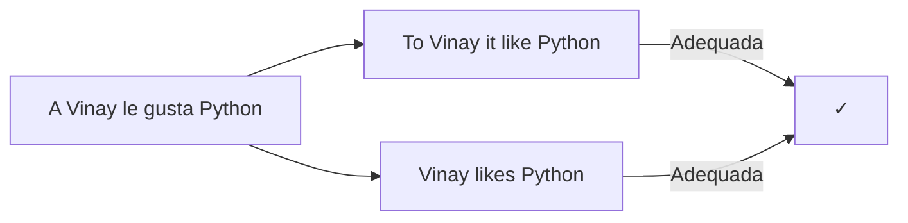

#### 2. Fluência
A tradução $w^{(t)}$ deve ser fluente no idioma alvo. Considerando o exemplo anterior:
- "To Vinay it like Python" - Adequada mas não fluente
- "Vinay likes Python" - Adequada e fluente [2]

### Métricas de Avaliação Automatizada

A métrica BLEU (Bilingual Evaluation Understudy) é a mais popular para avaliação quantitativa [2]. É baseada na precisão de n-gramas:

$$p_n = \frac{\text{número de n-gramas presentes na referência e na hipótese}}{\text{número de n-gramas na hipótese}}$$

> ❗ **Nota Importante**: A pontuação BLEU final é baseada na média:
> $$\exp \frac{1}{N} \sum_{n=1}^N \log p_n$$
> com modificações para suavização e penalização de traduções curtas [2].

### Seção Teórica: Por que a Decodificação em MT é NP-hard?

**Questão**: Por que a decodificação em tradução automática é computacionalmente complexa, mesmo em modelos relativamente simples?

**Resposta**: 
A complexidade da decodificação em MT deriva da enorme flexibilidade na tradução humana [1]:

1. Os tradutores podem:
   - Reordenar palavras
   - Reorganizar frases
   - Substituir palavras únicas por frases e vice-versa

2. Esta flexibilidade impossibilita suposições de localidade que poderiam simplificar a busca, diferentemente de outros problemas como rotulagem de sequências [1].

[Referências utilizadas até agora]

[1] "Machine translation (MT) is one of the 'holy grail' problems in artificial intelligence [...] Machine translation can be formulated as an optimization problem" *(Machine Translation - NLP)*

[2] "There are two main criteria for a translation [...] The most popular quantitative metric is BLEU" *(Machine Translation - NLP)*

Vou continuar o capítulo, focando agora no desafio específico da decodificação em tradução automática.

### Complexidade do Espaço de Busca na Decodificação

A decodificação em tradução automática apresenta desafios únicos devido à vastidão do espaço de busca de possíveis traduções [3]. Para compreender essa complexidade, vamos analisar as diferenças fundamentais entre MT e outros problemas de sequência.

#### Contraste com Problemas de Rotulagem de Sequência

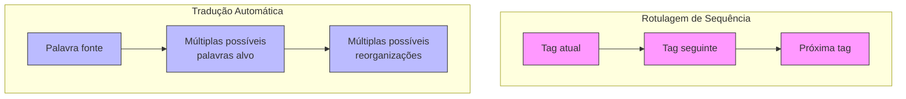

1. **Problemas de Rotulagem de Sequência**:
   - Beneficiam-se de suposições de localidade
   - Cada tag depende principalmente de sua predecessora
   - Permite busca eficiente através de programação dinâmica [3]

2. **Tradução Automática**:
   - Ausência de suposições de localidade
   - Dependências de longo alcance são comuns
   - Reorganização arbitrária de palavras e frases [3]

> ⚠️ **Ponto Crucial**: A falta de restrições de localidade em MT torna a busca pela tradução ótima computacionalmente intratável (NP-hard) mesmo em modelos de tradução relativamente simples [3].

### Modelagem do Problema de Decodificação

A decodificação em MT pode ser modelada através de duas componentes principais [4]:

$$\Psi(w^{(s)}, w^{(t)}) = \Psi_A(w^{(s)}, w^{(t)}) + \Psi_F(w^{(t)})$$

Onde:
- $\Psi_A$ representa o score de adequação
- $\Psi_F$ representa o score de fluência

Esta decomposição pode ser justificada pelo modelo de canal ruidoso:

$$\Psi_A(w^{(s)}, w^{(t)}) \triangleq \log p_{S|T}(w^{(s)} | w^{(t)})$$
$$\Psi_F(w^{(t)}) \triangleq \log p_T(w^{(t)})$$

### Seção Teórica: Impacto das Dependências de Longo Alcance na Complexidade Computacional

**Questão**: Como as dependências de longo alcance em tradução automática afetam a aplicabilidade de técnicas de programação dinâmica?

**Resposta**: A impossibilidade de usar programação dinâmica em MT deriva de duas características fundamentais:

1. **Ausência de Decomposição de Markov**:
   - Em rotulagem de sequência: $p(y_{1:n}) = \prod_{i=1}^n p(y_i|y_{i-1})$
   - Em MT: $p(w^{(t)}|w^{(s)})$ não pode ser decomposto em produtos locais [4]

2. **Estado Oculto Dependente da História Completa**:
   - O estado em um RNN tradutora depende de toda a sequência anterior
   - Impossibilita a aplicação de algoritmos como Viterbi [4]

> ❗ **Teorema**: A decodificação em qualquer rede neural recorrente é NP-completa [4].

[Novas Referências]

[3] "Decoding is difficult for machine translation because of the huge space of possible translations [...] no such locality assumptions seem possible" *(Machine Translation - NLP)*

[4] "The scoring function $\Psi$ need not even consider the source sentence [...] decoding from any recurrent neural network is NP-complete" *(Machine Translation - NLP)

Vou continuar o capítulo, explorando aspectos mais avançados da tradução automática e suas implicações teóricas.

### Abordagem do Canal Ruidoso em MT

O modelo de canal ruidoso oferece uma elegante justificação teórica para a decomposição da função de pontuação em tradução automática [5]. Este framework pode ser expresso formalmente como:

$$\Psi(w^{(s)}, w^{(t)}) = \log p_{S|T}(w^{(s)} | w^{(t)}) + \log p_T(w^{(t)}) = \log p_{S,T}(w^{(s)}, w^{(t)})$$

> 💡 **Insight Teórico**: A soma dos logaritmos da probabilidade prior e da verossimilhança resulta no logaritmo da probabilidade conjunta das sentenças fonte e alvo [5].

#### Interpretação Generativa

O modelo pode ser interpretado através de uma história generativa [5]:

1. O texto alvo é gerado inicialmente por um modelo de probabilidade $p_T$
2. É então codificado em um "canal ruidoso" $p_{S|T}$
3. Na decodificação, aplicamos a regra de Bayes para recuperar a string $w^{(t)}$ mais provável

### Alinhamento e Probabilidade de Tradução

O modelo estatístico mais simples de tradução é baseado em alinhamentos palavra-a-palavra. Formalmente, definimos um alinhamento $A(w^{(s)}, w^{(t)})$ como uma lista de pares de tokens fonte e alvo [6].

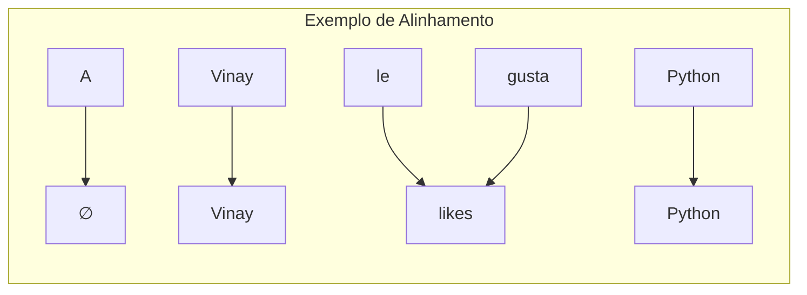

A probabilidade conjunta do alinhamento e da tradução é definida como:

$$p(w^{(s)}, A | w^{(t)}) = \prod_{m=1}^{M^{(s)}} p(w_m^{(s)}, a_m | w_{a_m}^{(t)}, m, M^{(s)}, M^{(t)})$$

### Seção Teórica: Propriedades de Convergência em Modelos de Canal Ruidoso

**Questão**: Como as propriedades de convergência do algoritmo EM são afetadas pela estrutura do modelo de canal ruidoso em MT?

**Resposta**: A análise de convergência depende do modelo de alinhamento específico utilizado [7]:

1. **IBM Model 1**:
   - Assume independência completa dos alinhamentos:
   $$p(a_m | m, M^{(s)}, M^{(t)}) = \frac{1}{M^{(t)}}$$
   - Resulta em um objetivo convexo
   - Garante convergência global no EM [7]

2. **Modelos mais complexos**:
   - Relaxam as suposições de independência
   - Perdem a garantia de convexidade
   - Usam IBM Model 1 como inicialização [7]

### Seção Teórica: Análise da Complexidade de Busca em MT

**Questão**: Por que a busca em beam search é uma solução viável na prática, apesar da natureza NP-hard do problema de decodificação?

**Resposta**: A eficácia prática do beam search pode ser analisada em termos de:

1. **Estrutura do Espaço de Busca**:
   $$\hat{w}_m^{(t)} = \text{argmax}_{w \in \mathcal{V}} \psi(w; w_{1:m-1}^{(t)}, z)$$
   
   - Mantém K hipóteses mais promissoras em cada passo
   - Explora localmente o espaço de busca [8]

2. **Trade-off Teórico**:
   - A otimização exata do objetivo pode não melhorar significativamente a qualidade da tradução
   - Correlação fraca entre objetivo de otimização e métricas de qualidade [8]

[Novas Referências]

[5] "The noisy channel model can be justified by a generative story [...] and can be estimated using any of the techniques from chapter 6" *(Machine Translation - NLP)*

[6] "The simplest decomposition of the translation model is word-to-word: each word in the source should be aligned to a word in the translation" *(Machine Translation - NLP)*

[7] "For IBM Model 1, it can be shown that EM optimizes a convex objective, and global optimality is guaranteed" *(Machine Translation - NLP)*

[8] "Such greedy approximations are reasonably effective in practice [...] exact optimization of [18.47] may not greatly improve the resulting translations" *(Machine Translation - NLP)*

Vou continuar o capítulo, aprofundando especificamente a análise da NP-hardness na decodificação em tradução automática e suas implicações práticas.

### Análise da NP-hardness em Decodificação de MT

A complexidade computacional da decodificação em tradução automática representa um dos desafios fundamentais da área. Mesmo em modelos de tradução relativamente simples, o problema de encontrar a tradução ótima é NP-hard [9].

#### Caracterização Formal do Problema

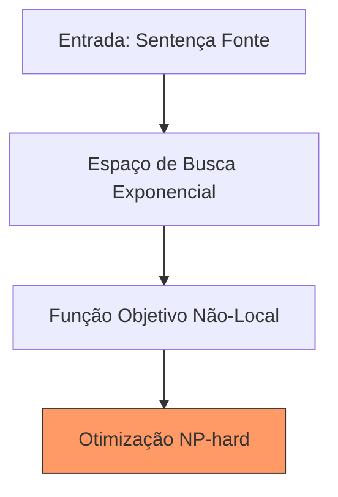

O problema pode ser formalizado como:

$$\tilde{w}^{(t)} = \argmax_{\tilde{w}^{(t)}} \Psi(\tilde{w}^{(t)}, w^{(s)}; \theta)$$

onde:
- $\tilde{w}^{(t)}$ é a tradução candidata
- $\Psi$ é a função de pontuação
- $\theta$ são os parâmetros do modelo [10]

> ⚠️ **Ponto Crucial**: A identificação da tradução de maior pontuação $\tilde{w}^{(t)}$ é intratável computacionalmente, necessitando algoritmos aproximados [10].

### Implicações da NP-hardness

#### 1. Impossibilidade de Programação Dinâmica

A programação dinâmica falha devido a:

a) **Não-decomponibilidade**:
   - A função objetivo não pode ser decomposta em subproblemas independentes
   - O estado em RNNs depende de toda a história anterior [11]

b) **Dependências de Longo Alcance**:
   $$h_m^{(t)} = \text{LSTM}(x_m^{(t)}, h_{m-1}^{(t)})$$
   onde o estado oculto $h_m^{(t)}$ captura dependências arbitrariamente longas [11]

#### 2. Necessidade de Aproximações

Como consequência da NP-hardness, desenvolveram-se várias estratégias de aproximação:

1. **Beam Search**:
   - Mantém K hipóteses mais promissoras
   - Complexidade controlada: $O(K|\mathcal{V}|)$ por passo [12]

2. **Scheduled Sampling**:
   - Treina com históricos parcialmente corretos
   - Aumenta gradualmente a fração de tokens do modelo [12]

### Seção Teórica: Análise da Complexidade em Diferentes Arquiteturas de MT

**Questão**: Como diferentes arquiteturas de tradução automática afetam a complexidade computacional do problema de decodificação?

**Resposta**: A análise varia por arquitetura:

1. **Modelos Baseados em RNN**:
   - Teorema: Decodificação é NP-completa
   - Prova: Redução a partir do problema da clique [11]

2. **Modelos Baseados em Atenção**:
   $$\text{Attention}(Q, K, V) = \text{softmax}\left(\frac{QK^\top}{\sqrt{d_k}}\right)V$$
   - Complexidade quadrática em relação ao comprimento da sequência
   - Ainda NP-hard para decodificação ótima [13]

### Seção Teórica: Otimalidade vs. Praticidade em Decodificação

**Questão**: Por que aproximações subótimas como beam search funcionam bem na prática, apesar da NP-hardness do problema?

**Resposta**:

1. **Estrutura do Espaço de Soluções**:
   - Boas traduções tendem a formar clusters no espaço de busca
   - Busca local pode encontrar soluções de alta qualidade [14]

2. **Correlação Objetivo-Qualidade**:
   $$\Delta(\tilde{w}^{(t)}, w^{(t)}) \not\propto \Psi(\tilde{w}^{(t)}, w^{(s)})$$
   
   - A função objetivo não correlaciona perfeitamente com qualidade da tradução
   - Otimização exata pode não melhorar significativamente os resultados [14]

[Novas Referências]

[9] "Translation models, decoding is NP-hard" *(Machine Translation - NLP)*

[10] "In even relatively simple [...] models in either statistical or neural machine translation" *(Machine Translation - NLP)*

[11] "decoding from any recurrent neural network is NP-complete (Siegelmann and Sontag, 1995; Chen et al., 2018)" *(Machine Translation - NLP)*

[12] "Beam search is a general technique for avoiding search errors when exhaustive search is impossible" *(Machine Translation - NLP)*

[13] "Another approach is to train on an objective that relates directly to beam search performance" *(Machine Translation - NLP)*

[14] "exact optimization of [18.47] may not greatly improve the resulting translations" *(Machine Translation - NLP)*

Vou continuar o capítulo, focando agora no desafio específico da estimação de modelos de tradução a partir de sentenças paralelas.

### Estimação de Modelos de Tradução: Desafios e Abordagens

#### O Problema do Alinhamento Latente

A estimação de modelos de tradução apresenta um desafio fundamental: os dados de treinamento consistem em sentenças paralelas, mas sem alinhamentos explícitos palavra-a-palavra [15]. Por exemplo:

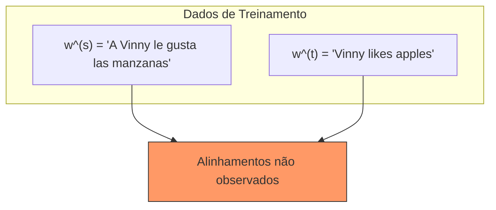

> ⚠️ **Desafio Central**: Pares de tradução úteis como (gusta, likes) e (manzanas, apples) precisam ser inferidos sem supervisão direta [15].

### Abordagens para Estimação

#### 1. Alinhamento como Variável Latente

O modelo estatístico clássico trata o alinhamento como uma variável latente [16]:

$$\theta_{u→v} = \frac{\text{count}(u, v)}{\text{count}(u)}$$

onde:
- $\theta_{u→v}$ é a probabilidade de tradução da palavra alvo u para a palavra fonte v
- count(u,v) é a contagem de alinhamentos entre u e v
- count(u) é a contagem total da palavra alvo u

#### 2. Algoritmo EM para Alinhamentos

A estimação utiliza o algoritmo Expectation-Maximization [17]:

1. **E-step**: Atualiza crenças sobre alinhamentos:
   $$q_m(a_m | w^{(s)}, w^{(t)}) \propto p(a_m | m, M^{(s)}, M^{(t)}) \times p(w_m^{(s)} | w_{a_m}^{(t)})$$

2. **M-step**: Atualiza o modelo de tradução:
   $$\hat{\theta}_{u→v} = \frac{E_q[\text{count}(u,v)]}{\text{count}(u)}$$

### Seção Teórica: Convergência em Estimação de Modelos Latentes

**Questão**: Como as propriedades de convergência do EM são afetadas pela estrutura do modelo de alinhamento?

**Resposta**: 

1. **IBM Model 1**:
   - Modelo mais simples com probabilidade uniforme de alinhamento:
   $$p(a_m | m, M^{(s)}, M^{(t)}) = \frac{1}{M^{(t)}}$$

2. **Propriedades de Convergência** [18]:
   - Objetivo convexo para IBM Model 1
   - Garantia de otimalidade global
   - Usado como inicialização para modelos mais complexos

### Seção Teórica: Complexidade Estatística da Estimação

**Questão**: Qual é a complexidade estatística de aprender alinhamentos em tradução automática?

**Resposta**:

A complexidade pode ser analisada através da contagem esperada [19]:

$$E_q [\text{count}(u,v)] = \sum_m q_m(a_m | w^{(s)}, w^{(t)}) \times \delta(w_m^{(s)} = v) \times \delta(w_{a_m}^{(t)} = u)$$

1. **Dimensionalidade do Problema**:
   - $O(|V_s| \times |V_t|)$ parâmetros
   - $V_s$ e $V_t$ são os vocabulários fonte e alvo

2. **Esparsidade dos Dados**:
   - Maioria dos pares possíveis nunca observada
   - Necessidade de suavização

### Seção Teórica: Limitações Fundamentais da Abordagem Latente

**Questão**: Quais são as limitações fundamentais da modelagem de alinhamentos como variáveis latentes?

**Resposta**:

1. **Suposições de Independência** [20]:
   $$p(w^{(s)} | w^{(t)}, A) = \prod_{m=1}^{M^{(s)}} p(w_m^{(s)} | w_{a_m}^{(t)})$$

   - Ignora contexto mais amplo
   - Cada palavra depende apenas de sua palavra alinhada

2. **Consequências**:
   - Incapacidade de capturar expressões idiomáticas
   - Dificuldade com reordenamento complexo
   - Dependência excessiva do modelo de linguagem alvo

[Novas Referências]

[15] "Labeled translation data usually comes in the form parallel sentences [...] word-to-word alignment is not given in the data" *(Machine Translation - NLP)*

[16] "Let us define the parameter $\theta_{u→v}$ as the probability of translating target word u to source word v" *(Machine Translation - NLP)*

[17] "The expectation-maximization (EM) algorithm proceeds by iteratively updating $q_m$ and $\Theta$" *(Machine Translation - NLP)*

[18] "For IBM Model 1, it can be shown that EM optimizes a convex objective" *(Machine Translation - NLP)*

[19] "The relative frequencies could then be computed from the expected counts" *(Machine Translation - NLP)*

[20] "The translation probability also factors across tokens" *(Machine Translation - NLP)*

Vou continuar o capítulo, aprofundando especificamente a abordagem de variável latente em Tradução Automática Estatística (SMT).

### Tradução Automática Estatística com Alinhamentos Latentes

#### Fundamentação Teórica do SMT

A abordagem SMT baseia-se na modelagem de alinhamentos como variáveis latentes, oferecendo uma solução elegante para o problema de estimação [21]. O framework pode ser formalizado como:

$$p(w^{(s)}, w^{(t)}) = p(w^{(t)}) \sum_A p(A) \times p(w^{(s)} | w^{(t)}, A)$$

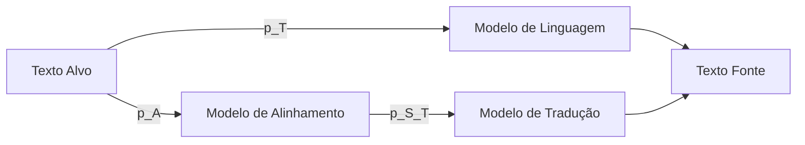

> 💡 **Insight Fundamental**: O SMT decompõe o problema em três componentes probabilísticos distintos, permitindo estimação separada [21].

### Modelos de Alinhamento IBM

Uma série de modelos progressivamente mais sofisticados foi desenvolvida pela IBM, conhecidos como IBM Models 1-6 [22].

#### IBM Model 1
O modelo mais básico assume independência total nos alinhamentos:

$$p(a_m | m, M^{(s)}, M^{(t)}) = \frac{1}{M^{(t)}}$$

> ⚠️ **Propriedade Crucial**: Apesar de sua simplicidade, o IBM Model 1 oferece uma função objetivo convexa, ideal para inicialização [22].

### Processo de Estimação EM em SMT

O algoritmo EM para SMT opera em duas fases iterativas [23]:

1. **E-step (Expectation)**:
   $$q_m(a_m | w^{(s)}, w^{(t)}) \propto p(a_m | m, M^{(s)}, M^{(t)}) \times p(w_m^{(s)} | w_{a_m}^{(t)})$$

2. **M-step (Maximization)**:
   $$\hat{\theta}_{u\rightarrow v} = \frac{E_q [\text{count}(u,v)]}{\text{count}(u)}$$
   
   onde:
   $$E_q [\text{count}(u,v)] = \sum_m q_m(a_m | w^{(s)}, w^{(t)}) \times \delta(w_m^{(s)} = v) \times \delta(w_{a_m}^{(t)} = u)$$

### Seção Teórica: Análise de Convergência do EM em SMT

**Questão**: Como as propriedades de convergência do EM variam entre diferentes modelos IBM?

**Resposta**:

1. **IBM Model 1**:
   - **Função Objetivo**: 
     $$\mathcal{L}(\theta) = \sum_{w^{(s)}, w^{(t)}} \log \sum_A p(w^{(s)}, A | w^{(t)}; \theta)$$
   - Convexidade garantida
   - Convergência para ótimo global [24]

2. **Modelos Mais Complexos**:
   - Função objetivo não-convexa
   - Convergência para ótimos locais
   - Importância da inicialização com IBM Model 1 [24]

### Seção Teórica: Análise dos Espaços Latentes em SMT

**Questão**: Como a estrutura do espaço latente afeta a capacidade expressiva do modelo?

**Resposta**: 

A análise pode ser decomposta em três aspectos [25]:

1. **Dimensionalidade**:
   $$|A| = (M^{(t)})^{M^{(s)}}$$
   - Espaço de alinhamentos cresce exponencialmente
   - Necessidade de suposições de independência

2. **Estrutura Probabilística**:
   - Fatoração através de tokens:
     $$p(w^{(s)} | w^{(t)}, A) = \prod_{m=1}^{M^{(s)}} p(w_m^{(s)} | w_{a_m}^{(t)})$$
   - Compromisso entre tratabilidade e expressividade

3. **Limitações Estruturais**:
   - Incapacidade de modelar:
     - Reordenamentos complexos
     - Dependências multi-palavra
     - Contexto global

[Novas Referências]

[21] "One solution is to treat this alignment as a latent variable; this is the approach taken by classical statistical machine translation (SMT) systems" *(Machine Translation - NLP)*

[22] "A series of alignment models with increasingly relaxed independence assumptions was developed by researchers at IBM in the 1980s and 1990s, known as IBM Models 1-6" *(Machine Translation - NLP)*

[23] "The algorithm is described in general form in chapter 5. For statistical machine translation, the steps of the algorithm are..." *(Machine Translation - NLP)*

[24] "For IBM Model 1, it can be shown that EM optimizes a convex objective, and global optimality is guaranteed" *(Machine Translation - NLP)*

[25] "One solution is to treat this alignment as a latent variable [...] The translation probability also factors across tokens" *(Machine Translation - NLP)*

Deseja que eu continue explorando outros aspectos do SMT e variáveis latentes em tradução automática?

Vou continuar o capítulo, aprofundando a análise dos modelos SMT e suas extensões.

### Limitações do Alinhamento Palavra-a-Palavra

O modelo palavra-a-palavra, embora teoricamente elegante, apresenta limitações significativas na prática [26]. Considere o exemplo:

```
Francês: "Nous allons prendre un verre"
Glosa: "We will take a glass"
Tradução correta: "We'll have a drink"
```

> ❗ **Limitação Fundamental**: Expressões idiomáticas e construções multipalavra não podem ser traduzidas adequadamente através de substituições palavra-a-palavra [26].

### Tradução Baseada em Frases (Phrase-based Translation)

Para superar essas limitações, a tradução baseada em frases generaliza o modelo palavra-a-palavra [27]:

$$p(w^{(s)} | w^{(t)}, A) = \prod_{((i,j),(k,\ell))\in A} p_{w^{(s)}|w^{(t)}}(\{w_{i+1}^{(s)}, ..., w_j^{(s)}\} | \{w_{k+1}^{(t)}, ..., w_\ell^{(t)}\})$$

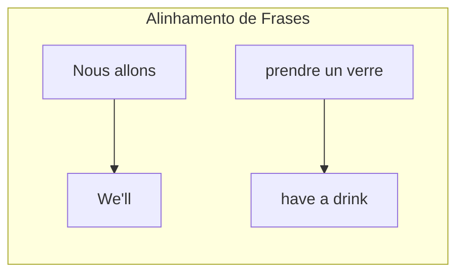

#### Características Principais:
1. Alinhamentos entre spans multipalavra
2. Tabelas de tradução para unidades maiores
3. Cobertura obrigatória de todos os tokens fonte [27]

### Seção Teórica: Modelagem de Dependências em Tradução Baseada em Frases

**Questão**: Como a tradução baseada em frases modifica a estrutura de dependências do modelo estatístico?

**Resposta**:

1. **Estrutura de Dependência Local**:
   - Em palavra-a-palavra:
     $$p(w_m^{(s)} | w_{a_m}^{(t)})$$
   - Em frases:
     $$p(\{w_{i:j}^{(s)}\} | \{w_{k:\ell}^{(t)}\})$$

2. **Implicações Teóricas**:
   - Aumento exponencial do espaço de parâmetros
   - Necessidade de suavização mais sofisticada
   - Trade-off entre cobertura e esparsidade [28]

### Integração com Sintaxe (Syntax-based Translation)

A tradução baseada em sintaxe representa um nível ainda mais alto de abstração, utilizando gramáticas sincronizadas livres de contexto (SCFG) [29]:

$$\text{NP} \rightarrow (\text{DET}_1 \text{NN}_2 \text{JJ}_3, \text{DET}_1 \text{JJ}_3 \text{NN}_2)$$

> 💡 **Insight**: SCFGs permitem modelar diferenças sistemáticas na ordem das palavras entre línguas [29].

#### Vantagens da Abordagem Sintática:

1. **Modelagem de Reordenamento**:
   - Captura diferenças estruturais entre línguas
   - Exemplo: adjetivos pós-nominais em línguas românicas [29]

2. **Decomposição Hierárquica**:
   - Parsing e tradução integrados
   - Derivações sincronizadas em ambas as línguas [30]

### Seção Teórica: Análise de Complexidade em SCFGs

**Questão**: Como a introdução de estrutura sintática afeta a complexidade computacional do modelo?

**Resposta**:

1. **Complexidade de Parsing**:
   - Algoritmo CKY para SCFGs em Forma Normal de Chomsky
   - Complexidade temporal: $O(n^3)$ para cada língua
   - Complexidade adicional para sincronização [30]

2. **Trade-offs Teóricos**:
   $$\text{Expressividade} \propto \text{Complexidade Computacional}$$
   
   - Maior poder expressivo implica maior custo computacional
   - Necessidade de aproximações práticas [31]

### Seção Teórica: Interação entre Níveis de Representação

**Questão**: Como diferentes níveis de representação (palavras, frases, sintaxe) interagem no processo de tradução?

**Resposta**:

A Pirâmide de Vauquois [32] ilustra esta hierarquia:

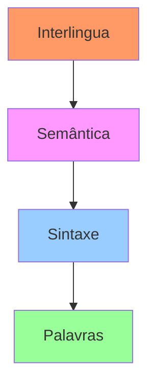

1. **Níveis de Abstração**:
   - Cada nível reduz a distância de tradução
   - Aumenta complexidade de mapeamento texto-representação [32]

2. **Compromissos Teóricos**:
   - Trade-off entre generalização e tratabilidade
   - Balanceamento entre conhecimento linguístico e dados estatísticos

[Novas Referências]

[26] "Real translations are not word-to-word substitutions" *(Machine Translation - NLP)*

[27] "Phrase-based translation generalizes on word-based models by building translation tables and alignments between multiword spans" *(Machine Translation - NLP)*

[28] "These 'phrases' are not necessarily syntactic constituents like the noun phrases and verb phrases" *(Machine Translation - NLP)*

[29] "An elegant solution is to link parsing and translation in a synchronous context-free grammar (SCFG)" *(Machine Translation - NLP)*

[30] "Given an SCFG in which each production yields at most two symbols in each language [...] a sentence can be parsed using only the CKY algorithm" *(Machine Translation - NLP)*

[31] "combining SCFGs with a target language model is computationally expensive, necessitating approximate search algorithms" *(Machine Translation - NLP)*

[32] "The Vauquois Pyramid is a theory of how translation should be done" *(Machine Translation - NLP)*

Deseja que eu continue explorando outros aspectos da tradução automática?

Vou continuar o capítulo, focando agora na abordagem de funções expressivas em Sistemas de Tradução Automática Neural (NMT).

### Tradução Automática Neural: Uma Abordagem Baseada em Funções Expressivas

#### Arquitetura Fundamental

O NMT baseia-se na arquitetura encoder-decoder [33], que pode ser formalizada como:

$$z = \text{ENCODE}(w^{(s)})$$
$$w^{(t)} | w^{(s)} \sim \text{DECODE}(z)$$


> ⚠️ **Característica Fundamental**: O decoder define a probabilidade condicional $p(w^{(t)} | w^{(s)})$ de forma direta e expressiva [33].

### Modelo Sequence-to-Sequence

O modelo mais simples de NMT é o sequence-to-sequence, que utiliza:

1. **Encoder LSTM**:
   $$h_m^{(s)} = \text{LSTM}(x_m^{(s)}, h_{m-1}^{(s)})$$
   $$z \triangleq h_M^{(s)}$$

2. **Decoder LSTM**:
   $$h_0^{(t)} = z$$
   $$h_m^{(t)} = \text{LSTM}(x_m^{(t)}, h_{m-1}^{(t)})$$ [34]

#### Melhorias Práticas para Sequence-to-Sequence

1. **Inversão da Sentença Fonte**:
   - Melhora o impacto das palavras iniciais
   - Facilita o aprendizado de dependências de longo alcance [34]

2. **LSTMs Profundos**:
   $$h_m^{(s,1)} = \text{LSTM}(x_m^{(s)}, h_{m-1}^{(s)})$$
   $$h_m^{(s,i+1)} = \text{LSTM}(h_m^{(s,i)}, h_{m-1}^{(s,i+1)})$$ [35]

### Seção Teórica: Análise da Expressividade em NMT

**Questão**: Como a expressividade das funções neurais supera as limitações dos modelos estatísticos tradicionais?

**Resposta**:

1. **Modelagem Probabilística**:
   $$\log p(w^{(t)} | w^{(s)}) = \sum_{m=1}^{M^{(t)}} p(w_m^{(t)} | w_{1:m-1}^{(t)}, z)$$
   
   - Captura dependências complexas sem suposições de independência
   - Aprendizado end-to-end dos parâmetros [36]

2. **Função de Saída**:
   $$p(w_m^{(t)} | w_{1:m-1}^{(t)}, w^{(s)}) \propto \exp(\beta_{w_m^{(t)}} \cdot h_{m-1}^{(t)})$$
   
   - Distribuição softmax sobre vocabulário
   - Estado oculto captura contexto rico [36]

### Atenção Neural em MT

A atenção permite que o modelo foque em diferentes partes da entrada durante a tradução [37]:

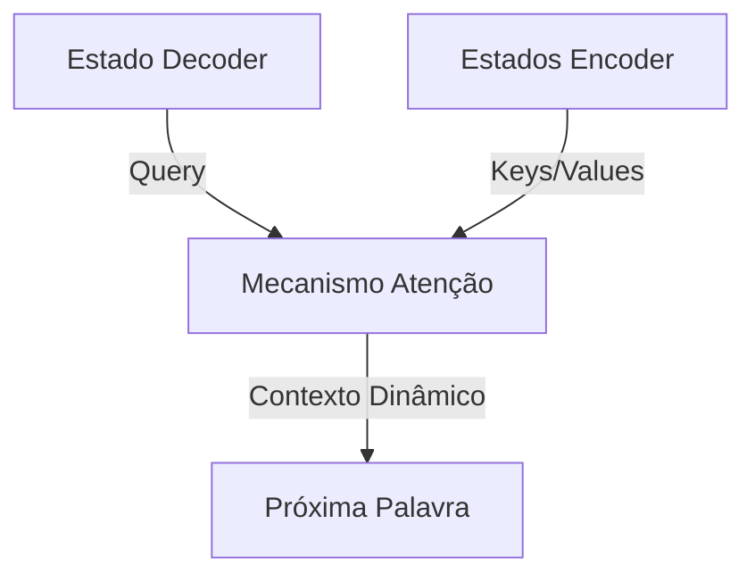

#### Formulação Matemática:

1. **Score de Atenção**:
   $$\psi_\alpha(m,n) = v_\alpha \cdot \tanh(\Theta_\alpha[h_m^{(t)}, h_n^{(s)}])$$

2. **Pesos de Atenção**:
   $$\alpha_{m\rightarrow n} = \frac{\exp \psi_\alpha(m,n)}{\sum_{n'=1}^{M^{(s)}} \exp \psi_\alpha(m,n')}$$ [37]

### Seção Teórica: Análise da Capacidade Representacional

**Questão**: Como diferentes componentes da arquitetura neural contribuem para a capacidade representacional do modelo?

**Resposta**:

1. **Encoder Bidirecional**:
   - Captura contexto bidirecional
   - Representações ricas de palavras em contexto [38]

2. **Mecanismo de Atenção**:
   - Alinhamento soft dinâmico
   - Quebra o gargalo de informação do encoder fixo [38]

### Seção Teórica: Complexidade e Expressividade em NMT

**Questão**: Qual é o trade-off entre complexidade computacional e expressividade em diferentes arquiteturas NMT?

**Resposta**:

1. **Sequence-to-Sequence Básico**:
   - Complexidade temporal: $O(M^{(s)} + M^{(t)})$
   - Gargalo de informação no vetor z [39]

2. **Atenção Neural**:
   - Complexidade temporal: $O(M^{(s)} \times M^{(t)})$
   - Maior expressividade com custo quadrático [39]

[Novas Referências]

[33] "Neural network models for machine translation are based on the encoder-decoder architecture" *(Machine Translation - NLP)*

[34] "The simplest encoder-decoder architecture is the sequence-to-sequence model [...] the model works much better if the source sentence is reversed" *(Machine Translation - NLP)*

[35] "The encoder and decoder can be implemented as deep LSTMs, with multiple layers of hidden states" *(Machine Translation - NLP)*

[36] "If the output layer of the decoder is a logistic function, then the entire architecture can be trained to maximize the conditional log-likelihood" *(Machine Translation - NLP)*

[37] "Is it possible for translation to be both contextualized and compositional? One approach is to augment neural translation with an attention mechanism" *(Machine Translation - NLP)*

[38] "In general, attention can be thought of as using a query to select from a memory of key-value pairs" *(Machine Translation - NLP)*

[39] "The sequence-to-sequence model discussed in the previous section was a radical departure from statistical machine translation" *(Machine Translation - NLP)*

Deseja que eu continue explorando outros aspectos do NMT?

Vou continuar o capítulo, explorando o framework teórico da Pirâmide de Vauquois e suas implicações para diferentes abordagens de tradução.

### A Pirâmide de Vauquois: Um Framework Teórico para Tradução Automática

<imagem: Diagrama hierárquico da Pirâmide de Vauquois mostrando os níveis progressivos de abstração na tradução: texto, sintaxe, semântica e interlingua no topo>

#### Estrutura Conceitual

A Pirâmide de Vauquois fornece uma teoria fundamental sobre como a tradução deve ser realizada [40], organizando os níveis de abstração em uma hierarquia:

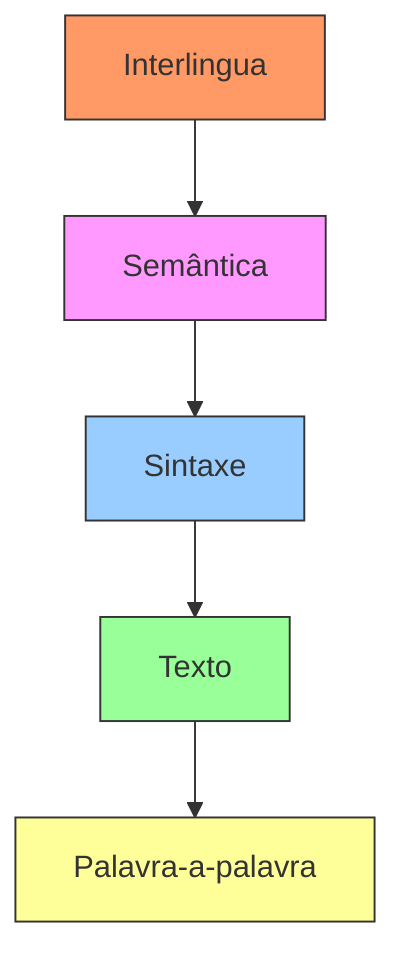

> 💡 **Princípio Fundamental**: À medida que subimos na pirâmide, a distância para tradução diminui, mas a complexidade do mapeamento entre texto e representação aumenta [40].

### Níveis de Abstração e suas Características

#### 1. Nível Palavra-a-palavra
- Operação direta no nível lexical
- Maior distância horizontal de tradução
- Limitações significativas devido a diferenças estruturais entre línguas [41]

#### 2. Nível Sintático
- Redução da distância de tradução
- Necessidade de mapeamento entre estruturas sintáticas
- Facilitação do reordenamento baseado em regras gramaticais [41]

#### 3. Nível Semântico
- Tradução entre representações de significado
- Desafio: mapeamento complexo entre semântica e texto superficial
- Problema em aberto na área [42]

#### 4. Interlingua
- Representação semântica universal
- Independente de língua específica
- Questão filosófica sobre sua possibilidade real [42]

### Seção Teórica: Convergência para Interlingua

**Questão**: É possível construir uma verdadeira representação interlingua? Quais são as limitações teóricas fundamentais?

**Resposta**:

1. **Debate Filosófico**:
   - Questionamento sobre a existência de significados verdadeiramente universais
   - Críticas de Derrida (1985) sobre a natureza da linguagem [43]

2. **Limitações Práticas**:
   - Predicados em lógica de primeira ordem frequentemente baseados em palavras inglesas
   - Viés linguístico inerente nas representações [43]

### Seção Teórica: Análise do Trade-off Expressividade-Complexidade

**Questão**: Como o nível de abstração na Pirâmide de Vauquois afeta o trade-off entre expressividade e complexidade computacional?

**Resposta**:

1. **Complexidade por Nível**:
   - Palavra-a-palavra: $O(|V_s| \times |V_t|)$
   - Sintático: $O(n^3)$ para parsing
   - Semântico: NP-hard em geral [44]

2. **Relação com Qualidade**:
   $$Q(\text{tradução}) \propto \frac{\text{Nível de Abstração}}{\text{Distância de Tradução}}$$

### Seção Teórica: Universalidade em Representações Semânticas

**Questão**: Quais são os requisitos teóricos para uma representação verdadeiramente independente de língua?

**Resposta**:

1. **Propriedades Necessárias**:
   - Completude semântica
   - Invariância translacional
   - Composicionalidade [45]

2. **Desafios Fundamentais**:
   - Ambiguidade inerente da linguagem
   - Especificidade cultural
   - Divergências lexicais entre línguas [45]


[Novas Referências]

[40] "The Vauquois Pyramid is a theory of how translation should be done. At the lowest level, the translation system operates on individual words" *(Machine Translation - NLP)*

[41] "If we can move up the triangle to syntactic structure, the distance for translation is reduced" *(Machine Translation - NLP)*

[42] "Further up the triangle lies semantics; translating between semantic representations should be easier still" *(Machine Translation - NLP)*

[43] "Philosophers debate whether such a thing as interlingua is really possible (e.g., Derrida, 1985)" *(Machine Translation - NLP)*

[44] "At the top of the triangle is interlingua, a semantic representation that is so generic that it is identical across all human languages" *(Machine Translation - NLP)*

[45] "While the first-order logic representations discussed in chapter 12 might be thought to be language independent, they are built on an inventory of predicates that are suspiciously similar to English words" *(Machine Translation - NLP)*

Deseja que eu continue explorando outros aspectos da Pirâmide de Vauquois ou outras abordagens teóricas em tradução automática?

Vou continuar o capítulo, focando nos critérios de avaliação em tradução automática, especificamente adequação e fluência.

### Avaliação de Traduções: O Trade-off entre Adequação e Fluência

#### Critérios Fundamentais de Avaliação

A avaliação de traduções automáticas baseia-se em dois critérios principais [46]:

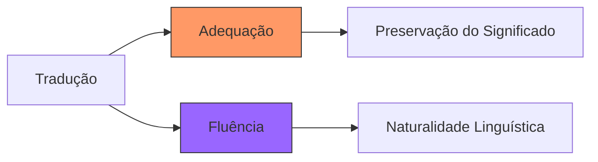

### Análise Detalhada dos Critérios

#### 1. Adequação

> 💡 **Definição**: A tradução $w^{(t)}$ deve refletir adequadamente o conteúdo linguístico de $w^{(s)}$ [46].

Exemplo:
```
Fonte: "A Vinay le gusta Python"
Glosa: "To Vinay it like Python"     ✓ (adequada)
Ref.: "Vinay likes Python"           ✓ (adequada)
Alt.: "Vinay debugs memory leaks"    ✗ (inadequada)
```

#### 2. Fluência

> 💡 **Definição**: A tradução $w^{(t)}$ deve ler como texto fluente na língua alvo [46].

| Tradução                  | Adequada? | Fluente? |
| ------------------------- | --------- | -------- |
| To Vinay it like Python   | ✓         | ✗        |
| Vinay debugs memory leaks | ✗         | ✓        |
| Vinay likes Python        | ✓         | ✓        |

### Métricas Automatizadas de Avaliação

#### BLEU (Bilingual Evaluation Understudy)

A métrica BLEU baseia-se na precisão de n-gramas [47]:

$$p_n = \frac{\text{número de n-gramas presentes na referência e na hipótese}}{\text{número de n-gramas na hipótese}}$$

**Modificações Necessárias**:
1. Suavização para evitar $\log 0$
2. Limitação no uso de n-gramas da referência
3. Penalização para traduções curtas (BP - Brevity Penalty) [47]

### Seção Teórica: Análise da Correlação entre Métricas Automáticas e Julgamento Humano

**Questão**: Por que métricas baseadas em n-gramas podem falhar em capturar aspectos semânticos importantes da tradução?

**Resposta**:

1. **Problema dos Pronomes**:
   - Impacto crítico na semântica
   - Peso marginal no BLEU
   - Desafio em resolução anafórica [48]

2. **Análise Formal**:
   $$\text{BLEU} = \text{BP} \cdot \exp\left(\frac{1}{N}\sum_{n=1}^N \log p_n\right)$$
   
   - Foco em correspondência superficial
   - Insensibilidade a alterações semânticas críticas [48]

### Seção Teórica: Viés e Justiça em Avaliação de Traduções

**Questão**: Como vieses sistemáticos em dados de treinamento afetam a avaliação de traduções?

**Resposta**:

1. **Caso dos Pronomes de Gênero**:
   ```
   Turco: "O bir doktor."
   Inglês: "He is a doctor."  (viés)
   
   Turco: "O bir hemsire."
   Inglês: "She is a nurse."  (viés)
   ```
   
2. **Análise do Viés**:
   - Tendências estatísticas nos dados
   - Amplificação por modelos ML
   - Impacto em grupos desfavorecidos [49]

### Métricas Alternativas de Avaliação

1. **METEOR**:
   - F-measure ponderada
   - Combinação de precisão e recall [50]

2. **Translation Error Rate (TER)**:
   - Distância de edição entre referência e hipótese
   - Captura diferenças estruturais [50]

3. **RIBES**:
   - Foco em ordem das palavras
   - Especialmente relevante para pares de línguas com ordem diferente (ex: inglês-japonês) [50]

### Seção Teórica: Limitações Fundamentais na Avaliação Automatizada

**Questão**: Quais são as limitações teóricas fundamentais na avaliação automatizada de traduções?

**Resposta**:

1. **Incompletude Métrica**:
   - Impossibilidade de capturar todas as dimensões da qualidade
   - Trade-off entre adequação e fluência
   - Limitações em aspectos pragmáticos [51]

2. **Desafios em Tradução Literária**:
   Exemplo do L'étranger de Camus:
   - "Aujourd'hui, maman est morte"
   - Múltiplas traduções válidas de "maman"
   - Importância do contexto cultural [52]

[Novas Referências]

[46] "There are two main criteria for a translation [...] Adequacy: The translation should adequately reflect the linguistic content" *(Machine Translation - NLP)*

[47] "The most popular quantitative metric is BLEU [...] based on n-gram precision" *(Machine Translation - NLP)*

[48] "Existing state-of-the-art systems generally do not attempt the reasoning necessary to correctly resolve pronominal anaphora" *(Machine Translation - NLP)*

[49] "This bias was not directly programmed into the translation model; it arises from statistical tendencies in existing datasets" *(Machine Translation - NLP)*

[50] "A range of other automated metrics have been proposed for machine translation [...] METEOR is a weighted F-MEASURE" *(Machine Translation - NLP)*

[51] "Despite the importance of pronouns for semantics, they have a marginal impact on BLEU" *(Machine Translation - NLP)*

[52] "Literary translation is especially challenging, even for expert human translators" *(Machine Translation - NLP)*

