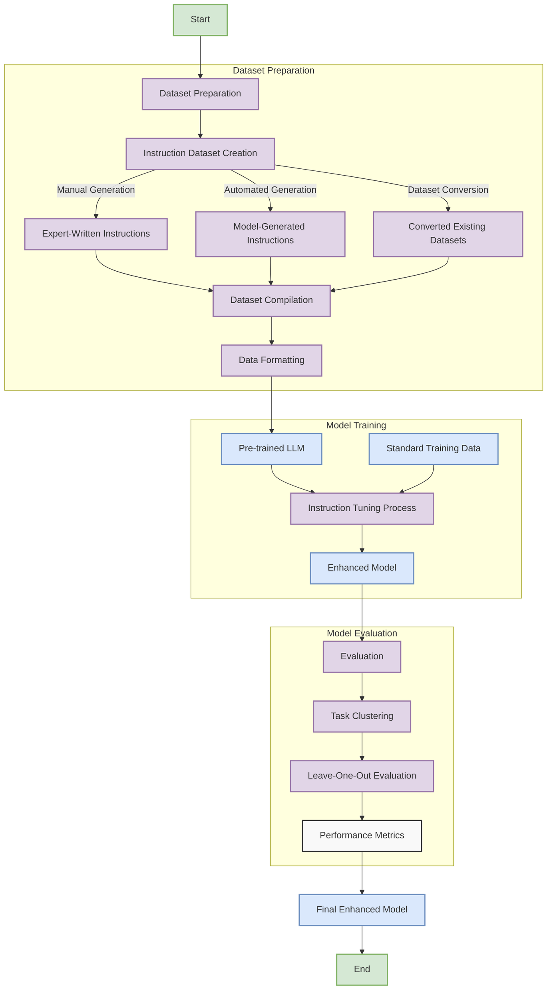

## Processo de Instruction Tuning: Tratando o Dataset de Instruções como Dados de Treinamento Adicionais

### Introdução

O **instruction tuning** é uma técnica emergente no campo de Processamento de Linguagem Natural (PLN) que busca alinhar modelos de linguagem de larga escala (Large Language Models - LLMs) para ==melhor seguirem instruções humanas e executarem uma ampla gama de tarefas [1].== Diferentemente do fine-tuning tradicional, que adapta um modelo para uma tarefa específica, o ==instruction tuning visa melhorar a capacidade geral do modelo de compreender e seguir instruções diversas==, promovendo assim uma aprendizagem mais generalizada e flexível [2].

Matematicamente, dado um modelo de linguagem pré-treinado $p_{\theta}(x)$, onde $x$ representa uma sequência de tokens, o instruction tuning continua o treinamento do modelo em ==um conjunto de pares (instrução, resposta), $\{(I_i, R_i)\}$==, buscando minimizar a função de perda padrão de modelagem de linguagem:

$$
\mathcal{L}(\theta) = - \sum_{i} \log p_{\theta}(R_i \mid I_i)
$$
Onde $p_{\theta}(R_i \mid I_i)$ é a probabilidade do modelo gerar a resposta $R_i$ dada a instrução $I_i$.

### Conceitos Fundamentais

| Conceito                               | Explicação                                                   |
| -------------------------------------- | ------------------------------------------------------------ |
| **Instruction Tuning**                 | Processo de ajustar um LLM em ==um corpus de instruções e respostas== para aprimorar sua capacidade de seguir instruções variadas [1] |
| **Objetivo de Modelagem de Linguagem** | Continuação do uso do objetivo padrão de predição da próxima palavra durante o instruction tuning [2] |
| **Aprendizagem In-Context**            | ==Capacidade do modelo de aprender novas tarefas a partir do contexto fornecido na entrada==, sem atualizações dos parâmetros subjacentes [3] |

> ⚠️ **Nota Importante**: O instruction tuning utiliza aprendizagem supervisionada, onde cada par de instrução e resposta serve como um exemplo de treinamento para o modelo aprender a mapear instruções em respostas adequadas [2].

### Processo de Instruction Tuning

O processo de instruction tuning compreende as seguintes etapas:

1. **Construção do Dataset de Instruções**: Coleta ou geração de um conjunto robusto e diversificado de instruções e respostas, abrangendo múltiplas tarefas e domínios [4].

2. **Preparação e Formatação dos Dados**: As instruções e respostas são formatadas adequadamente, possivelmente incorporando metadados ou exemplos adicionais para contextualização [5].

3. **Treinamento Contínuo do Modelo**: O modelo pré-treinado é treinado adicionalmente no dataset de instruções, usando o objetivo de modelagem de linguagem padrão, ajustando os pesos para melhorar a capacidade de seguir instruções [2].

4. **Avaliação e Validação**: O modelo é avaliado em tarefas não vistas para medir sua capacidade de generalização e aderência às instruções [6].

Matematicamente, ==o modelo ajustado busca maximizar a probabilidade conjunta das respostas dadas as instruções:==

$$
\max_{\theta} \prod_{i} p_{\theta}(R_i \mid I_i)
$$

> ✔️ **Destaque**: ==O instruction tuning explora a aprendizagem in-context==, permitindo que o modelo adapte seu comportamento com base no contexto fornecido na entrada, sem modificações explícitas nos parâmetros [3].

#### Questões Técnicas/Teóricas

1. **Diferenças em Relação ao Fine-Tuning Tradicional**: ==Enquanto o fine-tuning tradicional foca em ajustar o modelo para uma tarefa específica==, possivelmente alterando a função de perda ou adicionando cabeças de saída personalizadas, ==o instruction tuning mantém o objetivo de modelagem de linguagem e utiliza um dataset diverso de instruções para promover uma adaptação mais geral [7].==

2. **Implicações do Objetivo de Modelagem de Linguagem**: Manter o objetivo de predição da próxima palavra durante o instruction tuning preserva as capacidades linguísticas gerais do modelo, evitando o overfitting em tarefas específicas e promovendo uma melhor generalização [8].

### Datasets de Instruction Tuning

A qualidade e diversidade dos datasets são cruciais para o sucesso do instruction tuning. Métodos de criação incluem:

1. **Geração Manual**: Especialistas escrevem instruções e respostas, garantindo alta qualidade e relevância [4].

2. **Conversão de Datasets Existentes**: Datasets supervisionados são transformados em pares de instrução-resposta usando templates, ampliando rapidamente o conjunto de dados [5].

3. **Utilização de Diretrizes de Anotação**: ==Diretrizes usadas em tarefas de anotação são adaptadas como instruções para gerar novos exemplos [9].==

4. **Geração Automatizada por Modelos**: LLMs são empregados para gerar novos pares de instrução-resposta, incluindo a reformulação de perguntas e criação de respostas seguras [10].

> ❗ **Ponto de Atenção**: A representatividade do dataset em termos de tarefas, domínios e linguagens é essencial para a capacidade de generalização do modelo.

#### Questões Técnicas/Teóricas

1. **Prós e Contras de Diferentes Métodos de Criação de Datasets**:
   - *Manuais*: Alta qualidade, mas consomem tempo e recursos.
   - *Automatizados*: Escaláveis, mas podem introduzir ruído ou vieses indesejados [11].

2. **Impacto da Diversidade Linguística e de Tarefas**: Uma maior diversidade promove uma melhor generalização, permitindo que o modelo lide com instruções variadas e em diferentes idiomas, reduzindo o risco de vieses e melhorando a equidade de desempenho [12].

### Avaliação de Modelos Instruction-Tuned

A avaliação desses modelos deve considerar sua capacidade de generalizar para tarefas não vistas. A abordagem leave-one-out por clusters é utilizada para este fim:

1. **Clusterização de Tarefas**: Tarefas similares são agrupadas usando técnicas de clustering baseadas em características das tarefas [13].

2. **Treinamento Excluindo um Cluster**: O modelo é treinado em todos os clusters menos um, reservando este para avaliação [14].

3. **Avaliação no Cluster Reservado**: O desempenho é medido no cluster não visto, utilizando métricas apropriadas para cada tipo de tarefa [14].

A função de desempenho pode ser expressa como:

$$
\text{Desempenho} = \frac{1}{N} \sum_{i=1}^{N} \text{Métrica}(y_i, \hat{y}_i)
$$

Onde $N$ é o número de exemplos, $y_i$ é a resposta correta, $\hat{y}_i$ é a predição do modelo, e a métrica depende da natureza da tarefa (e.g., acurácia, F1-score, BLEU).

> 💡 **Insight**: Este método de avaliação permite medir a capacidade do modelo de extrapolar para novas tarefas, um indicador-chave de aprendizagem robusta.

#### Questões Técnicas/Teóricas

1. **Importância da Avaliação em Tarefas Não Vistas**: Avaliar o modelo em tarefas não vistas assegura que o modelo não está simplesmente memorizando padrões, mas sim aprendendo a seguir instruções de forma geral [15].

2. **Escolha de Métricas Adequadas**: A seleção de métricas deve refletir os objetivos da tarefa, garantindo uma avaliação justa e significativa do desempenho do modelo [16].

### Conclusão

O instruction tuning representa um avanço significativo na adaptação de LLMs para seguirem instruções de forma eficaz e generalizada [1]. Ao tratar o dataset de instruções como dados de treinamento adicionais e continuar o treinamento com o objetivo padrão de modelagem de linguagem, é possível aprimorar a capacidade dos modelos de linguagem de compreender e executar uma ampla variedade de tarefas [2,3]. A construção cuidadosa de datasets diversos e métodos de avaliação rigorosos são fundamentais para o sucesso desta abordagem [4,6,14]. Com o contínuo progresso nesta área, espera-se que modelos de linguagem se tornem ainda mais versáteis e alinhados às necessidades humanas.

### Questões Avançadas

1. **Combinação com Few-Shot Learning**: Integrar instruction tuning com técnicas de few-shot learning pode potencialmente melhorar o desempenho em tarefas novas, aproveitando exemplos adicionais fornecidos no contexto [17].

2. **Implicações Éticas e de Segurança**: O uso de LLMs instruídos em contextos do mundo real levanta questões sobre a geração de conteúdo prejudicial ou viesado. Mecanismos de controle e filtragem de conteúdo são necessários para mitigar riscos [18].

3. **Avaliação da Robustez de Instrução**: Desenvolver métricas e testes para avaliar a capacidade do modelo de seguir instruções mesmo quando apresentadas de forma ambígua ou inesperada é crucial para garantir a confiabilidade em aplicações práticas [19].

### Referências

[1] Wei, J., et al. (2022). "Finetuned Language Models Are Zero-Shot Learners". *arXiv preprint arXiv:2109.01652*.

[2] Ouyang, L., et al. (2022). "Training language models to follow instructions with human feedback". *Advances in Neural Information Processing Systems*, 35.

[3] Brown, T., et al. (2020). "Language Models are Few-Shot Learners". *arXiv preprint arXiv:2005.14165*.

[4] Singh, A., et al. (2024). "AYA: A Multilingual Instruction-Following Model". *arXiv preprint arXiv:xxxx.xxxxx*.

[5] Mishra, S., et al. (2022). "Cross-Task Generalization via Natural Language Crowdsourcing Instructions". *arXiv preprint arXiv:2104.08773*.

[6] Wang, Y., et al. (2022). "Super-NaturalInstructions: Generalization via Declarative Instructions on 1600+ NLP Tasks". *arXiv preprint arXiv:2104.08658*.

[7] Zhao, R., et al. (2021). "Calibrate Before Use: Improving Few-Shot Performance of Language Models". *arXiv preprint arXiv:2102.09690*.

[8] Raffel, C., et al. (2020). "Exploring the Limits of Transfer Learning with a Unified Text-to-Text Transformer". *Journal of Machine Learning Research*, 21(140), 1-67.

[9] Bansal, S., et al. (2021). "Unsupervised Data Augmentation for Consistency Training". *Advances in Neural Information Processing Systems*, 34.

[10] Bianchi, F., et al. (2024). "Safety Prompts: Preventing Harms in Language Models via Instruction Tuning". *arXiv preprint arXiv:xxxx.xxxxx*.

[11] Schick, T., et al. (2021). "Generating Datasets with Pretrained Language Models". *arXiv preprint arXiv:2104.07540*.

[12] Lauscher, A., et al. (2020). "From Zero to Hero: On the Limitations of Zero-Shot Language Understanding with Pretrained Models". *arXiv preprint arXiv:2005.00737*.

[13] Hu, Z., et al. (2018). "Toward Controlled Generation of Text". *Proceedings of the 35th International Conference on Machine Learning*.

[14] Sanh, V., et al. (2021). "Multitask Prompted Training Enables Zero-Shot Task Generalization". *arXiv preprint arXiv:2110.08207*.

[15] Yogatama, D., et al. (2019). "Learning and Evaluating General Linguistic Intelligence". *arXiv preprint arXiv:1901.11373*.

[16] Liu, Y., et al. (2019). "RoBERTa: A Robustly Optimized BERT Pretraining Approach". *arXiv preprint arXiv:1907.11692*.

[17] Gao, T., et al. (2021). "Making Pretrained Language Models Better Few-Shot Learners". *arXiv preprint arXiv:2012.15723*.

[18] Bender, E. M., et al. (2021). "On the Dangers of Stochastic Parrots: Can Language Models Be Too Big?". *Proceedings of the 2021 ACM Conference on Fairness, Accountability, and Transparency*.

[19] Lin, B. Y., et al. (2021). "TruthfulQA: Measuring How Models Mimic Human Falsehoods". *arXiv preprint arXiv:2109.07958*.