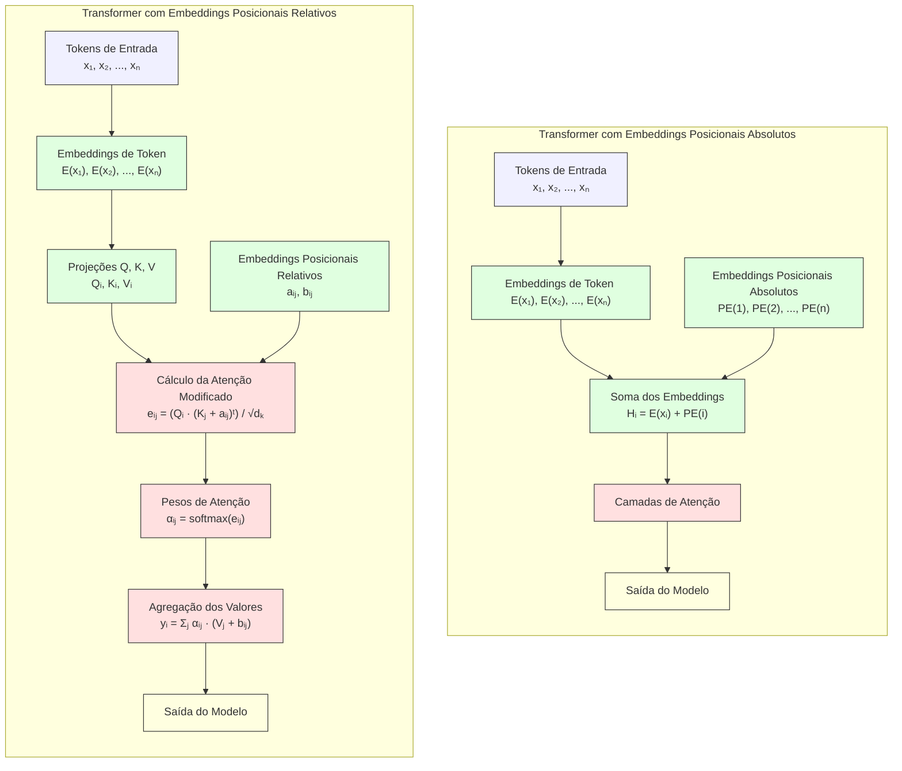
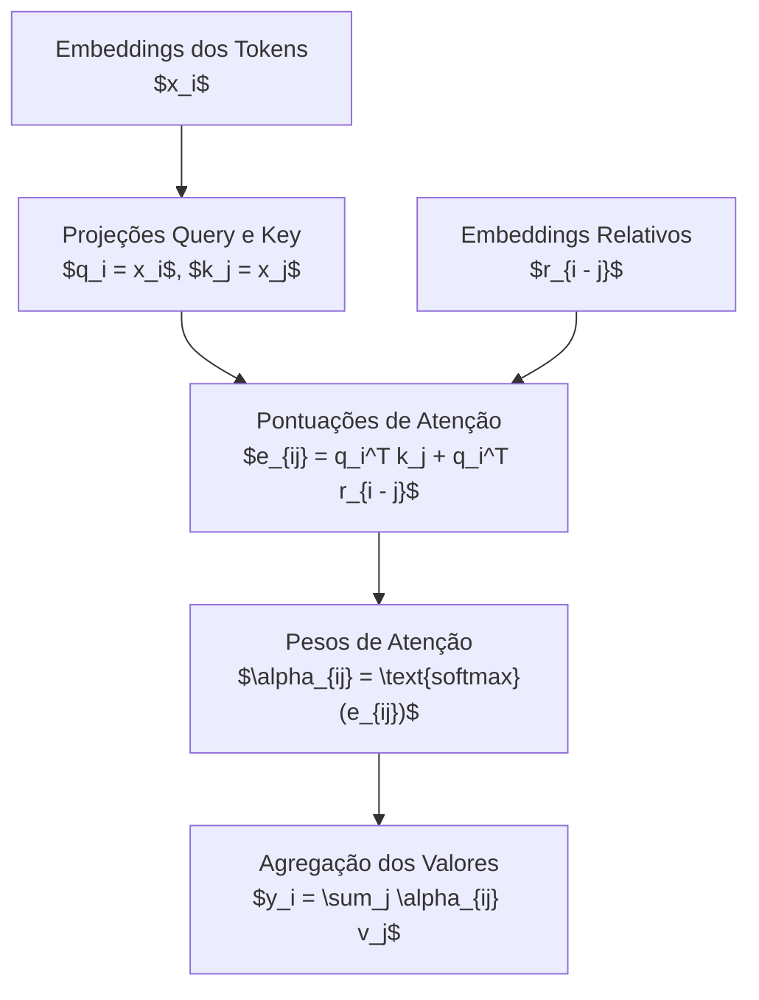

## Absolute vs. Relative Positional Embeddings em Transformers



### Introdução

Os **embeddings posicionais** são um componente crucial na arquitetura Transformer, permitindo que o modelo capture informações sobre a ordem sequencial dos tokens de entrada [1]. Essa funcionalidade é essencial, uma vez que o mecanismo de atenção em si é invariante à ordem dos tokens. Neste resumo, exploraremos em profundidade duas abordagens principais para embeddings posicionais: **absolutos** e **relativos**, analisando suas características, vantagens, desvantagens e aplicabilidades em diferentes cenários e tarefas de processamento de linguagem natural.

### Conceitos Fundamentais

| Conceito                             | Explicação                                                   |
| ------------------------------------ | ------------------------------------------------------------ |
| **Embeddings Posicionais Absolutos** | Vetores únicos que codificam a posição absoluta de cada token na sequência. São adicionados diretamente aos embeddings dos tokens. [1] |
| **Embeddings Posicionais Relativos** | ==Codificam a distância relativa entre pares de tokens, permitindo que o modelo capture relações posicionais de forma mais flexível. [2]== |
| **Invariância à Translação**         | ==Propriedade onde o significado de uma subsequência não muda com sua posição absoluta na sequência==. Importante para certos tipos de tarefas de NLP. [3] |

> ⚠️ **Nota Importante**: A escolha entre embeddings posicionais absolutos e relativos pode impactar significativamente o desempenho do modelo em diferentes tarefas e comprimentos de sequência.

### Embeddings Posicionais Absolutos

Os embeddings posicionais absolutos, ==introduzidos no artigo original do Transformer [1]==, são ==vetores únicos associados a cada posição na sequência de entrada==. Eles são somados diretamente aos embeddings dos tokens antes de serem processados pelas camadas de atenção.

A formulação matemática para os embeddings posicionais absolutos, conforme proposta originalmente, é:

$$
PE_{(pos,2i)} = \sin\left(\frac{pos}{10000^{2i/d_{\text{model}}}}\right)
$$

$$
PE_{(pos,2i+1)} = \cos\left(\frac{pos}{10000^{2i/d_{\text{model}}}}\right)
$$

Onde:

- $pos$ é a posição absoluta do token na sequência.
- $i$ é o índice da dimensão do embedding.
- $d_{\text{model}}$ é a dimensão do modelo.

Esta formulação permite que o modelo aprenda a atender a posições absolutas na sequência. Os embeddings posicionais absolutos têm algumas propriedades interessantes:

1. **Determinísticos**: ==Não são parâmetros aprendidos, mas calculados de forma determinística.==
2. **Periodicidade**: As funções seno e cosseno fornecem uma periodicidade que permite ao modelo generalizar para sequências mais longas do que as vistas durante o treinamento.
3. **Unicidade**: ==Cada posição tem um vetor único, permitindo que o modelo diferencie tokens em diferentes posições==.

#### Vantagens e Desvantagens dos Embeddings Posicionais Absolutos

👍 **Vantagens**:

- **Simplicidade de implementação** [4]: Fácil de incorporar em modelos existentes.
- **Eficiência computacional** [4]: Podem ser pré-computados e não adicionam complexidade ao modelo.
- **Generalização limitada para sequências mais longas** [1]: A periodicidade ajuda, mas com limitações.

👎 **Desvantagens**:

- **Limitação em capturar relações relativas entre tokens distantes** [5]: Não modelam diretamente a distância entre tokens.
- **Potencial perda de desempenho em tarefas que requerem invariância à translação** [3]: Dependem da posição absoluta.
- ==**Dificuldade em lidar com sequências muito longas além do comprimento máximo visto durante o treinamento** [6]:== O modelo pode não generalizar bem.

#### Questões Técnicas/Teóricas

1. **Como a periodicidade dos embeddings posicionais absolutos contribui para a generalização do modelo para sequências mais longas? Explique matematicamente.**

   *Resposta*: A periodicidade das funções seno e cosseno permite que os embeddings posicionais tenham valores similares para posições que são múltiplos do período da função. Isso significa que, para posições além do que o modelo viu durante o treinamento, os embeddings terão padrões que o modelo já aprendeu a interpretar, permitindo alguma generalização.

2. **Em uma tarefa de classificação de documentos longos, como os embeddings posicionais absolutos podem impactar o desempenho do modelo?**

   *Resposta*: Se os documentos forem significativamente mais longos do que as sequências vistas durante o treinamento, os embeddings posicionais podem atribuir valores a posições que o modelo não sabe interpretar, levando a um desempenho inferior. O modelo pode não capturar corretamente as relações entre tokens em posições distantes.

### Embeddings Posicionais Relativos

Os **embeddings posicionais relativos** foram introduzidos como uma alternativa aos embeddings absolutos para superar algumas de suas limitações, especialmente na captura de relações entre tokens independentemente de sua posição absoluta na sequência [7]. ==Em vez de atribuir um vetor fixo a cada posição absoluta, os embeddings relativos consideram a distância entre tokens, permitindo que o modelo compreenda como os tokens estão relacionados entre si em termos de posição.==

#### Como Funcionam os Embeddings Posicionais Relativos

No Transformer padrão, o cálculo da atenção entre tokens é realizado utilizando as projeções de *query* (Q) e *key*:

$$
\text{Attention}(Q, K, V) = \text{softmax}\left(\frac{QK^T}{\sqrt{d_k}}\right)V
$$

Onde:

- $Q$, $K$, $V$ são as projeções dos embeddings dos tokens.
- $d_k$ é a dimensão das *keys*.

Com embeddings posicionais absolutos, as informações de posição são adicionadas aos embeddings dos tokens antes das projeções. No entanto, isso limita o modelo a considerar apenas as posições absolutas, não capturando eficientemente as relações relativas entre tokens.

==**Com embeddings posicionais relativos**, modificamos o cálculo da atenção para incluir embeddings que representam a distância relativa entre tokens.== Uma formulação proposta por Shaw et al. [7] é:
$$
e_{ij} = \frac{(x_iW^Q)(x_jW^K)^T + (x_iW^Q)(a_{i - j})^T}{\sqrt{d_k}}
$$

Onde:

- $x_i$ é o embedding do token na posição $i$.
- $W^Q$, $W^K$ são matrizes de projeção para *query* e *key*.
- $a_{i - j}$ é o embedding da posição relativa entre os tokens nas posições $i$ e $j$.
- $e_{ij}$ é a pontuação de atenção não normalizada entre os tokens $i$ e $j$.

==O termo **$(x_iW^Q)(a_{i - j})^T$** adiciona ao cálculo de atenção um componente que depende da distância relativa entre os tokens, permitindo que o modelo capture relações posicionais de forma mais flexível.==

Após calcular $e_{ij}$ para todos os pares de tokens, aplicamos a função softmax para obter os pesos de atenção $\alpha_{ij}$:

$$
\alpha_{ij} = \text{softmax}(e_{ij})
$$

Finalmente, calculamos a saída $y_i$ para cada posição $i$:

$$
y_i = \sum_{j=1}^n \alpha_{ij}(x_jW^V)
$$

==Em algumas implementações, pode-se adicionar um termo adicional com embeddings de posição relativa aos valores:==
$$
y_i = \sum_{j=1}^n \alpha_{ij}(x_jW^V + b_{i - j})
$$

Onde $b_{i - j}$ são embeddings de posição relativa aplicados aos valores.

#### Intuição por Trás dos Embeddings Relativos

==A ideia central é que a relação entre dois tokens depende não apenas de suas características semânticas, mas também de quão distantes eles estão na sequência.== Por exemplo, em linguagem natural, ==palavras próximas tendem a ter interações mais fortes do que palavras distantes.==

Ao modelar explicitamente a distância relativa, os embeddings posicionais relativos permitem que o modelo:

- **Capture relações locais de forma mais eficaz**: Tokens próximos podem influenciar-se mutuamente de maneira mais significativa.
- **Generalize melhor para sequências de diferentes comprimentos**: ==Como o modelo foca nas distâncias entre tokens, ele pode aplicar o mesmo conhecimento a sequências mais longas ou mais curtas do que aquelas vistas durante o treinamento.==
- **Seja invariante à posição absoluta**: A importância da relação entre dois tokens é determinada pela distância entre eles, não por suas posições absolutas.

#### Exemplos Práticos

- **Análise Sintática**: Em tarefas de análise sintática, a relação entre palavras (como sujeito e verbo) depende de sua proximidade na sentença. ==Embeddings relativos ajudam o modelo a identificar essas relações independentemente da posição na frase.==

- **Tradução Automática**: ==Em tradução entre idiomas com ordens de palavras diferentes, é importante capturar a relação entre palavras que podem estar em posições distintas nas duas línguas.== Embeddings relativos permitem que o modelo alinhe palavras com base em sua distância relativa, melhorando a qualidade da tradução.

#### Vantagens e Desvantagens dos Embeddings Posicionais Relativos

👍 **Vantagens**:

- **Melhor captura de relações locais e distantes entre tokens** [7]: Modelam diretamente a distância entre tokens.
- **Maior invariância à translação** [3]: O desempenho não depende da posição absoluta dos tokens.
- **Potencial para melhor generalização em sequências longas** [8]: Adaptam-se melhor a sequências de comprimento variável.

👎 **Desvantagens**:

- **Maior complexidade computacional** [9]: Adicionam operações extras no cálculo da atenção.
- **Potencial aumento no número de parâmetros do modelo** [7]: ==Necessário armazenar embeddings para múltiplas distâncias relativas.==
- **Implementação mais complexa comparada aos embeddings absolutos** [9]: Requer modificações no cálculo da atenção.

#### Questões Técnicas/Teóricas

1. **Como a incorporação de embeddings posicionais relativos no cálculo da atenção afeta a complexidade computacional do modelo? Analise em termos de operações de matriz.**

   *Resposta*: A incorporação de embeddings relativos adiciona termos extras no cálculo da atenção, especificamente o produto entre as *queries* e os embeddings de posição relativa. Isso aumenta o número de operações de multiplicação e adição. ==Enquanto o cálculo padrão de atenção tem complexidade $O(n^2d_k)$, onde $n$ é o comprimento da sequência e $d_k$ é a dimensão das *keys*, a adição dos embeddings relativos mantém a mesma ordem de complexidade, mas com um coeficiente maior devido às operações adicionais.==

2. **Em uma tarefa de tradução automática, como os embeddings posicionais relativos podem melhorar o alinhamento entre palavras de idiomas com estruturas sintáticas diferentes? Dê um exemplo concreto.**

   *Resposta*: Em idiomas como o inglês e o japonês, a ordem das palavras pode ser diferente (Sujeito-Verbo-Objeto vs. Sujeito-Objeto-Verbo). Embeddings relativos permitem que o modelo reconheça que certas palavras estão relacionadas, independentemente de sua posição absoluta. Por exemplo, o verbo pode aparecer em posições diferentes nas duas línguas, mas a distância relativa entre o sujeito e o verbo pode ser consistente, ajudando o modelo a alinhar corretamente essas palavras durante a tradução.

#### Considerações Práticas

- **Limitação do Alcance das Distâncias**:

  - Na prática, limitamos o alcance das distâncias relativas para gerenciar o número de embeddings e a memória utilizada.
  - Distâncias maiores que um certo limite são agrupadas em um único embedding.

- **Compartilhamento de Embeddings**:

  - Os embeddings de posição relativa podem ser compartilhados entre camadas ou cabeças de atenção para reduzir o número de parâmetros.

- **Eficiência**:

  - Técnicas como *windowing* (janelamento) ou mascaramento podem ser usadas para reduzir o número de cálculos, especialmente em sequências muito longas.

#### Implementação e Exemplo em PyTorch

Implementar embeddings posicionais relativos requer modificar o cálculo da atenção. Aqui está um esboço simplificado:

```python
import torch
import torch.nn as nn

class RelativeMultiHeadAttention(nn.Module):
    def __init__(self, d_model, num_heads, max_len=5000):
        super().__init__()
        self.num_heads = num_heads
        self.d_k = d_model // num_heads
        self.max_len = max_len

        self.W_q = nn.Linear(d_model, d_model)
        self.W_k = nn.Linear(d_model, d_model)
        self.W_v = nn.Linear(d_model, d_model)

        self.rel_k = nn.Parameter(torch.randn(2 * max_len - 1, self.d_k))
        self.rel_v = nn.Parameter(torch.randn(2 * max_len - 1, self.d_k))

    def forward(self, x):
        batch_size, seq_len, _ = x.size()

        Q = self.W_q(x).view(batch_size, seq_len, self.num_heads, self.d_k)
        K = self.W_k(x).view(batch_size, seq_len, self.num_heads, self.d_k)
        V = self.W_v(x).view(batch_size, seq_len, self.num_heads, self.d_k)

        # Calcula pontuações de atenção com embeddings relativos
        # ...

        # Implementação detalhada requer manipulação cuidadosa das tensores
        # e índices para incorporar os embeddings de posição relativa.

        return output
```

> ❗ **Ponto de Atenção**: A implementação de embeddings posicionais relativos pode variar significativamente dependendo da abordagem específica escolhida. A versão acima é uma simplificação e pode requerer ajustes para casos de uso específicos.

### Exemplo Numérico de Embeddings Posicionais Relativos

Para ilustrar como os **embeddings posicionais relativos** funcionam na prática, vamos considerar um exemplo simples com uma sequência de quatro tokens:

**Sequência de Tokens**:

1. **Token 0**: "Eu"
2. **Token 1**: "amo"
3. **Token 2**: "aprendizado"
4. **Token 3**: "profundo"

Vamos assumir que:

- A dimensão dos embeddings (d_model) é **2** para simplificar.
- ==As matrizes de projeção $W^Q$ e $W^K$ são a **matriz identidade** (ou seja, não alteram os embeddings originais).==
- Os embeddings dos tokens são vetores de dimensão 2.
  
#### Embeddings dos Tokens ($x_i$)

| Posição (i) | Token         | Embedding ($x_i$) |
| ----------- | ------------- | ----------------- |
| 0           | "Eu"          | $[1, 0]$          |
| 1           | "amo"         | $[0, 1]$          |
| 2           | "aprendizado" | $[1, 1]$          |
| 3           | "profundo"    | $[0, 0]$          |

#### Embeddings de Posição Relativa ($r_{k}$)

Consideramos posições relativas de $-3$ a $+3$:

| Posição Relativa (k) | $r_k$     |
| -------------------- | --------- |
| $-3$                 | $[0, 0]$  |
| $-2$                 | $[0, 1]$  |
| $-1$                 | $[1, 0]$  |
| $0$                  | $[1, 1]$  |
| $+1$                 | $[0, -1]$ |
| $+2$                 | $[-1, 0]$ |
| $+3$                 | $[0, 0]$  |

#### Cálculo das Pontuações de Atenção ($e_{ij}$)

A pontuação de atenção entre os tokens na posição $i$ e $j$ é dada por:

$$
e_{ij} = q_i^T k_j + q_i^T r_{i - j}
$$

Onde:

- $q_i = W^Q x_i = x_i$ (já que $W^Q$ é a matriz identidade)
- $k_j = W^K x_j = x_j$ (já que $W^K$ é a matriz identidade)
- ==$r_{i - j}$ é o embedding da posição relativa entre $i$ e $j$==

Vamos calcular $e_{ij}$ para todos os pares $(i, j)$:

#### Tabela de Cálculos

| $i$  | $j$  | $x_i$  | $x_j$  | $x_i^T x_j$     | $i - j$ | $r_{i - j}$ | $x_i^T r_{i - j}$   | $e_{ij} = x_i^T x_j + x_i^T r_{i - j}$ |
| ---- | ---- | ------ | ------ | --------------- | ------- | ----------- | ------------------- | -------------------------------------- |
| 0    | 0    | [1, 0] | [1, 0] | $1*1 + 0*0 = 1$ | 0       | [1, 1]      | $1*1 + 0*1 = 1$     | $1 + 1 = 2$                            |
| 0    | 1    | [1, 0] | [0, 1] | $1*0 + 0*1 = 0$ | -1      | [1, 0]      | $1*1 + 0*0 = 1$     | $0 + 1 = 1$                            |
| 0    | 2    | [1, 0] | [1, 1] | $1*1 + 0*1 = 1$ | -2      | [0, 1]      | $1*0 + 0*1 = 0$     | $1 + 0 = 1$                            |
| 0    | 3    | [1, 0] | [0, 0] | $1*0 + 0*0 = 0$ | -3      | [0, 0]      | $1*0 + 0*0 = 0$     | $0 + 0 = 0$                            |
| 1    | 0    | [0, 1] | [1, 0] | $0*1 + 1*0 = 0$ | 1       | [0, -1]     | $0*0 + 1*(-1) = -1$ | $0 + (-1) = -1$                        |
| 1    | 1    | [0, 1] | [0, 1] | $0*0 + 1*1 = 1$ | 0       | [1, 1]      | $0*1 + 1*1 = 1$     | $1 + 1 = 2$                            |
| 1    | 2    | [0, 1] | [1, 1] | $0*1 + 1*1 = 1$ | -1      | [1, 0]      | $0*1 + 1*0 = 0$     | $1 + 0 = 1$                            |
| 1    | 3    | [0, 1] | [0, 0] | $0*0 + 1*0 = 0$ | -2      | [0, 1]      | $0*0 + 1*1 = 1$     | $0 + 1 = 1$                            |
| 2    | 0    | [1, 1] | [1, 0] | $1*1 + 1*0 = 1$ | 2       | [-1, 0]     | $1*(-1) + 1*0 = -1$ | $1 + (-1) = 0$                         |
| 2    | 1    | [1, 1] | [0, 1] | $1*0 + 1*1 = 1$ | 1       | [0, -1]     | $1*0 + 1*(-1) = -1$ | $1 + (-1) = 0$                         |
| 2    | 2    | [1, 1] | [1, 1] | $1*1 + 1*1 = 2$ | 0       | [1, 1]      | $1*1 + 1*1 = 2$     | $2 + 2 = 4$                            |
| 2    | 3    | [1, 1] | [0, 0] | $1*0 + 1*0 = 0$ | -1      | [1, 0]      | $1*1 + 1*0 = 1$     | $0 + 1 = 1$                            |
| 3    | 0    | [0, 0] | [1, 0] | $0*1 + 0*0 = 0$ | 3       | [0, 0]      | $0*0 + 0*0 = 0$     | $0 + 0 = 0$                            |
| 3    | 1    | [0, 0] | [0, 1] | $0*0 + 0*1 = 0$ | 2       | [-1, 0]     | $0*(-1) + 0*0 = 0$  | $0 + 0 = 0$                            |
| 3    | 2    | [0, 0] | [1, 1] | $0*1 + 0*1 = 0$ | 1       | [0, -1]     | $0*0 + 0*(-1) = 0$  | $0 + 0 = 0$                            |
| 3    | 3    | [0, 0] | [0, 0] | $0*0 + 0*0 = 0$ | 0       | [1, 1]      | $0*1 + 0*1 = 0$     | $0 + 0 = 0$                            |

#### Interpretação dos Resultados

- **Pontuações Elevadas**: Os pares $(i, j)$ com valores altos de $e_{ij}$ indicam que o token na posição $i$ está dando mais atenção ao token na posição $j$.

- **Impacto da Posição Relativa**:

  - Por exemplo, $e_{2,2} = 4$ é alto porque tanto $x_2^T x_2 = 2$ quanto $x_2^T r_0 = 2$.
  
  - O termo $x_i^T r_{i - j}$ ajusta a pontuação de atenção com base na distância entre os tokens, permitindo que o modelo capture dependências posicionais de forma mais eficaz.

#### Cálculo da Atenção

Após obter as pontuações $e_{ij}$, aplicamos a função *softmax* para obter os pesos de atenção $\alpha_{ij}$:

$$
\alpha_{ij} = \frac{\exp(e_{ij})}{\sum_{k=0}^{n-1} \exp(e_{ik})}
$$

**Exemplo para $i = 0$**:

Calculamos $\alpha_{0j}$ para $j = 0$ a $3$:

1. **Somatório das Exponenciais**:

   $$
   \sum_{k=0}^{3} \exp(e_{0k}) = \exp(2) + \exp(1) + \exp(1) + \exp(0) \approx 7.389 + 2.718 + 2.718 + 1 = 13.825
   $$

2. **Pesos de Atenção**:

   - $\alpha_{00} = \frac{\exp(2)}{13.825} \approx \frac{7.389}{13.825} \approx 0.534$
   - $\alpha_{01} = \frac{\exp(1)}{13.825} \approx \frac{2.718}{13.825} \approx 0.197$
   - $\alpha_{02} = \frac{\exp(1)}{13.825} \approx 0.197$
   - $\alpha_{03} = \frac{\exp(0)}{13.825} \approx \frac{1}{13.825} \approx 0.072$

3. **Interpretação**:

   - O token na posição 0 ("Eu") presta mais atenção a si mesmo ($\alpha_{00} \approx 53.4\%$).
   - A atenção aos tokens nas posições 1 e 2 é menor, mas significativa ($\approx 19.7\%$ cada).
   - A atenção ao token na posição 3 é a menor ($\approx 7.2\%$).

#### Resumo do Processo

1. **Projeções**: Calculamos $q_i$ e $k_j$ projetando os embeddings dos tokens.

2. **Embeddings Relativos**: Obtemos $r_{i - j}$ para cada par $(i, j)$ com base na distância relativa.

3. **Pontuações de Atenção**: Computamos $e_{ij} = q_i^T k_j + q_i^T r_{i - j}$.

4. **Pesos de Atenção**: Aplicamos a função *softmax* às pontuações $e_{ij}$ para obter $\alpha_{ij}$.

5. **Agregação**: Calculamos a saída $y_i$ para cada posição $i$:

   $$
   y_i = \sum_{j=0}^{n-1} \alpha_{ij} v_j
   $$

   Onde $v_j$ são as projeções dos valores (neste exemplo, assumimos $v_j = x_j$ para simplificar).

### Visualização do Processo



### Comparação e Análise

Para uma comparação mais detalhada entre embeddings posicionais absolutos e relativos, consideremos os seguintes aspectos:

| Aspecto                                  | Embeddings Absolutos | Embeddings Relativos |
| ---------------------------------------- | -------------------- | -------------------- |
| **Captura de Contexto Local**            | Limitada [5]         | Superior [7]         |
| **Invariância à Translação**             | Baixa [3]            | Alta [3]             |
| **Eficiência Computacional**             | Alta [4]             | Moderada a Baixa [9] |
| **Generalização para Sequências Longas** | Moderada [1]         | Alta [8]             |
| **Complexidade de Implementação**        | Baixa [4]            | Alta [9]             |

> ✔️ **Ponto de Destaque**: A escolha entre embeddings absolutos e relativos deve ser baseada nas características específicas da tarefa, no comprimento das sequências e nos recursos computacionais disponíveis.

### Implementação e Considerações Práticas

Ao implementar embeddings posicionais em um modelo Transformer, é crucial considerar o trade-off entre desempenho e eficiência. Aqui está um exemplo simplificado de como implementar embeddings posicionais absolutos em PyTorch:

```python
import torch
import torch.nn as nn
import math

class PositionalEncoding(nn.Module):
    def __init__(self, d_model, max_len=5000):
        super().__init__()

        pe = torch.zeros(max_len, d_model)
        position = torch.arange(0, max_len, dtype=torch.float32).unsqueeze(1)
        div_term = torch.exp(torch.arange(0, d_model, 2, dtype=torch.float32) * (-math.log(10000.0) / d_model))

        pe[:, 0::2] = torch.sin(position * div_term)  # dimensões pares
        pe[:, 1::2] = torch.cos(position * div_term)  # dimensões ímpares

        pe = pe.unsqueeze(0)  # adiciona dimensão do batch
        self.register_buffer('pe', pe)

    def forward(self, x):
        return x + self.pe[:, :x.size(1)]
```

Para embeddings posicionais relativos, a implementação é mais complexa e geralmente envolve modificar o cálculo da atenção. Aqui está um esboço simplificado:

```python
import torch
import torch.nn as nn

class RelativePositionalEncoding(nn.Module):
    def __init__(self, d_model, max_len=5000):
        super().__init__()
        self.d_model = d_model
        self.max_len = max_len
        self.rel_embeddings = nn.Embedding(2 * max_len - 1, d_model)

    def forward(self, length):
        range_vec = torch.arange(length)
        distance_mat = range_vec[None, :] - range_vec[:, None] + self.max_len - 1
        return self.rel_embeddings(distance_mat)
```

> ❗ **Ponto de Atenção**: A implementação completa requer integração desses embeddings no cálculo de atenção, modificando as operações de matriz para incluir as informações de posição relativa.

### Conclusão

A escolha entre embeddings posicionais absolutos e relativos é crucial para o desempenho de modelos Transformer em diversas tarefas de NLP. **Embeddings absolutos** oferecem simplicidade e eficiência, sendo adequados para muitas aplicações padrão. Por outro lado, **embeddings relativos** proporcionam maior flexibilidade e potencial de generalização, especialmente em tarefas que envolvem sequências longas ou requerem invariância à translação [3][7][8].

A decisão deve ser baseada nas características específicas da tarefa, nos recursos computacionais disponíveis e nos requisitos de desempenho do modelo. Em alguns casos, abordagens híbridas ou variações mais recentes desses métodos podem oferecer o melhor equilíbrio entre desempenho e eficiência.

À medida que a pesquisa em NLP avança, é provável que surjam novas técnicas de embedding posicional, possivelmente combinando os pontos fortes das abordagens absoluta e relativa ou introduzindo conceitos inteiramente novos para capturar informações posicionais em modelos de linguagem.

### Questões Avançadas

1. **Como você projetaria um experimento para comparar o desempenho de embeddings posicionais absolutos e relativos em uma tarefa de sumarização de documentos longos?**

   *Resposta*: Criaria um conjunto de dados com documentos de diferentes comprimentos, incluindo textos que excedem o comprimento máximo visto durante o treinamento. Treinaria dois modelos idênticos, um com embeddings absolutos e outro com embeddings relativos, e avaliaria o desempenho em termos de métricas como ROUGE ou BLEU. Analisaria como cada modelo lida com a captura de informações de contexto distante e a coerência geral do resumo.

2. **Analise o impacto potencial de embeddings posicionais relativos na interpretabilidade de modelos de linguagem. Como eles podem afetar nossa capacidade de entender as decisões do modelo em tarefas como análise de sentimentos ou extração de entidades?**

   *Resposta*: Embeddings relativos podem tornar mais complexo o rastreamento de quais tokens influenciam as decisões do modelo, pois a atenção depende de distâncias relativas. No entanto, eles também podem oferecer insights sobre quais relações posicionais são importantes, melhorando a interpretabilidade em termos de dependências sintáticas ou semânticas.

3. **Proponha uma abordagem híbrida que combine elementos de embeddings posicionais absolutos e relativos. Como essa abordagem poderia superar as limitações de cada método individual?**

   *Resposta*: Uma abordagem híbrida poderia somar os embeddings absolutos aos embeddings dos tokens e, ao mesmo tempo, incorporar embeddings relativos no cálculo da atenção. Isso permitiria ao modelo beneficiar-se da simplicidade dos embeddings absolutos e da flexibilidade dos embeddings relativos. O desafio seria equilibrar a complexidade computacional e garantir que as informações posicionais não se sobreponham de forma redundante.

### Referências

[1] "Embeddings posicionais absolutos, introduzidos no artigo original do Transformer, são vetores únicos associados a cada posição na sequência de entrada. Eles são somados diretamente aos embeddings dos tokens antes de serem processados pelas camadas de atenção." (Trecho de Transformers and Large Language Models - Chapter 10)

[2] "Embeddings Posicionais Relativos: Codificam a distância relativa entre pares de tokens, permitindo que o modelo capture relações posicionais de forma mais flexível." (Trecho de Transformers and Large Language Models - Chapter 10)

[3] "Invariância à Translação: Propriedade onde o significado de uma subsequência não muda com sua posição absoluta na sequência. Importante para certos tipos de tarefas de NLP." (Trecho de Transformers and Large Language Models - Chapter 10)

[4] "Simplicidade de implementação [...] Eficiência computacional (podem ser pré-computados)" (Trecho de Transformers and Large Language Models - Chapter 10)

[5] "Limitação em capturar relações relativas entre tokens distantes" (Trecho de Transformers and Large Language Models - Chapter 10)

[6] "Dificuldade em lidar com sequências muito longas além do comprimento máximo visto durante o treinamento" (Trecho de Transformers and Large Language Models - Chapter 10)

[7] "Os embeddings posicionais relativos foram introduzidos como uma alternativa aos embeddings absolutos, visando superar algumas de suas limitações [...] Uma implementação mais sofisticada, proposta por Shaw et al., introduz embeddings de posição relativa a_{ij} e b_{ij} no cálculo da atenção" (Trecho de Transformers and Large Language Models - Chapter 10)

[8] "Potencial para melhor generalização em sequências longas" (Trecho de Transformers and Large Language Models - Chapter 10)

[9] "Maior complexidade computacional [...] Implementação mais complexa comparada aos embeddings absolutos" (Trecho de Transformers and Large Language Models - Chapter 10)