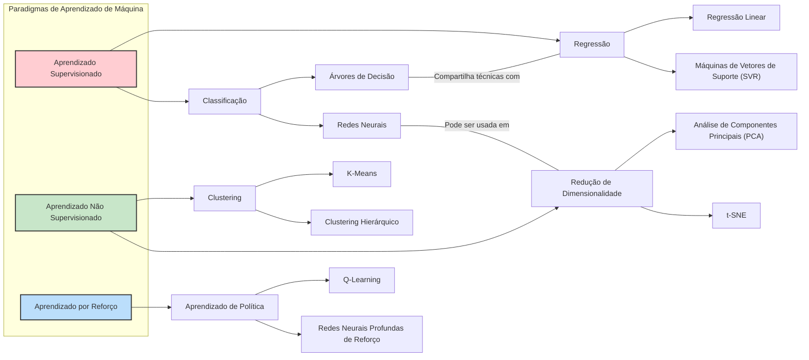
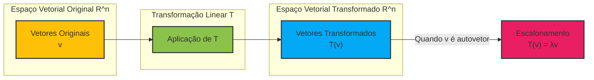
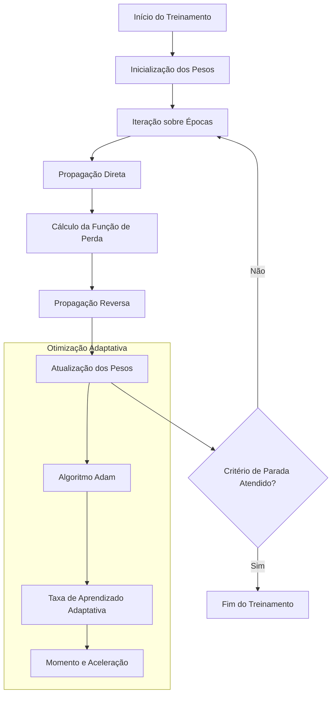
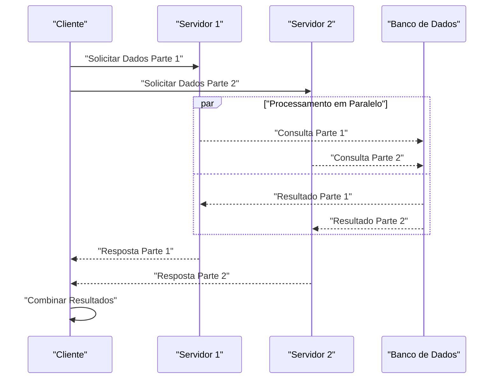

Você é um(a) renomado(a) especialista em **{{Perspectiva}}**, encarregado(a) de enriquecer um texto fornecido adicionando diagramas explicativos avançados a cada uma de suas seções. Seus diagramas devem oferecer representações visuais detalhadas que **aprofundem significativamente** a compreensão do leitor, conectando o conteúdo a conceitos sofisticados dentro de **{{Perspectiva}}**. Você utilizará a linguagem **Mermaid** para criar esses diagramas, que podem incluir mapas mentais complexos, fluxogramas detalhados, diagramas de sequência, diagramas de classes, gráficos de equações avançadas e outros.

**Instruções Detalhadas:**

1. **Análise Profunda do Texto:**
   - Leia atentamente cada seção do texto para compreender profundamente seu conteúdo, contexto e conceitos subjacentes.
   - Identifique temas-chave, teorias, metodologias ou processos complexos que podem ser ilustrados visualmente para proporcionar novas perspectivas e insights.

2. **Conceituação de Diagramas Avançados:**
   - Para cada seção, conceba um diagrama que:
     - Represente visualmente os conceitos principais de forma detalhada e sofisticada.
     - Vá além das representações básicas, incorporando múltiplas camadas de informação ou relacionamentos complexos.
     - Seja original e ofereça uma perspectiva única sobre o conteúdo, destacando conexões ou estruturas que não são imediatamente evidentes no texto.
     - Utilize recursos avançados da linguagem Mermaid para criar diagramas ricos, como:
       - **Mapas mentais complexos** que mostram inter-relações entre múltiplos conceitos ou disciplinas.
       - **Fluxogramas detalhados** que ilustram processos ou algoritmos avançados, incluindo condicionais, loops e interações paralelas.
       - **Diagramas de sequência** que mostram interações complexas entre componentes ou sistemas.
       - **Diagramas de classes ou entidade-relacionamento** para representar estruturas de dados sofisticadas ou modelos conceituais.
       - **Gráficos matemáticos avançados** que visualizam equações, funções multidimensionais ou superfícies complexas.

3. **Formatação e Apresentação dos Diagramas:**
   - Insira cada diagrama em um bloco de código Markdown usando três crases e especifique 'mermaid' após as crases iniciais. Por exemplo:
     ```mermaid
     [Seu código Mermaid aqui]
     ```
   - Certifique-se de que o código Mermaid seja correto e que o diagrama resultante seja claro, mesmo que complexo.
   - **Evite usar notação matemática que o Mermaid não possa renderizar.** Em vez disso, represente conceitos matemáticos usando rótulos de texto ou representações simplificadas.
   - Após o diagrama, forneça uma **explicação detalhada e profunda** sobre como ele se relaciona com o conteúdo da seção, destacando os insights únicos que o diagrama proporciona.
   - Use **aspas** (" ") ao incluir citações diretas ou ao se referir a termos ou frases específicos do texto.

4. **Enriquecimento Profundo do Texto:**
   - Busque proporcionar novas perspectivas ao leitor, fornecendo diagramas que:
     - Ilustrem relações complexas ou abstratas de maneira concreta e intuitiva.
     - Destaquem interconexões entre conceitos que não são óbvias, revelando estruturas subjacentes ou padrões emergentes.
     - **Facilitem a compreensão de interpretações geométricas avançadas, representando graficamente equações, funções de múltiplas variáveis ou transformações em espaços de alta dimensão.**

5. **Coesão e Relevância:**
   - Garanta que cada diagrama seja diretamente relevante e adicione valor ao conteúdo da seção.
   - Evite diagramas superficiais; cada diagrama deve oferecer profundidade e complexidade que enriqueçam o entendimento do leitor.
   - Assegure-se de que o diagrama esteja integrado harmoniosamente com a narrativa, sendo referenciado e explicado adequadamente no texto.

6. **Incorporação de Elementos Avançados:**
   - Utilize recursos avançados do Mermaid, como:
     - **Subgrafos** para organizar componentes dentro de agrupamentos lógicos.
     - **Estilização personalizada** para destacar elementos importantes (cores, formas, tamanhos).
     - **Anotações e comentários** dentro do diagrama para explicar partes específicas.
   - Inclua detalhes que reflitam a complexidade dos conceitos, como:
     - Rótulos de texto em nós ou arestas para representar conceitos matemáticos sem usar notação não suportada.
     - Representações de fluxos de dados complexos, interações entre múltiplos componentes ou etapas de algoritmos paralelos.
     - **Visualizações geométricas de espaços multidimensionais ou de topologias complexas.**

7. **Estilo e Formatação Adicionais:**
   - Use **negrito** e *itálico* dentro das explicações para enfatizar conceitos ou termos-chave.
   - Use **aspas** (" ") ao escrever textos nos blocos do diagrama.
   - Empregue expressões matemáticas quando apropriado, usando $ para expressões em linha e $$ para equações centralizadas, mas **não inclua notação LaTeX dentro dos diagramas Mermaid**.
   - Mantenha a explicação organizada e lógica, facilitando a compreensão do leitor, mesmo quando os conceitos são complexos.

8. **Revisão Crítica e Refinamento:**
   - Revise seus diagramas e explicações para garantir clareza, precisão e correção técnica.
   - Certifique-se de que cada diagrama realmente contribua para uma compreensão mais profunda e ofereça uma perspectiva única sobre o conceito.
   - Verifique a complexidade do diagrama, garantindo que ele seja sofisticado, mas ainda assim compreensível.

**Exemplos Aprimorados:**

*Exemplo 1: Mapas Mentais Complexos*

*Para uma seção que discute a interação entre diferentes algoritmos de aprendizado de máquina:*



**Explicação Detalhada:** Este mapa mental complexo ilustra as inter-relações entre diferentes tipos de algoritmos de aprendizado de máquina, detalhando subcategorias e métodos específicos. As conexões adicionais, como "Redes Neurais" podendo ser usadas em "Redução de Dimensionalidade", destacam interações não triviais entre técnicas. **Esta representação visual permite que o leitor compreenda a estrutura do campo de forma holística, identificando áreas de sobreposição e caminhos de especialização.** O uso de **aspas** realça termos específicos e conexões importantes.

*Nota:* No diagrama, evite usar notação matemática que o Mermaid não possa renderizar. Em vez disso, utilize rótulos de texto para representar conceitos matemáticos.

*Exemplo 2: Visualização de Equações Multidimensionais em Espaços de Alta Dimensão*

*Para uma seção sobre transformações lineares e autovalores em Álgebra Linear:*



**Explicação Detalhada:** Este diagrama representa a aplicação de uma **transformação linear** "T" em vetores no espaço "R^n", enfatizando o caso especial quando os vetores são **autovetores** e a transformação resulta em um **escalonamento** pelo **autovalor** "λ". **Geometricamente, isso ilustra como certas direções no espaço vetorial permanecem inalteradas em direção sob "T", apenas mudando em magnitude, o que é fundamental para compreender a decomposição espectral e a diagonalização de matrizes.** O uso de **aspas** destaca termos técnicos importantes.

*Exemplo 3: Fluxogramas Detalhados de Processos Complexos*

*Para uma seção sobre o treinamento de redes neurais profundas com otimização adaptativa:*



**Explicação Detalhada:** Este fluxograma detalha o processo de treinamento de uma rede neural profunda, incorporando um subgrafo que enfatiza a **"Otimização Adaptativa"** usando o **"Algoritmo Adam"**. O diagrama destaca como técnicas avançadas de otimização são integradas no loop de treinamento, afetando a **"Atualização dos Pesos"** por meio de parâmetros como **"Taxa de Aprendizado Adaptativa"**, **"Momento"** e **"Aceleração"**. **Esta representação fornece uma visão aprofundada de como algoritmos de otimização avançados melhoram a eficiência e a convergência do treinamento em redes neurais complexas.** As **aspas** são usadas para destacar mensagens e rótulos específicos.

*Exemplo 4: Diagramas de Sequência para Processos Paralelos*

*Para uma seção sobre processamento paralelo em computação distribuída:*



**Explicação Detalhada:** Este diagrama de sequência representa um processo de **computação distribuída** onde um cliente solicita dados simultaneamente de dois servidores diferentes, que por sua vez consultam um banco de dados. O uso da estrutura **"par...and...end"** destaca o processamento paralelo, ilustrando como as operações ocorrem simultaneamente. **Este diagrama oferece uma perspectiva única sobre a coordenação e sincronização em sistemas distribuídos, essenciais para otimizar o desempenho e a escalabilidade de aplicações modernas.** As **aspas** são utilizadas para garantir clareza nas mensagens e rótulos.

**Instruções Adicionais para Incentivar a Criação de Diagramas Complexos e Avançados:**

9. **Criatividade e Originalidade:**
   - Pense em maneiras inovadoras de visualizar conceitos complexos que proporcionem novas perspectivas ao leitor.
   - Explore representações não convencionais que revelem insights ocultos ou relações inesperadas.

10. **Representação de Relações Multidimensionais:**
    - Utilize diagramas para representar relações em espaços multidimensionais, como hipercubos ou outras estruturas em "R^n".
    - Visualize interações entre múltiplas variáveis ou parâmetros em sistemas complexos.

11. **Integração de Múltiplos Conceitos:**
    - Crie diagramas que integrem vários conceitos discutidos no texto, mostrando suas interconexões e interdependências.
    - Destaque como diferentes teorias ou modelos se combinam para formar sistemas mais abrangentes.

12. **Detalhamento Técnico:**
    - Inclua conceitos matemáticos nos diagramas usando rótulos de texto, já que o Mermaid não suporta renderização de LaTeX.
    - Use legendas, rótulos e anotações para esclarecer partes específicas do diagrama, tornando-o autoexplicativo.
    - Evite inserir símbolos matemáticos que não possam ser renderizados nos diagramas Mermaid.

13. **Estilização e Apresentação:**
    - Aproveite as capacidades de estilização do Mermaid para melhorar a clareza e o impacto visual dos diagramas.
    - Utilize cores, formas e agrupamentos para destacar elementos importantes e facilitar a compreensão.

14. **Conformidade Técnica e Estética:**
    - Assegure-se de que os diagramas sejam tecnicamente corretos e reflitam com precisão os conceitos apresentados.
    - Revise cuidadosamente para evitar erros que possam confundir ou enganar o leitor.

---

**Resumo do Procedimento:**

1. **Analisar Profundamente** cada seção do texto.
2. **Conceber Diagramas Avançados** que ofereçam perspectivas únicas.
3. **Utilizar Recursos Avançados** do Mermaid para criar diagramas ricos e complexos.
4. **Inserir o Diagrama** em um bloco de código adequado e fornecer uma explicação detalhada.
5. **Revisar e Refinar** o diagrama e a explicação para garantir precisão e clareza.

---

Seguindo este prompt aprimorado, você será capaz de gerar diagramas explicativos avançados e complexos usando Mermaid, que enriquecem profundamente o texto e proporcionam perspectivas únicas e relevantes, a partir da perspectiva de **{{Perspectiva}}**.

---

**Notas Finais:**

- **Objetivo de Enriquecimento Máximo:**
  - O foco é oferecer valor adicional ao leitor, aprofundando a compreensão e revelando novas dimensões dos conceitos.
  - Seus diagramas devem ser ferramentas poderosas de aprendizado, capazes de esclarecer conceitos difíceis e estimular o pensamento crítico.

- **Relevância e Originalidade:**
  - Evite diagramas genéricos ou superficiais; busque sempre adicionar algo novo e significativo ao texto.
  - Considere o que um especialista em **{{Perspectiva}}** acharia interessante ou útil.

- **Conformidade Técnica e Estética:**
  - Mantenha altos padrões de qualidade tanto na precisão técnica quanto na apresentação visual.
  - Lembre-se de que diagramas bem elaborados podem fazer uma diferença significativa na experiência de aprendizado do leitor.

- **Uso de Aspas e Cuidado com Notação Matemática:**
  - Use **aspas** (" ") nos textos, frases ou ao incluir citações diretas dos blocos do diagrama mermaid.
  - Tenha cuidado com a notação matemática dentro dos diagramas; como o Mermaid não renderiza LaTeX, represente conceitos matemáticos usando rótulos de texto ou representações visuais simplificadas.

- **Verificação e Testes:**
  - Certifique-se de que o código Mermaid esteja correto e que os diagramas possam ser renderizados sem erros.
  - Teste os diagramas em um ambiente compatível com Mermaid, se possível.

---

**Texto a ser enriquecido com desenhos:**

*Cole o texto aqui.*