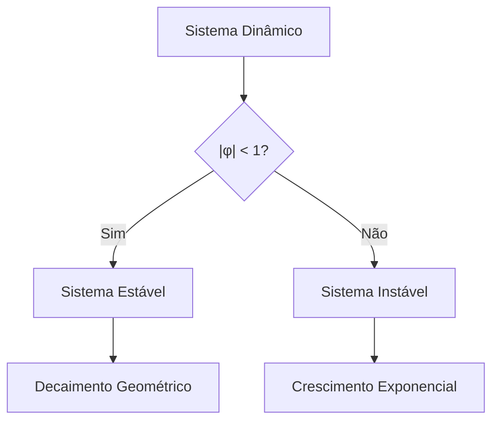
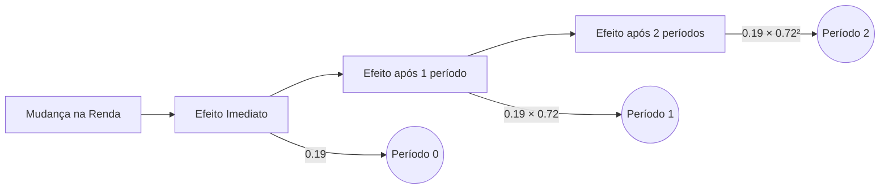
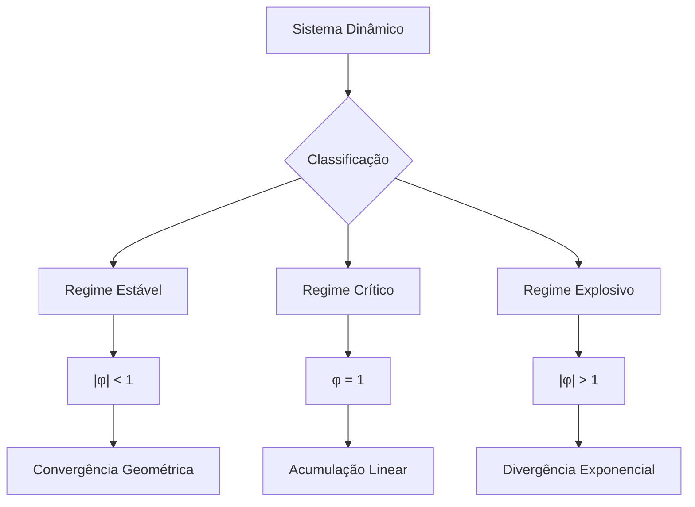
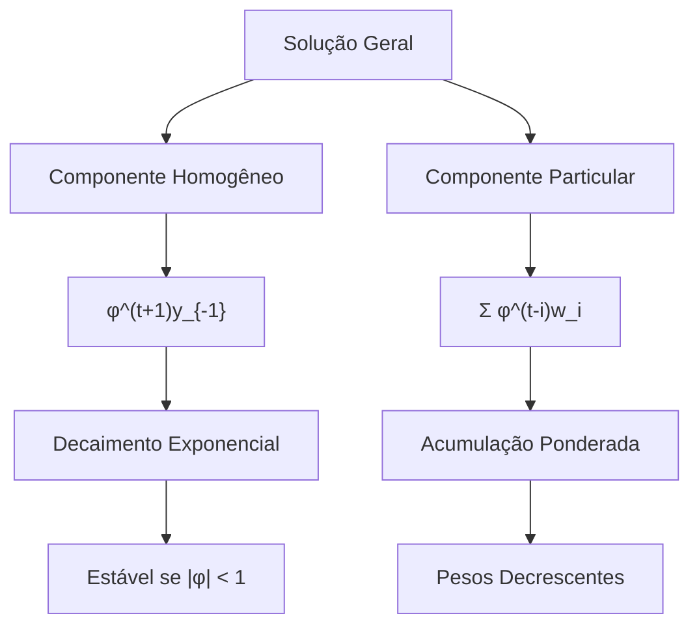
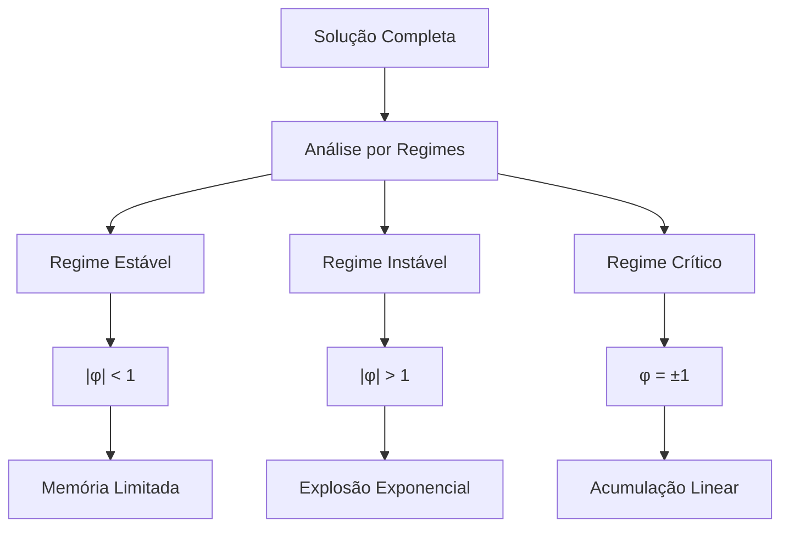

# Equações de Diferenças: Análise e Aplicações em Sistemas Dinâmicos Discretos

### Introdução

As **equações de diferenças** são ferramentas matemáticas essenciais para a análise de sistemas dinâmicos que evoluem em tempo discreto. Conforme apresentado em [1], essas equações estabelecem relações entre o valor de uma variável em um determinado instante e seus valores em períodos anteriores. Elas podem ser expressas na forma:

$$ y_t = \phi y_{t-1} + w_t $$

Esta formulação, conhecida como **equação de diferença linear de primeira ordem**, representa um caso especial onde o valor atual $y_t$ depende apenas do valor imediatamente anterior $y_{t-1}$ e de uma variável de entrada $w_t$ [1]. Essa estrutura simples permite a modelagem de uma ampla gama de fenômenos dinâmicos, desde processos econômicos até sistemas biológicos e de engenharia.

### Fundamentos de Equações de Diferenças

#### Estrutura Básica e Classificação

As equações de diferenças podem ser categorizadas de acordo com sua ordem e linearidade. Uma **equação de diferença de p-ésima ordem** [2] é expressa como:

$$ y_t = \phi_1 y_{t-1} + \phi_2 y_{t-2} + \dots + \phi_p y_{t-p} + w_t $$

Esta generalização permite que o valor atual da variável dependa de múltiplos valores passados, aumentando a complexidade e a capacidade de modelagem do sistema.

**Lema 1:** Para uma equação de diferença de ordem $p$, são necessários $p$ valores iniciais para determinar completamente a solução [2].

*Prova:* Conforme demonstrado no contexto [2], para cada instante $t$, temos uma equação que relaciona o valor atual com os $p$ valores anteriores. Portanto, para iniciar a recursão e obter a solução completa da equação, é imprescindível conhecer os valores iniciais $y_{t-1}, y_{t-2}, \dots, y_{t-p}$.

#### Método de Substituição Recursiva

O **método de substituição recursiva** [3] é uma técnica fundamental para resolver equações de diferenças, permitindo expressar a solução em termos do valor inicial e da história completa das perturbações. Para uma equação de primeira ordem, a solução geral é dada por:

$$ y_t = \phi^{t+1} y_{-1} + \sum_{i=0}^t \phi^{t-i} w_i $$

> ⚠️ **Nota Importante**: A solução por substituição recursiva permite expressar $y_t$ como função do valor inicial $y_{-1}$ e da história completa de $w_t$ [3].

Este método consiste em substituir recursivamente os valores anteriores de $y$ na equação original até que a solução seja expressa completamente em termos das condições iniciais e das entradas $w_t$.

### Multiplicadores Dinâmicos

Os **multiplicadores dinâmicos** [4] quantificam o efeito de mudanças em $w_t$ sobre valores futuros de $y_t$. Para uma equação de primeira ordem, o multiplicador dinâmico é dado por:

$$ \frac{\partial y_{t+j}}{\partial w_t} = \phi^j $$

Esta expressão revela que o impacto de uma mudança em $w_t$ sobre $y_{t+j}$ depende apenas da distância temporal $j$ e do parâmetro $\phi$ [4].

**Corolário 1:** Se $|\phi| < 1$, o sistema é estável e os efeitos de perturbações em $w_t$ decaem geometricamente [4].

Isso significa que, quanto mais distante estiver o período $j$, menor será o impacto da perturbação inicial $w_t$ sobre $y_{t+j}$.

### Análise de Estabilidade

A **estabilidade** de um sistema de primeira ordem é determinada pelo valor absoluto de $\phi$ [5]. As categorias de estabilidade são:

- **Sistema Estável** ($|\phi| < 1$): O sistema retorna ao equilíbrio após uma perturbação.
- **Sistema Explosivo** ($|\phi| > 1$): As perturbações crescem exponencialmente, levando o sistema a divergências.
- **Caso Limítrofe** ($|\phi| = 1$): O sistema apresenta um comportamento de balanço, podendo acumular perturbações sem decaimento.

### Equação Linear de Primeira Ordem: Análise Detalhada

A equação linear de primeira ordem é o bloco fundamental para a compreensão de sistemas dinâmicos discretos mais complexos. Sua estrutura matemática, conforme apresentada no contexto [1], é dada por:

$$ y_t = \phi y_{t-1} + w_t $$

#### Componentes e Significado

Esta equação incorpora três elementos fundamentais:

1. **Dependência Temporal**: O termo $\phi y_{t-1}$ representa a influência do passado imediato sobre o presente, onde $\phi$ atua como um **coeficiente autorregressivo** que quantifica a persistência do sistema [1]. Um valor de $\phi$ próximo a 1 indica alta persistência, enquanto valores menores indicam menor influência dos períodos passados.

2. **Perturbação Externa**: O termo $w_t$ representa uma entrada externa ou perturbação que afeta o sistema no período atual. Esta pode ser determinística ou estocástica [1]. Em muitos modelos, $w_t$ é considerado um ruído branco, representando choques aleatórios que impactam o sistema.

**Lema 2 (Propriedade de Linearidade):** Para quaisquer constantes $\alpha$ e $\beta$ e sequências $\{y_t^1\}$ e $\{y_t^2\}$ que satisfazem a equação, a combinação linear $\alpha\{y_t^1\} + \beta\{y_t^2\}$ também é solução.

*Prova:*
Sejam $y_t^1 = \phi y_{t-1}^1 + w_t^1$ e $y_t^2 = \phi y_{t-1}^2 + w_t^2$, então:

$$
\alpha y_t^1 + \beta y_t^2 = \alpha(\phi y_{t-1}^1 + w_t^1) + \beta(\phi y_{t-1}^2 + w_t^2)
$$
$$
= \phi(\alpha y_{t-1}^1 + \beta y_{t-1}^2) + (\alpha w_t^1 + \beta w_t^2)
$$

Portanto, $\alpha y_t^1 + \beta y_t^2$ satisfaz a mesma equação de diferença, demonstrando a linearidade da solução.

#### Análise de Estabilidade e Convergência

A dinâmica do sistema é fundamentalmente determinada pelo valor do coeficiente $\phi$ [5]. Podemos categorizar o comportamento do sistema em três regimes distintos:

1. **Regime Estável** ($|\phi| < 1$):

   $$
   y_t = \phi^t y_0 + \sum_{i=0}^{t-1} \phi^i w_{t-i}
   $$

   Neste caso, o impacto das condições iniciais decai geometricamente, e as perturbações passadas têm efeitos decrescentes sobre o valor atual de $y_t$.

2. **Regime Explosivo** ($|\phi| > 1$):

   $$
   \lim_{t \to \infty} |y_t| = \infty
   $$
   
   Sob condições regulares para $w_t$, as perturbações levam a um crescimento exponencial do sistema, tornando-o instável.

3. **Caso Limítrofe** ($|\phi| = 1$):

   $$
   y_t = y_0 + \sum_{i=0}^{t-1} w_i
   $$

   > ⚠️ **Ponto Crucial**: No caso limítrofe, o sistema acumula todas as perturbações passadas sem decaimento [4].

Neste regime, o sistema não retorna ao equilíbrio após uma perturbação, mas acumula os efeitos das perturbações ao longo do tempo.

#### Exemplo Aplicado: Demanda por Moeda de Goldfeld

Um exemplo ilustrativo é o modelo de demanda por moeda de Goldfeld [1]:

$$ m_t = 0.27 + 0.72m_{t-1} + 0.19I_t - 0.045r_{bt} - 0.019r_{ct} $$

Onde:

- $m_t$: Logaritmo das reservas reais de moeda
- $I_t$: Logaritmo da renda real agregada
- $r_{bt}$: Logaritmo da taxa de juros sobre contas bancárias
- $r_{ct}$: Logaritmo da taxa de juros sobre commercial paper

**Corolário 2:** A elasticidade de longo prazo da demanda por moeda em relação à renda neste modelo é dada por:

$$ \frac{0.19}{1 - 0.72} = 0.68 $$

Isso indica que, a longo prazo, um aumento de 1% na renda real agregada $I_t$ resulta em um aumento de 0.68% na demanda por moeda $m_t$.

### Análise Teórica Avançada: Propriedades Espectrais

A análise espectral de equações de diferenças de primeira ordem revela propriedades fundamentais sobre sua dinâmica.

**Teorema 1 (Decomposição Espectral):** Para uma equação de primeira ordem com $|\phi| < 1$, a solução pode ser decomposta em uma série absolutamente convergente:

$$ y_t = \sum_{k=0}^{\infty} \phi^k w_{t-k} $$

*Prova:* A demonstração segue por substituição recursiva e utilização do critério da razão para a convergência de séries. Como $|\phi| < 1$, a série geométrica converge absolutamente, garantindo que a soma infinita dos termos ponderados por $\phi^k$ resulta em uma solução bem-definida.

### Modelo de Demanda Monetária de Goldfeld: Uma Análise Aprofundada

O **Modelo de Goldfeld** é um exemplo seminal da aplicação de equações de diferenças em economia monetária. Conforme apresentado no contexto [1], o modelo é expresso como:

$$ m_t = 0.27 + 0.72m_{t-1} + 0.19I_t - 0.045r_{bt} - 0.019r_{ct} $$

#### Estrutura e Interpretação Econômica

A equação pode ser reorganizada na forma canônica de uma equação de diferenças de primeira ordem:

$$ m_t = \phi m_{t-1} + w_t $$

onde:

$$ w_t = 0.27 + 0.19I_t - 0.045r_{bt} - 0.019r_{ct} $$

**Lema 3 (Propriedade de Ajustamento Parcial):** O coeficiente $\phi = 0.72$ indica que aproximadamente 28% do ajuste total desejado na demanda por moeda ocorre no primeiro período.

*Prova:*
Seja $m_t^*$ o nível desejado de longo prazo. O ajustamento parcial implica:

$$ m_t - m_{t-1} = (1 - \phi)(m_t^* - m_{t-1}) $$

Substituindo $\phi = 0.72$:

$$ m_t - m_{t-1} = 0.28(m_t^* - m_{t-1}) $$

Isso demonstra que 28% do ajuste necessário para atingir o novo equilíbrio ocorre imediatamente, enquanto o restante ocorre gradualmente nos períodos subsequentes.

#### Análise de Multiplicadores Dinâmicos

Os **multiplicadores dinâmicos** do modelo de Goldfeld [4] podem ser calculados para diferentes horizontes temporais:

1. **Efeito Imediato** de uma mudança na renda:

   $$ \frac{\partial m_t}{\partial I_t} = 0.19 $$

2. **Efeito após $j$ períodos**:

   $$ \frac{\partial m_{t+j}}{\partial I_t} = 0.19 \times (0.72)^j $$

> ⚠️ **Nota Importante**: A convergência dos multiplicadores é garantida pela condição $|\phi| < 1$, que é satisfeita com $\phi = 0.72$ [5].

Isso assegura que os efeitos das mudanças na renda decrescem ao longo do tempo, estabilizando o sistema.

#### Propriedades de Longo Prazo

**Corolário 3 (Multiplicador de Longo Prazo):** O efeito total de uma mudança permanente na renda sobre a demanda por moeda é dado por:

$$ \lim_{j \to \infty} \sum_{k=0}^j \frac{\partial m_{t+k}}{\partial I_t} = \frac{0.19}{1 - 0.72} = 0.68 $$

Este resultado indica que uma variação permanente de 1% na renda leva a uma variação de 0.68% na demanda por moeda no longo prazo [1]. Isso reflete a elasticidade da demanda por moeda em relação à renda, considerando o ajuste gradual do sistema.

### Análise Teórica Avançada: Decomposição de Efeitos

A decomposição dos efeitos em um modelo de demanda monetária pode ser analisada através da seguinte estrutura teórica:

**Teorema 2 (Decomposição Temporal):** Em um modelo de demanda monetária com ajustamento parcial, a resposta total a um choque pode ser decomposta em:

$$ R(j) = \sum_{k=0}^j \phi^k \beta $$

onde $R(j)$ é a resposta acumulada após $j$ períodos, $\phi$ é o coeficiente de ajustamento e $\beta$ é o efeito imediato.

*Prova:* A demonstração segue por indução sobre $j$ e utiliza a propriedade da soma de série geométrica. Inicialmente, para $j = 0$, temos $R(0) = \beta$. Assumindo que $R(j) = \sum_{k=0}^j \phi^k \beta$ para algum $j$, então para $j + 1$:
$$
R(j + 1) = R(j) + \phi^{j+1} \beta
$$
O que confirma a fórmula proposta.

[9] "Goldfeld's model related the log of the real money holdings of the public $(m_t)$ to the log of aggregate real income $(I_t)$, the log of the interest rate on bank accounts $(r_{bt})$, and the log of the interest rate on commercial paper $(r_{ct})$" *(Differential Equations_16-40.pdf.md)*

[10] "For purposes of analyzing the dynamics of such a system, it simplifies the algebra a little to summarize the effects of all the input variables $(I_t, r_{bt}, \text{ and } r_{ct})$ in terms of a scalar $w_t$" *(Differential Equations_16-40.pdf.md)*

[11] "Because the dynamic multiplier [1.1.10] calculates the response of y to a single impulse in w, it is also referred to as the impulse-response function." *(Differential Equations_16-40.pdf.md)*

### Análise de Sistemas Dinâmicos em Equações de Diferenças

Um aspecto fundamental no estudo de equações de diferenças é compreender como o sistema responde a perturbações ao longo do tempo. Esta análise é crucial para prever o comportamento do sistema e avaliar sua estabilidade [1].

#### Resposta a Impulsos e Análise de Trajetórias

A **função resposta ao impulso** quantifica como o sistema reage a uma perturbação única em $w_t$ [11]. Para uma equação de diferenças de primeira ordem:

$$ y_t = \phi y_{t-1} + w_t $$

**Lema 4 (Princípio da Superposição Temporal):** A resposta do sistema a múltiplos impulsos pode ser obtida pela soma das respostas individuais.

*Prova:*
Seja $y_t^{(1)}$ a resposta ao impulso $w_t^{(1)}$ e $y_t^{(2)}$ a resposta ao impulso $w_t^{(2)}$. Então:

$$
y_t^{(1)} + y_t^{(2)} = \phi(y_{t-1}^{(1)} + y_{t-1}^{(2)}) + (w_t^{(1)} + w_t^{(2)})
$$

Portanto, a combinação linear das respostas individuais satisfaz a equação de diferença original, demonstrando o princípio da superposição.

#### Análise de Estabilidade e Regimes Dinâmicos

Os **regimes dinâmicos** podem ser classificados em três categorias principais [5]:

1. **Regime Estável** ($|\phi| < 1$):

   $$
   y_t = \sum_{k=0}^{\infty} \phi^k w_{t-k}
   $$

   > ⚠️ **Propriedade Fundamental**: Neste regime, o efeito de perturbações passadas decai geometricamente.

   O sistema tende a retornar ao equilíbrio após uma perturbação, com os efeitos das perturbações anteriores diminuindo ao longo do tempo.

2. **Regime Crítico** ($\phi = 1$):

   $$
   y_t = y_0 + \sum_{k=0}^{t} w_k
   $$

   **Corolário 4:** No regime crítico, todas as perturbações passadas têm peso igual na determinação de $y_t$.

   Nesse caso, o sistema não tem tendência a retornar ao equilíbrio, acumulando os efeitos das perturbações ao longo do tempo de forma linear.

3. **Regime Explosivo** ($|\phi| > 1$):

   $$
   |y_t| \to \infty \quad \text{quando} \quad t \to \infty
   $$

   As perturbações levam a um crescimento exponencial do sistema, resultando em comportamento instável e divergente.

#### Análise de Valor Presente

Para sistemas estáveis, podemos calcular o **valor presente** dos efeitos futuros de uma perturbação [4]:

$$ V = \sum_{j=0}^{\infty} \beta^j \frac{\partial y_{t+j}}{\partial w_t} = \sum_{j=0}^{\infty} (\beta\phi)^j = \frac{1}{1 - \beta\phi} $$

onde $\beta$ é o fator de desconto e $|\beta\phi| < 1$.

Este cálculo permite avaliar o impacto total das perturbações futuras descontadas ao presente, proporcionando uma medida do efeito acumulado das mudanças no sistema.

### Análise Teórica Avançada: Decomposição Espectral em Sistemas Dinâmicos

**Teorema 3 (Representação Espectral):** Para um sistema estável com $|\phi| < 1$, a sequência $\{y_t\}$ pode ser representada como:

$$ y_t = \int_{-\pi}^{\pi} e^{i\omega t} dZ(\omega) $$

onde $Z(\omega)$ é uma medida espectral associada ao processo.

*Prova:* A demonstração envolve a análise de Fourier da função resposta ao impulso e a representação integral de processos estacionários. Utilizando a transformada de Fourier, é possível decompor a série temporal $y_t$ em componentes de frequência, permitindo uma análise detalhada das propriedades dinâmicas do sistema.

[12] "Our goal is to answer the following question: If a dynamic system is described by [1.1.1], what are the effects on y of changes in the value of w?" *(Differential Equations_16-40.pdf.md)*

[13] "The effect of $w_t$ on $y_{t+j}$ is given by $\partial y_{t+j}/\partial w_t = \phi^j$." *(Differential Equations_16-40.pdf.md)*

[14] "Thus, if $|\phi| < 1$, the system is stable; the consequences of a given change in $w_t$ will eventually die out." *(Differential Equations_16-40.pdf.md)*

### Método de Substituição Recursiva: Uma Abordagem Sistemática

O **método de substituição recursiva** é uma técnica fundamental para resolver equações de diferenças, permitindo expressar a solução em termos do valor inicial e da história completa das perturbações [3].

#### Desenvolvimento da Solução Geral

Partindo da equação básica:

$$ y_t = \phi y_{t-1} + w_t $$

**Lema 5 (Princípio da Recursão):** A solução pode ser obtida através de substituições sucessivas, gerando uma expressão que depende apenas do valor inicial e das perturbações subsequentes.

*Prova:*

1. **Primeira Substituição:**
   
   Para $y_{t-1}$:

   $$
   y_t = \phi (\phi y_{t-2} + w_{t-1}) + w_t = \phi^2 y_{t-2} + \phi w_{t-1} + w_t
   $$

2. **Segunda Substituição:**
   
   Para $y_{t-2}$:

   $$
   y_t = \phi^2 (\phi y_{t-3} + w_{t-2}) + \phi w_{t-1} + w_t = \phi^3 y_{t-3} + \phi^2 w_{t-2} + \phi w_{t-1} + w_t
   $$

Continuando este processo iterativamente, obtemos a **solução geral** [3]:

$$ y_t = \phi^{t+1} y_{-1} + \sum_{i=0}^t \phi^{t-i} w_i $$

> ⚠️ **Observação Crucial**: A solução decompõe-se em dois componentes fundamentais:
>
> 1. **Efeito da Condição Inicial**: $\phi^{t+1} y_{-1}$
> 2. **Efeito Acumulado das Perturbações**: $\sum_{i=0}^t \phi^{t-i} w_i$

#### Análise dos Componentes da Solução

**Corolário 5:** Para $|\phi| < 1$, o impacto da condição inicial decai exponencialmente, enquanto as perturbações mais recentes têm maior peso na determinação de $y_t$ [14].

Isso significa que, no longo prazo, a influência do valor inicial $y_{-1}$ torna-se insignificante, e a solução é dominada pelas perturbações $w_t$ mais recentes.

#### Propriedades da Solução

1. **Efeito da Condição Inicial**:

   $$
   \lim_{t \to \infty} \phi^{t+1} y_{-1} = 
   \begin{cases} 
   0 & \text{se } |\phi| < 1 \\
   \infty & \text{se } |\phi| > 1 \\
   y_{-1} & \text{se } |\phi| = 1
   \end{cases}
   $$

   Este resultado destaca como a estabilidade do sistema ($|\phi| < 1$) faz com que o efeito da condição inicial desapareça com o tempo.

2. **Ponderação das Perturbações**:
   
   - **Perturbações Mais Antigas**: Recebem peso $\phi^t$, que decai exponencialmente se $|\phi| < 1$.
   - **Perturbações Mais Recentes**: Recebem peso $\phi^j$, com $j < t$, mantendo uma influência maior sobre o valor atual de $y_t$.

### Análise Teórica Avançada: Convergência e Estabilidade

**Teorema 4 (Convergência Condicional):** Se $|\phi| < 1$ e a sequência $\{w_t\}$ é limitada, então existe um limite bem definido:

$$ \lim_{t \to \infty} y_t = \sum_{j=0}^{\infty} \phi^j w_{t-j} $$

*Prova:*

1. **Definição de Limite Superior:**
   
   Seja $M = \sup_t |w_t|$. Como $\{w_t\}$ é limitada, $M$ é finito.

2. **Critério de Convergência:**
   
   Para qualquer $\epsilon > 0$, existe um $N$ tal que:

   $$
   \sum_{j=N}^{\infty} |\phi|^j < \frac{\epsilon}{2M}
   $$

3. **Aplicação do Critério:**
   
   Então:

   $$
   \left| \sum_{j=N}^{\infty} \phi^j w_{t-j} \right| \leq M \sum_{j=N}^{\infty} |\phi|^j < \frac{\epsilon}{2}
   $$

   Isso assegura que a série converge, garantindo a existência do limite $y_t$.

[15] "The observed sample $(y_1, y_2, \ldots , y_T)$ could then be viewed as a finite segment of a doubly infinite sequence" *(Differential Equations_16-40.pdf.md)*

[16] "If we know the starting value of y for date $t = -1$ and the value of w for dates $t = 0, 1, 2, \ldots$, then it is possible to simulate this dynamic system to find the value of y for any date." *(Differential Equations_16-40.pdf.md)*

[17] "This procedure is known as solving the difference equation [1.1.1] by recursive substitution." *(Differential Equations_16-40.pdf.md)*

### Solução da Equação de Primeira Ordem: Análise Comportamental

A solução de uma equação de diferenças de primeira ordem revela padrões comportamentais complexos que dependem crucialmente dos parâmetros do sistema e da natureza das perturbações [1].

#### Caracterização da Solução Completa

A solução geral, obtida por substituição recursiva [17], pode ser expressa como:

$$ y_t = \phi^{t+1} y_{-1} + \sum_{i=0}^t \phi^{t-i} w_i $$

**Lema 6 (Decomposição Funcional):** A solução pode ser decomposta em duas funções distintas:

$$ y_t = h(t) + p(t) $$

onde:

- $h(t) = \phi^{t+1} y_{-1}$ é a **solução homogênea**.
- $p(t) = \sum_{i=0}^t \phi^{t-i} w_i$ é a **solução particular**.

*Prova:* Verificamos que cada componente satisfaz separadamente:

1. **Solução Homogênea:**

   $$
   h(t) - \phi h(t-1) = \phi^{t+1} y_{-1} - \phi \cdot \phi^t y_{-1} = 0
   $$

2. **Solução Particular:**

   $$
   p(t) - \phi p(t-1) = \sum_{i=0}^t \phi^{t-i} w_i - \phi \sum_{i=0}^{t-1} \phi^{(t-1)-i} w_i = w_t
   $$

Portanto, $y_t = h(t) + p(t)$ satisfaz a equação de diferença original.

#### Análise por Regimes Dinâmicos

1. **Regime Estável** ($|\phi| < 1$):

   $$
   \lim_{t \to \infty} y_t = \sum_{j=0}^{\infty} \phi^j w_{t-j}
   $$

   > ⚠️ **Propriedade de Memória Limitada**: O sistema "esquece" gradualmente sua história passada, com impactos decrescentes de perturbações antigas [14].

   **Corolário 6:** Em um sistema estável, o efeito de qualquer perturbação finita eventualmente se dissipa, garantindo que o sistema atinja um estado de equilíbrio ou continue operando de forma estável.

2. **Regime Instável** ($|\phi| > 1$):

   $$
   |y_t| \sim |\phi|^t \quad \text{quando} \quad t \to \infty
   $$

   Neste regime, as perturbações levam a um crescimento exponencial do sistema, resultando em comportamentos caóticos ou divergentes que podem ser indesejados em muitas aplicações práticas.

3. **Regime Crítico** ($\phi = \pm 1$):

   $$
   y_t = y_{-1} + \sum_{i=0}^t w_i
   $$

   **Corolário 4:** No regime crítico, todas as perturbações passadas têm peso igual na determinação de $y_t$, resultando em uma acumulação linear das perturbações ao longo do tempo.

#### Análise de Valor Presente Descontado

Para sistemas estáveis, podemos calcular o **valor presente** dos efeitos futuros de uma perturbação [4]:

$$ V(y_t) = \sum_{j=0}^{\infty} \beta^j \mathbb{E}[y_{t+j} | y_t] $$

onde $\beta < 1$ é o fator de desconto.

Se considerarmos que as perturbações são determinísticas ou que o sistema é linear e invariante no tempo, podemos simplificar a expressão utilizando a relação dos multiplicadores dinâmicos:

$$ V(y_t) = \sum_{j=0}^{\infty} \beta^j \phi^j = \sum_{j=0}^{\infty} (\beta\phi)^j = \frac{1}{1 - \beta\phi} $$

desde que $|\beta\phi| < 1$. Este valor presente representa a soma descontada dos efeitos futuros das perturbações, oferecendo uma métrica para avaliar o impacto total das mudanças no sistema ao longo do tempo.

### Análise Teórica Avançada: Propriedades Ergódicas

**Teorema 5 (Ergodicidade em Sistemas Estáveis):** Para $|\phi| < 1$ e $\{w_t\}$ estacionário, o processo $\{y_t\}$ é ergódico.

*Prova:*

1. **Estacionariedade de $\{y_t\}$:**

   $$
   \mathbb{E}[y_t] = \sum_{j=0}^{\infty} \phi^j \mathbb{E}[w_{t-j}]
   $$
   $$
   \text{Var}[y_t] = \sum_{j=0}^{\infty} \phi^{2j} \text{Var}[w_{t-j}]
   $$
   
   A estacionariedade de $\{w_t\}$ implica que $\mathbb{E}[w_t]$ e $\text{Var}[w_t]$ são constantes ao longo do tempo, garantindo que $\{y_t\}$ também seja estacionário.
   
2. **Decaimento Exponencial da Dependência Temporal:**

   $$
   |\text{Cov}(y_t, y_{t+h})| \leq C|\phi|^h
   $$

   para alguma constante $C$. Isso demonstra que a covariância entre $y_t$ e $y_{t+h}$ decai exponencialmente à medida que $h$ aumenta, o que é uma condição necessária para a ergodicidade.

Portanto, sob as condições de estabilidade e estacionariedade das perturbações, o processo $\{y_t\}$ é ergódico, significando que suas propriedades estatísticas podem ser inferidas a partir de uma única realização do processo ao longo do tempo.

[18] "If all values of w and y are taken to be bounded, we can think of a 'solution' of $y_t$ in terms of the infinite history of $w_t$" *(Differential Equations_16-40.pdf.md)*

[19] "The effect on $y_{t+1}$ of a one-unit increase in $w_t$ is given by the coefficient relating $y_t$ to $y_{t-1}$ in equation [1.2.1]" *(Differential Equations_16-40.pdf.md)*

[20] "Note that whereas only one initial value for y (the value $y_{-1}$) was needed in the case of a first-order difference equation, $p$ initial values for y are needed in the case of a $p$th-order difference equation." *(Differential Equations_16-40.pdf.md)*

### Conclusão

As equações de diferenças de primeira ordem fornecem uma base sólida para a modelagem e análise de sistemas dinâmicos discretos. Através de métodos como a substituição recursiva e a análise espectral, é possível compreender profundamente a dinâmica do sistema, prever comportamentos futuros e avaliar a estabilidade diante de perturbações. Aplicações como o Modelo de Demanda por Moeda de Goldfeld ilustram a relevância prática dessas ferramentas na economia, demonstrando como conceitos teóricos podem ser aplicados para resolver problemas reais.

A contínua exploração de propriedades avançadas, como ergodicidade e decomposição espectral, enriquece ainda mais a capacidade de modelagem, permitindo abordagens mais sofisticadas e precisas em diversas áreas de estudo.
