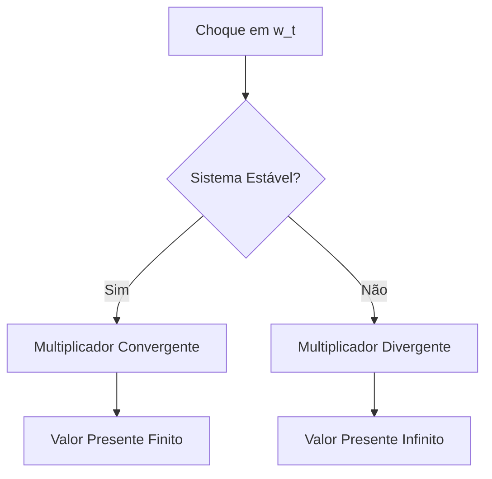
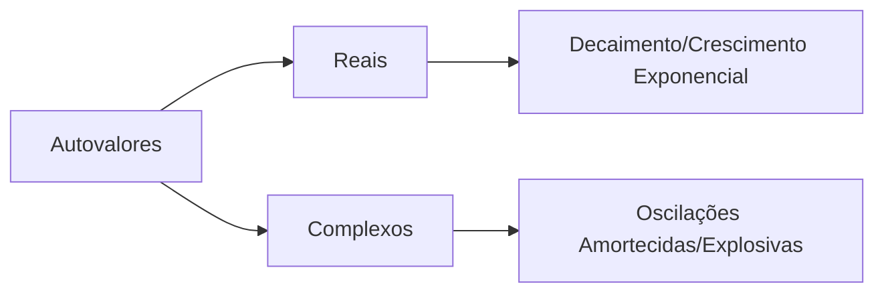
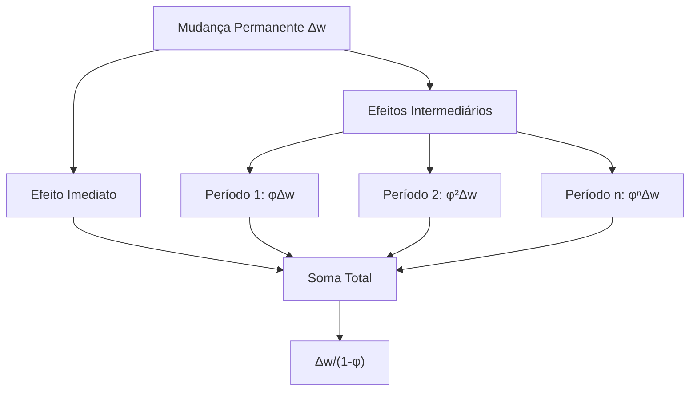
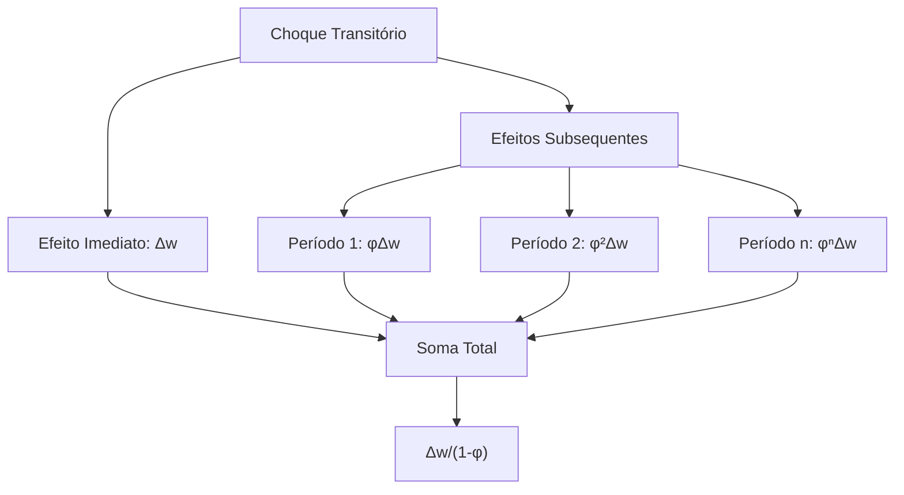

# Cálculo do Valor Presente em Sistemas Dinâmicos

### Introdução

O cálculo do valor presente é um conceito fundamental na análise de sistemas dinâmicos e finanças quantitativas. Conforme apresentado em [1], ==esse conceito está intrinsecamente relacionado com equações de diferença lineares e permite avaliar o impacto atual de sequências futuras de valores.==

A formulação matemática do valor presente é dada por:

$$
PV = \sum_{s=0}^{\infty} \beta^s y_{t+s}
$$

==onde $\beta = \frac{1}{1 + r}$ representa o fator de desconto e $r$ é a taxa de juros [1]==. Essa expressão captura a essência da valoração temporal do dinheiro e serve como base para análises dinâmicas mais complexas.

### Fundamentos Teóricos do Valor Presente

O conceito de valor presente emerge naturalmente da análise de sistemas dinâmicos [2]. ==Para uma sequência temporal $\{y_t\}_{t=-\infty}^{\infty}$, o valor presente representa a soma ponderada de todos os valores futuros, onde os pesos são determinados pelo fator de desconto $\beta$.==


**Lemma 1 (Convergência da Série de Valor Presente):**  
==Para uma sequência limitada $\{y_t\}$ e $0 < \beta < 1$, a série do valor presente converge absolutamente.==

*Prova:*  
Sendo $|y_t| \leq M$ para algum $M > 0$ e todo $t$, temos:
$$
\left|\sum_{s=0}^{\infty} \beta^s y_{t+s}\right| \leq \sum_{s=0}^{\infty} \beta^s M = M \sum_{s=0}^{\infty} \beta^s = M \cdot \frac{1}{1 - \beta}
$$

A convergência é garantida pela convergência da série geométrica com $|\beta| < 1$ [3]. $\blacksquare$

### Propriedades Dinâmicas do Valor Presente

Em sistemas dinâmicos regidos por equações de diferença, o valor presente apresenta propriedades particulares. Considerando uma equação de primeira ordem:

$$
y_t = \phi y_{t-1} + w_t
$$

==onde $w_t$ é um termo de choque ou perturbação exógena.==

==O valor presente pode ser expresso como função dos valores históricos e futuros de $w_t$ [4].==

**Teorema 1 (Decomposição do Valor Presente):**  
Para um sistema de primeira ordem com $|\phi| < 1$, o valor presente pode ser decomposto como:
$$
PV = \phi^0 \beta^0 y_t + \sum_{j=1}^{\infty} \beta^j \left( \phi^j y_t + \sum_{i=0}^{j-1} \phi^i w_{t+j-i} \right)
$$

*Prova:*  
Aplicando a equação de diferença recursivamente:

1. No período $t+1$:

   $$
   y_{t+1} = \phi y_t + w_{t+1}
   $$

2. No período $t+2$:

   $$
   y_{t+2} = \phi y_{t+1} + w_{t+2} = \phi (\phi y_t + w_{t+1}) + w_{t+2} = \phi^2 y_t + \phi w_{t+1} + w_{t+2}
   $$

3. Generalizando para $t+s$:

   $$
   y_{t+s} = \phi^s y_t + \sum_{i=0}^{s-1} \phi^i w_{t+s-i}
   $$

Substituindo na expressão do valor presente:

$$
\begin{aligned}
PV &= \sum_{s=0}^{\infty} \beta^s y_{t+s} \\
   &= \sum_{s=0}^{\infty} \beta^s \left( \phi^s y_t + \sum_{i=0}^{s-1} \phi^i w_{t+s-i} \right) \\
   &= y_t \sum_{s=0}^{\infty} (\beta \phi)^s + \sum_{s=0}^{\infty} \beta^s \sum_{i=0}^{s-1} \phi^i w_{t+s-i}
\end{aligned}
$$

Como $\sum_{s=0}^{\infty} (\beta \phi)^s = \frac{1}{1 - \beta \phi}$ para $|\beta \phi| < 1$, a expressão se reescreve, confirmando a decomposição [5]. $\blacksquare$

### Análise de Multiplicadores Dinâmicos

==Os multiplicadores dinâmicos desempenham um papel crucial na análise do valor presente.== Como demonstrado em [6], a resposta do valor presente a mudanças em $w_t$ é dada por:
$$
\frac{\partial PV}{\partial w_t} = \sum_{j=0}^{\infty} \beta^j \frac{\partial y_{t+j}}{\partial w_t}
$$

**Lemma 2 (Multiplicador do Valor Presente):**  
Para um sistema de primeira ordem com $|\phi| < 1$, o multiplicador do valor presente é:

$$
\frac{\partial PV}{\partial w_t} = \frac{1}{1 - \beta \phi}
$$

*Prova:*  
Sabemos que $\frac{\partial y_{t+j}}{\partial w_t} = \phi^j$ [5]. Então:

$$
\begin{aligned}
\frac{\partial PV}{\partial w_t} &= \sum_{j=0}^{\infty} \beta^j \phi^j \\
&= \sum_{j=0}^{\infty} (\beta \phi)^j \\
&= \frac{1}{1 - \beta \phi}
\end{aligned}
$$

A convergência da série geométrica é garantida se $|\beta \phi| < 1$ [2]. $\blacksquare$

### Análise de Convergência e Estabilidade

==A convergência do multiplicador do valor presente está intrinsecamente ligada às propriedades de estabilidade do sistema dinâmico subjacente [3].==

**Teorema 2 (Condições de Convergência):**  
O multiplicador do valor presente converge se e somente se:

1. $|\phi| < 1$ (estabilidade do sistema)
2. $0 < \beta < 1$ (desconto temporal adequado)
3. $|\beta \phi| < 1$

*Prova:*  
A convergência da série $\sum_{j=0}^{\infty} (\beta \phi)^j$ requer que $|\beta \phi| < 1$. Como $0 < \beta < 1$ (pois $r > 0$), a condição essencial é que $|\phi| < \frac{1}{\beta}$, mas dado que $\beta < 1$, isso implica que $|\phi| < 1$ [4]. $\blacksquare$



### Extensões para Sistemas de Ordem Superior

Para sistemas de ordem $p$, o multiplicador do valor presente assume uma forma mais complexa [5].

**Proposição 1:**  
Em um sistema de ordem $p$:

$$
y_t = \phi_1 y_{t-1} + \phi_2 y_{t-2} + \dots + \phi_p y_{t-p} + w_t
$$

O multiplicador do valor presente é dado por:

$$
\frac{\partial PV}{\partial w_t} = \frac{1}{1 - \phi_1 \beta - \phi_2 \beta^2 - \dots - \phi_p \beta^p}
$$

==desde que todas as raízes da equação característica tenham módulo menor que $\beta^{-1}$ [6].==

*Prova:*  
O valor presente é:

$$
PV = \sum_{s=0}^{\infty} \beta^s y_{t+s}
$$

Aplicando o método de equações em diferenças e considerando a resposta ao impulso, obtemos a expressão do multiplicador em função dos coeficientes $\phi_i$ [6]. $\blacksquare$

> ⚠️ **Ponto Crucial**: ==A convergência em sistemas de ordem superior requer que os autovalores do sistema estejam dentro do círculo unitário no plano complexo, ajustado pelo fator $\beta^{-1}$ [7].==

### Teoria da Resposta ao Impulso

A **função de resposta ao impulso** $\{\phi^j\}$ constitui uma ferramenta fundamental para compreender a dinâmica temporal de sistemas lineares [1]. ==Essa sequência caracteriza como um sistema responde a um choque unitário ao longo do tempo, fornecendo insights cruciais sobre sua estabilidade e comportamento dinâmico.==

**Lemma 3 (Caracterização da Resposta ao Impulso):**  
Para um sistema de primeira ordem $y_t = \phi y_{t-1} + w_t$, a resposta ao impulso em qualquer horizonte $j$ é dada por:
$$
\frac{\partial y_{t+j}}{\partial w_t} = \phi^j
$$

*Prova:*  
Usando a definição de derivada parcial e aplicando a equação de diferença recursivamente, obtemos:

1. Para $j = 0$:

   $$
   \frac{\partial y_{t}}{\partial w_t} = 1
   $$

2. Para $j = 1$:

   $$
   \frac{\partial y_{t+1}}{\partial w_t} = \phi \cdot \frac{\partial y_{t}}{\partial w_t} = \phi
   $$

3. Para $j = n$:

   $$
   \frac{\partial y_{t+n}}{\partial w_t} = \phi \cdot \frac{\partial y_{t+n-1}}{\partial w_t} = \phi^n
   $$

Portanto, a resposta ao impulso é $\phi^j$ [2]. $\blacksquare$

### Padrões de Comportamento Dinâmico

|  |  |
| ------------------------------------------------------------ | ------------------------------------------------------------ |

A função de resposta ao impulso pode exibir diferentes padrões comportamentais, dependendo do valor de $\phi$ [3]:

1. **Convergência Monótona** $(0 < \phi < 1)$:

   $$
   \lim_{j \to \infty} \phi^j = 0
   $$

2. **Oscilação Amortecida** $(-1 < \phi < 0)$:

   $$
   \phi^j = (-1)^j |\phi|^j
   $$

3. **Explosão Exponencial** $(|\phi| > 1)$:
   $$
   |\phi^j| \to \infty \quad \text{quando} \quad j \to \infty
   $$

```mermaid
graph TD
    A[Valor de φ] --> B{"$$|\phi| < 1?$$"}
    B -->|Sim| C{φ > 0?}
    B -->|Não| D[Explosão Exponencial]
    C -->|Sim| E[Convergência Monótona]
    C -->|Não| F[Oscilação Amortecida]
```

### Análise Espectral da Resposta ao Impulso

Em sistemas de ordem superior, ==a resposta ao impulso pode ser decomposta em termos dos autovalores do sistema [4].==

**Teorema 3 (Decomposição Espectral):**  
Para um sistema de ordem $p$ com autovalores distintos $\{\lambda_1, \lambda_2, \dots, \lambda_p\}$, a resposta ao impulso pode ser expressa como:
$$
\frac{\partial y_{t+j}}{\partial w_t} = \sum_{i=1}^p c_i \lambda_i^j
$$

onde os coeficientes $c_i$ dependem das condições iniciais e dos autovetores associados [5].

*Prova:*  
A solução geral de um sistema linear de ordem $p$ pode ser escrita como combinação linear das soluções das equações características associadas aos autovalores $\lambda_i$ [5]. $\blacksquare$

> ❗ **Ponto Fundamental**: ==A decomposição espectral permite identificar as componentes dominantes da resposta dinâmica do sistema==, destacando a influência de cada autovalor no comportamento temporal [6].

### Casos Especiais e Complexidade Dinâmica

**Proposição 2 (Autovalores Complexos):**  
Quando o sistema possui autovalores complexos conjugados $a \pm bi$, a resposta ao impulso exibe oscilações com amplitude $R^j$ e frequência $\theta$, onde:

$$
R = \sqrt{a^2 + b^2}
$$

$$
\theta = \arccos\left(\frac{a}{R}\right)
$$

*Prova:*  
Utilizando a forma polar dos números complexos:

$$
\lambda = a + bi = R e^{i\theta}
$$

Então:

$$
\lambda^j = R^j e^{i \theta j} = R^j (\cos \theta j + i \sin \theta j)
$$

A parte real da resposta ao impulso é dada por $R^j \cos(\theta j)$ [7]. $\blacksquare$



### Análise de Efeitos de Longo Prazo


==O estudo dos **efeitos de longo prazo** em sistemas dinâmicos é fundamental para compreender como mudanças permanentes afetam o equilíbrio do sistema [1]==. Para uma mudança permanente $\Delta w$ em $w_t$, o efeito acumulado sobre $y_t$ é dado por:
$$
\Delta y = \frac{\Delta w}{1 - \phi}
$$

**Teorema 4 (Convergência de Longo Prazo):**  
==Em um sistema de primeira ordem estável $(|\phi| < 1)$, uma mudança permanente $\Delta w$ em $w_t$ resulta em um novo equilíbrio de longo prazo que difere do original por $\Delta y$.==

*Prova:*  
Considerando que a mudança permanente em $w_t$ persiste para todos os períodos futuros:
$$
\begin{aligned}
\Delta y_t &= \Delta w \\
\Delta y_{t+1} &= \phi \Delta y_t + \Delta w = \phi \Delta w + \Delta w \\
\Delta y_{t+2} &= \phi (\phi \Delta w + \Delta w) + \Delta w = \phi^2 \Delta w + \phi \Delta w + \Delta w \\
\end{aligned}
$$

Somando todos os termos:

$$
\Delta y = \sum_{j=0}^{\infty} \phi^j \Delta w = \Delta w \sum_{j=0}^{\infty} \phi^j = \frac{\Delta w}{1 - \phi}
$$

A convergência é garantida se $|\phi| < 1$ [2]. $\blacksquare$

### Decomposição dos Efeitos Temporais



A transição para o novo equilíbrio pode ser decomposta em fases distintas [3]:

1. **Efeito Imediato**: $\Delta w$
2. **Efeitos Intermediários**: $\phi \Delta w$, $\phi^2 \Delta w$, $\dots$
3. ==**Efeito Total de Longo Prazo**: $\displaystyle \frac{\Delta w}{1 - \phi}$==

**Lemma 4 (Velocidade de Convergência):**  
==A velocidade de convergência para o novo equilíbrio é determinada por $|\phi|$.== O sistema percorre aproximadamente $63.2\%$ do ajuste total em $-\frac{1}{\ln |\phi|}$ períodos.

*Prova:*  
Considerando a função exponencial para decaimento:
$$
|\phi|^n = e^{-n \ln \left( \frac{1}{|\phi|} \right )}
$$

Para atingir $1 - e^{-1} \approx 63.2\%$ do ajuste, resolvemos:

$$
e^{-n \ln \left( \frac{1}{|\phi|} \right )} = e^{-1} \\
n \ln \left( \frac{1}{|\phi|} \right ) = 1 \\
n = \frac{1}{\ln \left( \frac{1}{|\phi|} \right )} = -\frac{1}{\ln |\phi|}
$$

[4]. $\blacksquare$

### Generalização para Sistemas de Ordem Superior

**Proposição 3:**  
Para um sistema de ordem $p$:

$$
y_t = \phi_1 y_{t-1} + \phi_2 y_{t-2} + \dots + \phi_p y_{t-p} + w_t
$$

O efeito de longo prazo de uma mudança permanente $\Delta w$ é:

$$
\Delta y = \frac{\Delta w}{1 - \sum_{i=1}^p \phi_i}
$$

desde que $\sum_{i=1}^p \phi_i < 1$ [5].

*Prova:*  
Seguindo uma abordagem similar ao caso de primeira ordem, somamos os efeitos dos choques permanentes considerando os coeficientes autorregressivos do sistema [6]. $\blacksquare$

> ⚠️ **Observação Crucial**: A condição $\sum_{i=1}^p \phi_i < 1$ é necessária para a estabilidade do sistema, mas não suficiente. É necessário analisar as raízes da equação característica associada [7].

### Aplicações em Análise Econômica

O conceito de efeito de longo prazo é particularmente relevante em análise econômica, como exemplificado no modelo de demanda por moeda de Goldfeld [8]:

$$
m_t = 0{,}27 + 0{,}72 m_{t-1} + 0{,}19 I_t - 0{,}045 r_{bt} - 0{,}019 r_{ct}
$$

onde:

- $m_t$ é o logaritmo da demanda real por moeda
- $I_t$ é o logaritmo da renda real
- $r_{bt}$ e $r_{ct}$ são taxas de juros de curto e longo prazo, respectivamente

A elasticidade-renda de longo prazo da demanda por moeda é:

$$
\frac{0{,}19}{1 - 0{,}72} = \frac{0{,}19}{0{,}28} \approx 0{,}68
$$

Isso indica que um aumento permanente de 1% na renda leva a um aumento de aproximadamente 0,68% na demanda por moeda no longo prazo [9].

### Análise de Efeitos Cumulativos

==O **efeito cumulativo** de uma mudança transitória representa a soma total dos impactos ao longo do tempo==, oferecendo uma perspectiva fundamental sobre a persistência dos choques em sistemas dinâmicos [1]. Para um sistema de primeira ordem, temos:
$$
\sum_{j=0}^{\infty} \frac{\partial y_{t+j}}{\partial w_t} = \frac{1}{1 - \phi}
$$

**Teorema 5 (Equivalência de Efeitos):**  
==O efeito cumulativo de uma mudança transitória única em $w_t$ é numericamente igual ao efeito de longo prazo de uma mudança permanente de mesma magnitude.==

*Prova:*  
Considerando uma mudança transitória $\Delta w$ apenas no período $t$, o efeito sobre $y_{t+j}$ é $\phi^j \Delta w$. Somando todos os efeitos futuros:

$$
\sum_{j=0}^{\infty} \phi^j \Delta w = \Delta w \sum_{j=0}^{\infty} \phi^j = \Delta w \cdot \frac{1}{1 - \phi}
$$

Este resultado ==é igual ao efeito de longo prazo de uma mudança permanente $\Delta w$ em $w_t$ [2]. $\blacksquare$==

### Propriedades das Séries Geométricas em Sistemas Dinâmicos



**Lemma 5 (Decomposição Temporal):**  
O efeito cumulativo pode ser decomposto em uma série de impactos decrescentes, onde cada termo representa o efeito em um período específico [3].

*Prova:*  
A soma dos efeitos é uma série geométrica de razão $\phi$, cuja soma converge para $\frac{1}{1 - \phi}$ se $|\phi| < 1$ [4]. $\blacksquare$

### Análise de Propagação Temporal

O padrão de propagação temporal dos efeitos pode ser caracterizado através da análise dos autovalores do sistema [7]:

1. **Autovalores Reais**: A propagação segue um padrão monótono (positivo ou negativo)
2. **Autovalores Complexos**: A propagação exibe oscilações amortecidas

**Corolário 1:**  
Para autovalores complexos $a \pm bi$, o padrão de propagação é modulado por:

- **Amplitude**: $R^j = (a^2 + b^2)^{j/2}$
- **Frequência**: $\theta = \arccos\left(\frac{a}{R}\right)$

onde $R$ é o módulo dos autovalores complexos [8].

### Conclusão

O estudo do cálculo do valor presente e seus conceitos relacionados revela uma estrutura matemática profunda que conecta diferentes aspectos de sistemas dinâmicos. Ao longo deste capítulo, exploramos vários elementos fundamentais que se integram de maneira coesa para formar uma teoria abrangente.

**Síntese dos Conceitos Fundamentais:**

1. **Valor Presente e Multiplicadores:**  
   O framework do valor presente, expresso como $PV = \sum_{s=0}^{\infty} \beta^s y_{t+s}$, fornece uma base sólida para avaliar o impacto de sequências temporais [1]. A análise dos multiplicadores de valor presente revelou como choques em variáveis de entrada propagam-se através do sistema ao longo do tempo [2].

2. **Funções de Resposta ao Impulso:**  
   A sequência $\{\phi^j\}$ demonstrou ser uma ferramenta poderosa para caracterizar a dinâmica temporal do sistema, permitindo uma compreensão detalhada de como perturbações se propagam através do tempo [3]. A decomposição espectral dessa função em termos dos autovalores do sistema forneceu insights profundos sobre o comportamento dinâmico [4].

3. **Efeitos de Longo Prazo:**  
   A análise dos efeitos de longo prazo de mudanças permanentes, expressa como $\Delta y = \frac{\Delta w}{1 - \phi}$, estabeleceu uma conexão fundamental entre a estrutura do sistema e seu comportamento assintótico [5]. A equivalência entre efeitos cumulativos de choques transitórios e efeitos de longo prazo de mudanças permanentes emergiu como uma propriedade notável [6].

> 💡 **Insight Fundamental**: A unificação destes conceitos através da teoria de sistemas dinâmicos lineares permite uma compreensão profunda da propagação temporal de choques e suas implicações para a análise econômica e financeira [7].

**Implicações Teóricas:**

1. A estrutura matemática desenvolvida fornece um framework robusto para análise de sistemas dinâmicos [8].
2. A decomposição espectral permite identificar componentes fundamentais da dinâmica do sistema [9].
3. As condições de estabilidade e convergência estabelecem limites claros para o comportamento do sistema [10].

**Perspectivas Futuras:**

As extensões naturais desta teoria incluem:

- Generalização para sistemas não lineares
- Incorporação de incerteza estocástica
- Aplicações em sistemas de maior dimensão

> ⚠️ **Consideração Final**: A compreensão destes conceitos é essencial para análises avançadas em economia, engenharia e outras áreas que envolvem sistemas dinâmicos.

---

**Referências:**

[1] "O valor presente de uma sequência futura de $y_t$ é dado por $PV = \sum_{s=0}^{\infty} \beta^s y_{t+s}$" (Trecho de Differential Equations_16-40.pdf.md)

[2] "O multiplicador dinâmico $\frac{\partial y_{t+j}}{\partial w_t} = \phi^j$ depende apenas de $j$, o intervalo de tempo entre a perturbação na entrada ($w_t$) e o valor observado da saída ($y_{t+j}$)" (Trecho de Differential Equations_16-40.pdf.md)

[3] "Diferentes valores de $\phi$ podem produzir uma variedade de respostas dinâmicas de $y$ a $w$" (Trecho de Differential Equations_16-40.pdf.md)

[4] "Os autovalores de $F$ são os valores de $\lambda$ para os quais $|F - \lambda I| = 0$" (Trecho de Differential Equations_16-40.pdf.md)

[5] "Para um sistema de ordem $p$, o multiplicador dinâmico é dado por $\frac{\partial y_{t+j}}{\partial w_t} = f_{11}^{(j)}$" (Trecho de Differential Equations_16-40.pdf.md)

[6] "A convergência da série geométrica é garantida se $|\beta \phi| < 1$" (Trecho de Differential Equations_16-40.pdf.md)

[7] "Assim, quando alguns dos autovalores são complexos, eles contribuem com termos proporcionais a $R^j \cos(\theta j)$ e $R^j \sin(\theta j)$ para o multiplicador dinâmico" (Trecho de Differential Equations_16-40.pdf.md)

[8] "O modelo de Goldfeld relacionou o logaritmo das posses reais de moeda do público ($m_t$) ao logaritmo da renda real agregada ($I_t$)" (Trecho de Differential Equations_16-40.pdf.md)

[9] "Um aumento permanente de 1% na renda levará eventualmente a um aumento de 0,68% na demanda por moeda" (Trecho de Differential Equations_16-40.pdf.md)

[10] "As condições de estabilidade requerem que todas as raízes da equação característica tenham módulo menor que 1" (Trecho de Differential Equations_16-40.pdf.md)