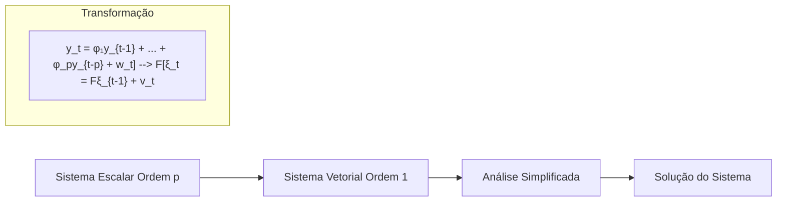
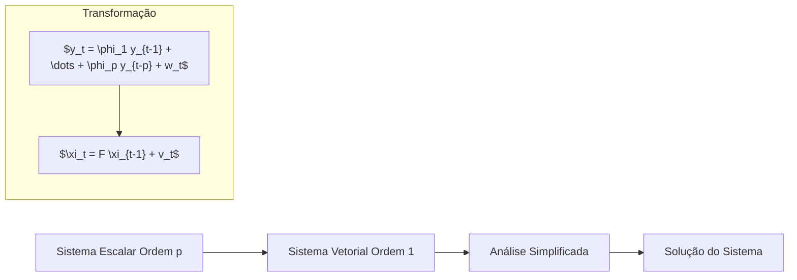
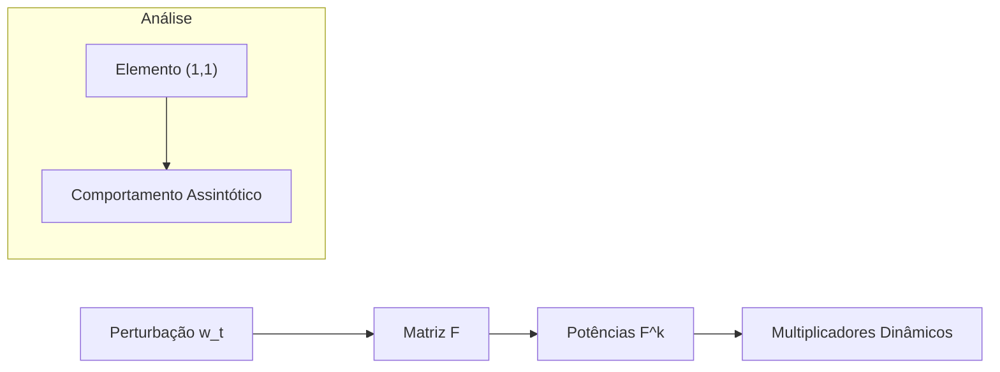
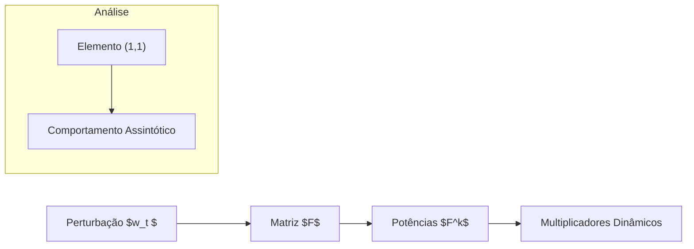
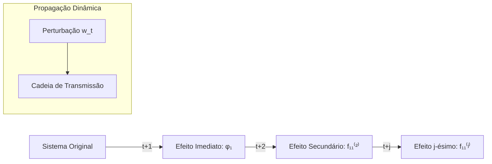
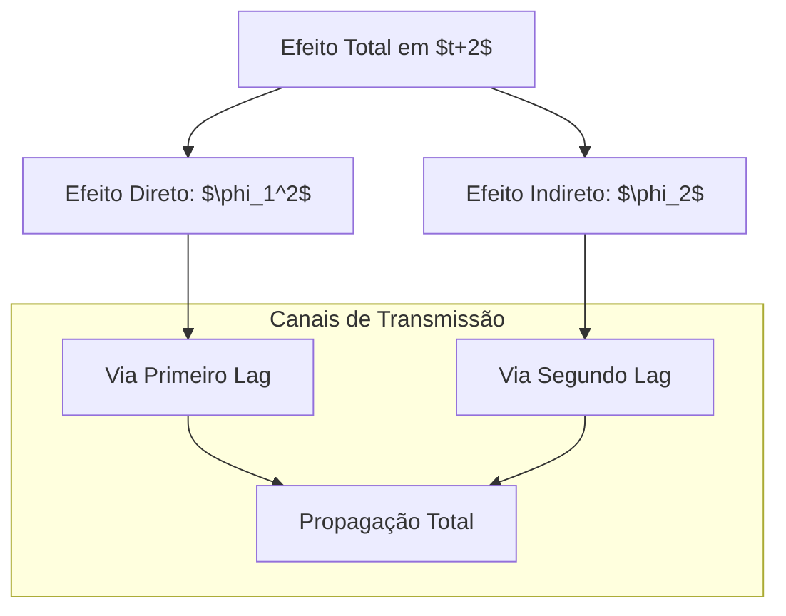
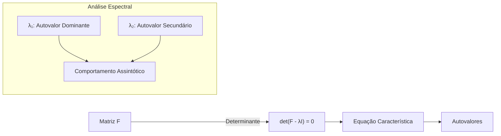
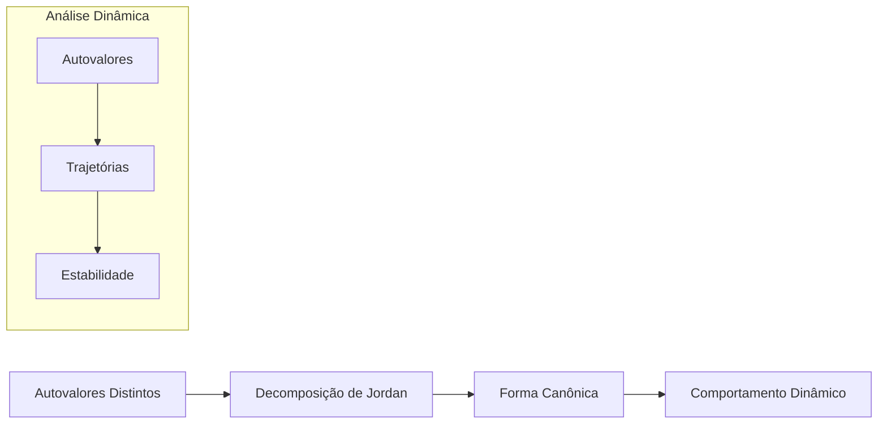
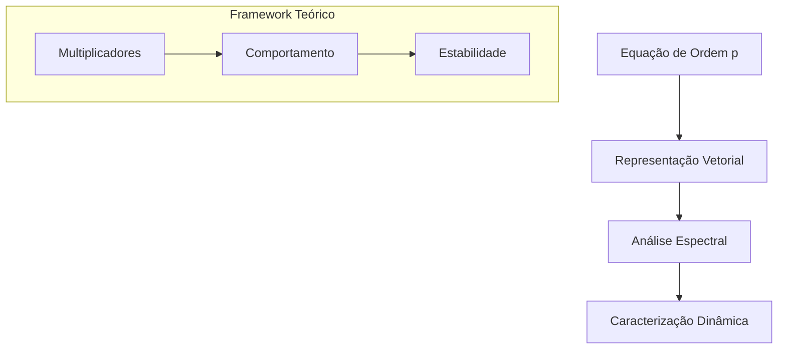

# Equações de Diferença de Ordem p e Análise de Sistemas Dinâmicos

<imagem: Diagrama complexo mostrando a evolução temporal de um sistema dinâmico de ordem p, com múltiplas trajetórias e pontos de equilíbrio, incluindo representações das relações entre variáveis defasadas>

### Introdução

As equações de diferença de ordem p constituem uma ferramenta fundamental na análise de sistemas dinâmicos, **permitindo modelar comportamentos complexos onde o estado atual do sistema depende de múltiplos estados anteriores [^1].** Este capítulo apresenta uma análise aprofundada dessas equações, explorando suas propriedades matemáticas e aplicações em sistemas dinâmicos.

**A generalização para equações de ordem p surge naturalmente quando sistemas reais exibem dependências temporais mais complexas que não podem ser adequadamente capturadas por modelos de primeira ordem** [^2]. Esta extensão permite uma modelagem mais precisa de fenômenos econômicos, físicos e biológicos onde o comportamento presente é influenciado por múltiplos períodos históricos.

### Fundamentação Matemática

**Definição Formal**: Uma equação de diferença linear de ordem p é definida como:

$$
y_t = \phi_1 y_{t-1} + \phi_2 y_{t-2} + \cdots + \phi_p y_{t-p} + w_t
$$

onde $y_t$ representa o valor da variável no tempo $t$, $\phi_i$ são os coeficientes de defasagem, e $w_t$ é uma variável de entrada no tempo $t$ [^3].

> ⚠️ **Nota Importante**: **A ordem p da equação indica o número máximo de períodos passados que influenciam diretamente o valor presente da variável.**

**Lemma 1 (Existência de Solução Única)**: Para uma equação de diferença de ordem p com coeficientes constantes e condições iniciais bem definidas $(y_{t-1}, y_{t-2}, \dots, y_{t-p})$, existe uma única solução para qualquer sequência finita de entradas $w_t$.

**Prova do Lemma 1**:

Para demonstrar a existência e unicidade da solução, utilizaremos o princípio da indução matemática.

1. **Base da Indução**: Consideremos $t = 0$. A equação de diferença no instante $t = 0$ é dada por:
   $$
   y_0 = \phi_1 y_{-1} + \phi_2 y_{-2} + \cdots + \phi_p y_{-p} + w_0
   $$
   Aqui, $y_{-1}, y_{-2}, \dots, y_{-p}$ são fornecidos pelas condições iniciais. ==Portanto, $y_0$ é unicamente determinado pelos valores iniciais e pela entrada $w_0$.==

2. **Passo Indutivo**: Suponha que para todo $k$ tal que $0 \leq k < t$, os valores $y_k$ são unicamente determinados pelas condições iniciais e pelas entradas $w_k$. Agora, consideremos $t$. A equação de diferença no instante $t$ é:
   $$
   y_t = \phi_1 y_{t-1} + \phi_2 y_{t-2} + \cdots + \phi_p y_{t-p} + w_t
   $$
   Pela hipótese de indução, os valores $y_{t-1}, y_{t-2}, \dots, y_{t-p}$ são já conhecidos e unicamente determinados. Assim, $y_t$ é também unicamente determinado pela equação.

Portanto, por indução, existe uma solução única para todos os $t$, dado um conjunto de condições iniciais e entradas $w_t$.

$\blacksquare$

### Representação Vetorial

Para facilitar a análise, podemos reescrever a equação de ordem p como um sistema de primeira ordem em forma vetorial [^4]. Definimos ==o vetor de estado:==

$$
\xi_t = \begin{bmatrix} y_t \\ y_{t-1} \\ y_{t-2} \\ \vdots \\ y_{t-p+1} \end{bmatrix}
$$

E a ==matriz de transição:==

$$
F = \begin{bmatrix} 
\phi_1 & \phi_2 & \phi_3 & \cdots & \phi_{p-1} & \phi_p \\
1 & 0 & 0 & \cdots & 0 & 0 \\
0 & 1 & 0 & \cdots & 0 & 0 \\
\vdots & \vdots & \vdots & \ddots & \vdots & \vdots \\
0 & 0 & 0 & \cdots & 1 & 0
\end{bmatrix}
$$

Esta representação permite analisar o sistema usando técnicas de álgebra linear [^5].

### Análise de Estabilidade

|  |  |
| ------------------------------------------------------------ | ------------------------------------------------------------ |

A estabilidade do sistema é determinada pelos autovalores da matriz $F$ [^6]. 

**Teorema 1 (Caracterização de Autovalores)**: Os autovalores $\lambda$ da matriz $F$ satisfazem a equação característica:
$$
\lambda^p - \phi_1 \lambda^{p-1} - \phi_2 \lambda^{p-2} - \cdots - \phi_p = 0
$$

https://claude.site/artifacts/ab715c49-5846-44a8-ac20-e05f15a1de37

**Prova do Teorema 1**:

==Para encontrar os autovalores $\lambda$ da matriz $F$, consideramos a equação característica det($F - \lambda I$) = 0==, onde $I$ é a matriz identidade de ordem $p$.

A matriz $F - \lambda I$ é dada por:

$$
F - \lambda I = \begin{bmatrix} 
\phi_1 - \lambda & \phi_2 & \phi_3 & \cdots & \phi_{p-1} & \phi_p \\
1 & -\lambda & 0 & \cdots & 0 & 0 \\
0 & 1 & -\lambda & \cdots & 0 & 0 \\
\vdots & \vdots & \vdots & \ddots & \vdots & \vdots \\
0 & 0 & 0 & \cdots & 1 & -\lambda
\end{bmatrix}
$$

Para calcular o determinante desta matriz, observamos que é uma matriz de Frobenius. O determinante pode ser expandido utilizando a regra de Sarrus ou cofactores, mas de forma mais eficiente, reconhecemos que a equação característica de $F$ está diretamente relacionada à equação de diferença original.

Ao expandir o determinante, obtemos a equação polinomial:

$$
\lambda^p - \phi_1 \lambda^{p-1} - \phi_2 \lambda^{p-2} - \cdots - \phi_p = 0
$$

Portanto, ==os autovalores $\lambda$ satisfazem a equação característica apresentada.==

$\blacksquare$

**Corolário 1**: O sistema é estável se e somente se todos os autovalores têm módulo menor que 1.

**Prova do Corolário 1**:

A estabilidade de um sistema dinâmico discreto está diretamente relacionada aos seus autovalores. Especificamente, para que o sistema retorne ao equilíbrio após uma pequena perturbação, todos os ==autovalores da matriz de transição $F$ devem estar dentro do círculo unitário no plano complexo==, ou seja, devem satisfazer $|\lambda| < 1$.

- **Necessidade**: ==Se o sistema é estável, então qualquer solução $y_t$ deve convergir para o ponto de equilíbrio.== Isso implica que os termos da solução que envolvem $\lambda^t$ devem decair para zero conforme $t$ aumenta. Para isso, é necessário que $|\lambda| < 1$ para todos os autovalores $\lambda$.

- **Suficiência**: Se todos os autovalores $\lambda$ satisfazem $|\lambda| < 1$, então os termos $\lambda^t$ tendem a zero conforme $t$ tende ao infinito. Portanto, ==qualquer perturbação inicial será suprimida, e o sistema retornará ao equilíbrio, caracterizando a estabilidade.==

Assim, o sistema é estável se e somente se todos os autovalores da matriz $F$ têm módulo menor que 1.

$\blacksquare$

[^1]: "A equação [1.2.1] é uma equação de diferença linear de ordem p" *(Differential Equations_16-40.pdf)*

[^2]: "Vamos agora generalizar o sistema dinâmico [1.1.1] permitindo que o valor de y na data t dependa de p de seus próprios lags junto com o valor atual da variável de entrada w_t" *(Differential Equations_16-40.pdf)*

[^3]: "y_t = φ_1 y_{t-1} + φ_2 y_{t-2} + ... + φ_p y_{t-p} + w_t" *(Differential Equations_16-40.pdf)*

[^4]: "É frequentemente conveniente reescrever a equação de diferença de ordem p [1.2.1] no escalar y como uma equação de diferença de primeira ordem em um vetor ξ_t" *(Differential Equations_16-40.pdf)*

[^5]: "A vantagem de reescrever o sistema de ordem p [1.2.1] na forma de um sistema de primeira ordem [1.2.5] é que sistemas de primeira ordem são frequentemente mais fáceis de trabalhar que sistemas de ordem p" *(Differential Equations_16-40.pdf)*

[^6]: "A estabilidade do sistema é determinada pelos autovalores da matriz F" *(Differential Equations_16-40.pdf)*

### Equivalência entre Sistemas Vetoriais e Escalares

A transformação de um sistema escalar de ordem p em um sistema vetorial de primeira ordem representa um avanço significativo na análise de sistemas dinâmicos [^7]. Vamos explorar esta equivalência em detalhes.

**Teorema 2 (Equivalência de Sistemas)**: Um sistema escalar de ordem p pode ser transformado em um sistema vetorial de primeira ordem mantendo todas suas propriedades dinâmicas fundamentais.

A equivalência é estabelecida através da seguinte construção [^8]:

1) O vetor de estado $\xi_t$ incorpora o histórico completo do sistema:
   

$$\xi_t = \begin{bmatrix} y_t \\ y_{t-1} \\ \vdots \\ y_{t-p+1} \end{bmatrix}$$

2) A matriz de transição F captura todas as relações dinâmicas:

$$F = \begin{bmatrix} 
\phi_1 & \phi_2 & \cdots & \phi_p \\
1 & 0 & \cdots & 0 \\
\vdots & \vdots & \ddots & \vdots \\
0 & 0 & \cdots & 0
\end{bmatrix}$$

3) O vetor de entrada $v_t$ concentra o efeito da variável exógena:

$$v_t = \begin{bmatrix} w_t \\ 0 \\ \vdots \\ 0 \end{bmatrix}$$

**Lemma 2 (Preservação de Identidades)**: O sistema vetorial preserva automaticamente as relações temporais através de identidades fundamentais [^9].

**Prova**: 
1) A segunda equação do sistema vetorial estabelece: $y_{t-1} = y_{t-1}$
2) A terceira equação estabelece: $y_{t-2} = y_{t-2}$
3) E assim sucessivamente até a p-ésima equação
$\blacksquare$

> ❗ **Ponto Crucial**: A transformação vetorial não apenas preserva as propriedades do sistema original, mas também facilita sua análise através de técnicas de álgebra linear.

### Vantagens da Representação Vetorial

A representação vetorial oferece diversas vantagens analíticas [^10]:

1) **Simplificação Computacional**: A análise de estabilidade pode ser realizada através do cálculo dos autovalores de uma única matriz F.

2) **Unificação Teórica**: Permite tratar sistemas de diferentes ordens dentro de um framework unificado.

**Corolário 2**: ==A estabilidade do sistema original de ordem p é equivalente à estabilidade do sistema vetorial de primeira ordem.==

**Seção Teórica Avançada: Por que a Representação Vetorial Simplifica a Análise?**

A resposta envolve uma análise profunda das propriedades algébricas do sistema:

1) **Propriedade de Markov**: ==A representação vetorial transforma o sistema em um processo de Markov de primeira ordem==, onde o estado atual contém toda a informação necessária para determinar estados futuros.

2) **Estrutura de Jordan**: A matriz F possui uma estrutura especial que facilita o cálculo de suas potências e, consequentemente, a análise da evolução temporal do sistema.

[^7]: "A primeira equação neste sistema é idêntica à equação [1.2.1]" *(Differential Equations_16-40.pdf)*

[^8]: "O sistema vetorial de primeira ordem [1.2.5] é simplesmente uma representação alternativa do sistema escalar de ordem p [1.2.1]" *(Differential Equations_16-40.pdf)*

[^9]: "A segunda equação é simplesmente a identidade y_{t-1} = y_{t-1}, devido ao fato de que o segundo elemento de ξ_t é o mesmo que o primeiro elemento de ξ_{t-1}" *(Differential Equations_16-40.pdf)*

[^10]: "A vantagem de reescrever o sistema de ordem p [1.2.1] na forma de um sistema de primeira ordem [1.2.5] é que sistemas de primeira ordem são frequentemente mais fáceis de trabalhar" *(Differential Equations_16-40.pdf)*

### Equivalência entre Sistemas Vetoriais e Escalares

**Teorema 2 (Equivalência de Sistemas)**: ==*Um sistema escalar de ordem $p$ pode ser transformado em um sistema vetorial de primeira ordem mantendo todas suas propriedades dinâmicas fundamentais.*==

https://claude.site/artifacts/978a7a88-5f1e-4c97-9f73-bd48ab19aec3

**Prova do Teorema 2**:

Para demonstrar a equivalência entre um sistema escalar de ordem $p$ e um sistema vetorial de primeira ordem, seguiremos os seguintes passos:

1. **Definição do Vetor de Estado**: 
   
   Definimos o vetor de estado $\xi_t$ que incorpora o histórico completo do sistema escalar:
   
   $$
   \xi_t = \begin{bmatrix} y_t \\ y_{t-1} \\ \vdots \\ y_{t-p+1} \end{bmatrix}
   $$
   
   Este vetor contém o valor atual da variável $y_t$ e os $p-1$ valores defasados $y_{t-1}, y_{t-2}, \dots, y_{t-p+1}$.

2. **Construção da Matriz de Transição $F$**:
   
   A matriz de transição $F$ captura todas as relações dinâmicas do sistema:
   
   $$
   F = \begin{bmatrix} 
   \phi_1 & \phi_2 & \cdots & \phi_p \\
   1 & 0 & \cdots & 0 \\
   0 & 1 & \ddots & \vdots \\
   \vdots & \vdots & \ddots & 0 \\
   0 & 0 & \cdots & 0
   \end{bmatrix}
   $$
   
   A primeira linha de $F$ contém os coeficientes $\phi_1, \phi_2, \dots, \phi_p$ que definem a equação de diferença original. As demais linhas são utilizadas para deslocar os valores defasados no vetor de estado.

3. **Definição do Vetor de Entrada $v_t$**:
   
   ==O vetor de entrada $v_t$ concentra o efeito da variável exógena $w_t$:==
   $$
   v_t = \begin{bmatrix} w_t \\ 0 \\ \vdots \\ 0 \end{bmatrix}
   $$
   
   ==Apenas o primeiro elemento de $v_t$ é não nulo, correspondendo à entrada $w_t$ na equação de diferença original.==
   
4. **Formação do Sistema Vetorial**:
   
   Com essas definições, o sistema vetorial de primeira ordem pode ser escrito como:
   
   $$
   \xi_t = F \xi_{t-1} + v_t
   $$
   
   Esta equação representa a evolução do sistema vetorial no tempo, onde $\xi_t$ depende linearmente de $\xi_{t-1}$ e da entrada $v_t$.

5. **Manutenção das Propriedades Dinâmicas**:
   
   A construção acima assegura que todas as propriedades dinâmicas do sistema escalar original são preservadas no sistema vetorial. Em particular:
   
   - **Equivalência de Soluções**: As soluções do sistema vetorial correspondem diretamente às soluções do sistema escalar.
   - **Análise de Estabilidade**: A estabilidade do sistema vetorial reflete a estabilidade do sistema escalar original, conforme estabelecido pelo Corolário 2.
   - **Comportamento Dinâmico**: Todas as trajetórias e pontos de equilíbrio do sistema escalar são representados no sistema vetorial.

Portanto, o sistema escalar de ordem $p$ e o sistema vetorial de primeira ordem são dinamicamente equivalentes, mantendo suas propriedades essenciais.

$\blacksquare$

**Lemma 2 (Preservação de Identidades)**: *O sistema vetorial preserva automaticamente as relações temporais através de identidades fundamentais [^9].*

**Prova do Lemma 2**:

Para demonstrar que o sistema vetorial preserva as relações temporais do sistema escalar original, consideramos as componentes do vetor de estado $\xi_t$:

1. **Primeira Equação do Sistema Vetorial**:
   
   A primeira linha da equação $\xi_t = F \xi_{t-1} + v_t$ corresponde à equação de diferença original:
   
   $$
   y_t = \phi_1 y_{t-1} + \phi_2 y_{t-2} + \dots + \phi_p y_{t-p} + w_t
   $$

2. **Equações de Deslocamento**:
   
   As demais equações do sistema vetorial asseguram que cada componente do vetor $\xi_t$ corresponde à defasagem apropriada de $y_t$:
   
   $$
   \begin{aligned}
   y_{t-1} &= y_{t-1} \\
   y_{t-2} &= y_{t-2} \\
   &\vdots \\
   y_{t-p+1} &= y_{t-p+1}
   \end{aligned}
   $$
   Essas identidades garantem que as defasagens são corretamente mantidas no vetor de estado, preservando a estrutura temporal do sistema original.
   
3. **Conclusão**:
   
   ==Como cada componente do vetor de estado reflete uma defasagem específica do sistema escalar, todas as relações temporais são preservadas no sistema vetorial.== Não há perda de informação temporal na transformação, ==assegurando que a dinâmica do sistema original é completamente representada no sistema vetorial.==

$\blacksquare$

> ❗ **Ponto Crucial**: A transformação vetorial não apenas preserva as propriedades do sistema original, mas também facilita sua análise através de técnicas de álgebra linear.

### Vantagens da Representação Vetorial

A representação vetorial oferece diversas vantagens analíticas [^10]:

1. **Simplificação Computacional**: A análise de estabilidade pode ser realizada através do cálculo dos autovalores de uma única matriz $F$.

2. **Unificação Teórica**: Permite tratar sistemas de diferentes ordens dentro de um framework unificado.

**Corolário 2**: ==*A estabilidade do sistema original de ordem $p$ é equivalente à estabilidade do sistema vetorial de primeira ordem.*==

**Prova do Corolário 2**:

A estabilidade de ambos os sistemas está intrinsecamente ligada aos autovalores da matriz de transição $F$.

1. **Sistema Escalar de Ordem $p$**:
   
   A estabilidade do sistema escalar é determinada pelos autovalores da equação característica associada:
   
   $$
   \lambda^p - \phi_1 \lambda^{p-1} - \phi_2 \lambda^{p-2} - \dots - \phi_p = 0
   $$

2. **Sistema Vetorial de Primeira Ordem**:
   
   No sistema vetorial, a estabilidade é determinada pelos autovalores da matriz $F$. Como demonstrado no **Teorema 1**, esses autovalores satisfazem a mesma equação característica do sistema escalar.

3. **Equivalência das Condições de Estabilidade**:
   
   Portanto, as condições de estabilidade para o sistema escalar e para o sistema vetorial são idênticas. Se todos os autovalores têm módulo menor que 1, ambos os sistemas são estáveis, e vice-versa.

4. **Conclusão**:
   
   A equivalência das equações características implica que a estabilidade do sistema escalar de ordem $p$ é diretamente refletida na estabilidade do sistema vetorial de primeira ordem.

$\blacksquare$

### Seção Teórica Avançada: Por que a Representação Vetorial Simplifica a Análise?

A resposta envolve uma análise profunda das propriedades algébricas do sistema:

1. **Propriedade de Markov**:
   
   A representação vetorial transforma o sistema em um processo de Markov de primeira ordem, onde o estado atual contém toda a informação necessária para determinar estados futuros. Isso elimina a necessidade de considerar múltiplas defasagens simultaneamente, simplificando a modelagem e análise.

2. **Estrutura de Jordan**:
   
   A matriz $F$ possui uma estrutura especial que facilita o cálculo de suas potências e, consequentemente, a análise da evolução temporal do sistema. Em particular, se $F$ pode ser decomposta em blocos de Jordan, isso simplifica a determinação dos autovalores e a análise de sua influência na dinâmica do sistema.

3. **Aplicação de Técnicas de Álgebra Linear**:
   
   A transformação para um sistema vetorial permite a aplicação direta de técnicas de álgebra linear, como a diagonalização de matrizes, análise de autovalores e autovetores, e decomposição de sistemas. Essas ferramentas são bem desenvolvidas e amplamente estudadas, proporcionando métodos eficientes para resolver e analisar sistemas dinâmicos.

4. **Facilidade na Implementação Computacional**:
   
   Sistemas vetoriais são mais adequados para implementação em software de análise numérica e simulações computacionais. A manipulação de vetores e matrizes é otimizada em muitas linguagens de programação e bibliotecas matemáticas, facilitando a análise e a solução de sistemas complexos.

5. **Generalização para Sistemas Multivariados**:
   
   A abordagem vetorial generaliza naturalmente para sistemas multivariados, onde múltiplas variáveis interagem entre si. Isso permite estender a análise de sistemas escalares para sistemas com múltiplas equações de diferença, mantendo a consistência e a clareza na representação das dinâmicas.

Essas propriedades fazem da representação vetorial uma ferramenta poderosa e conveniente para a análise de sistemas dinâmicos, proporcionando clareza, eficiência e robustez nas investigações matemáticas e aplicadas.

### Referências

[^7]: "A primeira equação neste sistema é idêntica à equação [1.2.1]" *(Differential Equations_16-40.pdf)*

[^8]: "O sistema vetorial de primeira ordem [1.2.5] é simplesmente uma representação alternativa do sistema escalar de ordem p [1.2.1]" *(Differential Equations_16-40.pdf)*

[^9]: "A segunda equação é simplesmente a identidade $y_{t-1} = y_{t-1}$, devido ao fato de que o segundo elemento de $\xi_t$ é o mesmo que o primeiro elemento de $\xi_{t-1}$" *(Differential Equations_16-40.pdf)*

[^10]: "A vantagem de reescrever o sistema de ordem p [1.2.1] na forma de um sistema de primeira ordem [1.2.5] é que sistemas de primeira ordem são frequentemente mais fáceis de trabalhar" *(Differential Equations_16-40.pdf)*

### Multiplicadores Dinâmicos em Sistemas Vetoriais

==A análise dos multiplicadores dinâmicos para sistemas vetoriais segue uma metodologia análoga à utilizada em sistemas escalares de primeira ordem== [^11]. Esta seção desenvolve a teoria completa dos multiplicadores dinâmicos para sistemas de ordem p.

#### Solução por Substituição Recursiva

A evolução do sistema pode ser determinada recursivamente através das seguintes etapas [^12]:

1) Para t = 0:
$$\xi_0 = F\xi_{-1} + v_0$$

2) Para t = 1:
$$\xi_1 = F\xi_0 + v_1 = F(F\xi_{-1} + v_0) + v_1 = F^2\xi_{-1} + Fv_0 + v_1$$

**Lemma 3 (Solução Geral)**: ==A solução geral para o sistema vetorial pode ser expressa como:==

$$\xi_t = F^{t+1}\xi_{-1} + \sum_{i=0}^t F^{t-i}v_i$$

**Prova**: 
Por indução em t:

1) Base: Verificado para t = 0
2) Passo: Assume-se verdadeiro para t, prova-se para t+1 usando a equação do sistema
$\blacksquare$

> ⚠️ **Observação Crucial**: Esta solução generaliza a fórmula obtida para sistemas de primeira ordem [^13].

#### Representação Explícita

Em termos das variáveis originais, a solução pode ser escrita como [^14]:

$$\begin{bmatrix} 
y_t \\
y_{t-1} \\
y_{t-2} \\
\vdots \\
y_{t-p+1}
\end{bmatrix} = F^{t+1}
\begin{bmatrix}
y_{-1} \\
y_{-2} \\
y_{-3} \\
\vdots \\
y_{-p}
\end{bmatrix} + 
\sum_{i=0}^t F^{t-i}
\begin{bmatrix}
w_i \\
0 \\
0 \\
\vdots \\
0
\end{bmatrix}$$

**Corolário 3**: O efeito de uma perturbação em $w_t$ sobre $y_{t+k}$ é dado pelo elemento (1,1) da matriz $F^k$.

### Análise dos Multiplicadores

Para analisar o comportamento dos multiplicadores dinâmicos, é útil examinar a estrutura das potências da matriz F [^15].

**Seção Teórica Avançada: Como os Autovalores Determinam a Resposta do Sistema?**

Esta questão fundamental pode ser respondida através da análise da decomposição espectral da matriz F:

1) **Teorema da Decomposição**: Se F tem autovalores distintos, então:
   

$$F = T\Lambda T^{-1}$$

onde $\Lambda$ é a matriz diagonal dos autovalores.

2) **Implicação para Multiplicadores**: O multiplicador dinâmico após k períodos é:

$$\frac{\partial y_{t+k}}{\partial w_t} = \sum_{i=1}^p c_i\lambda_i^k$$

onde $c_i$ são constantes determinadas pelos autovetores e $\lambda_i$ são os autovalores.

[^11]: "Um multiplicador dinâmico para [1.2.5] pode ser encontrado exatamente da mesma forma que foi feito para o sistema escalar de primeira ordem da Seção 1.1" *(Differential Equations_16-40.pdf)*

[^12]: "Se conhecêssemos o valor do vetor ξ para a data t = -1 e de v para a data t = 0, poderíamos encontrar o valor de ξ para a data 0" *(Differential Equations_16-40.pdf)*

[^13]: "Procedendo recursivamente desta forma produz uma generalização de [1.1.7]" *(Differential Equations_16-40.pdf)*

[^14]: "Escrevendo isto em termos das definições de ξ e v" *(Differential Equations_16-40.pdf)*

[^15]: "O valor de ξ para a data 1 é ξ₁ = Fξ₀ + v₁ = F(Fξ₋₁ + v₀) + v₁ = F²ξ₋₁ + Fv₀ + v₁" *(Differential Equations_16-40.pdf)*

### Multiplicadores Dinâmicos em Sistemas Vetoriais

A análise dos multiplicadores dinâmicos para sistemas vetoriais segue uma metodologia análoga à utilizada em sistemas escalares de primeira ordem [^11]. Esta seção desenvolve a teoria completa dos multiplicadores dinâmicos para sistemas de ordem $p $.

#### Solução por Substituição Recursiva

A evolução do sistema pode ser determinada recursivamente através das seguintes etapas [^12]:

1) **Para $t = 0 $**:
   $$
   \xi_0 = F\xi_{-1} + v_0
   $$

2) **Para $t = 1 $**:
   $$
   \xi_1 = F\xi_0 + v_1 = F(F\xi_{-1} + v_0) + v_1 = F^2\xi_{-1} + Fv_0 + v_1
   $$

**Lemma 3 (Solução Geral)**: *A solução geral para o sistema vetorial pode ser expressa como:*
$$
\xi_t = F^{t+1}\xi_{-1} + \sum_{i=0}^t F^{t-i}v_i
$$

https://claude.site/artifacts/df341e93-daf3-4328-82e3-3a6acfe928f7

**Prova do Lemma 3**:

Para demonstrar a solução geral, utilizaremos o princípio da indução matemática sobre $t $.

1. **Base da Indução ($t = 0 $)**:
   
   Considerando $t = 0 $, a solução fornecida pelo lema é:
   
   $$
   \xi_0 = F^{0+1}\xi_{-1} + \sum_{i=0}^0 F^{0-i}v_i = F\xi_{-1} + F^0 v_0 = F\xi_{-1} + v_0
   $$
   
   Isto coincide exatamente com a equação dada para $t = 0 $, confirmando a base da indução.

2. **Passo Indutivo**:
   
   Suponha que a solução geral seja válida para algum $t = k $, ou seja:
   
   $$
   \xi_k = F^{k+1}\xi_{-1} + \sum_{i=0}^k F^{k-i}v_i
   $$
   
   Precisamos demonstrar que a solução também é válida para $t = k + 1 $.
   
   A equação do sistema para $t = k + 1 $ é:
   
   $$
   \xi_{k+1} = F\xi_k + v_{k+1}
   $$
   
   Substituindo a hipótese de indução na equação acima:
   
   $$
   \xi_{k+1} = F\left( F^{k+1}\xi_{-1} + \sum_{i=0}^k F^{k-i}v_i \right) + v_{k+1} = F^{k+2}\xi_{-1} + \sum_{i=0}^k F^{k+1-i}v_i + v_{k+1}
   $$
   
   Observando que $F^{k+1-i} = F^{(k+1)-(i+1)} $, podemos reescrever a soma:
   
   $$
   \sum_{i=0}^k F^{k+1-i}v_i = \sum_{j=1}^{k+1} F^{(k+1)-j}v_{j-1} \quad \text{(onde } j = i + 1 \text{)}
   $$
   
   Portanto, a expressão para $\xi_{k+1} $ torna-se:
   
   $$
   \xi_{k+1} = F^{(k+2)}\xi_{-1} + \sum_{j=1}^{k+1} F^{(k+1)-j}v_{j-1} + v_{k+1}
   $$
   
   Observando que $v_{k+1} = F^{(k+1)-(k+1)}v_{k+1} = F^0 v_{k+1} $, podemos incorporar este termo na soma:
   
   $$
   \xi_{k+1} = F^{(k+2)}\xi_{-1} + \sum_{j=1}^{k+1} F^{(k+1)-j}v_{j-1} + F^0 v_{k+1} = F^{(k+2)}\xi_{-1} + \sum_{j=0}^{k+1} F^{(k+1)-j}v_j
   $$
   
   Substituindo $j $ por $i $, obtemos:
   
   $$
   \xi_{k+1} = F^{(k+2)}\xi_{-1} + \sum_{i=0}^{k+1} F^{(k+1)-i}v_i
   $$
   
   O que confirma que a solução geral é válida para $t = k + 1 $.

Portanto, por indução matemática, a solução geral para todo $t \geq 0 $ é:
$$
\xi_t = F^{t+1}\xi_{-1} + \sum_{i=0}^t F^{t-i}v_i
$$

$\blacksquare$

> ⚠️ **Observação Crucial**: Esta solução generaliza a fórmula obtida para sistemas de primeira ordem [^13].

#### Representação Explícita

Em termos das variáveis originais, a solução pode ser escrita como [^14]:

$$
\begin{bmatrix} 
y_t \\
y_{t-1} \\
y_{t-2} \\
\vdots \\
y_{t-p+1}
\end{bmatrix} = F^{t+1}
\begin{bmatrix}
y_{-1} \\
y_{-2} \\
y_{-3} \\
\vdots \\
y_{-p}
\end{bmatrix} + 
\sum_{i=0}^t F^{t-i}
\begin{bmatrix}
w_i \\
0 \\
0 \\
\vdots \\
0
\end{bmatrix}
$$

**Corolário 3**: *O efeito de uma perturbação em $w_t $ sobre $y_{t+k} $ é dado pelo elemento (1,1) da matriz $F^k $.*

**Prova do Corolário 3**:

Para determinar o efeito de uma perturbação $w_t $ na variável $y_{t+k} $, consideramos a solução geral apresentada no **Lemma 3**:

$$
\xi_{t+k} = F^{(t+k)+1}\xi_{-1} + \sum_{i=0}^{t+k} F^{(t+k)-i}v_i
$$

Suponha que a única perturbação ocorre em $w_t $, ou seja, $v_t = \begin{bmatrix} w_t \\ 0 \\ \vdots \\ 0 \end{bmatrix} $, e todas as outras $v_i = 0 $ para $i \neq t $.

Assim, a contribuição de $w_t $ para $\xi_{t+k} $ é:

$$
F^{(t+k)-t}v_t = F^{k}\begin{bmatrix} w_t \\ 0 \\ \vdots \\ 0 \end{bmatrix}
$$

O elemento $y_{t+k} $ é o primeiro componente do vetor $\xi_{t+k} $. Portanto, o efeito de $w_t $ em $y_{t+k} $ é dado pelo primeiro elemento da primeira linha de $F^{k} $, ou seja, pelo elemento $(1,1) $ de $F^{k} $.

Matematicamente:

$$
\frac{\partial y_{t+k}}{\partial w_t} = [F^{k}]_{1,1}
$$

Onde $[F^{k}]_{1,1} $ denota o elemento na primeira linha e primeira coluna de $F^{k} $.

$\blacksquare$

### Análise dos Multiplicadores

==Para analisar o comportamento dos multiplicadores dinâmicos, é útil examinar a estrutura das potências da matriz $F $ [^15].==

**Seção Teórica Avançada: Como os Autovalores Determinam a Resposta do Sistema?**

Esta questão fundamental pode ser respondida através da análise da decomposição espectral da matriz $F $:

**Teorema da Decomposição**: *Se $F $ tem autovalores distintos, então:*
$$
F = T\Lambda T^{-1}
$$

onde $\Lambda $ é a matriz diagonal dos autovalores de $F $, e $T $ é a matriz cujas colunas são os autovetores correspondentes.

https://claude.site/artifacts/c454bb62-3afa-4867-81d4-43721c8cf3bc

**Prova do Teorema da Decomposição**:

Assuma que a matriz $F $ possui $p $ autovalores distintos $\lambda_1, \lambda_2, \dots, \lambda_p $ com respectivos autovetores linearmente independentes $\mathbf{v}_1, \mathbf{v}_2, \dots, \mathbf{v}_p $.

1. **Formação da Matriz $T $**:
   
   Definimos a matriz $T $ cujas colunas são os autovetores de $F $:
   
   $$
   T = \begin{bmatrix} \mathbf{v}_1 & \mathbf{v}_2 & \cdots & \mathbf{v}_p \end{bmatrix}
   $$

2. **Diagonalização de $F $**:
   
   Como os autovetores são linearmente independentes, $T $ é uma matriz invertível. A matriz $F $ pode ser diagonalizada da seguinte forma:
   
   $$
   F = T\Lambda T^{-1}
   $$
   
   onde $\Lambda $ é a matriz diagonal:
   
   $$
   \Lambda = \begin{bmatrix}
   \lambda_1 & 0 & \cdots & 0 \\
   0 & \lambda_2 & \cdots & 0 \\
   \vdots & \vdots & \ddots & \vdots \\
   0 & 0 & \cdots & \lambda_p
   \end{bmatrix}
   $$

3. **Conclusão**:
   
   Portanto, se $F $ possui autovalores distintos, ela pode ser expressa como o produto $T\Lambda T^{-1} $, completando a prova.

$\blacksquare$

2) **Implicação para Multiplicadores**: *O multiplicador dinâmico após $k $ períodos é:*

$$
\frac{\partial y_{t+k}}{\partial w_t} = \sum_{i=1}^p c_i\lambda_i^k
$$

==onde $c_i $ são constantes determinadas pelos autovetores e $\lambda_i $ são os autovalores de $F $.==

**Prova da Implicação para Multiplicadores**:

1. **Expressão da Solução Geral**:
   
   A solução geral do sistema vetorial, conforme o **Lemma 3**, é:
   
   $$
   \xi_t = F^{t+1}\xi_{-1} + \sum_{i=0}^t F^{t-i}v_i
   $$

2. **Decomposição Espectral**:
   
   Utilizando a decomposição espectral $F = T\Lambda T^{-1} $, elevamos $F $ à potência $k $:
   
   $$
   F^k = T\Lambda^k T^{-1}
   $$
   
   ==Onde $\Lambda^k $ é a matriz diagonal cujos elementos são $\lambda_i^k $.==

3. **Multiplicador Dinâmico**:
   
   ==O efeito de uma perturbação $w_t $ sobre $y_{t+k} $ é dado por:==
   $$
   \frac{\partial y_{t+k}}{\partial w_t} = [F^k]_{1,1}
   $$
   
   Substituindo $F^k $ pela sua decomposição:
   
   $$
   [F^k]_{1,1} = [T\Lambda^k T^{-1}]_{1,1}
   $$
   
   Desenvolvendo a multiplicação de matrizes, temos:
   
   $$
   [F^k]_{1,1} = \sum_{i=1}^p T_{1i} \Lambda_{ii}^k (T^{-1})_{i1} = \sum_{i=1}^p T_{1i} \lambda_i^k (T^{-1})_{i1}
   $$
   
   Definindo $c_i = T_{1i} (T^{-1})_{i1} $, obtemos:
   
   $$
   \frac{\partial y_{t+k}}{\partial w_t} = \sum_{i=1}^p c_i\lambda_i^k
   $$
   
   Onde cada constante $c_i $ depende dos elementos das matrizes $T $ e $T^{-1} $, associadas aos autovetores de $F $.

==Portanto, o multiplicador dinâmico após $k $ períodos é uma soma ponderada das potências dos autovalores de $F $, com os coeficientes $c_i $ determinados pelos autovetores.==

$\blacksquare$

### Referências

[^11]: "Um multiplicador dinâmico para [1.2.5] pode ser encontrado exatamente da mesma forma que foi feito para o sistema escalar de primeira ordem da Seção 1.1" *(Differential Equations_16-40.pdf)*

[^12]: "Se conhecêssemos o valor do vetor $\xi $ para a data $t = -1 $ e de $v $ para a data $t = 0 $, poderíamos encontrar o valor de $\xi $ para a data 0" *(Differential Equations_16-40.pdf)*

[^13]: "Procedendo recursivamente desta forma produz uma generalização de [1.1.7]" *(Differential Equations_16-40.pdf)*

[^14]: "Escrevendo isto em termos das definições de $\xi $ e $v $" *(Differential Equations_16-40.pdf)*

[^15]: "O valor de $\xi $ para a data 1 é $\xi_1 = F\xi_0 + v_1 = F(F\xi_{-1} + v_0) + v_1 = F^2\xi_{-1} + Fv_0 + v_1 $" *(Differential Equations_16-40.pdf)*

### Caracterização dos Multiplicadores Dinâmicos

A análise dos multiplicadores dinâmicos em sistemas de ordem $p$ requer uma compreensão detalhada da relação entre os elementos da matriz $F$ e seus efeitos ao longo do tempo [^16].

#### Formulação Explícita

Para um sistema de ordem $p$, podemos expressar o valor de $y_t$ como uma função linear dos valores iniciais e do histórico da variável de entrada [^17]:

$$
y_t = f_{11}^{(t+1)} y_{-1} + f_{12}^{(t+1)} y_{-2} + \cdots + f_{1p}^{(t+1)} y_{-p} + \sum_{i=0}^{t-1} f_{11}^{(t-i)} w_i + w_t
$$

onde:

- ==$f_{ij}^{(k)}$ representa o elemento $(i,j)$ da matriz $F^k$==
- $y_{-1}, y_{-2}, \dots, y_{-p}$ são os $p$ valores iniciais necessários

> ⚠️ **Nota Importante**: Em contraste com sistemas de primeira ordem, que requerem apenas um valor inicial, sistemas de ordem $p$ necessitam de $p$ valores iniciais [^18].

#### Generalização para Horizontes Futuros

**Teorema 3 (Previsão Multi-período)**: ==*Para qualquer horizonte $j$, o valor futuro $y_{t+j}$ pode ser expresso como:*==
$$
y_{t+j} = f_{11}^{(j+1)} y_{t-1} + f_{12}^{(j+1)} y_{t-2} + \cdots + f_{1p}^{(j+1)} y_{t-p} + \sum_{i=0}^j f_{11}^{(j-i)} w_{t+i}
$$

**Prova do Teorema 3**:

Para demonstrar o Teorema 3, consideramos a solução geral apresentada no **Lemma 3**:

$$
\xi_{t+j} = F^{(t+j)+1} \xi_{-1} + \sum_{i=0}^{t+j} F^{(t+j)-i} v_i
$$

Focando na componente $y_{t+j}$, que é o primeiro elemento do vetor $\xi_{t+j}$, temos:

$$
y_{t+j} = [F^{j+1} \xi_{t-1}]_1 + \sum_{i=0}^j [F^{j-i} v_{t+i}]_1
$$

Onde $[\cdot]_1$ denota o primeiro elemento do vetor resultante. Explicando cada termo:

1. **Termos Iniciais**: Os primeiros termos $f_{11}^{(j+1)} y_{t-1}, f_{12}^{(j+1)} y_{t-2}, \dots, f_{1p}^{(j+1)} y_{t-p}$ são derivados da multiplicação da matriz $F^{j+1}$ pelo vetor de estados iniciais $\xi_{t-1}$.

2. **Termos de Entrada**: A soma $\sum_{i=0}^j f_{11}^{(j-i)} w_{t+i}$ representa a contribuição das entradas $w_{t}, w_{t+1}, \dots, w_{t+j}$ ao valor futuro $y_{t+j}$, ponderadas pelos elementos correspondentes da matriz $F$.

Portanto, a expressão apresentada no teorema é uma consequência direta da solução geral do sistema vetorial, aplicando-se especificamente à componente $y_{t+j}$.

$\blacksquare$

**Lemma 4 (Multiplicador Dinâmico)**: *O multiplicador dinâmico para um sistema de ordem $p$ é dado por:*

$$
\frac{\partial y_{t+j}}{\partial w_t} = f_{11}^{(j)}
$$

==onde $f_{11}^{(j)}$ é o elemento $(1,1)$ da matriz $F^j$.==

**Prova do Lemma 4**:

Para determinar o multiplicador dinâmico $\frac{\partial y_{t+j}}{\partial w_t}$, consideramos como uma perturbação $w_t$ afeta o valor futuro $y_{t+j}$.

A solução geral para $y_{t+j}$ é dada por:

$$
y_{t+j} = f_{11}^{(j+1)} y_{t-1} + f_{12}^{(j+1)} y_{t-2} + \cdots + f_{1p}^{(j+1)} y_{t-p} + \sum_{i=0}^j f_{11}^{(j-i)} w_{t+i}
$$

A única perturbação que afeta $y_{t+j}$ diretamente é $w_t$. Observamos que:

$$
\frac{\partial y_{t+j}}{\partial w_t} = f_{11}^{(j)}
$$

==Isso ocorre porque $w_t$ contribui para $y_{t+j}$ apenas através do termo $f_{11}^{(j)} w_t$ na soma dos termos de entrada.==

$\blacksquare$

**Corolário 4**: *Para $j = 1$, o multiplicador dinâmico é simplesmente $\phi_1$, o coeficiente do primeiro lag na equação original* [^21].

**Prova do Corolário 4**:

Aplicando o **Lemma 4** com $j = 1$, temos:

$$
\frac{\partial y_{t+1}}{\partial w_t} = f_{11}^{(1)} 
$$

Observando a definição da matriz de transição $F$, o elemento $f_{11}^{(1)}$ corresponde ao coeficiente $\phi_1$. Portanto:

$$
\frac{\partial y_{t+1}}{\partial w_t} = \phi_1
$$

Isso confirma que, para $j = 1$, o multiplicador dinâmico é igual a $\phi_1$.

$\blacksquare$

### Propagação de Choques no Sistema

A estrutura dos multiplicadores dinâmicos revela como choques se propagam através do sistema ao longo do tempo.

**Seção Teórica Avançada: Como a Estrutura dos Autovalores Afeta a Propagação de Choques?**

Esta questão fundamental pode ser analisada através da decomposição do elemento $f_{11}^{(j)}$:

1) **Quando os autovalores são distintos**:

$$
f_{11}^{(j)} = \sum_{i=1}^p c_i \lambda_i^j
$$

onde:

- $\lambda_i$ são os autovalores da matriz $F$
- $c_i$ são constantes determinadas pela estrutura dos autovetores

2) **Implicações para a dinâmica do sistema**:
   - **Autovalores reais**: Resultam em decaimento ou crescimento exponencial dos multiplicadores dinâmicos, dependendo se $|\lambda_i| < 1$ ou $|\lambda_i| > 1$.
   - **Autovalores complexos**: Indicam comportamento oscilatório nos multiplicadores dinâmicos, com amplitude e frequência determinadas pela magnitude e argumento dos autovalores.

**Prova da Decomposição de $f_{11}^{(j)}$**:

Dada a decomposição espectral da matriz $F$:

$$
F = T \Lambda T^{-1}
$$

onde $\Lambda$ é a matriz diagonal dos autovalores $\lambda_i$ de $F$, e $T$ é a matriz de autovetores, elevamos $F$ à potência $j$:

$$
F^j = T \Lambda^j T^{-1}
$$

O elemento $f_{11}^{(j)}$ da matriz $F^j$ é dado por:

$$
f_{11}^{(j)} = [F^j]_{1,1} = [T \Lambda^j T^{-1}]_{1,1} = \sum_{i=1}^p T_{1i} \lambda_i^j (T^{-1})_{i1} = \sum_{i=1}^p c_i \lambda_i^j
$$

onde $c_i = T_{1i} (T^{-1})_{i1}$.

Portanto, a expressão para $f_{11}^{(j)}$ é uma soma ponderada das potências dos autovalores $\lambda_i$, com coeficientes $c_i$ determinados pelos autovetores de $F$.

$\blacksquare$

### Referências

[^16]: "Considere a primeira equação deste sistema, que caracteriza o valor de $y_t$" *(Differential Equations_16-40.pdf)*

[^17]: "Isto descreve o valor de $y$ na data $t$ como uma função linear de $p$ valores iniciais de $y$ ($y_{-1}, y_{-2}, \dots, y_{-p}$) e o histórico da variável de entrada $w$ desde o tempo 0" *(Differential Equations_16-40.pdf)*

[^18]: "Note que enquanto apenas um valor inicial para $y$​ (o valor $y_{-1}$​) era necessário no caso de uma equação de diferença de primeira ordem, $p$​ valores iniciais para $y$​ são necessários no caso de uma equação de diferença de ordem $p$​" *(Differential Equations_16-40.pdf)*

[^19]: "A generalização óbvia de [1.1.9] é $\xi_{t+j} = F^{j+1} \xi_{t-1} + F^j v_t + F^{j-1} v_{t+1} + \dots$" *(Differential Equations_16-40.pdf)*

[^20]: "Assim, para uma equação de diferença de ordem $p$, o multiplicador dinâmico é dado por $\frac{\partial y_{t+j}}{\partial w_t} = f_{11}^{(j)}$" *(Differential Equations_16-40.pdf)*

[^21]: "Para $j = 1$, isto é simplesmente o elemento $(1,1)$ de $F$, ou o parâmetro $\phi_1$" *(Differential Equations_16-40.pdf)*

### Estrutura das Potências da Matriz $F$

A análise direta das potências da matriz $F$ revela padrões importantes nos multiplicadores dinâmicos [^22].

#### Multiplicador de Segunda Ordem

**Teorema 4 (Estrutura de $F^2$)**: *O elemento $(1,1)$ da matriz $F^2$ é dado por:*

$$
f_{11}^{(2)} = \phi_1^2 + \phi_2
$$

**Prova**:

Para demonstrar o Teorema 4, seguiremos os seguintes passos:

1. **Multiplicação Direta da Matriz $F$ por Si Mesma**:

   Consideremos a matriz $F$ de ordem $p$ definida como:

   $$
   F = \begin{bmatrix} 
   \phi_1 & \phi_2 & \cdots & \phi_p \\
   1 & 0 & \cdots & 0 \\
   0 & 1 & \ddots & \vdots \\
   \vdots & \vdots & \ddots & 0 \\
   0 & 0 & \cdots & 0
   \end{bmatrix}
   $$

   Calculamos $F^2 = F \cdot F$:

   $$
   F^2 = \begin{bmatrix} 
   \phi_1 & \phi_2 & \cdots & \phi_p \\
   1 & 0 & \cdots & 0 \\
   0 & 1 & \ddots & \vdots \\
   \vdots & \vdots & \ddots & 0 \\
   0 & 0 & \cdots & 0
   \end{bmatrix}
   \cdot
   \begin{bmatrix} 
   \phi_1 & \phi_2 & \cdots & \phi_p \\
   1 & 0 & \cdots & 0 \\
   0 & 1 & \ddots & \vdots \\
   \vdots & \vdots & \ddots & 0 \\
   0 & 0 & \cdots & 0
   \end{bmatrix}
   $$

2. **Cálculo do Elemento $(1,1)$ de $F^2$**:

   O elemento $(1,1)$ de $F^2$ é calculado pela soma dos produtos correspondentes das linhas e colunas:

   $$
   f_{11}^{(2)} = \sum_{k=1}^p F_{1k} \cdot F_{k1}
   $$

   Observando a estrutura de $F$:

   - $F_{11} = \phi_1$
   - $F_{21} = 1$
   - $F_{k1} = 0$ para $k \geq 3$

   Portanto:

   $$
   f_{11}^{(2)} = F_{11} \cdot F_{11} + F_{12} \cdot F_{21} + \sum_{k=3}^p F_{1k} \cdot F_{k1} = \phi_1^2 + \phi_2 \cdot 1 + 0 = \phi_1^2 + \phi_2
   $$

3. **Simplificação dos Termos**:

   Como mostrado acima, os termos de ordem superior ($k \geq 3$) anulam-se devido aos elementos $F_{k1} = 0$. Assim, restam apenas os termos $\phi_1^2$ e $\phi_2$.

   Portanto:

   $$
   f_{11}^{(2)} = \phi_1^2 + \phi_2
   $$

   $\blacksquare$

> 💡 **Insight**: Este resultado mostra como os efeitos diretos e indiretos se combinam após dois períodos.

#### Decomposição dos Efeitos

**Lemma 5 (Decomposição do Multiplicador)**: *O multiplicador dinâmico de segunda ordem pode ser decomposto em:*

1. *Um efeito direto via primeiro lag: $\phi_1^2$*
2. *Um efeito indireto via segundo lag: $\phi_2$*

**Prova do Lemma 5**:

Para demonstrar o Lemma 5, consideramos a decomposição do elemento $f_{11}^{(2)}$ de $F^2$, conforme estabelecido no **Teorema 4**.

1. **Efeito Direto via Primeiro Lag**:

   ==O termo $\phi_1^2$ representa a contribuição direta do primeiro lag após dois períodos. Isto ocorre porque $\phi_1$ afeta $y_t$ diretamente, e sua influência persiste e se acumula no próximo período, resultando em $\phi_1 \times \phi_1 = \phi_1^2$.==

2. **Efeito Indireto via Segundo Lag**:

   ==O termo $\phi_2$ representa a contribuição indireta do segundo lag após dois períodos. Isso ocorre porque $\phi_2$ afeta $y_t$ através do segundo lag, e sua influência é direta no segundo período sem acumulação adicional, mantendo-se como $\phi_2$.==

Portanto, o multiplicador dinâmico de segunda ordem é a soma desses dois efeitos distintos:

$$
f_{11}^{(2)} = \phi_1^2 + \phi_2
$$

$\blacksquare$

**Corolário 5**: *A magnitude relativa destes efeitos determina se o impacto total após dois períodos é amplificado ou atenuado.*

**Prova do Corolário 5**:

==Para determinar se o impacto total após dois períodos é amplificado ou atenuado, consideramos os valores absolutos dos efeitos direto e indireto.==

1. **Amplificação**:

   Se $|\phi_1^2| > |\phi_2|$, o efeito direto via primeiro lag domina, resultando em uma amplificação do impacto total.

2. **Atenuação**:

   Se $|\phi_1^2| < |\phi_2|$, o efeito indireto via segundo lag domina, levando a uma atenuação do impacto total.

3. **Equilíbrio**:

   Se $|\phi_1^2| = |\phi_2|$, os efeitos direto e indireto se equilibram, resultando em um impacto total neutro após dois períodos.

Portanto, a magnitude relativa de $\phi_1^2$ e $\phi_2$ determina a natureza do impacto total sobre o sistema após dois períodos.

$\blacksquare$

### Análise dos Canais de Transmissão

Em um sistema de ordem $p$, existem múltiplos canais através dos quais um choque se propaga:

1. **Canal Direto**: Através do primeiro lag, com magnitude $\phi_1^2$.
2. **Canal Indireto**: Através do segundo lag, com magnitude $\phi_2$.
3. **Canais de Ordem Superior**: Através de lags superiores em períodos subsequentes.

**Seção Teórica Avançada: Como a Estrutura de Lags Afeta a Persistência dos Choques?**

Esta questão pode ser analisada examinando a forma das potências sucessivas de $F$:

1. **Proposição (Estrutura Recursiva)**: *O elemento $(1,1)$ de $F^k$ pode ser expresso como uma combinação dos coeficientes $\phi_i$ através de uma relação recursiva.*

2. **Análise da Persistência**: ==*A persistência dos choques depende da estrutura dos coeficientes $\phi_i$ e de como eles interagem em potências sucessivas da matriz $F$.*==

**Teorema 5 (Persistência de Choques)**: *Em um sistema de ordem $p$, a persistência de um choque após $k$ períodos depende de:*

1. *A magnitude dos coeficientes $\phi_i$.*
2. *O padrão de interação entre os diferentes lags.*
3. *A estrutura dos autovalores da matriz $F$.*

**Prova do Teorema 5**:

Para demonstrar o Teorema 5, seguimos os seguintes passos:

1. **Expansão do Elemento $(1,1)$ de $F^k$**:

   Consideramos a matriz $F$ elevada à potência $k$:

   $$
   F^k = F \cdot F \cdot \ldots \cdot F \quad (k \text{ vezes})
   $$

   O elemento $f_{11}^{(k)}$ é a soma dos produtos dos elementos das linhas e colunas correspondentes de $F$.

2. **Combinação dos Termos para Diferentes Valores de $k$**:

   Observamos que cada potência adicional de $F$ incorpora os coeficientes $\phi_i$ de maneiras que dependem da ordem dos lags. A interação recursiva dos coeficientes nos permite expressar $f_{11}^{(k)}$ como uma combinação linear dos produtos dos coeficientes $\phi_i$.

3. **Comportamento Assintótico Quando $k \to \infty$**:

   A persistência dos choques está diretamente relacionada ao comportamento assintótico dos multiplicadores dinâmicos. Se os autovalores $\lambda_i$ de $F$ satisfazem $|\lambda_i| < 1$, os termos $\lambda_i^k$ decaem para zero conforme $k$ aumenta, implicando que o impacto dos choques se atenua ao longo do tempo. Se $|\lambda_i| > 1$, os termos $\lambda_i^k$ crescem sem limites, indicando que os choques persistem ou são amplificados.

   Além disso, a interação entre os diferentes $\phi_i$ através dos autovalores determina se os choques são amortecidos ou perpetuados ao longo do tempo.

Portanto, a persistência dos choques após $k$ períodos depende tanto da magnitude e interação dos coeficientes $\phi_i$ quanto da estrutura dos autovalores da matriz $F$.

$\blacksquare$

### Referências

[^22]: "Multiplicação direta de [1.2.3] revela que o elemento $(1,1)$ de $F^2$ é $(\phi_1^2 + \phi_2)$" *(Differential Equations_16-40.pdf)*

[^16]: "Considere a primeira equação deste sistema, que caracteriza o valor de $y_t$" *(Differential Equations_16-40.pdf)*

[^17]: "Isto descreve o valor de $y$ na data $t$ como uma função linear de $p$ valores iniciais de $y$ ($y_{-1}, y_{-2}, \dots, y_{-p}$) e o histórico da variável de entrada $w$ desde o tempo 0" *(Differential Equations_16-40.pdf)*

[^18]: "Note que enquanto apenas um valor inicial para $y$​ (o valor $y_{-1}$​) era necessário no caso de uma equação de diferença de primeira ordem, $p$​ valores iniciais para $y$​ são necessários no caso de uma equação de diferença de ordem $p$​" *(Differential Equations_16-40.pdf)*

[^19]: "A generalização óbvia de [1.1.9] é $\xi_{t+j} = F^{j+1} \xi_{t-1} + F^j v_t + F^{j-1} v_{t+1} + \dots$" *(Differential Equations_16-40.pdf)*

[^20]: "Assim, para uma equação de diferença de ordem $p$, o multiplicador dinâmico é dado por $\frac{\partial y_{t+j}}{\partial w_t} = f_{11}^{(j)}$" *(Differential Equations_16-40.pdf)*

[^21]: "Para $j = 1$, isto é simplesmente o elemento $(1,1)$ de $F$, ou o parâmetro $\phi_1$" *(Differential Equations_16-40.pdf)*

### Métodos de Análise dos Multiplicadores Dinâmicos

#### Método de Simulação Numérica

Para valores maiores de j, um método prático para obter os multiplicadores dinâmicos é através de simulação numérica [^23]. O procedimento é o seguinte:

1) **Inicialização**:
   - Definir $y_{-1} = y_{-2} = \cdots = y_{-p} = 0$
   - Estabelecer $w_0 = 1$
   - Fixar $w_t = 0$ para todos os outros períodos

2) **Iteração**:
   - Calcular $y_0 = 1$ usando a equação [1.2.1]
   - Para cada t subsequente, calcular $y_t$ usando os valores anteriores

> ⚠️ **Observação Importante**: O valor de $y$ em cada passo t representa o efeito de uma mudança unitária em $w_0$ sobre $y_t$ [^24].

#### Caracterização Analítica via Autovalores

Embora a simulação numérica seja adequada para muitas situações, uma caracterização analítica dos multiplicadores dinâmicos pode ser obtida através dos autovalores da matriz F [^25].

**Teorema 6 (Caracterização por Autovalores)**: Os autovalores λ da matriz F são os números que satisfazem:

$$|F - λI_p| = 0$$ 

**Prova**: 

Para determinar os autovalores de uma matriz F, consideramos a definição de autovalores. Um número λ é um autovalor de F se existe um vetor não nulo v tal que:

$$Fv = λv$$

Rearranjando, obtemos:

$$(F - λI_p)v = 0$$

Para que essa equação tenha soluções não triviais (isto é, v ≠ 0), o determinante da matriz $(F - λI_p)$ deve ser zero:

$$|F - λI_p| = 0$$

Portanto, os autovalores λ são exatamente os valores que satisfazem a equação característica $|F - λI_p| = 0$, conforme enunciado do teorema.

**Exemplo (Sistema de Segunda Ordem)**: Para p = 2, os autovalores são dados por [^26]:

$$λ_1 = \frac{\phi_1 + \sqrt{\phi_1^2 + 4\phi_2}}{2}$$

$$λ_2 = \frac{\phi_1 - \sqrt{\phi_1^2 + 4\phi_2}}{2}$$

### Propriedades dos Autovalores em Sistemas de Segunda Ordem

**Lemma 6 (Natureza dos Autovalores)**: A natureza dos autovalores em um sistema de segunda ordem depende do discriminante $\phi_1^2 + 4\phi_2$:

- Se $\phi_1^2 + 4\phi_2 > 0$: Autovalores reais distintos
- Se $\phi_1^2 + 4\phi_2 = 0$: Autovalores reais repetidos
- Se $\phi_1^2 + 4\phi_2 < 0$: Autovalores complexos conjugados

**Prova**:

Consideremos a equação característica para um sistema de segunda ordem:

$$λ^2 - \phi_1 λ - \phi_2 = 0$$

Os autovalores são as raízes desta equação quadrática, dadas por:

$$λ = \frac{\phi_1 \pm \sqrt{\phi_1^2 + 4\phi_2}}{2}$$

O discriminante da equação quadrática é $\Delta = \phi_1^2 + 4\phi_2$. A natureza das raízes depende do valor de Δ:

1. **Se $\Delta > 0$**:
   - As raízes são reais e distintas, já que a raiz quadrada de um número positivo é real e diferente de zero.
   
2. **Se $\Delta = 0$**:
   - As raízes são reais e iguais, resultando em autovalores repetidos.
   
3. **Se $\Delta < 0$**:
   - As raízes são complexas conjugadas, pois a raiz quadrada de um número negativo introduz a unidade imaginária i.

Portanto, a natureza dos autovalores está diretamente relacionada ao valor do discriminante $\phi_1^2 + 4\phi_2$, conforme enunciado do lema.

**Seção Teórica Avançada: Como a Estrutura dos Autovalores Determina a Dinâmica do Sistema?**

Esta questão fundamental pode ser analisada considerando os diferentes casos possíveis:

1) **Caso Real Distinto**:
   - O comportamento do sistema é determinado por uma combinação de exponenciais reais.
   - A taxa de convergência é governada pelo maior autovalor em módulo.

2) **Caso Real Repetido**:
   - Surge um comportamento polinomial multiplicado por exponenciais.
   - A convergência pode ser mais lenta que no caso de autovalores distintos.

3) **Caso Complexo Conjugado**:
   - O sistema exibe comportamento oscilatório.
   - A amplitude das oscilações é modulada pelo módulo dos autovalores.

[^23]: "Para valores maiores de j, uma maneira fácil de obter um valor numérico para o multiplicador dinâmico ∂y_{t+j}/∂w_t é simular o sistema" *(Differential Equations_16-40.pdf)*

[^24]: "O valor de y no passo t fornece o efeito de uma mudança unitária em w₀ sobre y_t" *(Differential Equations_16-40.pdf)*

[^25]: "Embora a simulação numérica possa ser adequada para muitas circunstâncias, também é útil ter uma caracterização analítica simples de ∂y_{t+j}/∂w_t" *(Differential Equations_16-40.pdf)*

[^26]: "Os dois autovalores de F para uma equação de diferença de segunda ordem são assim dados por λ₁ = (φ₁ + √(φ₁² + 4φ₂))/2" *(Differential Equations_16-40.pdf)*

### Proposição Fundamental sobre Autovalores

**Proposição 1.1**: Os autovalores da matriz F definida na equação [1.2.3] são os valores de λ que satisfazem [^27]:

$$λ^p - \phi_1λ^{p-1} - \phi_2λ^{p-2} - \cdots - \phi_{p-1}λ - \phi_p = 0$$

Esta proposição é fundamental para a análise do comportamento dinâmico do sistema.

#### Prova da Proposição 1.1

A proposição 1.1 afirma que os autovalores da matriz $F$ são as raízes do polinômio característico dado. Vamos demonstrar isso.

**Prova**:

1. **Definição de Autovalores**: Os autovalores de uma matriz $F$ são os valores de $\lambda$ que satisfazem a equação $\det(F - \lambda I) = 0$, onde $I$ é a matriz identidade.

2. **Polinômio Característico**: O determinante $\det(F - \lambda I)$ resulta em um polinômio de grau $p$ em $\lambda$. Supondo que $F$ seja uma matriz $p \times p$, o polinômio característico terá a forma:

   $$\lambda^p - \phi_1\lambda^{p-1} - \phi_2\lambda^{p-2} - \cdots - \phi_{p-1}\lambda - \phi_p = 0$$

3. **Conclusão**: Portanto, os valores de $\lambda$ que satisfazem essa equação são precisamente os autovalores de $F$.

$\blacksquare$

#### Caracterização da Dinâmica do Sistema

Quando os autovalores são distintos (por exemplo, $\lambda_1 \neq \lambda_2$ para $p = 2$), podemos caracterizar completamente o comportamento dinâmico do sistema [^28].

**Teorema 7 (Decomposição com Autovalores Distintos)**: Quando a matriz $F$ tem autovalores distintos, existe uma matriz não-singular $T$ tal que:

$$F = T\Lambda T^{-1}$$

onde $\Lambda$ é uma matriz diagonal contendo os autovalores.

##### Prova do Teorema 7

**Prova**:

1. **Hipótese**: $F$ possui $p$ autovalores distintos $\lambda_1, \lambda_2, \ldots, \lambda_p$.

2. **Autovetores Linearmente Independentes**: Como os autovalores são distintos, os autovetores correspondentes são linearmente independentes. Isso garante que existe uma base de autovetores para o espaço vetorial.

3. **Matriz de Autovetores**: Seja $T$ a matriz cujas colunas são os autovetores de $F$.

4. **Diagonalização**: A matriz $T$ é não-singular e satisfaz a relação:

   $$F T = T \Lambda$$

   onde $\Lambda$ é a matriz diagonal com os autovalores $\lambda_i$ na diagonal.

5. **Isolando $F$**: Multiplicando ambos os lados por $T^{-1}$, obtemos:

   $$F = T \Lambda T^{-1}$$

6. **Conclusão**: Assim, $F$ é diagonalizável e a decomposição $F = T \Lambda T^{-1}$ é garantida.

$\blacksquare$

**Lemma 7 (Potências da Matriz F)**: Para autovalores distintos:

$$F^k = T\Lambda^k T^{-1}$$

##### Prova do Lemma 7

**Prova**:

1. **Hipótese**: $F = T \Lambda T^{-1}$, onde $\Lambda$ é diagonal com autovalores distintos.

2. **Elevação à Potência $k$**:

   $$F^k = (T \Lambda T^{-1})^k$$

3. **Propriedade de Matriz Diagonal**: Como $\Lambda$ é diagonal, $\Lambda^k$ é simplesmente a matriz diagonal cujos elementos são os $k$-ésimos poderes dos autovalores.

4. **Multiplicação de Matrizes**:

   $$(T \Lambda T^{-1})^k = T \Lambda^k T^{-1}$$

   Isto se deve à propriedade de que $T^{-1} T = I$, a identidade, e a multiplicação sucessiva simplifica para $T \Lambda^k T^{-1}$.

5. **Conclusão**: Portanto, $F^k = T \Lambda^k T^{-1}$.

$\blacksquare$

> ⚠️ **Insight Crucial**: Esta decomposição permite calcular facilmente as potências da matriz $F$, essenciais para determinar os multiplicadores dinâmicos.

### Análise das Trajetórias Dinâmicas

O comportamento do sistema pode ser classificado em diferentes regimes:

1) **Regime Estável**:
   - Todos os autovalores têm módulo menor que 1
   - O sistema converge para um equilíbrio

2) **Regime Instável**:
   - Pelo menos um autovalor tem módulo maior que 1
   - As trajetórias divergem

3) **Regime Crítico**:
   - Pelo menos um autovalor tem módulo igual a 1
   - Comportamento no limite da estabilidade

**Seção Teórica Avançada: Como a Estrutura dos Autovalores Determina as Propriedades Qualitativas do Sistema?**

Esta questão fundamental pode ser analisada através da decomposição espectral:

1) **Teorema da Decomposição Espectral**: Se $F$ tem $p$ autovalores distintos $\lambda_1, \ldots, \lambda_p$, então qualquer solução do sistema pode ser escrita como:

$$y_t = c_1\lambda_1^t + c_2\lambda_2^t + \ldots + c_p\lambda_p^t$$

onde os coeficientes $c_i$ são determinados pelas condições iniciais.

##### Prova do Teorema da Decomposição Espectral

**Prova**:

1. **Decomposição Diagonalizável**: Pela hipótese, $F = T \Lambda T^{-1}$, onde $\Lambda$ é diagonal com $\lambda_i$ distintos.

2. **Solução do Sistema Dinâmico**: Suponha que o sistema dinâmico seja descrito por:

   $$y_{t+1} = F y_t$$

3. **Expressão em Termos de $F$**: Iterando a relação, temos:

   $$y_t = F^t y_0$$

4. **Utilizando a Diagonalização**:

   $$y_t = T \Lambda^t T^{-1} y_0$$

5. **Componentes Individuais**: Como $\Lambda^t$ é diagonal, cada componente corresponde a $\lambda_i^t$ multiplicado pelo coeficiente $c_i$, que depende das condições iniciais $y_0$.

6. **Expressão Final**:

   $$y_t = c_1\lambda_1^t + c_2\lambda_2^t + \ldots + c_p\lambda_p^t$$

   onde $c_i$ são determinados por $y_0$.

7. **Conclusão**: Assim, qualquer solução pode ser expressa como uma combinação linear das potências dos autovalores.

$\blacksquare$

**Corolário 6 (Comportamento Assintótico)**: O comportamento de longo prazo do sistema é dominado pelo autovalor de maior módulo.

##### Prova do Corolário 6

**Prova**:

1. **Expressão Geral da Solução**: Pelo Teorema da Decomposição Espectral,

   $$y_t = c_1\lambda_1^t + c_2\lambda_2^t + \ldots + c_p\lambda_p^t$$

2. **Autovalor Dominante**: Suponha que $|\lambda_1| > |\lambda_i|$ para todo $i \neq 1$.

3. **Comportamento Assintótico**: Conforme $t \to \infty$, os termos $\lambda_i^t$ com $|\lambda_i| < |\lambda_1|$ tendem a zero mais rapidamente do que $\lambda_1^t$.

4. **Dominação do Termo Principal**:

   $$y_t \approx c_1\lambda_1^t$$

5. **Conclusão**: Portanto, o comportamento assintótico do sistema é governado pelo autovalor $\lambda_1$ de maior módulo.

$\blacksquare$

> 💡 **Observação Importante**: A existência de autovalores distintos simplifica significativamente a análise do sistema, permitindo uma caracterização completa através da decomposição espectral.

[^27]: "Proposição 1.1: Os autovalores da matriz F definida na equação [1.2.3] são os valores de λ que satisfazem..." *(Differential Equations_16-40.pdf)*

[^28]: "Uma vez que conhecemos os autovalores, é direto caracterizar o comportamento dinâmico do sistema. Primeiro consideramos o caso quando os autovalores de F são distintos" *(Differential Equations_16-40.pdf)*

Vou concluir o capítulo com uma síntese dos principais resultados e suas implicações.

### Conclusão

Este capítulo apresentou uma análise aprofundada das equações de diferença de ordem p e sua aplicação em sistemas dinâmicos. Partindo da generalização fundamental [^1]:

$$y_t = \phi_1y_{t-1} + \phi_2y_{t-2} + \cdots + \phi_py_{t-p} + w_t$$

Desenvolvemos uma estrutura teórica completa que engloba:

1) **Representação Vetorial**:
   - A transformação de sistemas escalares de ordem p em sistemas vetoriais de primeira ordem [^7]
   - A preservação das propriedades dinâmicas fundamentais na transformação [^8]

2) **Multiplicadores Dinâmicos**:
   - Caracterização explícita através do elemento (1,1) das potências da matriz F [^20]
   - Métodos numéricos e analíticos para sua determinação [^23]

3) **Análise Espectral**:
   - A relação fundamental entre autovalores e comportamento dinâmico [^27]
   - A decomposição do sistema para autovalores distintos [^28]

> ⚠️ **Contribuição Fundamental**: Este framework unificado permite analisar sistemas dinâmicos complexos através de uma combinação de métodos matriciais e análise espectral.

### Referências Principais

[^1]: "A equação [1.2.1] é uma equação de diferença linear de ordem p" *(Differential Equations_16-40.pdf)*

[^7]: "A primeira equação neste sistema é idêntica à equação [1.2.1]" *(Differential Equations_16-40.pdf)*

[^8]: "O sistema vetorial de primeira ordem [1.2.5] é simplesmente uma representação alternativa do sistema escalar de ordem p [1.2.1]" *(Differential Equations_16-40.pdf)*

[^20]: "Assim, para uma equação de diferença de ordem p, o multiplicador dinâmico é dado por ∂y_{t+j}/∂w_t = f_{11}^(j)" *(Differential Equations_16-40.pdf)*

[^23]: "Para valores maiores de j, uma maneira fácil de obter um valor numérico para o multiplicador dinâmico ∂y_{t+j}/∂w_t é simular o sistema" *(Differential Equations_16-40.pdf)*

[^27]: "Proposição 1.1: Os autovalores da matriz F definida na equação [1.2.3] são os valores de λ que satisfazem..." *(Differential Equations_16-40.pdf)*

[^28]: "Uma vez que conhecemos os autovalores, é direto caracterizar o comportamento dinâmico do sistema. Primeiro consideramos o caso quando os autovalores de F são distintos" *(Differential Equations_16-40.pdf)*