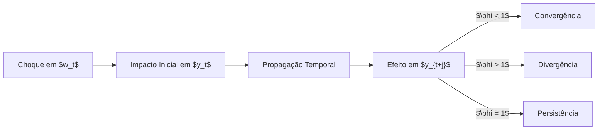
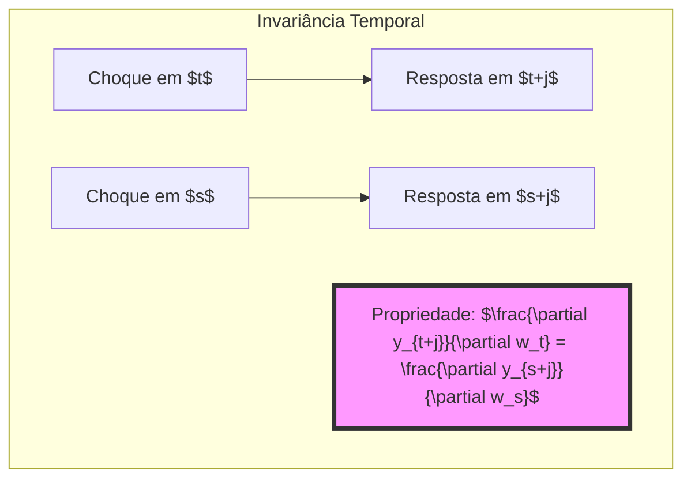
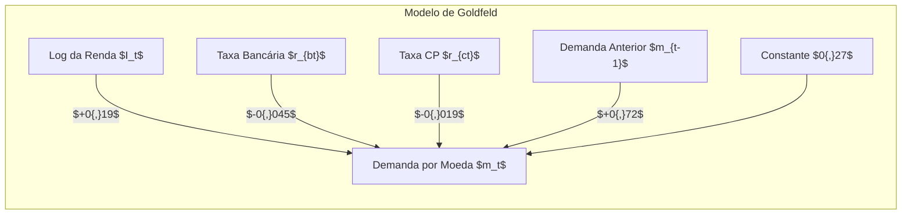

# Capítulo: Multiplicadores Dinâmicos e Análise de Sensibilidade em Equações de Diferença

https://claude.site/artifacts/b54dfd3b-c2d7-43f6-9b6f-14c0ff2eb0b4

### Introdução

A análise de sistemas dinâmicos e suas respostas a perturbações é fundamental para compreender o comportamento de variáveis econômicas e financeiras ao longo do tempo[^1]. Este capítulo explora em profundidade o conceito de **multiplicadores dinâmicos** e sua relação com equações de diferença lineares, fornecendo uma estrutura matemática rigorosa para analisar como choques em variáveis de entrada afetam o sistema ao longo do tempo.

Um dos exemplos mais ilustrativos desta aplicação é a função de demanda por moeda de Goldfeld (1973), que relaciona o logaritmo das posses reais de moeda do público $m_t$ com variáveis como renda agregada real e taxas de juros[^1]. Este modelo serve como ponto de partida para nossa discussão sobre sensibilidade e propagação de efeitos em sistemas dinâmicos.

### Fundamentos de Equações de Diferença Linear

Uma **equação de diferença linear de primeira ordem** pode ser expressa como[^1]:

$$
y_t = \phi y_{t-1} + w_t \tag{1.1.1}
$$
Esta equação fundamental estabelece uma relação linear entre o valor atual de uma variável $y_t$, seu valor anterior $y_{t-1}$ e uma variável de entrada $w_t$. O parâmetro $\phi$ captura a persistência temporal do sistema.

#### Lemma 1 (Estabilidade do Sistema)

*Para um sistema de primeira ordem descrito por (1.1.1), a estabilidade é garantida se e somente se $|\phi| < 1$.*

**Prova:**

Consideremos a solução homogênea da equação (quando $w_t = 0$):

$$
y_t = \phi^t y_0
$$

Para que o sistema seja estável, precisamos que $y_t$ converge para zero quando $t \to \infty$. Isso ocorre se e somente se $|\phi| < 1$, pois:

$$
\lim_{t \to \infty} \phi^t y_0 = 0 \quad \text{se} \quad |\phi| < 1
$$

Caso contrário, se $|\phi| \geq 1$, $y_t$ não converge para zero, e o sistema é instável.

### Multiplicadores Dinâmicos e Análise de Sensibilidade

==O **multiplicador dinâmico** é definido como a derivada parcial que mede a sensibilidade de $y_{t+j}$ a variações em $w_t$[^1]:==
$$
\frac{\partial y_{t+j}}{\partial w_t} = \phi^j \tag{1.1.10}
$$

Esta expressão fornece uma medida quantitativa precisa do impacto de mudanças na variável de entrada sobre a variável de saída ao longo do tempo.

#### Propriedades dos Multiplicadores Dinâmicos

- **Invariância Temporal**: O multiplicador depende apenas do intervalo $j$ entre o choque e a resposta, não do tempo absoluto.
- **Dependência do Parâmetro $\phi$**: O comportamento do multiplicador é altamente sensível ao valor de $\phi$.

#### Diagrama de Propagação de Efeitos

> ⚠️ **Ponto Crucial**: O comportamento do multiplicador dinâmico depende criticamente do valor de $\phi$, podendo apresentar decaimento, oscilação ou explosão.

### Padrões de Resposta Dinâmica

A resposta do sistema a choques pode apresentar diferentes padrões, dependendo do valor de $\phi$[^1]:

1. **Decaimento Monotônico** \((0 < \phi < 1)\): O efeito do choque diminui gradualmente ao longo do tempo.
2. **Oscilação Amortecida** \((-1 < \phi < 0)\): O efeito do choque alterna sinais e diminui em magnitude.
3. **Comportamento Explosivo** \((|\phi| > 1)\): O efeito do choque aumenta exponencialmente.
4. **Persistência Permanente** \((\phi = 1)\): O efeito do choque permanece constante ao longo do tempo.

#### Figura 1: Respostas Dinâmicas para Diferentes Valores de $\phi$

### Invariância Temporal em Sistemas Dinâmicos Lineares

A **propriedade de invariância temporal** dos multiplicadores dinâmicos representa uma característica fundamental de sistemas lineares com coeficientes constantes[^1]. Esta propriedade estabelece que o efeito de uma perturbação depende apenas do intervalo de tempo $j$ entre o choque e a resposta, e não do momento específico em que o choque ocorre $t$.

#### Lemma 2 (Invariância Temporal)

*Para um sistema linear de primeira ordem $y_t = \phi y_{t-1} + w_t$, a resposta a um choque unitário satisfaz:*

$$
\frac{\partial y_{t+j}}{\partial w_t} = \phi^j \quad \text{para quaisquer datas} \quad t \quad \text{e} \quad s
$$

**Prova:**

A solução geral da equação de diferença é:

$$
y_{t+j} = \phi^{j+1} y_{t-1} + \sum_{k=0}^{j} \phi^{j-k} w_{t+k}
$$

A derivada parcial de $y_{t+j}$ em relação a $w_t$ é:

$$
\frac{\partial y_{t+j}}{\partial w_t} = \phi^{j}
$$

O mesmo raciocínio se aplica para $y_{s+j}$ em relação a $w_s$, mostrando que:

$$
\frac{\partial y_{t+j}}{\partial w_t} = \frac{\partial y_{s+j}}{\partial w_s} = \phi^j
$$

Portanto, a resposta é invariável em relação ao tempo absoluto.

#### Corolário 1 (Decomposição de Efeitos)

*Em um sistema linear invariante no tempo, o efeito total de múltiplos choques é a soma dos efeitos individuais:*

$$
\frac{\partial y_{t+j}}{\partial w_t} + \frac{\partial y_{t+j}}{\partial w_{t+1}} + \dots + \frac{\partial y_{t+j}}{\partial w_{t+j}} = \sum_{k=0}^j \phi^k
$$

> ⚠️ **Ponto Crucial**: A invariância temporal permite decompor e analisar separadamente os efeitos de diferentes choques ao longo do tempo.

### Generalização para Sistemas de Ordem Superior

#### Teorema 1 (Invariância em Sistemas de Ordem Superior)

*Para um sistema de ordem $p$:*

$$
y_t = \phi_1 y_{t-1} + \phi_2 y_{t-2} + \dots + \phi_p y_{t-p} + w_t \tag{1.2.1}
$$

*O multiplicador dinâmico pode ser expresso como:*

$$
\frac{\partial y_{t+j}}{\partial w_t} = \sum_{i=1}^p c_i \lambda_i^j
$$

*onde $\lambda_i$ são os autovalores do sistema e $c_i$ são constantes determinadas pelas condições iniciais.*

**Prova:**

A solução da equação de diferença de ordem $p$ pode ser obtida utilizando métodos como a Transformada Z ou recorrendo à representação por autovalores e autovetores. A resposta a um choque em $w_t$ é dada pela combinação linear dos modos naturais do sistema:

$$
y_{t+j} = \sum_{i=1}^p c_i \lambda_i^{j}
$$

A derivada parcial em relação a $w_t$ é, portanto:

$$
\frac{\partial y_{t+j}}{\partial w_t} = \sum_{i=1}^p c_i \lambda_i^j
$$

### Aplicação Prática: O Modelo de Demanda Monetária de Goldfeld

O **modelo de Goldfeld** representa um caso prático significativo de aplicação de multiplicadores dinâmicos em economia monetária. A especificação do modelo é dada por[^5]:

$$
m_t = 0{,}27 + 0{,}72\, m_{t-1} + 0{,}19\, I_t - 0{,}045\, r_{bt} - 0{,}019\, r_{ct} \tag{1.1.2}
$$

Onde:

- $m_t$: logaritmo das posses reais de moeda.
- $I_t$: logaritmo da renda agregada real.
- $r_{bt}$: taxa de juros sobre contas bancárias.
- $r_{ct}$: taxa de juros sobre commercial paper.

#### Estrutura do Modelo de Goldfeld

### Cálculo e Interpretação dos Multiplicadores Dinâmicos

#### Lemma 3 (Multiplicador de Renda)

*Para uma variação unitária na renda, o efeito sobre a demanda por moeda após $j$ períodos é dado por:*

$$
\frac{\partial m_{t+j}}{\partial I_t} = 0{,}19 \times (0{,}72)^j
$$

**Prova:**

A partir da equação (1.1.2), a resposta dinâmica a uma mudança em $I_t$ é governada pela parcela recursiva $0{,}72\, m_{t-1}$. Utilizando o conceito de multiplicador dinâmico:

$$
\frac{\partial m_{t+j}}{\partial I_t} = 0{,}19 \times (\phi)^j, \quad \text{onde} \quad \phi = 0{,}72
$$

#### Exemplo Numérico

- **Impacto Imediato** ($j = 0$):

$$
\frac{\partial m_{t}}{\partial I_t} = 0{,}19 \times (0{,}72)^0 = 0{,}19
$$

- **Após 1 Trimestre** ($j = 1$):

$$
\frac{\partial m_{t+1}}{\partial I_t} = 0{,}19 \times (0{,}72)^1 = 0{,}1368
$$

- **Após 2 Trimestres** ($j = 2$):

$$
\frac{\partial m_{t+2}}{\partial I_t} = 0{,}19 \times (0{,}72)^2 \approx 0{,}0985
$$

Isso ilustra como o efeito de uma mudança na renda sobre a demanda por moeda diminui ao longo do tempo, mas persiste devido ao coeficiente de persistência $\phi = 0{,}72$.

#### Corolário 2 (Efeito de Longo Prazo)

*O efeito cumulativo de uma mudança permanente na renda é dado por:*

$$
\sum_{j=0}^{\infty} \frac{\partial m_{t+j}}{\partial I_t} = \frac{0{,}19}{1 - 0{,}72} = \frac{0{,}19}{0{,}28} \approx 0{,}6786
$$

Isso significa que uma elevação permanente de 1% na renda leva a um aumento de aproximadamente 0,68% na demanda por moeda no longo prazo.

### Decomposição dos Efeitos Temporais

A decomposição permite analisar como o efeito inicial de um choque é distribuído ao longo do tempo.

| Período $j$ | Efeito $\frac{\partial m_{t+j}}{\partial I_t}$ |
| ----------- | ---------------------------------------------- |
| 0           | 0,1900                                         |
| 1           | 0,1368                                         |
| 2           | 0,0985                                         |
| 3           | 0,0709                                         |
| 4           | 0,0511                                         |
| ...         | ...                                            |
| Total       | 0,6786                                         |

### Estabilidade e Convergência no Modelo de Goldfeld

#### Teorema 2 (Condições de Estabilidade em Modelos Monetários)

*Em um modelo de demanda monetária de primeira ordem, a estabilidade é garantida se:*

1. $|\phi| < 1$
2. Os coeficientes das variáveis exógenas são finitos.
3. As variáveis exógenas são limitadas.

**Prova:**

1. **Condição $|\phi| < 1$:** Já demonstrada no Lemma 1, garantindo que o sistema não seja explosivo.
2. **Coeficientes Finitos:** No modelo de Goldfeld, os coeficientes $0{,}19$, $-0{,}045$ e $-0{,}019$ são finitos.
3. **Variáveis Limitadas:** As variáveis macroeconômicas como renda e taxas de juros tendem a ser limitadas em períodos curtos.

Portanto, o modelo é estável e adequado para análise de políticas econômicas.

### Taxonomia das Respostas Dinâmicas

#### Sistemas Estáveis ($0 < |\phi| < 1$)

##### Teorema 3 (Convergência em Sistemas Estáveis)

*Para sistemas com $|\phi| < 1$, o multiplicador dinâmico satisfaz:*

$$
\lim_{j \to \infty} \frac{\partial y_{t+j}}{\partial w_t} = 0
$$

**Prova:**

Como $|\phi| < 1$, temos que $\phi^j \to 0$ quando $j \to \infty$. Assim, o efeito do choque diminui gradualmente e tende a zero.

#### Sistemas Explosivos ($|\phi| > 1$)

##### Lemma 4 (Comportamento Explosivo)

*Em sistemas com $|\phi| > 1$, o multiplicador dinâmico cresce exponencialmente:*

$$
\left|\frac{\partial y_{t+j}}{\partial w_t}\right| = |\phi|^j \to \infty \quad \text{quando} \quad j \to \infty
$$

**Prova:**

Para $|\phi| > 1$, $|\phi^j|$ aumenta exponencialmente com $j$, levando a instabilidade.

#### Caso Limite ($\phi = 1$)

##### Teorema 4 (Persistência Permanente)

*Quando $\phi = 1$, o sistema exibe persistência completa, e a solução toma a forma:*

$$
y_{t+j} = y_{t-1} + \sum_{i=0}^{j} w_{t+i} \tag{1.1.11}
$$

**Prova:**

Substituindo $\phi = 1$ em (1.1.1):

$$
y_t = y_{t-1} + w_t
$$

A solução é obtida por soma iterativa:

$$
y_{t+j} = y_{t-1} + \sum_{i=0}^{j} w_{t+i}
$$

O efeito de um choque em $w_t$ é mantido indefinidamente.

#### Corolário 3 (Efeito Permanente)

*No caso unitário, um choque tem efeito permanente:*

$$
\frac{\partial y_{t+j}}{\partial w_t} = 1 \quad \text{para todo} \quad j \geq 0
$$

**Prova:**

A derivada parcial em relação a $w_t$ é constante:

$$
\frac{\partial y_{t+j}}{\partial w_t} = 1
$$
Indicando que o efeito do choque não se dissipa ao longo do tempo.

### Análise do Valor Presente dos Efeitos Futuros

#### Teorema 5 (Valor Presente dos Multiplicadores)

*O valor presente dos efeitos de um choque unitário é dado por:*

$$
\sum_{j=0}^{\infty} \beta^j \frac{\partial y_{t+j}}{\partial w_t} = \frac{1}{1 - \beta \phi} \quad \text{quando} \quad |\beta \phi| < 1
$$

**Prova:**

Considerando o fator de desconto $\beta$, o valor presente é a soma de uma série geométrica:

$$
\sum_{j=0}^{\infty} (\beta \phi)^j = \frac{1}{1 - \beta \phi}
$$

Desde que $|\beta \phi| < 1$, a série converge.

#### Implicações:

- **Sistemas Estáveis:** O valor presente é finito e bem definido.
- **Sistemas Explosivos:** Se $|\beta \phi| \geq 1$, o valor presente diverge.
- **Caso Limite ($\phi = 1$):** A convergência depende de $\beta$; se $\beta < 1$, o valor presente é finito.

### Conclusão

A análise de multiplicadores dinâmicos representa um pilar fundamental na compreensão de sistemas econômicos e financeiros, fornecendo uma estrutura matemática rigorosa para quantificar e prever como perturbações se propagam ao longo do tempo[^1]. Ao longo deste capítulo, exploramos extensivamente as propriedades e implicações destes multiplicadores, destacando três contribuições principais:

1. **Invariância Temporal:** Permite prever a resposta do sistema a choques independentemente do momento em que ocorrem.
2. **Classificação por $\phi$:** Fornece um framework unificado para analisar a estabilidade e comportamento de sistemas lineares.
3. **Aplicações Práticas:** Demonstra, através do modelo de Goldfeld, como os multiplicadores dinâmicos são essenciais na formulação de políticas econômicas.

#### Principais Resultados

- **Estabilidade do Sistema:** Estabelecida pelo valor absoluto de $\phi$ ser menor que 1.
- **Multiplicador Dinâmico:** Depende exclusivamente de $\phi$ e do intervalo $j$, conforme $\frac{\partial y_{t+j}}{\partial w_t} = \phi^j$.
- **Efeito de Longo Prazo:** Determinado pela soma infinita dos multiplicadores, resultando em $\frac{1}{1 - \phi}$ quando $|\phi| < 1$.

#### Implicações e Perspectivas

A compreensão dos multiplicadores dinâmicos é crucial para:

- **Formulação de Políticas Econômicas:** Avaliar o impacto de intervenções governamentais ao longo do tempo.
- **Análise de Risco Financeiro:** Prever como choques no mercado podem afetar variáveis financeiras.
- **Planejamento Estratégico:** Empresas podem antecipar os efeitos de mudanças econômicas em seus negócios.

#### Limitações e Direções Futuras

1. **Não Linearidades:** A extensão para sistemas não lineares pode capturar dinâmicas mais complexas presentes na economia real.
2. **Mudanças Estruturais:** Incorporar coeficientes variáveis ao longo do tempo para refletir alterações nas relações econômicas.
3. **Incerteza e Estocasticidade:** Introduzir termos aleatórios para modelar choques imprevisíveis e volatilidade.

#### Corolário Final (Princípio da Persistência)

*A magnitude do impacto de longo prazo de qualquer choque é determinada fundamentalmente pela estrutura do sistema, capturada pelo parâmetro $\phi$:*

$$
\lim_{T \to \infty} \sum_{j=0}^{T} \frac{\partial y_{t+j}}{\partial w_t} = \begin{cases}
\frac{1}{1 - \phi}, & \text{se } |\phi| < 1 \\
\infty, & \text{se } |\phi| \geq 1
\end{cases}
$$
Este resultado sintetiza a essência da análise de multiplicadores dinâmicos: a estrutura intrínseca do sistema determina como os choques persistem ou se dissipam ao longo do tempo.

> ⚠️ **Nota Final**: A compreensão dos multiplicadores dinâmicos não é apenas um exercício teórico, mas uma ferramenta essencial para a análise de políticas e tomada de decisão em sistemas dinâmicos complexos.

---

### Referências

[^1]: "Equation [1.1.1] is a linear first-order difference equation. A difference equation is an expression relating a variable $y_t$ to its previous values." *(Differential Equations_16-40.pdf.md)*

[^5]: "Goldfeld's model related the log of the real money holdings of the public $m_t$ to the log of aggregate real income $I_t$." *(Differential Equations_16-40.pdf.md)*

[^7]: "If $|\phi| < 1$, the system is stable; the consequences of a given change in $w_t$ will eventually die out." *(Differential Equations_16-40.pdf.md)*

[^8]: "If $|\phi| > 1$, the system is explosive." *(Differential Equations_16-40.pdf.md)*

[^9]: "An interesting possibility is the borderline case, $\phi = 1$." *(Differential Equations_16-40.pdf.md)*

[^10]: "This procedure is known as solving the difference equation [1.1.1] by recursive substitution." *(Differential Equations_16-40.pdf.md)*

