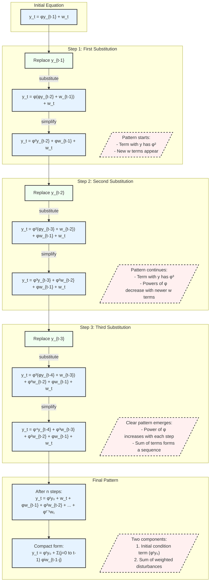

# Método de Substituição Recursiva em Equações de Diferenças

### Introdução

As **equações de diferenças** desempenham um papel central na modelagem de sistemas que evoluem discretamente ao longo do tempo, sendo amplamente utilizadas em diversas áreas como economia, finanças, engenharia e ciências sociais. ==O **Método de Substituição Recursiva** surge como uma técnica poderosa e fundamental para resolver equações de diferenças lineares [1]==. ==Essa abordagem permite expressar o valor atual de uma variável não apenas em função de seu valor inicial, mas também incorporando a influência acumulada de perturbações externas ou choques ao longo do tempo [2].== Compreender e aplicar este método é essencial para a análise de sistemas dinâmicos, especialmente na avaliação de estabilidade, previsões e resposta a choques em modelos econômicos e financeiros [3].

### Conceitos Fundamentais

| Conceito                         | Explicação                                                   |
| -------------------------------- | ------------------------------------------------------------ |
| **Equação de Diferenças Linear** | Uma expressão matemática que relaciona o valor atual de uma variável $y_t$ com seus valores passados e uma entrada externa $w_t$, geralmente na forma [4]: $$y_t = \phi y_{t-1} + w_t$$ |
| **Processo Recursivo**           | ==Método de solução que envolve a substituição iterativa de valores anteriores da variável dependente, retrocedendo até alcançar condições iniciais conhecidas [5].== |
| **Solução Geral**                | A expressão final que descreve $y_t$ como uma função explícita de $y_0$ (condição inicial) e da sequência histórica de valores de $w_t$, permitindo a análise completa do comportamento da variável ao longo do tempo [6]. |

> ⚠️ **Nota Importante**: A estabilidade da solução está intimamente ligada ao valor do parâmetro $\phi$. Especificamente, para $|\phi| < 1$, o sistema tende a ser estável, ou seja, as influências iniciais e os choques dissipam-se ao longo do tempo [7].

### Desenvolvimento da Solução Recursiva

A solução recursiva é construída através de um processo sistemático de substituições, que permite expressar $y_t$ em termos de $y_0$ e dos valores passados de $w_t$ [8]:

1. **Equação de Partida**:

   Começamos com a equação básica de diferenças lineares:

   $$y_t = \phi y_{t-1} + w_t$$

2. **Primeira Substituição**:

   Substituímos $y_{t-1}$ utilizando a mesma equação aplicada em $t-1$:

   $$y_{t-1} = \phi y_{t-2} + w_{t-1}$$

   Substituindo na equação original:

   $$y_t = \phi (\phi y_{t-2} + w_{t-1}) + w_t = \phi^2 y_{t-2} + \phi w_{t-1} + w_t$$

3. **Continuação do Processo**:

   Prosseguindo com as substituições, obtemos:

   $$y_t = \phi^3 y_{t-3} + \phi^2 w_{t-2} + \phi w_{t-1} + w_t$$

   E, em geral, após $k$ iterações:

   $$y_t = \phi^k y_{t-k} + \sum_{j=0}^{k-1} \phi^j w_{t-1-j}$$

4. **Solução Geral**:

   ==Tomando $k = t$, chegamos à expressão que relaciona $y_t$ diretamente a $y_0$:==

   $$y_t = \phi^t y_0 + \sum_{j=0}^{t-1} \phi^j w_{t-1-j}$$

### Análise dos Componentes da Solução

A solução geral é composta por dois termos principais, cada um com interpretações e implicações distintas para a dinâmica do sistema.

#### Termo Homogêneo

O termo $\phi^t y_0$ representa a influência da condição inicial $y_0$ ao longo do tempo [9]:

- **Para $|\phi| < 1$**: O termo decai exponencialmente, indicando que o efeito de $y_0$ diminui ao longo do tempo.
- **Para $|\phi| > 1$**: O termo cresce exponencialmente, sugerindo instabilidade e amplificação de qualquer desvio inicial.
- **Para $\phi = 1$**: O termo permanece constante, indicando persistência do estado inicial sem amortecimento ou amplificação.

#### Termo Particular

==A soma $\sum_{j=0}^{t-1} \phi^j w_{t-1-j}$ captura o efeito acumulado das perturbações externas $w_t$ [10]:==

- **Pesos Decrescentes**: Para $|\phi| < 1$, os pesos $\phi^j$ diminuem com $j$, atribuindo maior importância aos choques mais recentes.
- **Persistência dos Choques**: Valores de $\phi$ próximos a 1 indicam que os choques têm efeitos mais duradouros.

### [Pergunta Teórica Avançada]: Como o Comportamento de Longo Prazo é Afetado pelo Parâmetro $\phi$?

**Resposta:**

O comportamento de longo prazo de $y_t$ é determinado pela análise do limite $\lim_{t \to \infty} y_t$ [11]. Considerando ambos os termos da solução:

1. **Termo Homogêneo**:

   $$\lim_{t \to \infty} \phi^t y_0 = \begin{cases}
   0, & \text{se } |\phi| < 1 \\
   \infty, & \text{se } |\phi| > 1 \\
   y_0, & \text{se } \phi = 1
   \end{cases}$$

2. **Termo Particular (Assumindo $w_t = w$, constante)**:

   Para $|\phi| < 1$, a soma infinita converge:

   $$\lim_{t \to \infty} \sum_{j=0}^{t-1} \phi^j w = \frac{w}{1 - \phi}$$

   Portanto, o valor de $y_t$ tende a um valor finito, determinado pelo termo particular.

3. **Conclusão**:

   - **Estabilidade**: Quando $|\phi| < 1$, o sistema é estável, e $y_t$ converge para um valor finito.
   - **Instabilidade**: Para $|\phi| > 1$, $y_t$ diverge, indicando instabilidade.
   - **Persistência**: Com $\phi = 1$, o sistema apresenta memória perfeita, e os efeitos iniciais persistem indefinidamente.

> 💡 **Insight Importante**: A convergência para um equilíbrio de longo prazo e a dissipação de choques dependem criticamente do módulo de $\phi$ ser menor que 1 [14].

### [Pergunta Teórica Avançada]: Como Calcular o Valor Presente dos Efeitos Futuros?

**Resposta:**

Para calcular o valor presente dos efeitos futuros dos choques $w_t$, utilizamos um fator de desconto $\beta = \frac{1}{1 + r}$, onde $r$ é a taxa de juros [15]. O valor presente é dado por:

$$\sum_{j=0}^{\infty} \beta^j \frac{\partial y_{t+j}}{\partial w_t} = \sum_{j=0}^{\infty} (\beta \phi)^j = \frac{1}{1 - \beta \phi}$$

Condições importantes:

- **Convergência**: A série converge se $|\beta \phi| < 1$.
- **Interpretação**: Este cálculo permite avaliar o impacto total, em termos presentes, de um choque atual sobre todos os valores futuros de $y_t$.

### Aplicações em Modelos Econômicos

Uma aplicação significativa do método está na análise de modelos econométricos, como a função de demanda por moeda de Goldfeld [16]:

$$m_t = 0{,}27 + 0{,}72\, m_{t-1} + 0{,}19\, I_t - 0{,}045\, r_{bt} - 0{,}019\, r_{ct}$$

Onde:

- $m_t$: Logaritmo dos saldos monetários reais.
- $I_t$: Logaritmo da renda real agregada.
- $r_{bt}$: Logaritmo da taxa de juros em contas bancárias.
- $r_{ct}$: Logaritmo da taxa de juros em commercial papers.

**Análise**:

- O coeficiente $\phi = 0{,}72$ indica que aproximadamente 72% do valor passado de $m_t$ influencia o valor atual.
- A estabilidade do sistema pode ser avaliada considerando que $|\phi| = 0{,}72 < 1$, sugerindo estabilidade.
- Os multiplicadores dinâmicos podem ser calculados para entender o impacto das variáveis explicativas ao longo do tempo.

### Análise de Multiplicadores Dinâmicos

Os **multiplicadores dinâmicos** quantificam o efeito de uma mudança em $w_t$ sobre os valores futuros de $y_t$ [17]:

| Horizonte (j) | Efeito ($\phi^j$) | Interpretação              |
| ------------- | ----------------- | -------------------------- |
| 0             | $1$               | Efeito imediato do choque. |
| 1             | $\phi$            | Efeito após um período.    |
| 2             | $\phi^2$          | Efeito após dois períodos. |
| ...           | ...               | ...                        |
| $j$           | $\phi^j$          | Efeito após $j$ períodos.  |
| $\infty$      | $0$ se \(         | \phi                       |

**Interpretação**:

- **Decaimento**: Para $|\phi| < 1$, o efeito dos choques decai exponencialmente ao longo do tempo.
- **Persistência**: Valores de $\phi$ próximos a 1 indicam maior persistência dos efeitos.

### [Dedução Teórica Complexa]: Propriedades do Operador de Defasagem

O **operador de defasagem** $L$ é uma ferramenta matemática útil na manipulação de equações de diferenças [18]:

$$Ly_t = y_{t-1}$$

**Propriedades**:

1. **Linearidade**:

   $$L(a y_t + b x_t) = a L y_t + b L x_t$$

2. **Potências do Operador**:

   $$L^k y_t = y_{t-k}$$

3. **Polinômios em $L$**:

   A equação de diferenças pode ser reescrita utilizando polinômios em $L$:

   $$(1 - \phi L) y_t = w_t$$

> ⚠️ **Ponto Crucial**: A representação em termos do operador de defasagem facilita a aplicação de técnicas algébricas para encontrar soluções e analisar a estabilidade [19].

**Resolução Utilizando o Operador de Defasagem**:

Podemos reescrever a equação como:

$$(1 - \phi L) y_t = w_t$$

Invertendo o operador (assumindo $|\phi| < 1$):

$$y_t = \frac{1}{1 - \phi L} w_t$$

Expandindo em série geométrica:

$$y_t = (1 + \phi L + \phi^2 L^2 + \phi^3 L^3 + \dots) w_t$$

O que recupera a forma da solução geral:

$$y_t = \sum_{j=0}^{\infty} \phi^j w_{t - j}$$

### Considerações Práticas

#### 👍 **Vantagens**

- **Análise Temporal Explícita**: Permite decompor a dinâmica temporal de forma clara, identificando a contribuição de cada período [20].
- **Cálculo de Multiplicadores Dinâmicos**: Facilita a quantificação dos efeitos de choques ao longo do tempo [21].
- **Avaliação de Estabilidade**: Através do parâmetro $\phi$, é possível determinar a estabilidade do sistema de forma direta [22].
- **Flexibilidade Matemática**: O uso do operador de defasagem e técnicas relacionadas amplia as ferramentas disponíveis para solução [26].

#### 👎 **Limitações**

- **Coeficientes Constantes**: O método assume que os coeficientes são constantes no tempo, o que pode não ser realista em alguns contextos [23].
- **Condições Iniciais**: Requer conhecimento preciso das condições iniciais, que nem sempre estão disponíveis [24].
- **Não-linearidades**: Não captura comportamentos não-lineares, limitando sua aplicabilidade a sistemas lineares ou linearizados [25].
- **Choques Não-Estacionários**: A análise pode ser complicada na presença de choques que não são estacionários ou possuem variâncias não constantes.

### [Prova Matemática]: Estabilidade do Sistema

**Teorema**: O sistema descrito pela equação $y_t = \phi y_{t-1} + w_t$ é estável se e somente se $|\phi| < 1$ [26].

**Prova**:

1. **Solução Geral**:

   $$y_t = \phi^t y_0 + \sum_{j=0}^{t-1} \phi^j w_{t-1-j}$$

2. **Termo Homogêneo**:

   - **Se $|\phi| < 1$**: $\lim_{t \to \infty} \phi^t y_0 = 0$
   - **Se $|\phi| \geq 1$**: $\lim_{t \to \infty} |\phi^t y_0| \to \infty$

3. **Termo Particular** (Assumindo $w_t$ limitado):

   - **Se $|\phi| < 1$**: A soma converge para um valor finito.
   - **Se $|\phi| \geq 1$**: A soma pode divergir ou crescer sem limite.

4. **Conclusão**:

   - **Estabilidade**: O sistema é estável se $|\phi| < 1$, pois $y_t$ permanece limitado.
   - **Instabilidade**: Se $|\phi| \geq 1$, o sistema é instável, com $y_t$ potencialmente crescendo sem limite.

**Portanto**, a condição $|\phi| < 1$ é necessária e suficiente para a estabilidade do sistema. ■

### Conclusão

O **Método de Substituição Recursiva** constitui uma ferramenta essencial na análise de equações de diferenças lineares [28]. Sua aplicação permite:

- **Compreender a Dinâmica Temporal**: Identificando como estados iniciais e choques afetam o sistema ao longo do tempo.
- **Avaliar a Estabilidade**: Determinando se o sistema tende a um equilíbrio ou se diverge.
- **Calcular Multiplicadores e Efeitos de Longo Prazo**: Quantificando o impacto de perturbações em diferentes horizontes temporais.
- **Aplicações Práticas**: Fornece base teórica para modelagem em economia, finanças e outras áreas que envolvem processos dinâmicos discretos [29].

A compreensão profunda deste método não só enriquece a análise teórica, mas também aprimora a capacidade de modelar e prever comportamentos em sistemas reais, contribuindo para tomadas de decisão mais embasadas.
